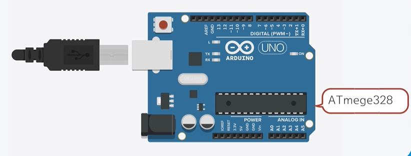
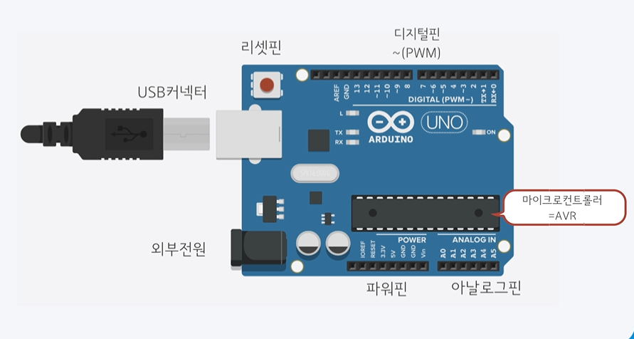
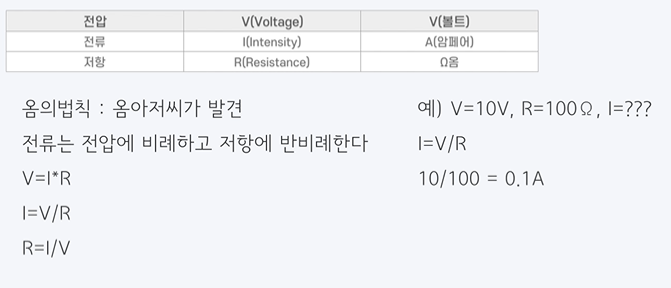
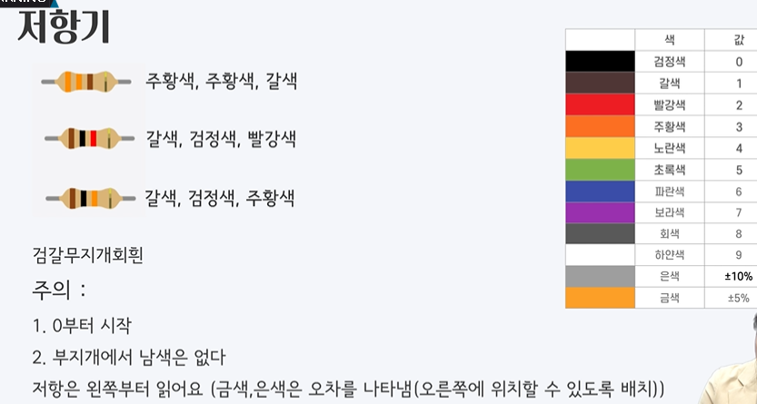

# 아두이노란 ?





> 마이크로컨트롤러를 사용하여 만들어진 개발보드, 초보자나 일반인도 쉽게 접근 가능
> 마이크로 컨트롤러

- 중앙처리장치(CPU)와 주변장치들을 하나의 칩으로 집약시켜 컨트롤할 수 있는 일종의 소형 컴퓨터
- 아트멜이라는 회사에서 만든 ATemege328 시리즈를 사용.
- 컴파일 - 사람이 입력한 코드를 컴퓨터가 이해할 수 있도록 번역
- 시리얼 모니터 - 컴퓨터와 아두이노간의 대화를 할 수 있는 공간.

## 1. 아두이노 설치 및 IDE  기본세팅

### [아두이노 IDE VSCODE 셋팅]([아두이노 팁 #1. Visual Studio Code 아두이노 환경설정::Lucy Archive (tistory.com)](https://juahnpop.tistory.com/71))


## 2. 아두이노 예제 실행

## 3. 아두이노 프로그래밍 ( 주석, setup, loop )

### 3.1 setup() { } 함수

- data 초기화/설정 , 한번만 실행 됨.

```
void setup() {
    pinMode(8, OUTPUT);
    pinMode(9, OUTPUT);
    pinMode(10, OUTPUT);


}
```


### 3.2 Loop() { } 함수

- 무한 반복하여 실행

```
void loop() {
    digitalWrite(8, HIGH);
    digitalWrite(9, HIGH);
    digitalWrite(10, HIGH);
    delay(1000);
    digitalWrite(8, LOW);
    digitalWrite(9, LOW);
    digitalWrite(10, LOW);
    delay(1000);
}
```


## 4. 시리얼 통신 ( Serial.begin, serial.print )


## 5. 전압, 전류, 저항

- 전압 : 전자를 흐를 수 있게 해주는 에너지

- 전류 : 전자의 흐름

- 저항 : 전류의 흐름을 제어 ( 전류의 세기를 조절 ) ( 수도 역할 )



- 전압(V) = 전류(I) X 저항(R)

- 전류(I) = 전압(V) / 저항(R)

- 저항(R) = 전류(I) / 전압(V)


LED 동작 전압 - 2V, 필요전류 10mA,

아두이노 동작 전압 - 5V, 남는 전압이 3V 즉 3V가 없어져야 함.



- 검 , 갈 , 무지개 , 남색없고, 회 하