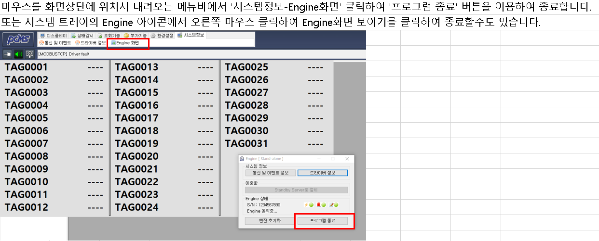
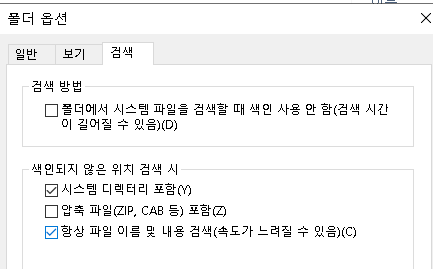

# 개요.

2022.6월 끝난 사업으로, 국가 수도 유역 센터에서 DATA를 수집하는 시스템. 
각 지자체별로 데이터를 수집하여 수자원 공사에 데이터를 보내 통합하는 시스템. 

- techwin에서 개발.
  2023.06.30 현재 7군데 중 4군데 문제(하자) 발생. 
  
  < 고성, 홍천, 제천, 강릉 >

- 데이터 확인 해보니 구축 당시부터 데이터 수집이 안되는 상황.

## 0. 하자 확인 조치해야 할 사항

> 우리가 해결할 수 있는 문제인지, 아닌지 판단이 필요하다.

- C 드라이브 내 폴더 확인하여 ExportServer 실행 및 확인 ( 데이터 수집이 잘 이루어지고 있는지, 문제 없는지 등 )
- 게이트웨이 - 온도계 / UPS 간 통신 결선 확인 및 데이터 체크가 필요하다.

### 0.1 PCMS 설정

#### 0) **PCMS 설치**

셋업파일(PCMS_Setup(202112Lite).exe) 실행하여 프로그램 설치

설치 시 키락 번호는 아무숫자 입력, 추후 키락 제공시 해당 키락 번호 입력하세요.

#### 1) 제공된 샘플 프로젝트를 C:\PCMS\Projects 폴더 아래에 복사

#### 2) **드라이버 설정**

        샘플 프로젝트를 열어서 '드라이버 수정'에서 IP 변경

        

#### 3) **PCMS TAG 생성**

#### 4) **PCMS 화면 작성**

        

#### 5) **PCMS 실행**

      - '프로젝트 -> 테스트 -> Engine 실행' (F5)로 실행합니다.

      - PCMS 로그인 ID/PW 는 PCMS/pcms1234! 입니다.

#### 6) **데이터 확인**

        

#### 7) PCMS 종료

    

## 1. 데이터 연계 이상 (고성군)

- 중계서버와 지자체 HMI ( Human Machine Interface - 프로세서 시스템과 운영자 간의 인터페이스, 대시보드 ) 간 통신 이상으로 데이터 수집 불가 ( techwin )

- 중계서버에 설치된 HMI ( PCMS ) 와 지자체 HMI ( Autobase ) 간 통신을 위해 ExportServer라는 전송 프로그램을 사용하였다.

- 현재 해당 프로그램( ExportServer ) 가 실행되어 있지 않은 것 같다.

- 방문하여 해당 프로그램 ( ExportServer ) 실행이 필요하다.

### 1.1 ExportServer

- 시리얼 통신 프로그램 ( Client - Server )
- 지자체 서버에 설치되어 있다. ( 모니터링 )

### 1.2 윈도우 10 파일 쉽게 찾기 (폴더 옵션 변경)

- 

- 

- 항상 파일 이름 및 내용 검색을 체크하면, 파일을 검색 할 때 파일명만 가지고 검색을 하는 것이 아니라, 파일 안에 들어가져 있는 특정 단어나 내용도 같이 검색을 해 결과를 보여 준다.

### 1.3 Where 명령어 사용

> where /r C:\경로\파일명

예시 1) C 드라이브 전체 중 일지라는 이름이 포함된 파일을 찾고 싶다.

- where /r C:\*일지*

예시 2) C 드라이브 전체 중 list로 끝나는 파일을 찾고 싶다.

- where /r C:\ *list

예시 3) C 드라이브 전체 중 game으로 시작하는 파일을 찾고 싶다.

- where /r C:\ game*

예시 4) C 드라이브 내 확장자 검색

- where /r C:\ *.xlsx

### 1.4 윈도우10 탐색기 폴더 검색 안됨 해결 방법

[윈도우10 탐색기 폴더 검색 안됨 해결하는 방법 - 익스트림 매뉴얼 (extrememanual.net)](https://extrememanual.net/37140)

- **윈도우 서비스 확인**
  
  - Win + R 을 눌러 실행창을 띄운 다음, **services.msc**를 입력 후 엔터키를 누른다.
  
  - 서비스 창에서 **Windows Search**를 찾아 더블 클릭한 다음 서비스 상태가 실행 중인지 확인 한다.
  
  - 만일 실행 중이 아니라면, **시작 유형을 자동으로 변경**한 다음 시작 버튼을 눌러 서비스를 실행 한다.
  
  - 

- **탐색기 색인 초기화**
  
  색인 **DB**에 폴더 또는 파일이 누락되었거나, **DB** 파일이 깨져 검색 결과가 나오지 않는 경우가 있다. 이 경우 색인을 초기화해서 다시 색인을 생성하면 문제를 해결 할 수 있다.
  
  - 제어판을 실행한 다음, 보기 기준을 **작은 아이콘**으로 변경한 후 **색인 옵션**을 선택한다.
  
  - 색인 옵션에서 **고급** 버튼을 클릭한다.
  
  - 문제 해결 항목에서 **색인을 삭제하고 다시 작성(다시 색인)** 버튼을 클릭한다.
  
  - 색인이 초기화되고 다시 색인되는데 시간이 걸리며 색인이 끝난 후 탐색기에서 검색 결과를 확인한다.
  
  - 

- **드라이브 색인 허용하기**
  
  새로 장착한 SSD 또는 하드디스크에 색인이 허용되어 있지 않은 경우 해당 파일 또는 폴더가 검색 결과로 나타나지 않을 수 있다.
  
  - 파일 탐색기에서 드라이브를 마우스 오른쪽 버튼으로 선택한 다음 **속성**  을 클릭한다.
  
  - 일반 탭 하단의 **이 드라이브의 파일 속성 및 내용 색인 허용** 옵션을 체크한 다음 확인 버튼을 누른다.
  
  - 

- **드라이브에 시스템 권한 추가하기**
  
  - 파일 탐색기에서 드라이브를 마우스 오른쪽 버튼으로 선택한 후 **속성**으로 이동한다.
  
  - 보안 탭을 선택한 다음 사용 권한 **편집** 버튼을 클릭한다.
  
  - 그룹 또는 사용자 이름 항목 아래의 **추가** 버튼을 클릭한다.
  
  - 선택할 개체 이름 입력 칸에 **system**을 입력한 후, 오른쪽의 이름 확인 버튼을 클릭한다.
  
  - **SYSTEM**이 대문자로 선택되면 확인 버튼을 클릭한다.
  
  - **SYSTEM**의 사용 권한을 모두 허용으로 체크한 후 확인 버튼을 클릭한다.
  
  - 

## 2. 게이트웨이를 통한 온도계 및 UPS 데이터 수집 불가

- 고성군 : 온도계 , UPS 통신 안됨.
- 홍천군 : 온도계 통신 안됨.
- 제천시 : 온도계 통신 안됨.
- 강릉시 : UPS 통신 안됨.

### 2.1 게이트웨이(이더포스) 설정

- 환경부 유역수도지원시스템 - 게이트웨이(EtherFOS-150) 프로그램 설정

#### 1) IP 설정

- 지자체 중게서버 IP 대역으로 변경 ( IP는 31 사용 )

- '쓰기' 버튼 클릭하여 설정 적용

#### 2) NTP 시간동기화 설정

- 주기적인 동기화를 위해 프로그램 추가

#### 3) 온도계, UPS 통신프로그램 사용여부 설정

- 지자체의 온도계, UPS 설치 여부에 따라 해당 프로그램 Enable/Disable 설정

#### 4) DB 접속정보 설정

- 상대국 주소를 중계서버 IP로 설정

- 지자체 중계서버 DB의 ID, DB이름 입력

#### 5) DB_Insert문 변수 설정

- 해당 유역 코드값 입력

- 지자체 시군구코드 입력

#### 6) 프로그램 쓰기

- '프로그램 쓰기' 버튼을 클릭하여 변경사항 적용
  
   

#### 7) 동작 확인

>  DB 저장 상태

- 프레임 모니터에서 Ch0 추가하여 모니터링 시작

- Tx 패킷의 Insert문에서 데이터 확인
  
  

> 온도계, UPS 통신 상태

- 프레임 모니터에서 Serial 포트를 추가하여 모니터링 시작 ( 온도계 : CARD0 COM1, CARD0 COM2)

- Tx 패킷의 요청 확인

- Rx 패킷의 응답 확인
  
  

#### 8) Modbus TCP 드라이버 설정 (iWater 통신)

- 드라이버에서 추가버튼 클릭하여 Modbus TCP 추가

- 설정 버튼 클릭 후 Bast Address를 모두 0으로 설정
  
  

#### 9) 결선 확인

