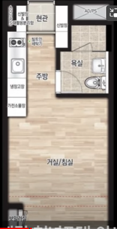
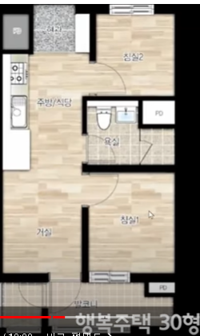

# 청년, 서울에서 살아가기.



- 무주택자 ( 가족 제외 . 나의 현재 상황 )

- 서울에서 청년에게만 공급하는 주택 찾기

- 접수는 공짜. 관심 가지고 알아보기

- 세부적으로 보면 종류가 너무많다. 
  
  기준을 잡고, 접근하자.

## 0. 신청 해야 할 리스트 정리

### 0.1 7.3 신청 무조건 하기 !

[역세권청년주택.강동구](https://soco.seoul.go.kr/youth/bbs/BMSR00015/view.do?boardId=5880&menuNo=400008)

[LH행복주택.수서.강남구 자곡동](https://apply.lh.or.kr/LH/index.html?Sls#SIL::CLCC_SIL_0065:1010204)

[LH청년매입임대.송파.](https://apply.lh.or.kr/LH/index.html?Sls#SIL::CLCC_SIL_0160:1010204)

[7월10일SH청년행복주택](https://www.i-sh.co.kr/main/lay2/program/S1T294C295/www/brd/m_241/view.do)

[SH국민임대주택?](https://www.i-sh.co.kr/main/lay2/program/S1T294C295/www/brd/m_241/view.do)

## 1. 청년 주택 비교

| 항목   | 역세권 청년주택                  | 행복주택            | 청년  매입임대                                                      | 청년  전세임대                        |
| ---- | ------------------------- | --------------- | ------------------------------------------------------------- | ------------------------------- |
| 종류   | 신축 오피스텔                   | 신축 아파트          | 신축 빌라                                                         | 집 물색                            |
| 공급   | 민간, SH                    | LH, SH          | SH, LH                                                        | LH                              |
| 집 크기 | 17형, 19형                  | 30형             | 31형, 25형                                                      | 집 물색                            |
| 보증금  | 4,718만원, 3,405만원          | 6,408만원         | 2,078만원(1순위) 3,464만원(2,3순위), 100만원(1순위) 200만원(2순위)            | 100만원(1순위) 200만원(2순위)           |
| 임대료  | 367,207원, 120,208원        | 210,581원        | 217,527원(1순위) 362,580원(2,3순위), 377,3652원(1순위) 471,991원(2,3순위) | 200(보증금) / 15(월임대료, 1억2천 한달 이자) |
| 거주기간 | 8년, 6년(혼인 시 최대 10년)       | 6년(혼인 시 최대 10년) | 6년(혼인 시 최대 20년)                                               | 6년(혼인 시 최대 20년)                 |
| 관리비  | 높음                        | 보통(10만원 수준)     | 낮음                                                            | *                               |
| 특징   | 자동차 소유 X                  | 브랜드 아파트         | 타지역 우대                                                        | 집 물색                            |
| 옵션   | 아주 많음                     | 적음              | 많음                                                            | 집 물색                            |
| 소득   | 120% (1인 기준 : 3,854,536원) | 동일              | 동일                                                            | 동일                              |
| 자산   | 2억 8,800만원                | 동일              | 동일                                                            | 동일                              |

- 1순위 ( 수급자, 차상위, 한부모가족 계층 )

- 2순위 ( 본인과 부모님 기준으로 심사 ) 

- 3순위 ( 본인 대상 심사 )

- 상호전환은 보증금을 더 내고 월세를 줄이는 것.

- 집 크기 ( 19형, 30형 )

- 아파트(행복주택) 보다는 오피스텔(역세권청년주택)의 관리비가 보통 높다
  
  관리비 보통 수준은 10만원 정도. 

    19형 크기 

    

    30형 크기

    

- 아파트는 발코니 면적이 전용면적에서 제외 된다.
  
  따라서 빌라 31형 보다 행복주택 30형이 더 넓다.

### 1.1 역세권 청년 주택 ( 서울 )

- 신축 오피스텔
- 한 건물에 집주인이 2명
- 자동차 소유 X ( 생업용, 장애인 자동차 가능 )
- 동, 호수가 정해짐.
- 민간은 시장가라 월임대료가 조금 비싸다. 

### 1.2 행복 주택 ( 전국 )

- 신축 아파트
- 자동차 3,557만원 이하
- 브랜드 아파트 ( 래미안, e편한세상, 롯데캐슬)
- 동, 호수가 정해짐.
- 브랜드 아파트라서 보증금이 조금 더 높다.

### 1.3 청년 매입임대 ( 전국 )

- 신축 빌라
- 자동차 3,557만원 이하
- 타지역 우대
- 순번에 따라 원하는 호수를 고른다.

### 1.4 청년 전세임대 ( 전국 )

- 청년대출 ( 빌라, 다세대 ) 신축은 거의 없음. 집을 직접 물색해야 함.
- 자동차 3,557만원 이하
- 대출 해주는 금액은 1억 2천만원 ( 1% 대 금리 )

## 2. 보증금을 어떻게 구할까? ( 청년전용 전세대출 4가지 비교 )

> 보증금의 80% 또는 중기청 이용하면 100% 해결할 수 있다고 한다. 자세히 알아보자.

- 민간은 기금대출 중복이 가능하다. sh공사에서 무이자로 절반 해결하고,
  
  나머지 50%는 '기금대출'로 쓰면 된다고 한다.
