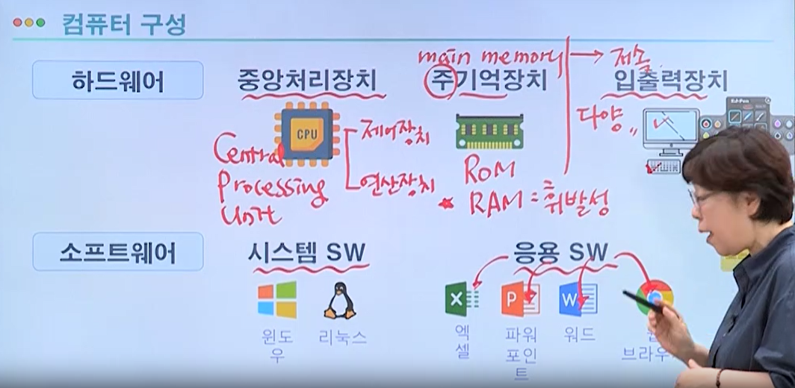

# 전자계산기 구조 (컴퓨터)

## 1. 하드웨어란?

### 1.1 중앙처리장치 (cpu) - Central Processing Unit

1. 제어장치 (명령 인출 -> 명령해독( 종류파악 ) -> 실행하도록 제어신호 발생)

2. 연산장치 ( ALU - 산술, 논리, 장치 ) (데이터 인출 -> 실행 ( 논리, 산술 연산 ) )

3. 레지스터 ( cpu 속도 ) ( cpu 내 임시 기억 장소 )
   
    

### 1.2 기억장치 (main memory)

1. 주 기억장치 ( cpu 직접 연결 )
- Rom ( Read Only Memory ) 비휘발성, 1번쓰기 가능, 변경 X
  
  - 여러번 쓰기 가능, 지우기 추가

- Ram ( Random Access Memory ) - 읽기 / 쓰기, 휘발성 
2. 보조기억장치
- SSD ( Rom 하고 Ram의 성격이 합쳐진 것 ) 반영구적 데이터 저장

### 1.3 입출력장치

1. Input Device ( 외부 -> 내부 )
- 키보드 , 마우스
2. Output Device ( 내부 -> 외부 )
- 모니터, 프린터

## 2. 소프트웨어란? ( 프로그램 + 문서 )

### 2.1 시스템 소프트웨어 ( 운영체제, 필수 환경 )

- 윈도우 , 유닉스 / 리눅스

- 언어번역 프로그램 - 컴파일러(번역가, 파일 단위) / 인터프리터(통역사, 문장 단위)
  
  - 링커 Ex) dll - 동적 연결 라이브러리
  
  - 로더 (메모리)
  
  - Ex) OTT - Over The Top
  
  - 장치 드라이버

### 2.2 응용 소프트웨어 ( 엑셀, 파워포인트, 한글 등)

## 3. 컴퓨터 부팅 과정

- CPU -> ROM ( BIOS, 부트로더 ) -> HDD ( OS ) -> RAM ( OS 복사 )

- Bios -> POST ( Power On Self Test )

## 4. 컴퓨터 구조 발전

- ENIAC -> 프로그램 외장 방식

- EDSAC, EDVAC -> 프로그램 내장 방식 ( 폰 노이만 방식  -직렬)

- 하버드 방식 ( 병렬 )

- 무어의 법칙

## 5. 컴퓨터 분류

- 사용 데이터
  
  - 디지털 (  A -> 1100001 , 불연속, 정확도 )
  
  - 아날로그 ( 연속적인 물리량 )