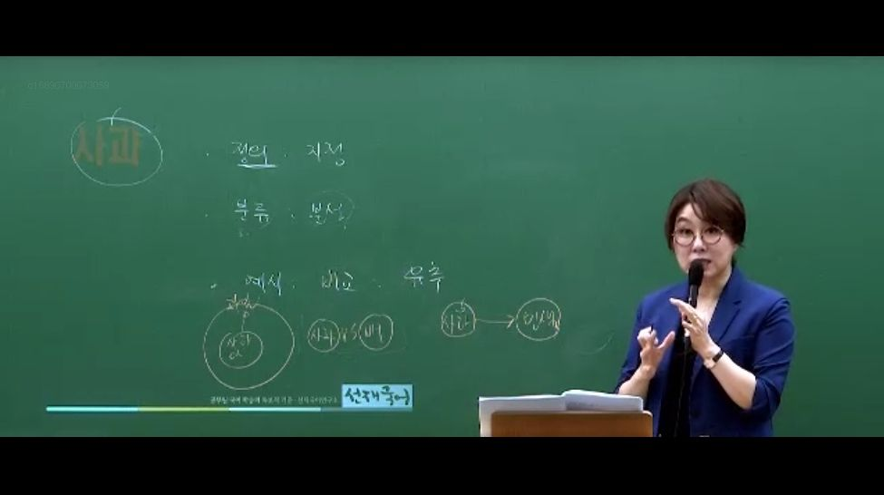
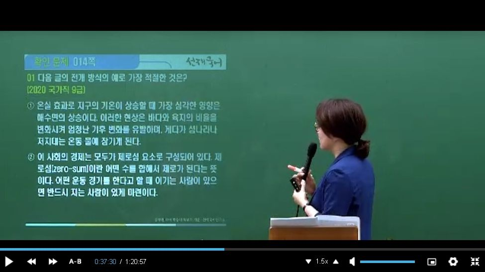
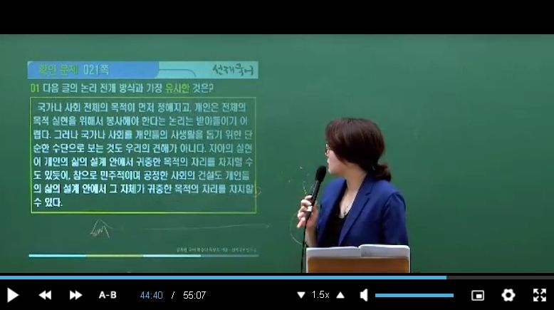
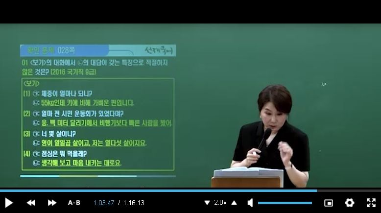
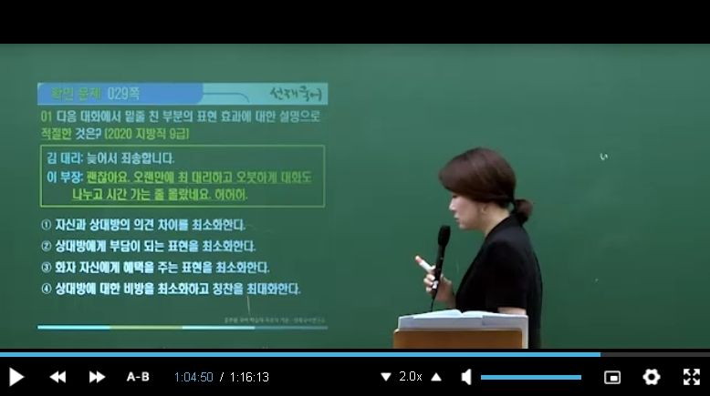

# 1. 글의 전개방식 / 2. 논증과 추론 / 3. 쓰기 말하기

## 1. 글의 전개방식

### 1-1. 동태적 전개방식

1. 서사 ( 시간의 흐름, 사건의 중점 )
   
   - 누가 무엇을 했는가?

2. 과정
   
   - 방법

3. 인과

### 1-2. 정태적 전개 방식

1. 정의
   
   - 종개념과 유개념 관계 검토 ( 유개념이 더 상위에 있는 지 )
     
     종개념 위에 유개념이 있어야 한다.
   
   - 인간만이 생각하는 특성을 가지고 있다고 할 때, 정의는 종차를 밝히는 과정이다.
   
   
   
   
   
   
   
   

2. 지정
   
   - 저 사람은 빨간색 모자를 쓰고 있다.

3. 예시

4. 비교와 대조

5. 분류
   
   - 

6. 분석
   
   

7. 묘사

8. 유추
   
   - 

          

### 1-3. 헷갈리는 부분은 ?

## 2. 논증과 추론

### 2-1. 명제와 논리

#### (1) 명제

ㄱ. 사실 명제

ㄴ. 가치 명제

ㄷ. 정책 명제

#### (2) 논거

ㄱ. 사실 논거

ㄴ. 소견 논거

### 2-2. 추론

- 추론은 어떤 사실을 바탕으로 하여 다른 문제에 대해서 논리적으로 도출하는 과정을 말한다. (결론)

- 연역법 -> 일반적 전제 -> 구체적 결론

- 귀납법 -> 구체적 근거 -> 일반적 결론

- 변증법 -> 정과 반의 대립 -> 지양. 종합적 결론

- 결론은 앞, 뒤 문장이 정해져 있는 것이 아니라, 그러므로 따라서를 붙여 결론을 찾는다.

### 2-3 추론의 유형

#### (1) 연역 추론

1. 연역 추론의 개념

2. 삼단 논법의 종류
   
   ##### ㄱ. 정언 삼단논법
   
   
   
   
   
   
   
   ##### ㄴ. 가언 삼단 논법 ( 제일 중요하다. )
   
   
   
   
   
   
   
   
   
   
   
   ##### ㄷ. 선언 삼단 논법
   
   
   
   ##### ㄹ. 생략 삼단 논법
   
   

#### (2) 귀납 추론

1.  귀납 추론의 개념

2. 귀납 추론의 종류        

#### (3) 변증법

1. 변증법의 개념

2. 변증법의 형식
   
   

### 2-3 추론의 오류

#### (1) 형식적 오류

1. 전건 부정의 오류

2. 후건 부정의 오류

3. 선언지 긍정의 오류

#### (2) 비형식적 오류

##### 1. 언어적 오류

ㄱ. 모호한 문장의 오류

ㄴ. 애매어 사용의 오류 

ㄷ. 은밀한 재정의의 오류 (자의적인 뜻을 마음대로 덧붙인다.)

ㄹ. 강조의 오류

ㅁ. 범주의 오류

##### 2. 자료적 오류

ㄱ. 성급한 일반화의 오류

ㄴ. 우연의 오류 ( 예외를 인정하지 않는 오류 )

ㄷ. 잘못된 인과 관계의 오류

ㄹ. 공통 원인의 오류

ㅁ. 논점 일탈의 오류

ㅂ. 합성의 오류 (결합의 오류)

ㅅ. 분할의 오류 (분해의 오류)

ㅇ. 의도 확대의 오류

ㅈ. 흑백 사고의 오류

ㅊ. 무지에 호소하는 오류

ㅋ. 잘못된 유비 추리 (기계적 유비 추리의 오류)

ㅌ. 복합 질문의 오류

ㅍ. 순환 논증의 오류 (선결 문제 요구의 오류)

ㅎ. 발생학적 오류

##### 3.심리적 오류

ㄱ. 공포(위력)에 호소하는 오류

ㄴ. 연민(동정)에 호소하는 오류

ㄷ. 정황에 호소하는 오류

ㄹ. 대중(다수)에 호소하는 오류 ( 양 -> 질 )

ㅁ. 부적합한 권위에 호소하는 오류

ㅂ. 인신공격의 오류

ㅅ. 피장파장의 오류(역공격의 오류)

ㅇ. 원천 봉쇄의 오류(우물에 독 뿌리기)

  

- 1. 순환 논증의 오류 

- 2. 무지에 호소하는 오류

- 대중에 호소하는 오류 ( 양 -> 질 )

- 2. 무지에 호소하는 오류
  
  3. 권위에 호소하는 오류
  
  4. 동정에 호소하는 오류

## 3. 쓰기·말하기

### 3-1. 쓰기

#### 1. 문단의 개념

#### 2. 문단의 요건

##### (1) 통일성

##### (2) 완결성

##### (3) 일관성

#### 3. 문단의 구조와 유형

- 전제를 찾으라는 말은 결론을 찾으라는 말이다.

### 3-2. 말하기

#### 1. 대화의 개념과 원리

##### (1) 협력의 원리

- 양의 격률

- 질의 격률 ( 거짓, 과장 X )

- 관련성의 격률

- 태도의 격률

##### (2) 순서 교대의 원리

##### (3) 공손성의 원리

- 요령, 칭찬 ( 상대방에게 부담이 되는 표현을 최소화 )

- 관용, 겸양 ( 자신에게 부담이 되는 표현을 최대화 )

- 동의

### 3-3. 공감적 듣기

#### (1) 소극적인 들어 주기

#### (2) 적극적인 들어 주기

- 집중 -> 격려 -> 반영

- 1. 양의 격률
  
  2. 질의 격률 (과장)
  
  3. 양의 격률
  
  4. 태도의 격률

### 3-4 토의

#### (1) 토의의 개념과 특성

- 토의  VS 토론 ( 찬성과 반대 )

- 공통점 : 집단적 담화

- 차이점 : 찬반으로 나뉘는 경우

#### 토의 유형

- 심포지엄 ( 학술적, 전문성, 발표 )

- 포럼 ( 공청회와 유사, 공공성 ), 공청회는 청중이 참여

- 패널 ( 대표성, 대신 토의, 배심 토의 )

- 원탁 토의 ( 평등성 )

