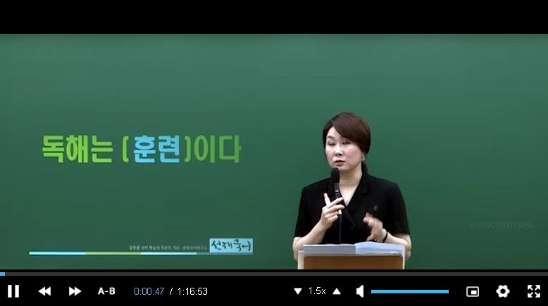
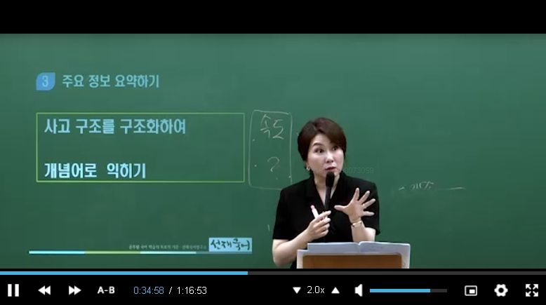
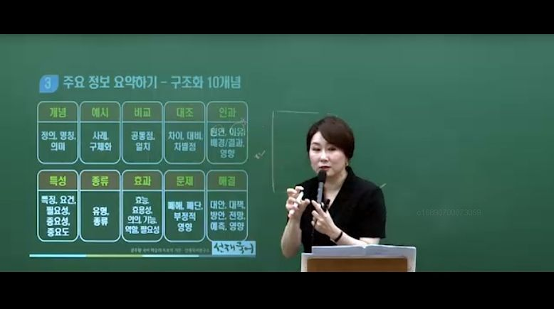
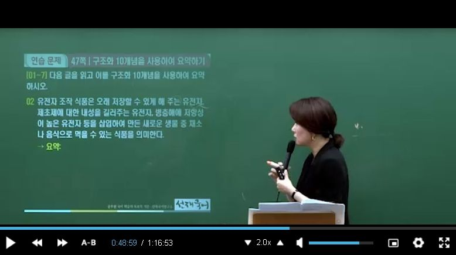
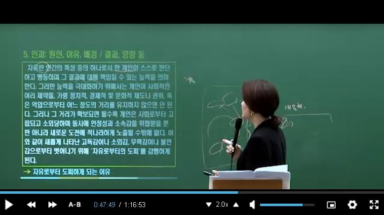
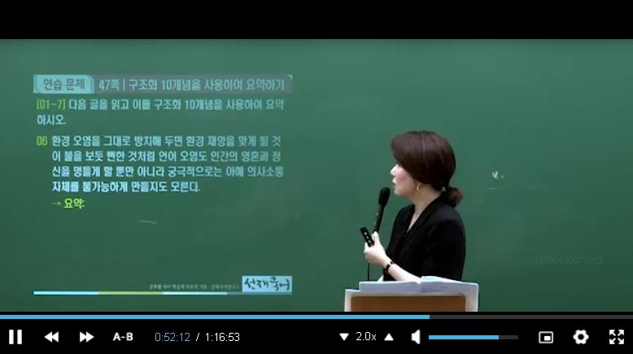
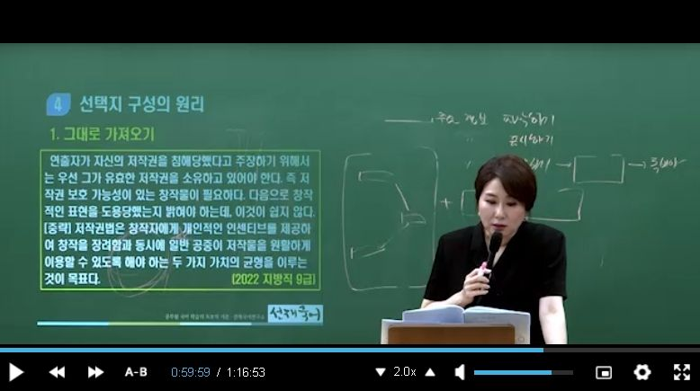
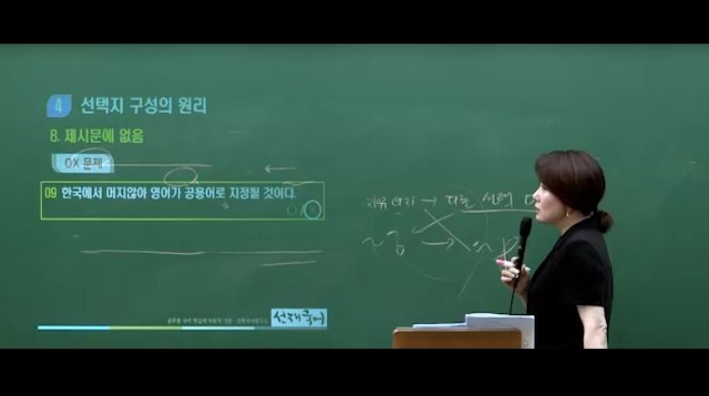

# 1.독해의 기술 / 2. 주요 문제 유형 분석

 

## 1.독해 유형

1. A and B

2. A but B

3. A이다. 물론 B이다(일 수 있다.) 그러나 C이다

4. A 그래서(그러므로,따라서,이처럼) B

5. A 때문에 B이다. B인것은 A 때문이다.

6. A 즉 (다시 말하면) B -> 중요한 것은 A

7. A 예를들어 (가령, 이를테면, 예컨대) B - > 중요한 것은 B

## 2.주요 정보 표시하기

## 3.주요 정보 요약하기

 

### 3-1. 개념: 정의, 명칭, 의미 등

### 3-2. 예시: 사례, 구체화 등

### 3-3. 비교: 공통점, 일치 등

### 3-4. 대조: 차이, 대비, 차별점 등

### 3-5. 인과: 원인, 이유, 배경 / 결과, 영향 등

### 3-6. 특성: 특징, 성질(성격), 요건, 중요성, 중요도 등

### 3-7. 종류: 유형, 종류 등

### 3-8. 효과 : 효능, 효용성, 의의, 기능, 역할 필요성 등

### 3-9. 문제: 폐해, 폐단, 부정적 영향, 위험성

### 3-10. 해결: 대안, 대책, 방안, 전망, 예측, 영향 등

## 4. 선택지 구성의 원리

- 출제자가 왜 이런 문제를 내었을까?

### 4-1. 그대로 가져오기

### 4-2. 반대 진술

### 4-3. 비교, 범주, 수치의 오류

### 4-4. 의도의 오류

### 4-5. 원인과 결과

### 4-6. 치환(바꿔 쓰기)

### 4-7. 혼용 (섞어 쓰기)

### 4-8. 제시문에 없음

 

#### **헷갈렸던 문제.**

