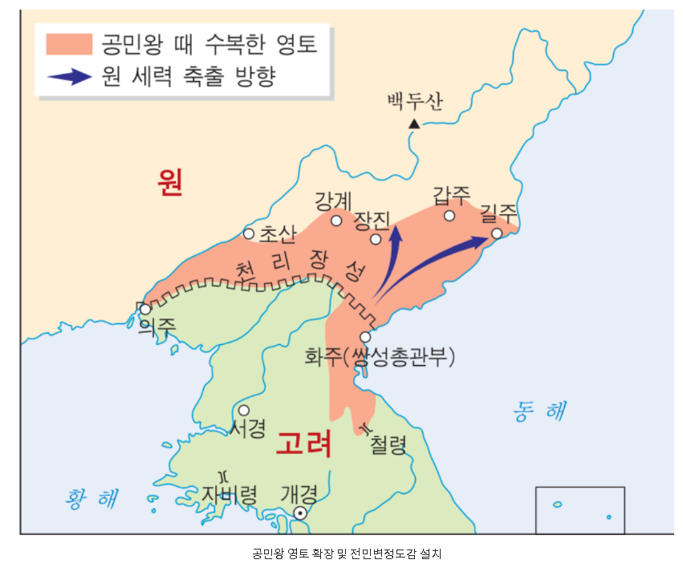
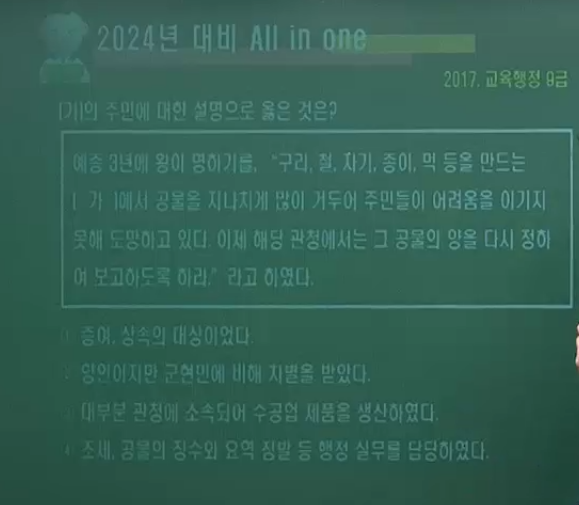
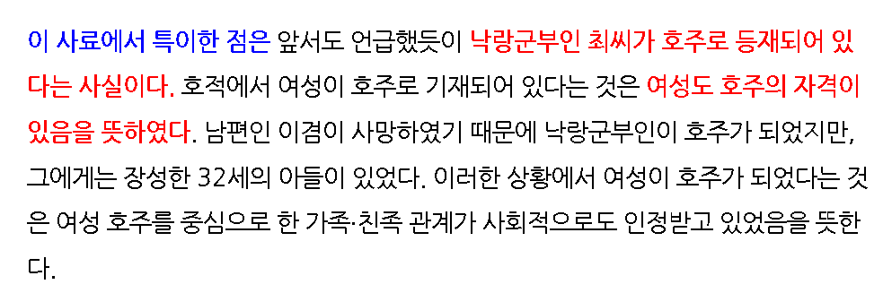
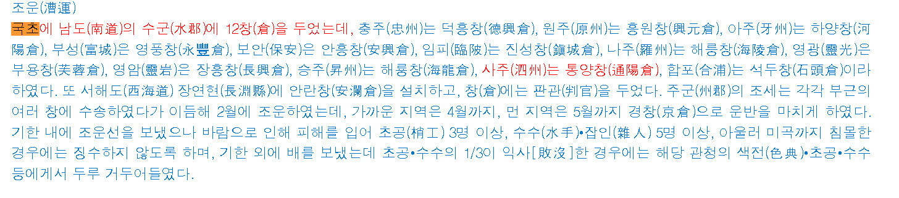
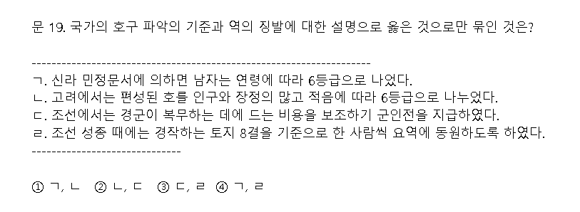

# 여진 정벌과 9성 개척 ( p.212  )

## 1. 여진과의 충돌

### 1.1 초기 여진 ( 아무것도 아님. )

- 여진은 한때 말갈이라 불리면서 오랫동안 고구려에 복속되어 있었다.

- 발해가 멸망한 후에 여진으로 불리며 발해의 옛 땅에서 반독립적 상태로 세력을 유지하였으며, 고려는 두만강 연안의 여진을 경제적으로 도와주면서 회유 · 동화 정책으로 포섭해 나갔다. ( 고려를 '부모의 나라' 라고 부름. )

## 2. 윤관의 여진 정벌 ( 중간 단계 성장. )

### 2.1 여진의 발흥

- 12세기 초 만주 하얼빈 지방에서 일어난 (완옌부 추장 아골타)가 여진을 통합하면서, 정주까지 남 하하여 고려와 충돌을 빚게 되었다.

### 2.2  별무반 편성( 1104, 숙종 9 )

- 설치 배경 : 기병 중심의 여진과의 1차 접촉에서 패한 고려는 여진을 보병만으로 상대하기는 어렵다고 판단하였다.

- 윤관의 건의로 편성 : 신기군(기병), 신보군(보병), 항마군(승병)으로 별무반을 편성하여 여진 정벌을 준비하였다.

- 성격 : 양천혼성군 - 귀족에서부터 양민 농민, 노비에 이르기까지 광범위한 계층

### 2.3  동북 9성 축조(1107, 예종 2 )

- (예종) 때 윤관은 별무반을 이끌고 천리장성을 넘어 여진을 북방으로 쫓아버리고, 동북 지방 일대에 9성을 쌓아 방어하였다.

### 2.4  9성 환부(1109, 예종 4 )

- 수비 곤란 : 여진의 계속된 침입으로 9성 수비에 어려움을 겪었고, 서북쪽의 거란과 대치하는 상황이 벌어져 여진 방어에만 힘쓸 수 없었다.

- 조건 수락 : 이에 고려는 다시 침략하지 않고 해마다 조공을 바치겠다는 여진의 조건을 수락하고 약 1년 만에 9성을 돌려주었다.

## 3. 금의 건국과 사대 외교

### 3.1 여진족의 금 건국 (1115)

- 여진족은 더욱 강성해져 만주 일대를 장악하면서 국호를 금이라 하고(1115), 요(거란)를 멸한 뒤(1126) 고려에 군신 관계를 맺고자 압력을 가해 왔다.

### 3.2  금의 사대 요구(군신 관계 요구) 수용 ( 1126, 인종 4 )

- 갈등 : 고려는 금의 사대 요구를 둘러싸고 정치적 분쟁을 겪었다.

- 수용 : 당시 집권자인 (이자겸)은 현실적으로 금과의 무력 충돌을 피하기 어려운 점을 고려하여 결국 (금의 군신 관계 요구를 받아 들였다.) 이는 정권 유지를 위하여 금과 평화 관계를 유지하는 것이 유리하였기 때문이었다.

- 결괴 : 태조 이래의 북진 정책이 좌절되었고, 고려 사회의 분열을 가속화하는 계기가 되었다. -> ( 모순1 : 이자겸의 난), ( 모순2 : 묘청의 서경 천도 운동 야기 )

-------

# 03 / 문벌 귀족 사회의 성립과 동요 ( p 214 )

## 1. 문벌 귀족 사회의 성립과 모순

### 1.1 성립

- 형성 : 성종 이후 중앙 집권적인 국가 체제가 확립됨에 따라 새로운 지배 새력이 형성 되었다.

- 의미 : 이들 중 (여러 세대에 걸쳐 중앙에서 고위 관직자들을 배출한 가문)을 문벌 귀족이라 부른다. ( 가문의 벌열화 ).

### 1.2 출신

- 지방 호족 출신으로 중앙 관료가 된 계열과, 신라 6두품 계통의 유학자들이었다.

### 1.3 정치

- 문벌 귀족은 (과거와 음서)를 통하여 관직을 독점하고, (중서문하성과 중추원의 재상)이 되어 정국을 주도해 나갔다.

- 음서 : 공신이나 5품 이상의 고위 관료의 자제등을 과거 시험 없이 등용하는 제도.

- 공음전 : 5품 이상 관료들에게 지급된 세습이 허용되는 토지

- 문벌 귀족의 보수성 : 좌주와 문생의 관계 ( 항맥 )

### 1.4 경제

- 관직에 따라 (과전)을 받고 (세습이 허용되는 공음전) 등의 혜택을 누렸을 뿐만 아니라, 권력을 이용하여 불법적으로 개인이나 국가의 토지를 소유하였다.

### 1.5 사회

- 가문과 문벌을 중시한 문벌 귀족들은 비슷한 부류들끼리 (폐쇄적 통혼 관계)를 형성하여 권력을 더욱 공고히 하였다. 특히 (왕실과 혼인 관계)를 맺어 (외척으로서의 지위)를 이용하여 정권을 장악하기도 했다.

### 1.6 모순과 갈등

- 원인 : 문벌 귀족 사회의 내부에서 정치권력의 독점과 경제적 특권의 확대를 둘러싼 분열이 일어났다.

- 문벌 귀족과 지방 출신 관료와의 갈등 : 과거를 통하여 진출한 지방 출신의 관료들 중 일부는 왕에게 밀착하여 왕권을 강화하고 보좌하는 측근 세력이 되어 문벌 귀족과 대립하였다.

- 대표 사건 : (이자겸의 난)과 (묘청의 난)은 이들 정치 세력 간의 대립과 갈등이 표면으로 드러난 사건이었다.

## 2. 이자겸의 난(1126, 인종 4, 모순 1 )

### 2.1 배경 ( 경원 이씨의 족벌 정치)

- 11세기 이래 대표적인 (문벌 귀족)인 경원(인주) 이씨 가문은 외척이 되어 80여 년간 정권을 잡았다.

- 경원 이씨는 이자연의 딸이 문종의 왕비가 되면서, 정치권력을 장악하기 시작 했다.

- 이자연의 손자인 (이자겸도 예종과 인종의 외척)이 되어 집권하였다.

- 이자겸은 예종의 측근 세력()을 몰아내고 인종이 왕위에 오를 수 있게 하면서, 그 세력이 막강해졌다. 이러한 이자겸의 권력 독점에 반대한 왕의 측근 세력은 왕을 중심으로 결짐하였다. 인종은 이자겸의 권력에 불안을 느껴 그를 제거하려 하였다.

### 2.2 과정

#### 1. 인종 측근 세력 축출

> 이자겸 
> 
> 예종의 장인
> 
> 인종의 외조부이자, 장인
> 
> 지국군사라고 자칭
> 
> 자신의 생일을 인수절이라 칭함
> 
> 아들을 출가시켜 현화사 불교 세력과 강력한 유대 관계

- 한안인 등 인종의 측근 세력인 반대파를 제거

- 도참설을 내세워 (척준경)과 함께 난을 일으켜 권력을 장악하였다 ( 1126 )

#### 2. 이자겸 몰락

- 인종이 척준경을 회유하여 이자겸이 척준경에 의해 물러난다.

- 척준경도 정지상(신진 세력, 묘청)의 탄핵으로 축출됨으로써 이자겸 세력이 몰락하였다.

### 2.3 결과

#### 1. 왕권 위축

- 왕궁 소실, 문벌 귀족의 권력 장악 과정에서 왕권이 약화 되었다.

#### 2. 서경 천도설 대두

- 개경의 지덕이 쇠했다는 풍수지리설과 서경 천도설이 대두되었다.

#### 3. 문벌 귀족 사회 분열

- 중앙 지배층 사이의 분열을 드러냄으로써 (문벌 귀족 사회의 붕괴를 촉진하는 계기)가 되었다.

#### 굴비의 어원

> 전남 영광 법성포에 유배된 이자겸은 소금에 절여 말린 조기를 임금(인종)에게 진상하면서, "선물은 보내도 굴한 것은 아니다."라는 의미로 굴비(屈非)라 적어 보냈다. 이는 오늘날 굴비의 어원이라 전해진다.

----

## 3. 묘청의 서경 천도 운동(묘청의 난, 1135,인종 13)

### 3.1 배경

#### 1.  ( 인종의 정치 개혁 추진 )

- 이자겸의 난 이후 인종은 "유신지교"를 반포(1127, 인종5)하여 실추된 왕권을 회복하고 민생을 안정시키며 국방력을 강화하기 위한 정치 개혁을 추진하였다.
  
  > 유신지교(維新之敎)
  > 
  > 고려 인종은 이자겸의 난(1126)이 진압된 후 묘청 일파의 요청으로 1127년(인종 5) 서경에 행차하여 새로운 정치를 펼치려는 의지를 밝히는 유신지교를 반포하였다. 그 내용을 일부 요약하면 다음과 같다.
  > 
  > 1. 방택에서 지신에게 제사를 지내 4교의 좋은 기운을 받아 들일 것.
  > 
  > 2. 수레와 의복의 제도는 검약하도록 힘쓸 것
  >    
  >    4. 농사를 권장하고 토지에 힘써 백성들의 식량을 넉넉하게 할 것
  >       
  >       6. 백성에게서 거두는 데는 법도가 있으니 정해진 조세와 공물 이외에는 함부로 거두어 들이지 말 것.

#### 2. ( 보수적 관리와 개혁적 관리의 대립 )

- 왕권 강화 과정에서 (김부식)을 중심으로 한 보수적 관리와 (묘청.정지상)을 중심으로 한 지방 출신의 개혁적 관리들 사이에 대립이 벌어졌다.

#### 3. ( 서경 천도 시도 )

- 묘청 세력은 풍수지리설을 내세워 서경(평양)으로 도읍을 옮겨, 개경의 보수적인 문벌 귀족 세력을 억압하고 왕권을 강화하면서 자주적인 혁신 정치를 시행하려 하였다.

- 인종의 동조하에 서경에 (대화궁) 이라는 궁궐과 (팔성당[신당])을 세우고 (황제를 칭할 것)과 (금을 정벌할 것)을 주장하였으나 개경파에 의해 좌절 되었다.

- 김부식이 중심이 된 개경 귀족 세력은 유교 이념에 충실함으로써 사회 질서를 확립 할 것을 주장하였다. 아울러 이들은 민생 안정을 내세워 (금)과 사대 관계를 맺었다.

> 개경파  VS 서경파

| 구분     | 개경파                       | 서경파                        |
| ------ | ------------------------- | -------------------------- |
| **인물** | 보수적 개경 문벌 귀족(김부식)         | 지방 출신 개혁 관리(묘청 · 정지상)      |
| **주장** | 민생 안정 강조 (금에 대한 사대)       | 칭제건원, 금국 정벌 주장             |
| **성격** | - 사대적, 보수적 - 신라 계승 의식 | - 자주적, 개혁적 - 고구려 계승 의식 |
| **사상** | 유교 이념 충실                  | 전통 사상 + 불교 사상, 풍수지리        |

> 서경 세력의 주장

> 개경 세력의 주장

> 김부식
> 
> - 대표적인 문벌 귀족, 신라 왕실의 후예
> 
> - 묘청의 난 진압
> 
> - 왕명에 따라 [삼국사기]를 편찬하였다.

### 3.2 경과

> 묘청 세력은 서경 천도를 통한 정권 장악이 어렵게 되자 서경에 (대위국) 을 건국하고 연호는 (천개) 군대를 (천견충의군)이라 하고, (묘청의 난, 1135)을 일으켰으나, 약 1년 만에 김부식이 이끄는 관군의 진압으로 실패하였다.

### 3.3 성격

#### 1. 지배층 내부의 분열

- (문벌 귀족 사회 내부의 분열)과 지역 세력 간의 대립이었다.

#### 2. 사상적 대립

- (풍수지리설이 결부된 자주적 전통사상(서경파)과 
  
  사대적 유교 정치 사상의 충돌(개경파)이었다.

#### 3. 상반된 계승 이념

- 고구려 계승 이념(서경파)과 신라 계승 이념(개경파)에 대한 갈등이 얽혀 일어난 것으로, 귀족 사회 내부의 모순을 드러낸 것이다.

### 3.4 영향

#### 1. 승문천무 현상 강화

- 문벌 귀족 세력이 강화되고, 승문천무 현상이 두드러져 (무신정변의 배경)이 되었다.

#### 2. 서경 세력 약화

- 서경의 지위가 하락하였고, 분사 제도도 폐지되었다.

### 3.5 신채호의 평가

- 단재 신채호는 (조선사 연구초)에서 묘청의 서경 천도 운동의 자주성을 높이 평가하여 (조선 역사상 일천년래 제일대사건)이라 평하였다.

----

# 3.5 현종 이후 ~ 무신 정변 이전의 왕대사

| 현종 (1009~1031, 8대)  목/ 강조의 정변 | - 지방 제도 정비(5도 양계 4도호부 8목), 연등회 · 팔관회 부활 - 현화사 건립, 초조대장경 조판, [7대 실록] 편찬 시작 - 주창수렴법 : 각 주에 창고 설치 -> 흉년에 빈민 대상 곡식 대여(의창 보완) - 면군급고법 : 고령의 노부모가 있는 정남 군역 면제 - 감목양마법 : 군마 확보 목적(기병 양성)                   |
| ------------------------------------- | ------------------------------------------------------------------------------------------------------------------------------------------------------------------------------------------------------------------- |
| **덕종 (1031~1034, 9대)**            | - 천리장성 착공 - [7대 실록] 완성                                                                                                                                                                                      |
| **정종 (1034~1046, 10대)**           | - 천리장성 완공                                                                                                                                                                                                           |
| **문종 (1046~1083, 11대)**           | - 경정전시과 실시, 녹봉제도 완비 - 한양을 남경으로 승격 - 최충의 문헌공도(9재 학당) 설립 - 동서 대비원 정비, 흥왕사 건립 - 삼복제(사형수 판결의 삼심제) - 향리의 승진(승급) 규정을 정함 - 기인선상법(1077): 기인의 인질 성격이 사라짐.                                            |
| **숙종 (1095~1105, 15대)**           | - 윤관의 별무반 편성 - 남경개창도감 설치(김위제 건의) - 서적포 설치, 기자 사당 건립  - 의천의 해동천태종 개창 (국청사 완공) - 주전도감 설치 및 화폐 주조 : 해동통보, 해동중보, 삼한통보, 동국통보, 활구(은병) 등                                                               |
| **예종 (1105~1122, 16대)**           | - 여진 정벌 -> 동북 9성 축조, 반환 - 7재(전문 강좌) · 양현고(장학 재단) 설치 - 청연각 · 보문각 설치 - 복원궁(도교 사원) 처음 건립 - 속현에 감무 파견, 혜민국 · 구제도감 설치 - 도이장가 지음 ( 개국공신 김락, 신숭겸 추모곡 ) - [해동비록] ( 1106 ) - [속편년통재] (1116, 홍관 ) |
| **인종 (1122~1146, 17대)**           | - 이자겸의 난 ( 1126, 인종 4 ) - 묘청의 난 ( 1135, 인종 13 ) - 김부식의 [삼국사기] 편찬 ( 1145, 인종 23 ) - 경사 6학 정비, 강예재 폐지 - [상정고금예문] 편찬(최윤의) -> 강화 피난기인 고종 21년(1234, 최우 집권기)에 금속활자로 인쇄 - 송의 사신 서긍 입국 ( [선화봉사고려도경] 저술) |

----

# 04 / 무신 집권기 ( 1170 ~ 1270 )

## 1. 무신 정변 (경인년의 난)

### (1) 배경

- 묘청의 서경 천도 운동 이후 문벌 귀족 지배 체제의 모순은 심화되었고, 지배층은 이와 같은 상황에 효과적으로 대응하지 못한 채 정치적 분열을 거듭하였다.

- 숭문천무 정책
  
  > ㄱ. 무신 차별 : 과거 제도에 무과를 거의 시행하지 않았고, 무신 최고 지위인 상장군, 대장군이 3품에 불과했으며 문신에 비해 무신이 차별 대우를 받았다. 군대의 총사령관도 문신이 임명되었다. 거란의 침략을 막은 강감찬과 여진 정벌에 나선 윤관 모두 문신으로 군대의 총사령관이 된 인물들이다.
  > 
  > ㄴ. 군인전 미지급 등 : 무신의 전시과 토지 분급이 문신보다 낮았고 군인전 미지급으로 인한 하급 군인들의 불만도 고조되고 있었다. 이러한 지배 체제의 모순이 정치적으로 폭발한 것이 무신 정변이었다(1170).
  > 
  > ㄷ. 의종의 실정 : 문신을 우대하며 무신을 차별하고 측근 세력을 키워 의존하며, 향락에 빠지는 등의 실정을 거듭하여 무신들의 불만이 커졌다.

### (2) 경과

- (정중부, 이의방, 이고) 등 무신들은 의종의 (보현원) 행차를 기회로 정변을 일으켜 다수의 문신을 죽이고 (의종을 폐하여 거제도로 귀양) 보낸 후 (명종을 옹립)하여 정권을 장악하였다 (1170, 경인난).
  
  

### (3) 결과

- 무신 정권 초기에는 무신들 간의 권력 다툼으로 국정이 혼란하였다. 정중부, 이의방 등은 권력을 장악하고 (무신들의 회의 기구인 중방을 통해 권력을 행사) 하였다.

- 이 시기에는 무신과 문신의 관직을 동시에 가질 수 있도록 한 (문무 겸직제)를 시행하여 무신이 (재신) 과 (추신)이 될 수 있게 하였다.

> 중방
> 
> 무신 정변 이전부터 있었으나 무신 정변 이후 최씨 정권 성립 이전까지 최고 권력 기구로 기능하였다.

## 2. 무신 정권의 변천

### (1) 정중부( 1170~1179, 명종 때 )

- (중방)을 중심으로 권력을 행사하면서 주요 관직을 독차지하고 토지와 노비를 늘려 나갔다. 또한, 저마다 사병을 길러 권력 쟁탈전을 벌였다.

### (2) 경대승 ( 1179~1183, 명종 때)

- 정중부를 제거하고 집권하였으며, (사병 집단)인 (도방)을 처음 설치하였다.

> 도방
> 
> 경대승은 신변에 위협을 느끼게 되어 스스로를 보호할 목적으로 결사대 100여 명을 자기 집에 머무르게 하고 그 이름을 도방이라 하였다. 이는 고려 시대 무신 정권의 사병 집단이며 숙위 기관이었다.

### (3) 이의민 ( 1183~1196, 명종 때 )

- (천민 출신)으로 김보당의 난 때 공을 세워 정계에 진출 하였다. 이후 (중방)을 중심으로 무신 정권의 권력을 잡았으나 피살 되었다.
  
  > 이의민의 아버지는 소금 장수이며, 어머니는 옥령사의 노비로서 천인 출신이었다. 1174년 조위총의 난을 진압하면서 급속히 출세하여 무인집정의 자리에 올랐다.

### (4) 최씨 정권의 성립

#### ① 최충헌( 1196~1219, 명종~고종 때 )

- 이의민을 제거하고 정권을 장악하였다. 그는 1197년에 명종을 폐하고 신종(1197~1204), 희종(1204~1211), 강종(1211~1213), 고종(1213~1259)을 옹립하였다.

| 봉사 10조 제시 (1196, 명종 26) | - 사회 개혁책으로 최충헌이 국왕에게 올림 - 제대로 된 개혁을 시도하지 않음.                                                                  |
| --------------------------- | ----------------------------------------------------------------------------------------------------------------- |
| **농장 확대**                   | - 전라도와 경상도 일대에 농장을 소유. (진주 지방 식읍으로 받아 경제권 장악) - 희종 때 (진강후)의 벼슬을 받고 (흥녕부)를 설치                              |
| **교정도감 설치 (1209)**      | - 관리의 감찰과 인사 행정 및 재정권까지 담당한 최고 집정 기관 - 장관인 교정별감은 최씨 일가가 대대로 세습 - 국정을 총괄하는 최고 정치 기구가 탄생하면서 중방의 권력은 크게 약화됨. |
| **도방 부활 (무단 정치 강화)**    | - 농민 항쟁 적극적 진압 - 삼별초(최우가 설치)와 함께 최씨 정권을 유지하는 권력적 기반                                                           |
| **조계종 후원**                  | - 왕실과 귀족의 교종과 사원을 억압하고 (선종 조계종)을 후원하였다.                                                                           |
| **문신 지위 향상**                | - (이규보), 진화 등을 우대하는 등 문신을 등용하여 무신을 견제하였다.                                                                         |

> 최충헌의 봉사 10조 ( 1. 왕은 속히 정전[연경궁]으로 환어할 것. )

#### ② 최우(최이, 1219~1249, 고종 때)

| 정방 설치                  | - 자신의 집에 정방을 설치하여 모든 관직에 대한 (인사권)을 장악하였다.                                                                                                                                                                                                                    |
| ---------------------- | ------------------------------------------------------------------------------------------------------------------------------------------------------------------------------------------------------------------------------------------------------------ |
| **서방 설치**              | - (문신)들의 숙위 가구 - (이규보), 이인로, 최자 등이 서방에서 활약                                                                                                                                                                                                           |
| **마별초 조직**             | - 최씨 정권의 사병 조직 중 하나로, (기병대)로 편성되었다. 몽골 기병의 영향을 받아 설치된 것으로 보인다.                                                                                                                                                                                               |
| **야별초 조직 (->삼별초)** | - 야간 순찰과 도둑을 단속하게 하였다. 이 야별초는 후에 삼별초로 확대 · 개편되었다.                                                                                                                                                                                                            |
| **대몽항쟁(강화 천도)**        | - 몽골과의 장기 항전을 고려하여 (강화도로 천도) 하였다 ( 1232 ) - 고려 고종은 1233년 최우에게 천도한 공을 인정하여 (진양후)에 봉하였고, 그의 집은 (진양부)가 되었다. - 부를 설치하여 왕자등과 동등한 지위를 공식적으로 인정받았다. - 강화도 천도 시기 [상정고금예문을 금속 활자로 인쇄하였다 (1234) - [팔만(재조)대장경을 조판(1236~51)]하며 부처의 힘으로 외적을 방어해 줄 것을 빌었다. |

- 강화 천도 (1232)
  
  > 최우는 몽골의 지나친 간섭과 조공 요구에 반발하여 장기 항전을 위해 강화도로 도읍을 옮겼다. 육지에 남게 될 백성들을 염려하여 천도에 반대하는 신하들도 있었으나, (이규보는 강화도 천도에 찬성) 하는 주장을 하여 최우의 계획을 옹호하였다.

> 삼별초
> 
> 좌별초 · 우별초 · 신의군
> 
> 경찰 · 전투 등 공적 임무 수행 -> 공적 군대에 준함.

#### ③ 최씨 정권의 특징

> 정치적으로는 안정되었지만 국가 통치 질서는 약화되었고 권력 유지에 급급하여 권력의 유지와 이를 위한 체제의 정비에 집착했을 뿐, 국가의 발전이나 백성들의 안정을 위한 노력에는 소홀하였다.

### (5) 무신 정권의 몰락 ( 1270년 강화도 -> 개경 환도 )

> 김준 이후 임연, 임유무 부자가 집권하였으며, 원종(1270) 때 임유무가 제거되면서 무신 정권은 끝났다. 이후 원 간섭기가 시작되었다.

## 3. 사회의 동요 ( 무신 정권에 대한 반발 )

| 정중부 (1170~1179) 4건        | - 김보당의 난 ( 1173, 명종 3년 ) - 교종 승려의 난 ( 1174, 명종 4년 ) - 조위총의 난 ( 1174, 명종 4년 ) - 공주 명학소 망이.망소이의 난 ( 1176, 명종 6년) |
| ------------------------- | -------------------------------------------------------------------------------------------------------------------------- |
| **경대승(1179~1183) 1건**     | - 전주 관노의 난 ( 1182, 명종 12년 )                                                                                                |
| **이의민(1183~1196) 1건**     | - 김사미.효심의 난(1193, 명종 23년 ) -> 무신 집권기 최대 규모의 민란                                                                             |
| **최충헌(1196~1219) 4건 만리최** | - 만적의 난 ( 1198, 신종 1년 ), 광명.계발의 난(1200, 신종 3년) - 이비.패좌의 난 (1202, 신종 5년) - 최광수의 난 (1217, 고종 4년 )                |
| **최우(1219~1249) 1건**      | - 이언년의 난 (1237, 고종 24년 )                                                                                                   |

### (1) 반(反) 무신의 난

#### ① 김보당의 난( 계사 난,경계의 난,  1173, 명종 3) 마이너스

> 최초의 (반 무신의 난)으로, 동북면 병마사 김보당이 (의종의 복위를 꾀하여 난)을 일으켰으나, 진압되고 이의민 등이 의종을 참혹하게 살해함으로써 이 난은 완전히 평정되었다.

#### ② 교종 승려(귀법사)의 난 ( 1174, 명종 4 ) 마이너스

> 문벌 귀족과 연결되었던 귀법사 등 (교종 계통의 승려)들이 무신 정권에 반발하여 난을 일으켰다.

#### ③ 조위총의 난 ( 1174, 명종 4, 서북계 지방의 민란 )

> (서경) 유수 조위총은 지방군과 농민을 이끌고 중앙의 무신들에게 3년간이나 항거하였으나 실패하였다. 조위총의 난에는 많은 농민이 가세하여 농민 항쟁의 성격을 띠었다.

### (2) 하층민의 봉기

> 무신 집권기에 지배층에 의한 대토지 소유는 더욱 늘어났고, 정치 싸움으로 인하여 중앙 정부의 지방 통제력이 약화되면서 농민과 천민의 대규모 봉기가 일어났다.

#### ① 양민들의 난 플러스

##### ㉠ 망이 · 망소이의 난 ( 1176, 명종 6, 남부 지방의 반란 )

> (공주 명학 소)에서 망이 · 망소이가 신분 해방을 외치며 봉기하였다. 이후 명학소를 (충순현으로 승격) 시켰고, 향·소·부곡이 점차 소멸되는 계기가 되었다.

##### ㉡ 김사미 · 효심의 난 ( 1193, 명종 23. 이의민이 지원함-why? 왕이 되려고 )

> 고려 명종 때인 1193년 김사미 세력과 효심 세력이 연합하여 일으킨 농민 봉기이다. (김사미는 운문(청도)) (효심은 초전(밀양 또는 울산)) 에서 난을 일으켰다.
> 
> 이들은 한때 경상도 전역을 장악하고 토벌군에 대항했으나 이듬해 진압되고 말았다.

##### ㉢ 광명 · 계발의 난 ( 1200, 신종 3 )

> (최충헌 집권기)에 경상도 합주(현 경남 합천)에서 노올부곡민이 진주민과 함께 지방관의 탐학에 항거하여 일으킨 반란이다.

    

#### ② 천민 · 노비들의 난

##### ㉠ 전주 관노의 난 (죽동의 난, 1182, 명종 12 )

> (경대승의 집권기)에 전주 관노의 난이 일어나 한 때 전주를 점령하였다.

##### ㉡ 만적의 난 ( 1198, 신종 1)

> (최충헌의 사노인) 만적은 사람이면 누구나 공경대부가 될 수 있다고 주장하였다. 그들은 신분 차별에 항거하며 정권 탈취를 시도하였다.

#### ③ 삼국 부흥 운동

#### ㉠ 고구려 부흥 운동

> (서경)에서 (고구려 부흥)을 표방한 (최광수의 난. 1217) 이 일어났다.

#### ㉡ 백제 부흥 운동

> (담양)에서 (백제 부흥)을 표방한 (이연년의 난. 1237)이 일어났다.

#### ㉢ 신라 부흥 운동

> 1193년 (운문, 초전)에서 (신라 부흥)을 표방한 (김사미·효심의 난. 1193)이 일어났고, 1202년에는 (경주)에서 (이비.패좌)가 주동이 되어 (신라 부흥)을 내걸고 (이비.패좌의 난)을 일으켰다.

- 반란 진압 후 최충헌은 동경을 경주로 격하시키는 등 잔족 세력을 색출 하였다.

## 4. 무신 정변의 영향

### (1) 정치 면

- 문벌귀족 사회가 붕괴되고 (관료 체제로의 전환.능력 위주)이 촉진 되었다.

- 왕권이 약화되고 무신들이 중방과 교정도감을 통해 권력을 독점하였다.

- 이의민, 김준 등 일부 천민 출신들이 권력층으로 등장하기도 하였다.

### (2) 경제 면

- (전시과 체제가 붕괴)되고 대토지 소유의 확대 농장이 증가하였다.

- 민생 피폐 : 국가의 수취와 집권층의 수탈이 심화되었다.

### (3) 사회 면

- 국가 통제력 약화 : 정치 싸움으로 인하여 중앙정부의 지방 통제력이 약화되었다.

- 신분제 동요 : 농민과 천민의 대규모 봉기가 일어났으며, 하층민 출신에서 출세한 자가 늘어났다. 전국적 봉기 2

### (4) 사상 면

- 신앙 결사 운동 : 불교계가 자기모순을 인식하고 개혁과 본연의 자세를 확립하려는 결사 운동이 일어났다.

- 조계종 개창 : 무신 정권의 후원으로 지눌이 선종 중심의 조계종을 개창하였다.

### (5) 문화 면

- 문화 침체 : 소외된 문신의 패관 문학과 은둔적 시조 문학이 발달하였으며, 문벌 귀족의 몰락으로 유학이 쇠퇴하였다.

- 민족 주체적 문화 발달 : 사회가 혼란스럽고 몽골 침입 등 국가적인 위기로 인하여 민족의 자주 의식이 강조된 사서가 편찬 되었다.

# 05 / 몽골과의 전쟁

## 1. 13세기 초 동아시아의 정세

### (1) 몽골의 팽창

#### ① 칭기즈 칸의 통일

> 13세기 초 오랫동안 부족 단위로 유목 생활을 하던 몽골족이 통일 된 국가를 형성하면서 금을 공격하여 북중국을 점령하였다.

#### ② 금의 쇠퇴

> 금의 지배하에 있던 거란족의 일부가 대요수국을 건국(1216)하였고, 여진의 잔여 세력이 두만강 지역에 동진국을 건국하였다(1217).

### (2) 여 · 몽의 접촉

#### ① 거란족의 침입

> 거란족의 일부가 몽골에 쫓겨 고려에 침입해 왔으나, 제천 방면에서 김취려에게 대파당하였다(1217).

#### ② 강동성의 역(1219)

> 이후 거란족이 다시 고려에 침입하였고, 고려군은 거란에 반격하여 강동성(평양 동쪽)에서 포위하였다. 이때 거란족을 추격해 온 몽골 및 두만강 유역에 있던 동진국의 군대와 연합하여 거란족을 몰아냈다.

### (3) 분쟁

#### ① 여 · 몽 협약

> 몽골은 거란족을 토벌해 주었다는 구실로 고려에 지나친 공물을 요구하였다(1219).

#### ② 저고여 피살(1225)

> 몽골 사신 저고여가 귀국길에 국경 지대에서 피살당하였다.

## 2. 몽골의 침입

### (1) 1차 침입(1231)

#### ① 발단

- (몽골 사신 저고여 피살 사건)을 구실로 몽골군이 침입해 왔다(1231).

#### ② 전개

- 몽골군이 의주를 점령한 후, (귀주성)에서 (박서)의 저항과 (충주)에서 (지광수와 노비군의 활약) 등에 부딪히자 길을 돌려 개경을 포위하였다.

#### ③ 결과

- 개경이 포위되자 고려 정부는 몽골의 요구를 수용하였고, 몽골은 서북면 지방에 다루가치(감찰관)를 배치하고 철수하였다.

### (2) 2차 침입(1232)

#### ① 발단

- 당시 집권자인 (최우)는 몽골의 무리한 조공 요구와 간섭에 반발하여 (강화도[강도]로 도읍)을 옮기고(1232, 고종 19), 장기 항전을 위한 방비를 강화하였다.

#### ② 전개 및 결과

- 이에 몽골은 다시 침입해 왔다. 그러나 (처인성[경기 용인] 전투) 에서 승려 출신 (김윤후)와 (처인 부곡민)들이 몽골의 장수 (살리타를 사살) 해 몽골군을 퇴각시키는 전과를 올렸고, 이후 처인 부곡은 현으로 승격되었다.

#### ③ 초조대장경 소실

- 몽골의 침입으로 (대구 부인사)에 보관되어 있던 초조대장경이 소실 되었다(1232)

### (3) 3차 침입 ( 1235 ~ 1239 )

#### ① 재조대장경 조판 착수(1236)

- (강화도)에서 최우는 부처의 힘으로 몽골군을 물리치겠다는 염원을 담은 (재조대장경[팔만대장경] 조판 사업)을 시행하였다.

#### ② 문화재 소실

- 경주의 황룡사 9층 목탑이 소실되었다 ( 1238 ).

### (4) 5차 침입(1253)

#### ① 발단

- 몽골은 고려 국왕의 친조와 출륙을 요구하며 다시 침입하였다.

#### ② 전개

- 김윤후(방호별감)가 이끈 (충주성 전투)에서 충주 관노와 잡류 별초는 몽골군에 대항하여 분전하여 침입을 격퇴하였다. 이후 충주는 국원경으로 승격되었다.

#### ③ 결과

- 왕족을 몽골에 보내고 강화를 맺었다.

### (5) 6차 침입(1254~1259)

> 몽골의 6차 침입 때에는 충주 다인철소민들이 몽골군을 격퇴하였다. 그 공훈으로 (다인철소는 익안현)으로 승격되었다.

### (6) 고려의 항전

#### ① 강화도의 고려 정부

> ㉠ 몽골의 침입에 대항하고자 최씨 무신 정권은 송악에서 강도(강화도)로 서울을 옮기고 장기 항전을 꾀하였다. 지방의 주 · 현민들에게는 산성이나 바다의 섬으로 들어가서 오랜 전쟁에 대비하게 하였다.

> ㉡ 강화도 정부는 부처의 힘으로 외적을 방어하겠다는 마음으로 (팔만대장경)을 조판하였다.

#### ② 일반 백성

##### ㉠ 장기 항쟁의 원동력

> 일반 백성들은 몽골의 침략에 자력으로 맞섰으며, 용감하게 대항하였다.

##### ㉡ 몽골군을 격퇴한 사례

- 처인 부곡

- 충주 다인철소

### (7) 결과

- 백성의 희생

- 국토의 황폐화

- ##### 문화재 소실
  
  - 대구 부인사의 대장경판(초조대장경, 교장)
  
  - 황룡사 9층 목탑

### (8) 무신 정권의 붕괴와 개경 환도(1270)

#### ① 무신 정권 몰락

> 고려 조정에서는 몽골과 강화를 맺으려는 온건파가 득세하여 최씨 정권이 무너지고 전쟁은 끝이 났다.

#### ② 몽골과의 강화

>  몽골이 고려와 강화를 맺고 고려의 주권과 고유한 풍속을 인정한 것은 고려를 직속령으로 완전히 정복하려던 계획을 포기한 것을 의미하며, 이것은 고려의 끈질긴 항전의 결과였다.

### (9) 삼별초의 항쟁(1270~1273). 공적인 역할. 사병.

#### ① 배경

> 삼별초는 최우가 치안 유지를 위해 설치한 야별초에서 분리된 좌별초와 우별초,
> 
> 그리고 몽골의 포로였다가 탈출한 군사로 이루어진 신의군을 합한 군사 조직으로 최씨 정권의 사병 역할도 수행하였다.
> 
> 삼별초는 고려 정부가 개경으로 환도하자 무신정권의 붕괴와 몽골과의 굴욕적 강화 체결에 반발하며 (배중손)의 지휘 아래 반기를 들었다.

#### ② 경과 : 강화도 -> 진도 -> 제주도

| 강화도     | - 고려 조정이 개경으로 환도한 후 강화산성에서 배중손의 지휘로 (승화후 온)을 왕으로 추대하고 반기를 들었다.                                                                                 |
| ------- | ---------------------------------------------------------------------------------------------------------------------------------------------- |
| **진도**  | - 장기 항전을 계획하고 (진도)로 옮겨 (용장성)을 쌓고 저항하였지만 여 · 몽 연합군의 공격으로 진도가 함락되었다.                                                                             |
| **제주도** | - 진도 함락 후에도 제주도로 근거지를 옮겨 (김통정)의 지휘 아래 계속 항쟁하였으나 결국 평정되었다. (항파두리 유적지, 항몽 순의비) - 원(몽골)은 1273년 삼별초의 항쟁을 진압한 후, 제주도에 (탐라총관부)를 설치하고 목마장을 경영하였다. |

##### 고려첩장불심조조

> 1271(원종 12년) 삼별초의 진도 정부가 일본에 보낸 외교 문서를 가마쿠라 막부가 경도 조정에 보내면서 이상하게 여긴 내용을 12조목으로 정리한 문서이다. 몽골이 일존을 공격할 가능성과 연대의 필요성, 군사적 지원 요청을 담고 있다.

#### ③ 장기 항쟁 가능 이유

> 삼별초의 장기적인 항쟁이 가능하였던 것은 몽골군이 접근하기 어려운 지리적 이점과 몽골에 굴복하는 것에 반발하는 일반 민중들의 적극적인 지원이 있었기 때문이었다.

#### ④ 의의

- 고려 무인의 항몽 정신과 자주성을 나타내는 것으로 볼 수 있다.

--- 

# 06 / 고려 후기의 정치 변동

## 1. 원의 내정 간섭

### (1) 일본 원정

#### ① 배경

> 몽골과 강화한 이후 고려의 자주성이 크게 손상되었다. 전쟁의 피해가 복구되지 않은 상태에서 고려는 두 차례 일본 원정에 동원됨으로써 막대한 희생을 강요하였다.

#### ② 전개

##### ㉠ 1차 원정(1274, 충렬왕 1)

> 원(몽골)은 일본 원정을 위해 고려에 둔전을 설치하도록 하고 그 경영을 위해
> 
> (둔전경략사 1271. 원종 12)를 설치하는 한편, 막대한 양의 군량과 함선 및 군사를 마련하게 하였다. 이러한 준비 과정을 거쳐 1274년(충렬왕 1)에 제 1차 일본 원정이 단행되었다. 하지만 일본 막부의 저항과 태풍으로 인해 실패하였다.

##### ㉡ 2차 원정(1281, 충렬왕 7)

> 원은 다시 일본 원정을 준비하기 위해 개경에 (정동행성 1280)을 설치하고 이듬해 2차 원정을 단행하였으나 이번에도 태풍을 만나 실패하였다.

#### ③ 결과

##### ㉠ 정동행성은 계속 남아 고려의 내정 간섭

##### ㉡ 가마쿠라 막부 붕괴

### (2) 영토의 상실 · 수복

#### ① 쌍성총관부 (1258~1356)

> 고종 말년에 원(몽골)은 화주(영흥)에 쌍성총관부를 설치하여 (철령 이북)의 땅을 직속령으로 편입하였다. (공민왕 6년 1356에 무력으로 회복)

#### ② 동녕부 (1270~1290)

> 원종 때 최탄의 투항으로 원은 자비령 이북의 땅을 차지하여 (서경)에 동녕부를 설치하였다. (충렬왕 16년 1290에 회복)

#### ③ 탐라총관부 (1273~1301)

> 원은 삼별초의 항쟁을 진압한 뒤 (제주도)에 탐라총관부를 설치하고 일본 원정을 위해 목마장을 경영하였다. (충렬왕 27년 1301에 회복)

### (3) 관제의 격하

#### ① 부마국

- 고려의 국왕은 원의 공주와 결혼하여 원 황제의 부마가 되었다.

- 왕실의 호칭과 격이 부마국에 걸맞는 것으로 바뀌었고 관제도 개편되고 격도 낮아졌다.

#### ② 관제의 격하 및 변화 ( 성 -> 부 -> 사 )

- 중서문하성과 상서성이 통합되어 (첨의부)로 격하되었다.

- 6부는 (4사)로 축소 · 통합되었다.
  
  > 전리사(이부,예부), 군부사(병부), 판도사(호부), 전법사(형부), 공부는 폐지

- 중추원(추밀원)은 (밀직사)로 격하되었다.

- 도병마사는 국정 전반을 담당하게 되어 (도평의사사)로 개칭되었다.( 관제 격하로 볼 수 없음. )
  
  > 도병마사는 1279년(충렬왕 5)에 도평의사사로 개편되어 구성과 기능이 더욱 확대 · 강화되었다.

#### ③ 순마소 설치

- 충렬왕 때 원의 주현 포도기관이었던 기관을 모방하여 설치하였다.

- 감찰, 왕권 보호 등의 정치 경찰적 활동을 하였다.

- 이후 순군만호부로 개편되었다.

> 원 간섭기 관제 및 왕실 용어의 변화

| 원 간섭 이전               | 원 간섭 이후                       |
| --------------------- | ----------------------------- |
| **중추원(추밀원)**          | 밀직사                           |
| **도병마사**              | 도평의사사(관제 격하로 볼 수 없음.)         |
| **2성(중서문하성,상서성)**     | 첨의부                           |
| 6부(이부,예부,병부,호부,형부,공부) | 4사(전리사,군부사,판도사,전법사) 공부 폐지 |

| 원 간섭 이전 | 원 간섭 이후 |
| ------- | ------- |
| **짐**   | 고       |
| **폐하**  | 전하      |
| **태자**  | 세자      |
| 조.종     | 충○왕     |

### (4) 원의 내정 간섭

#### ① 내정 간섭 제도

| 심양왕 제도       | - 원이 남만주 심양 일대에 포로나 유민으로 온 고려민을 통치하기 위해 설치하였다. - 고려왕의 견제 수단으로 활용하였으며 심양왕과 고려왕 사이에 다툼이 있었다.     |
| ------------ | -------------------------------------------------------------------------------------------------- |
| **독로화 제도**   | 고려의 세자가 원나라의 수도 <연경(북경)>에 인질이 되어 머물다가 고려로 돌아와 왕위에 오르게 하는 제도였다.                                     |
| **입성책동**     | 부원배들이 원나라로 하여금 고려에 행성을 세우도록 획책한 사건이다. 이는 고려국을 없애고 새로운 행성을 설치하여 고려를 원의 직할령으로 직접 지배하자는 주장이었다.        |
| **원의 법속 강요** | 고려 왕실의 혈족혼을 비난하고, 몽골식 의복이나 변발 등 몽골의 법속을 강요하였다.                                                     |
| 중조 사건        | 원은 황제 즉위 또는 집권 세력의 변동 시에 고려를 효과적으로 통제하기 위해 국왕을 교체하는 중조 사건을 일으켰다. (충렬왕 · 충선왕과 충숙왕 · 충혜왕 시기에 발생) |

#### 입성책동

> 입성책동은 충선왕 복위 이후부터 약 30년 동안 4차례에 걸쳐 일어났다. 모두가 원나라에 가 있던 고려 사람들에 의해 주도되었고, 고려의 왕위 계승과 관련되어 일어났다는 공통점을 가진다. 논의에 그쳤을 뿐 실행에 옮겨진 적은 없었다.

#### ② 내정 간섭 기구

| 정동행성     | 원은 일본 원정을 준비하기 위하여 개경에 설치한 정동행성을 일본 원정이 끝난 후에도 유지하면서 연락 기구로 삼았다. (정동행성의 장관인  승상에는 고려의 왕이 임명)되었다. |
| -------- | ------------------------------------------------------------------------------------------------ |
| **순마소**  | (감찰 기관) 이었으며, 반원 인사의 색출과 개경의 치안을 담당하였다.                                                          |
| **만호부**  | 군사적으로는 5개의 만호부, 천호부 등 십진법에 따른 군사 편제가 고려의 군사 조직에 영향력을 행사하였다.                                      |
| **다루가치** | 다루가치라는 (감찰관)을 파견하여 내정 간섭 및 공물의 징수를 감독하였다.                                                        |
| 동경총관     | 만주 일대 고려인들에 대한 통치 기관이다.                                                                          |

#### 만호부

> 고려에 설치된 원의 군사 단위로, 개경, 서경, 경상도, 전라도, 제주도(탐라) 등에 설치 되었다.

### (5) 원의 인적 · 물적 수탈

#### ① 인적 수탈

> 환관이나 고려의 처녀들을 뽑아가(공녀) [조혼 풍습]이 유행
> 
> 공녀 선발을 피하기 위해 어린 신랑을 처가에서 양육해 혼인시키는 [예서제]
> 
> 가 성행하였다.

> [결혼도감]을 통하여 원으로 끌려간 여인 중에는 특별한 지위에 오른 사람도 있었지만, 대부분 고통스럽게 살았다.

> 일본 원정을 위해 전국에서 군사와 노역병을 징발하였다.

#### ② 물적 수탈

> 금.은.베를 비롯하여 인삼.약재.매 등의 특산물을 징발하여 농민의 고통을 가중 시켰다.

> 매를 잡기 위해 [응방]이라는 특수 기관을 설치하고, 해동청을 사육하였다.

#### ③ 영향

- 자주성 손상 : 왕권이 원에 의지하여 유지되었다.

- 통치 질서 와해 

- 인적 물적 교류

### (6) 원 간섭기의 사회 변화

#### ① 친원 세력의 대두

- 친원 세력이 권문세족으로 성장

- 기철은 기황후와 원을 등에 업고 친원파 세력을 결집하여 토지 수탈 등의 권세를 부렸다.

- 그 외 역관,노비,환관,응방 관리 등이 권문세족이 되었다.

#### ② 풍속의 교류

- 몽골풍 ( 몽골어, 변발, 복장 )

- 고려양 ( 고려 사람들에 의하여 의복,그릇,음식 등의 풍습이 몽골에 전해 졌다.)

#### ③ 문화의 교류

> (충선왕)은 원나라 연경에 학문 연구소인 (만권당을 설치)하여 원의 (조맹부)와 (이제현) 등 학자들 간에 학문 교류를 가질 수 있도록 하였다.
> 
> 조맹부 - 송설체

## 2. 원 간섭기의 개혁 정치

### (1) 원 간섭기 고려의 상황

#### ① 권문세족의 대두 ( 문벌 귀족 가문 )

#### ② 사회 모순의 심화

- 권문세족이 (농장)을 확대하고 양민을 억압하여 (노비)로 삼는 등 사회 모순을 격화 시켰다.

### (2) 원 간섭기 개혁 정치

#### ① 충렬왕 ( 1274~1308, 왕비 : 제국대장 공주 )

- 관제 및 호칭 격하

- 일본 원정 ( 1차원정, 2차원정-정동행성 )

- 동녕부와 탐라총관부를 원으로부터 반환 받음.

> 문화사 보충
> 
> 안향의 성리학 전래
> 
> 관학 진흥
> 
> - 섬학전 설치 (교육재단, 안향 건의), 문묘(공자 사당) 새로 건립
> 
> - 경사교수도감 설치(1296) : 경학, 사학 장려, 문학 중심의 학풍을 경세 중심으로 변경
> 
> 역사 편찬
> 
> - 삼국유사(일연), 제왕운기(이승휴)
> 
> - 천추금경록(정가신) : 고려사를 간략하게 정리
> 
> - 고금록(원부.허공) : 고려 건국사 정리
> 
> - 기타 : 왕실의 원찰인 묘련사 창건

#### ② 충선왕 ( 1298, 1308~1313, 왕비 : 계국대장 공주, 조비 )

##### 조비 무고 사건

> 충선왕의 다른 왕비 조비를 시기해 무고한 사건.

##### ㉠ 재정 개혁

- 소금 전매제 (각염법 제정)

- (의염창) 설치

- 농장과 노비 조사를 위한 (전농사)를 설치하였다.

##### ㉡ ★사림원 설치

- 정방 폐지 ( 무신집권기 최우. 인사권 )

- 사림원 설치로 왕명의 출납을 담당케 하였다.

##### ㉢ 재상지종 발표

- 왕실 종친과 혼인 관계를 맺을 수 있는 15성을 발표(충선왕 교서) 하였다.

##### ㉣ 만권당 설치

- 아들(충숙왕)에게 왕위를 물려주고 (연경.북경)으로 건너가 (만권당)이라는 연구 기관을 설립하여 (원의 조맹부. 고려의 이제현 ) 등 당대의 일류 학자들을 모아 서로 교류하게 하였다.

> 충선왕은 1308년 복위 교서에서 왕실과 혼인할 수 있는 15개 가문을 '재상지종'으로 선정하고, 족내혼(동성혼)을 금지할 것을 명하였다. 이후 왕실에서 족내혼의 비중이 감소하였다.

#### ③ 충숙왕( 1313~1330, 1332~1339 )

##### ㉠ 사심관 제도  폐지

> 사심관의 지방 행정에 대한 영향력은 많은 폐단을 초래하였는데, 결국 충숙왕은 사심관 제도를 폐지하였다.

##### ㉡ 제폐사목소 설치

> 권세가가 점유한 전민을 색출하기 위해 설치하였다. 약 1개월 뒤에 (찰리변위도감)으로 개칭하였으나, 권세가들의 반발로 곧 폐지되었다.

##### ㉢ 기타

> 원나라 입조에 필요한 (경비)를 마련하기 위해 (반전도감)을 설치하였고, 
> 
> 평양에 기자 사당(숭인전)을 건립하였다.

#### ④ 충혜왕 ( 1330~1332, 1339~1334 )

##### - ㉠ 중조

##### - ㉡ 소은병

##### - ㉢ 편민조례추변도감

- 민생 안정을 위해 편민조례추변도감을 설치하여 개혁을 시도하였으나, 권문세족의 반발로 실패하였다.

#### ⑤ 충목왕

##### - ㉠ 정치도감 설치

- 각 도에 양전을 실시하였으며, 권문세족의 농장을 혁파하여 토지와 노비를 본주인에게 돌려주기도 하였다.

##### - ㉡ 권문세족 견제

- 녹과전 폐단 시정

##### - ㉢ ★ 경천사지 10층 석탑 건립

- 대리석으로 만든 탑으로 원의 영향을 받았음.

- 조선 세조 때 건립 된 원각사지 10층 석탑에 영향을 주었다.

#### 원 간섭기 개혁 기구

| 충렬왕    | 충선왕 | 충숙왕    | 충혜왕      | 충목왕  |
| ------ | --- | ------ | -------- | ---- |
| 전민변정도감 | 사림원 | 찰리변위도감 | 편민조례추변도감 | 정치도감 |

## 3. 공민왕의 개혁 정치 ( 1351~ 1374, 노국공주 )

> 공민왕은 14세기 (중국의 원 · 명 교체기를 이용)하여 개혁을 추진하였다. 공민왕의 개혁은 대외적으로 친명 정책을 추진하고 반원 자주를 실현하며, 대내적으로는 왕권을 강화하려 하였다.

### (1) 제1기 - 초기 : 반원 자주 정책

| 몽골풍 폐지 (1352)         | 몽골식 머리 모양인 (변발)과 그들의 옷인 (호복)을 입던 관습을 폐지하였다.                                                                                                          |
| --------------------- | ---------------------------------------------------------------------------------------------------------------------------------------------------- |
| **정방 폐지(1352)**       | 왕권을 제약하고 신진 사대부의 등장을 억제하고 있던 정방을 폐지하고 권문세족으로부터 인사권을 회수하여 문무의 인사를 전리사와 군부사로 돌렸다. |
| **친원파 숙청(1356)**      | 기황후와 몽골을 배경으로 세력을 형성하여 국왕권을 위협했던 (기철로 대표되던 친원 세력을 숙청)하였다.                                                                                            |
| **정동행성 이문소 폐지(1356)** | 고려의 내정을 간섭하던 정동행성 이문소를 폐지하였다.                                                                                                                        |
| 쌍성총관부 공격 · 수복(1356)   | 유인우로 하여금 무력으로 쌍성총관부를 공격하도록 하여 철령 이북의 땅을 수복하였다.                                                                                                       |
| 원 연호 폐지 및 관제 복구(1356) | 원의 연호인 지정 사용을 중단함으로써 원의 연호 사용을 폐지하고, 원의 간섭으로 바뀌었던 관제를 고려 전기 문종 대 관제로 환원시켰다.                                                                          |

### (2) 제 2기 - 위기: 외적의 침입과 내부 반란

| 1차 홍건적 침입 (1359)     | 서경이 함락되기도 하였으나, 이승경, 이방실 등이 격퇴하였다.                                                                                                                                |
| -------------------- | ----------------------------------------------------------------------------------------------------------------------------------------------------------------- |
| **2차 홍건적 침입 (1361)** | 개경이 함락되고 (공민왕이 복주(안동)까지 피난) 하기도 했으나 이성계와 이방실 등이 격퇴하였다.                                                                                                            |
| **나하추의 침입 (1362)**   | 원의 장수 나하추의 침입을 이성계가 격퇴하였다.                                                                                                                                        |
| 흥왕사의 변 (1363)        | 1363년 공민왕이 복주(안동)로부터 돌아오는 길에 개경 주변 흥왕사에 머물다가 시해 위협을 당하는 일이 발생했다. 이는 부원배와 결탁한 (김용)이 주도한 사건이었다. 공민왕은 시해를 면했으나, 왕으로 위장하고 있었던 안도치가 죽임을 당했다. 이 반란은 최영이 군사를 거느리고 평정하였다. |

### (3) 제 3기 - 위기 이후 왕권 강화 정책

| 신돈 등용                | 1365년 왕비 노국대장 공주의 사망으로 실의에 빠지기도 하였으나, 공민왕은 국정 주도권을 회복하고 개혁을 지속하기 위해 신돈을 등용했다. 공민왕은 신돈을 사부로 삼고 국정을 자문했다. |
| -------------------- | ------------------------------------------------------------------------------------------------------- |
| **전민변정도감 설치 (1366)** | 전민변정도감을 설치하고, (신돈이 판사)가 되어 권문세족이 부당하게 빼앗은 토지와 노비를 본래의 소유주에게 돌려주거나 양민으로 해방시켰다.                           |
| **성균관 중영 (1367)**    | 1367년(공민왕 16)에 성균관을 다시 짓고, (이색)으로 하여금 성균대사성을 삼아 유학 교육을 강화하였다.                                           |
| 과거제 정비 (1368)        | 친시 ( 임금이 직접 주재하는 과거 ) 를 단행하여 유신들의 좌주-문생 관계를 국왕 중심으로 재편하고자 하였다.                                          |
| 요동 공략 (1369~1370)    | 공민왕은 요동의 동녕부 정벌을 단행했다. 1369년에 고려는 (이성계와 지용수)를 원수로 삼아 1370년 우리산성을 포위하여 항복을 받아냈다.                         |
| 자제위 설치(1372)         | 왕권을 강화하고 신변 호위 및 인재 양성을 목적으로 궁중에 자제위를 설치하여, 공신과 고위 관직자의 자제를 선발하여 배속시켰다.                                 |

### 첨설직

> 고려 말에 군공을 포상하기 위해 설치된 실직없는 관직을 말한다. 최초로 설치 된 것은 1354년(공민왕 3)이다. 첨설직의 증가로 국가의 관직 및 신분 질서가 파괴되고, 국가 재정이 어렵게 되어 고려 말 사대부들은 첨설직의 개혁을 주장하게 되었다.

### (4) 공민왕의 개혁 실패

- 원의 간섭

- 홍건적과 왜구 침입

- 권문세족의 반발 ( 신돈 제거, 자제위 문제로 공민왕 시해 )

- 신진 사대부 세력의 미약

## 홍건적과 왜구의 침입

### (1) 홍건적 침입

- 원 · 명 교체기에 원의 쇠약을 틈타 홍건적(한적 반란군)이 원의 추격에 쫓겨 고려를 침입하였다.
  
  #### ① 1차 침입(1359)
  
  - 모거경 등 홍건적 군사 4만이 침입하여 (서경을 함락)하였다.
  
  - 이승경과 이방실 등이 격퇴하였다.
  
  #### ② 2차 침입(1361)
  
  - 사유 등 홍건적 10만이 (개경을 함락), 공민왕은 (복주,안동) 피신
  
  - 정세운, 안우, 이방실, 이성계 등이 격퇴하였다. 

### (2) 왜구의 침략

#### ① 시기

> 13세기부터 침략을 시작하여, 14세기 중반부터 본격적으로 침략해왔다.
> 
> 14세기에 가마쿠라 막부가 무너지고, 남북조 시대가 열리는 혼란기가 전개되면서
> 
> 지방 통제가 약화됨에 따라 일본 서부에서 대규모의 무장 세력들이 왜구가 되어 한반도와 중국 연안을 약탈하였다.

#### ② 영향

- 국가 재정의 파탄

- 수군의 재건

- 화통도감 설치 ( 우왕 3년 . 1377) 최무선 건의 ( 화약과 화기의 제조 담당 )

- 신흥 무인 세력 등장 ( 최영. 이성계 )

### (3) 왜구의 격퇴

#### ① 외교 교섭

- 정몽주 등을 일본에 보내 교섭하였으나, 일본 정부가 이를 억제할 수 없음.

#### ② 무력 토벌 전개

| 홍산 대첩  | 최영  | 홍산(부여)에서 격퇴화였다.                                                  |
|:------ | --- | ---------------------------------------------------------------- |
| 진포 대첩  | 최무선 | 최무선, 나세, 심덕부 등이 진포(충남 서천)에서 최초로 화포를 사용하여 왜선 500여 척을 불태웠다.        |
| 황산 대첩  | 이성계 | 남해안 일대에서 횡행하던 왜구를 이성계가 황산(남원 운봉)에서 전멸 ( 후일 조선 선조 때 황산대첩비 건립)시켰다. |
| 관음포 대첩 | 정지  | 관음포(경남 남해)에서 전멸시켜 왜구의 재침을 어렵게 하였다.                               |
| 쓰시마 정벌 | 박위  | 전함 100척을 이끌고  왜구의 소굴인 쓰시마 섬을 정벌하였다.                              |

# 

-----

# 중세의 사회

## 01 / 고려의 신분 제도

### (1) 문벌 귀족 사회

### (2) 개방적 사회

### (3) 고려의 사회 신분

- 귀족, 중류, 양민, 천민

- 중류층은 고려 시대에 새로이 등장한 신분층

- 신분 세습 원칙, 각 신분에는 그에 따른 역이 부과되었다.

### (4) 성씨의 일반화

#### ① 본관제 시행 ( 호족 )

- 호족 세력의 현실적 지위를 법제적으로 인정하는 조치로 시행되었다. 설정된 지역 내에 거주하는 것이 원칙이었다.
  
  - 관리가 되어 개경으로 올라오거나 혼인을 하는 경우만 제한적으로 허락
  
  - 다른 지역으로 이주해도 호적에는 원래의 본관을 기재하였음
  
  - 관리가 중범죄를 저지르면 본관지로 돌려보내는 귀향형에 처했음

- 이름 앞에 출신지를 표기하게 한 제도

- 태조 왕건이 후삼국 통일 과정에서 각 지방의 호족에게 성씨를 하사하며 시행됨.

#### ② 평민의 성 보유 ( 노비 X )

- 오래전부터 성씨가 있으면 이를 토성으로 인정하였다.

- 일반 평민도 중국 성씨를 받아들여 자신의 성을 보유하는 것이 가능했다.

### (5) 대가족 중심 사회

### (6) 신분 제도

#### ① 귀족

- 5품 이상의 고위 관료

- 개경 거주, 음서(과거 시험 없이 관리가 됨) , 공음전 혜택을 받는 특권층

- 배타적 · 폐쇄적인 혼인 관계

#### ② 중류층

| 서리(잡류) | 중앙 관청의 실무 담당  |
|:------ | ------------- |
| 남반     | 궁중의 실무 담당     |
| 향리     | 지방 행정의 실무 담당  |
| 군반     | 직업 군인 , 하급 장교 |
| 역리     | 지방의 역 관리      |

| 호족 출신 향리 | 호족 출신들은 호장, 부호장을 대대로 배출한 지방의 실질적 지배층 상층 향리인 (호장은 중앙의 상서성에 임명)  - 지방 세력 가운데 과거 합격률이 가장 높아 관료를 배출하는 모체 |
|:-------- | ------------------------------------------------------------------------------------------------------------ |
| 하층 향리    | 지배층과 피지배층 사이의 말단 행정직을 담당하며 세습적으로 직역을 물려받았고 그에 상응하는 토지를 받았다.                                              |

#### ③ 양민 ( 농민, 상공업 )

##### ㉠ 백정 농민층

> 백성의 대부분을 이루는 양민은 자유로운 신분이었으며, 대다수 농민들로, 백정이라고도 불리었다.

| 거주지역·구성 | 주로 일반 주·부·군·현에 거주하며, 농업이나 상공업에 종사하였다.                                                               |
|:------- | --------------------------------------------------------------------------------------------------- |
| 의무      | 조세,공납,역을 부담하였다.                                                                                     |
| 권한      | 백정 농민층은 법제적으로 (과거 응시가 가능) 하였고 전지를 받는 군인으로 선발될 수도 있었다.                                               |
| 경제적 지위  | 농민들은 국가에서 토지를 지급받지 못하고 자기 소유의 소규모 땅인 민전을 경작하였다. 그렇지 않으면 다른 사람의 토지를 빌려 경작하며 일정량의 소작료를 토지 주인에게 납부하였다. |

##### ㉡ 향·소·부곡민(특수 행정 구역 거주자)

| 구성               | 향·부곡 - 농업에 종사 소 - 수공업,광업품 생산 종사 역,진 - 교통 및 운송                                                |
| ---------------- | ---------------------------------------------------------------------------------------------------- |
| 특징               | 더 많은 세금 부담, 관직 진출 차별                                                                                 |
| 거주 제한 및 과거 응시 제한 | -                                                                                                    |
| 기타 제한            | 형벌 - 노비와 동등하게 취급 일반 군현의 양민과 결혼 X 승려 되지 못함 부모 중 한쪽이 특수 지역 주민이면 자녀도 특수 지역 소속               |
| 신분 변동            | 일반 군현민들이 반란을 일으킨 경우에 집단적으로 처벌하여 군현을 부곡 등으로 강등하기도 했다. 무신 집권기 공주 명학소의 난을 계기로 특수 행정 구역은 일반 군현으로 바뀌어 갔다. |
| 향·소·부곡의 향리       | 중앙의 서리나 하급 관리가 될 수 있었지만 과거 응시에 제한을 받거나 과거 승진에 한계가 있었다.                                               |

##### ㉢ 신량역천

> 어간(어부), 염간(제염업), 목자간(목축업), 철간(광부), 봉화간(봉화 올리는 일) 등이 있었는데 모두가 상대적으로 천한 일이었다. 그래서 이곳에 사는 주민 중에는 간 혹은 척이라고 불리는 경우가 많았다. 이렇게 신분은 양인이지만, 직업이 천한 사람들을 신량역천 계층이라고도 불렀다.

#### ④ 천민

##### ㉠ 공노비

| 입역 노비 | 궁중과 중앙 관청이나 지방 관아에서 잡역에 종사하면서 급료를 받고 생활하였다.            |
| ----- | ------------------------------------------------------ |
| 외거 노비 | 지방에 거주하면서 농업에 종사하였고, 농경을 하여 얻은 수입 중 규정된 액수를 관청에 납부하였다. |

##### ㉡ 사노비

| 솔거 노비 | 귀족이나 사원에서 직접 부리는 노비로 상전의 집에서 살면서 잡일을 돌보며 생활하였다.                                                                                                                                                   |
| ----- | ------------------------------------------------------------------------------------------------------------------------------------------------------------------------------------------------- |
| 외거 노비 | - 주인과 따로 살며 농업에 종사하고 일정량의 신공을 바치는 노비 - 외거 노비는 주인의 토지 뿐 아니라 다른 사람의 토지도 소작할 수 있어서 노력에 따라 경제적으로 여유를 얻을 수 있었으며 자신의 토지도 소유할 수 있었다. - 신분적으로는 주인에게 예속되어 있었으나 경제적으로는 양민 백정과 비슷하게 독립된 경제생활이 가능하였다. |

##### ㉢ 처지

- 재산으로 관주되어 엄격히 관리

- 성씨 보유 불가

- 매매·증여·상속의 대상

##### ㉣ 일천즉천(신분)

- 부모 중 한쪽이 노비이면 그 자식도 노비가 되게 하였다.

##### ㉤ 천자수모법(소유권)

- 노비를 부모로 둔 자식은 어머니 쪽의 소유주에게 귀속되었다.

##### ㉥ 혼인 가능

- 소유주가 각기 다른 노와 비가 혼인하더라도 가정을 이루는 것은 가능하였다.

#### ⑤ 기타

- 화척(도살업,양수척), 재인(광대) 이들은 호적도 없고 국역의 부담도 없었다.

### (7) 사회 계층의 이동

#### ① 신분 상승

##### ㉠ 지방 향리의 자제

>  지방 향리의 자제들도 과거를 통하여 벼슬에 나아가 신진 관료가 됨으로써 귀족의 대열에 합류할 수 있었다.

##### ㉡ 군인

-  군공을 쌓아 무반에 오르는 경우가 있었다.

##### ㉢ 향·소·부곡

- 일반 군현으로 승격하는 경우가 있었다.

##### ㉣ 외거 노비

- 재산을 모아 양인으로 상승할 수 있었다.

#### ② 낙향

> 중앙 집권적 체제인 고려 사회에서 (귀들은 개경에 거주하였는데, 그들 중에서 죄를 지은 자가 있으면 형벌로 낙향을 시키도록 하였다.(귀향형)
> 
> 이에 중앙 귀족에서 낙향하여 향리로 전락하는 경우도 있었다.

### 사대부로 성장한 향리 집안 출신 이규보

## 2. 고려 시대 지배 세력의 변화

### (1) 문벌 귀족

#### ① 유형

| 호족    | - 지방 호족들이 과거나 공훈으로 중앙 관리로 진출하였다. - 상호 간의 혼인 및 (왕실간의 혼인 관계)를 통하여 귀족 가문으로 자리를 잡았고 문벌 귀족 세력을 형성하였다. |
| ----- | ---------------------------------------------------------------------------------------------------- |
| 6두품   | - 신라 6두품 계열의 지식인들이 과거나 공훈으로 중앙 관리로 진출하여 세력을 형성하였다.                                                   |
| 개국 공신 | - 개국 공신으로 정치를 주도하여 (여러 세대에 걸쳐 중앙에서 고위 관직자들을 배출한 가문)을 문벌 귀족이라 한다.                                     |

#### ② 특징

| 정치  | - 과거와 음서를 통하여 관직을 독점하였고, 중서문하성과 중추원의 재상이 되어 정국을 주도하였다.                                                                                                                      |
| --- | --------------------------------------------------------------------------------------------------------------------------------------------------------------------------- |
| 경제  | - 관직에 따라 과전과 세습이 가능한 공음전을 국가로부터 받았으며, 권력을 이용한 불법적 토지 수탈을 행하였다.                                                                                                              |
| 사회  | - 거주 : 중앙 집권적 체제 고려 사회에서 귀족들은 개경에 거주하였는데, 그들 중에서 죄를 지은 자가 있으면 형벌로 낙향(귀향) 을 시키도록 하였다. - 폐쇄적 통혼 : 같은 귀족끼리 중첩된 혼인 관계로 권력을 공고히 하고, 왕실과 혼인 관계를 맺어 외척으로서의 지위를 이용하여 정권을 장악하였다. |

### ③ 대표적 문벌 귀족

> <경원(인주) 이씨> 는 문종부터 인종 때까지의 왕실 외척으로,  80 여년간 정권을 독점하였다. 이 외 대표적 문벌 귀족으로 <해주 최씨, 경주 김씨, 파평 윤씨> 등이 있었다. 

### ④ 문벌 귀족의 몰락

> 종래의 문벌 귀족들이 부패하고 도태되면서 무신들이 무신정변으로 권력을 잡았다.  이후 무신 정권이 붕괴되면서 권문세족이 등장하였다.

### (2) 권문세족

#### ① 개념

> 고려 후기(원 간섭기)에 정계의 고관 요직을 장악하고 농장을 소유한 최고 권력층이었다.

#### ② 유형

> 종래의 문벌 귀족 가문, 무신 정권기에 새로 등장한 가문, 원과의 관계를 통하여 성장한 가문(부원 세력 : 역관, 환관, 응방, 원 황실과의 혼인 ) 등이 권문세족이라는 새로운 지배층을 형성하게 되었다.

### ③ 특징

| 정치  | - 과거보다 주로 음서로 관직에 진출하였으며, 보수적인 사회 세력을 형성하며 신분을 세습시켜 갔다. - 국정 최고 기관인 [도평의사사(도당),첨의부, 밀직사 등의 고위 관직을 독점]하였다.                    |
| --- | -------------------------------------------------------------------------------------------------------------------------------- |
| 경제  | - 중앙의 [부재지주]로 대농장을 소유한 최고 권력층이었다. - [강과 하천을 경계]로 삼을 만큼 대규모의 농장을 소유하고도 국가에 세금을 내지 않았으며, 몰락한 농민들을 농장으로 끌어들여 노비처럼 부리며 부를 축적하였다. |
| 외교  | - 친원적 성격을 띠며 원의 앞잡이 노릇을 하였다.                                                                                                     |
| 사상  | - 불교를 옹호하며 불교와 밀착하거나 온건하게 비판하였다. - 문벌 귀족에 비하여 유교적 소양이 약했다.                                                                   |

#### ④ 몰락

> 위화도 회군(1388) 이후, 전제 개혁으로 과전법(1391)을 실시하여 권문세족은 농장을 상실하였고 세력이 약화되었다.

#### 권문세족의 농장 확대

> 권문세족은 사패를 받아 농장을 확대시켰다. 사패란 궁가나 공신에게 나라에서 산림과 토지, 노비 따위를 내려 주며 그 소유에 관한 문서를 주던 일이나 그 문서를 말한다. 모수사패(위조한 사패)를 이용하는 경우도 있었다.

### (3) 신진 사대부

#### ① 출신

> 지방의 중소 지주층 · 자작농으로 가문이 한미한 하급 관리나 (향리의 집에서 주로 배출하였다.)

#### ② 등장

- 무신 집권기 이래 지방의 향리 자제들을 중심으로, 경제력을 토대로 과거 시험에 합격하여 중앙의 관리로 진출하였다.

- 대부분 (공민왕) 때의 개혁 정치에 힘입어 지배 세력으로 성장하였다.

- 일부는 측근 세력으로 성장하여 권문세족이 되기도 하였다.

#### ③ 특징

> 행정 실무에 능한 학자적 관료였으며, 주로 과거를 통하여 정계에 진출하였다.

| 경제  | - 대부분 지방의 중소 지주 출신이었다. - 자신들의 기반을 침해하면서 농장을 확대하는 권문세족과 대립하였고, 국가의 공적인 힘을 강화하여 그들의 비리와 불법을 견제하며 자신들의 기반을 유지해 나갔다. |
| --- | -------------------------------------------------------------------------------------------------------------------- |
| 외교  | - (친명적인 성향)을 띠었으며, 조선 개창 이후에도 이러한 정책을 견지하였다.                                                                         |
| 사상  | - (성리학을 수용)하여 학문적 기반으로 삼고 (불교의 폐단을 비판)하였다.                                                                           |

#### ④ 개혁 추구

- 국가 재정이 어려워지고 전시과의 붕괴로 과전을 받지 못하게 되자 사전의 폐단을 지적하면서 권문세족과 대립하게 되었다.

- 권문세족으로 대표되는 구질서와 여러 가지 모순을 비판하고 전반적인 사회 개혁과 문화 혁신을 추구하였다. 

#### ⑤ 한계

> 권문세족의 인사권 장악으로 고위 관직으로의 진출이 제한되었고, 과전과 녹봉도 제대로 받지 못하였다.

### 고려의 정치 세력(문벌 귀족, 권문세족, 신진사대부) 비교

| 구분    | 문벌 귀족                  | 권문세족                | 신진 사대부                        |
|:-----:| ---------------------- | ------------------- |:-----------------------------:|
| 성립 시기 | 고려 전기(성종 때)            | 고려 후기 (무신 정권 붕괴 이후) | 고려 말기 (무신 집권기에 등장, 공민왕 때 세력화) |
| 출신 배경 | 호족,개국 공신, 6두품          | 친원 세력               | 향리, 하급 관리                     |
| 정계 진출 | 음서, 과거, 혼인 관계          | 음서, 원의 세력           | 과거                            |
| 권력 기반 | 가문, 중서문하성, 중추원         | 관직, 도평의사사           | 학문적 식견, 실무 능력                 |
| 경제 기반 | 과전, 공음전                | 대농장 경영              | 중소 지주                         |
| 성향    | 보수적, 사대적, 친송 정책, 금에 사대 | 수구적 , 친원적           | 개혁적, 친명적 (원과의 관계를 끊을 것을 주장)   |
| 사상    | 유교, 불교                 | 불교                  | 성리학, 불교 비판                    |

## 02 / 백성들의 생활 모습

### 1. 농민의 공동 조직과 사회 시책

#### (1) 향도

##### ① 기원

> 지금까지 확인된 최초의 향도 사례는 신라에서 609년(진평왕 31)경에 김유신을 중심으로 조직된 화랑도를 용화향도라고 지칭한 것이다.
> 
> 고려는 (삼국시대부터 있어 왔던 향도)를 계승하여 신앙의 결속을 다졌다.

##### ② 성격

- 불교 신앙 조직

##### ③ 구성

- 향리와 농민이 함께 모여 있는 조직, 향리가 조직을 주도

##### ④ 활동

- 매향 활동을 하는 무리

- 매향은 불교 신앙의 하나, 미륵을 만나 구원받고자 향나무를 바닷가에 묻는 활동이다.

##### ⑤ 역할

| 신앙적 조직(초기) | 향도는 단순히 매향만 하는 것이 아니라 대규모 인력이 동원되는 불상, 석탑의 제작이나 절을 지을 때에도 주도적인 역할을 하였다.                                          |
| ---------- | ---------------------------------------------------------------------------------------------------------------- |
| 공동체 조직(후기) | 후기에 이르러 점차 신앙적인 향도에서 자신들의 이익을 위하여 조직되는 향도로 변모되어 마을 노역, 혼례와 상장례, 민속 신앙과 관련된 마을 제사 등 공동체 생활을 주도하는 농민 조직으로 발전되어 갔다. |

##### 사천매향비(경남 사천)

> 1387년에 향나무를 묻고 세운 것으로, 내세의 행운과 국태민안을 기원하는 내용을 담고 있다.

#### (2) 농민 보호책

- 잡역 금지 - 잡역을 면제하여 농업에 전념

- 면재법 - 자연재해로 피해를 입은 농민들에게 피해 정도에 따라 조세와 부역 감면

- 고리대 제한 - 자모정식법

- 겸병 금지 

#### (3) 권농 정책

##### ① 적전 경작 - 왕이 적전을 친히 갈아 농사의 모범을 보였다.

### 2. 사회 제도

#### (1) 사회 시설

##### ① 흑창(태조) - 평시에 곡물 비축, 흉년 빈민 구제 기관

##### ② 의창(성종) - 흑창을 개칭, 고구려 진대법 발전, 춘대추납

##### ③ 상평창(성종) - 개경, 서경, 12목 물가 안정 기구

##### ④ 제위보(광종) - 일정 기금을 만들어 그 이자로 빈민을 구제하는 기구

#### (2) 의료 기관

##### ① 동 · 서 대비원 - 개경에 설치된 병원

##### ② 혜민국(예종) - 약국

##### ③ 구제도감(예종), 구급도감(고종) - 재해 빈민 구제 임시 기관

### 3. 법률과 풍습

#### (1) 법률

##### ① 특징

> 중국의 당률을 참작한 71개조의 법률이 시행되었으나, 대부분의 경우는 관습법을 따랐다.

##### ② 형벌

> 태 . 장 . 도 . 유(귀양) . 사
> 
> 귀양형을 받은 자가 부모상을 당하면 7일간의 휴가
> 
> 70세 이상 노부모 봉양할 가족이 없는 경우 형벌 집행 보류
> 
> 삼복제(문종/삼심제)
> 
> 지방관의 사법권이 커서 중요 사건 이외에는 재량권 행사  

#### (2) 풍속

##### ① 혼인 풍습

| 혼인 연령 | 대략 여자는 18세 전후, 남자는 20세 전후 |
| ----- | ------------------------- |
| 초기    | 고려 초 왕실 친족 간 근친혼과 동성혼이 성행 |
| 중기 이후 | 근친혼에 대한 금령 (재상지종. 충선왕)    |
| 혼인 형태 | 왕실은 일부다처제, 백성은 일부일처제가 일반적 |

##### ② 장례와 제사

> 유교적 규범을 시행하려는 정부의 의도와는 달리 대개 토착 신앙과 융합된 불교와 도교의 풍속을 따랐다.

##### ③ 불교 행사

| 구분  | 연등회                                                                                                  | 팔관회                                                                                                       |
| --- | ---------------------------------------------------------------------------------------------------- | --------------------------------------------------------------------------------------------------------- |
| 내용  | - 불교행사 - 1월(정월) 15일 (또는 2월 15일) 전국에서 개최 - 부처에 대한 공양의 덕을 쌓는 행사 - 유네스코 인류 무형 문화유산 등재(2020) | - 불교와 도교, 토속 신앙(제천 행사) 결합 - 서경(10월) 개경(11월)에서 개최 - 송.여진.아라비아.탐라 등의 사신 및 상인들이 진상품을 바치며 국제 무역이 이뤄짐. |
| 공통점 | - 신라 진흥왕 대에 시작 - 국가와 왕실의 태평을 기원하는 국가적 종교 행사                                                      |                                                                                                           |

### 고려 시대 가족 제도와 여성의 지위

#### (1) 재산의 상속 - 토지,노비,곡물 등을 자녀에게 골고루 분배

#### (2) 여성의 지위(여성의 지위가 비교적 높음). 부계,모계 동등

| 재산 상속             | 남녀 차별 없이 균분상속, 출생 순서에 따라 (차등을 두지 않았다.)                                                             |
| ----------------- | -------------------------------------------------------------------------------------------------- |
| 호적 등록             | (태어난 차례대로 호적을 기재)하여 남녀 차별을 하지 않았으며, (여성도 호주)로 등재가 가능하였다.                                           |
| 음서 혜택             | (사위와 외손자)에게까지 음서의 혜택이 있었으며, 공을 세운 사람은 부모는 물론 장인과 장모도 함께 상을 받았다.                                    |
| 제사 봉행             | (제사는 형제자매가 돌아가면서 지냈고), 아들이 없을 경우 (양자를 들이지 않고 딸이 제사)를 지냈다.                                          |
| 상복 제도             | 친가와 외가의 차이가 크지 않았다.                                                                                |
| 남귀여가혼(서류부가혼, 솔서혼) | 남자가 여자 집으로 장가를 가서 어느 정도 생활한 후에 시집으로 가는 것이 일반적이었고 사위가 처가의 호적에 입적하여 처가에서 생활하는 경우도 적지 않았다.            |
| 여성의 재가            | 여성의 이혼과 재가가 (비교적 자유롭게) 이루어졌고, 그 (소생 자식의 사회적 진출에도 차별을 받지 않았다). 또한 남편이 먼저 죽으면 재산의 분배권을 아내가 가지기도 하였다. |
| 가정생활              | 여성의 (사회 진출에는 제한)이 있었으나, 가정생활이나 경제 운영에 있어서는 여성의 지위가 남성과 거의 대등하였다.                                   |
| 여성의 재산권           | (부부 간에도 여성의 재산에 대한 권리는 보호) - 천자수모법                                                                 |
| 한계                | 관직에 오르거나, 공적인 사회 기구에 취임할 수는 없었다.                                                                   |

# 4. 중세의 경제

## 01 / 경제 정책

### 1. 농업 중심의 산업 발전

#### (1) 중농 정책 - 농업 중시

##### ① 개간지 면세 - 황무지 개간 장려

##### ② 농번기 잡역 금지

##### ③ 농민 안정책 강화 ( 의창 )

##### ④ 권농 정책 ( 광종 - 황무지 개간 규정, 성종 - 무기를 농기구로 만들어 보급.시비법 발달)

#### (2) 상업과 수공업

##### ① 상업 - 상업 발달에 관심 ( 조선은 상업 발달을 정책적으로 억제, 농본억상 )

- 개경.서경 등에 (시전)을 설치, (국영 점포) 개설

- 화폐처럼 유통되는 곡물이나 삼베를 대신하여 쇠, 구리, 은 등을 (금속 화폐)로 만들어 유통하는 등 상업 발전에 관심을 기울였다.

##### ② 수공업

-  관청 수공업 - 관청에 기술자를 소속시켜 무기, 비단 등 왕실과 국가에서 필요로 하는 물품을 생산하는 형태였으며, 민간 기술자나 일반 농민을 동원하여 생산을 보조하게 하였다.

- 소 수공업 - 먹, 종이, 금, 은 등 수공업 제품을 생산하여 공물로 바치게 하였다. 그러나 자급자족적인 농업경제를 기본으로 하였기 때문에 상업과 수공업의 발달은 부진하였다.

### 2. 전시과 제도와 토지 소유

> 1. 태조 역분전(논공행상) - 관품의 높고 낮음은 하지 못함. ( 인품, 공로 )
>    
>    - 착한지 악한지? ( 선, 악 )
> 
> 2. 전시과 ( 성종 무렵 )
>    
>    - 1단계 시정 전시과 - 경종 ( 4색 공복 기준 )
>    
>    - 2단계 개정 전시과 - 목종
>    
>    - 3단계 경정 전시과 - 문종(중기 전성기) 때 완성

#### (1) 토지 제도 운영

- 고려 시대의 토지는 크게 공전과 사전으로 구분되었다. ( 수조권에 따른 구분 )
  
  - 국유지 및 국가 기관에서 조를 거두는 토지 - 공전
  
  - 사유지 및 개인이 조를 거두는 토지 - 사전

- 전지와 시지를 차등하여 나누어 준 전시과와
  
  민전을 근간으로 토지 제도를 운영

#### (2) 전시과 제도의 특징

##### ① 원칙

| 소유권 | 토지의 소유권을 가진 사람은 (지주)였으며, 그 토지에서 소작을 하는 (전호)가 있었다.                 |
| --- | ----------------------------------------------------------------- |
| 수조권 | 토지에서 수확한 것에 따라 세금을 받는 사람을 (전주)라 하였고, 그 세금을 내야 하는 사람을  (전객)이라 하였다. |
| 경작권 | 농민과 외거 노비에게는 다른 사람의 토지라도 오랜 기간 경작하면 경작권을 인정해 주었다.                 |

##### ② 내용

> 고려는 국가에 봉사하는 대가로 관료에게 토지를 나누어주는 제도를 운영하였다.
> 
> 전시과 제도에 따라 (문무 관리로부터 군인, 한인에 이르기까지 18등급)으로 나누어 (곡물을 수취할 수 있는 전지) 와 (땔감을 얻을 수 있는 시지)를 주었다.
> 
> 이때 지급된 토지는 (수조권만 갖는 토지)였다.

##### ③ 세습 불가

> 관직 복무와 직역에 대한 대가로 지급된 것이므로 (원칙적으로 토지를 받은 자가 죽거나 관직에서 물러날 때에는 토지를 국가에 반납)하도록 하였다.

#### (3) 토지의 종류

##### ① 공전 (수조권에 따른 분류)

| 내장전 | (왕실의 경비 충당)                |
| --- | -------------------------- |
| 공해전 | 중앙과 지방의 각 관청에 지급하여 경비를 충당  |
| 둔전  | 변경이나 군사 요지에 설치해 군량에 충당한 토지 |
| 학전  | 교육 기관 경비 충당하기 위해 지급된 토지    |
| 적전  | 임금이 몸소 농민을 두고 농사를 짓던 토지    |

##### ② 사전 (수조권에 따른 분류)

| 과전(양반전) | 전시과 규정에 따라 문무 관리에 차등 지급(세습 X)                                                                                                        |
| ------- | ------------------------------------------------------------------------------------------------------------------------------------ |
| 공음전     | 관리에게 보수로 주던 과전과 달리 문벌 귀족의 세습적인 경제적 기반이 되었다. 공음전은 5품 이상의 관료가 되어야 받을 수 있었으며, (자손에게 세습)할 수 있었다. 이는 음서제와 함께 귀족의 지위를 유지해 나갈 수 있는 기반이 되었다. |
| 공신전     | 공신에게 지급한 토지로서 (세습되었다.)                                                                                                               |
| 군인전     | 중앙군에게 (군역의 대가)로 주는 토지로서 군역이 세습됨에 따라 (자손에게 세습) 되었다.  ( 2군 6위 )                                                                        |
| 외역전     | (향리의 향역 대가)로 지급한 것이며 향직이 세습되었기 때문에 (사실상 세습) 되었다.                                                                                     |
| 한인전     | (6품 이하 하급 관료의 자제로서 관직에 오르지 못한 사람)에게 지급한 토지인데, 이것은 관인 신분의 세습을 위한 것이었다.                                                                |
| 구분전     | (하급 관료와 군인의 유가족)에게는 구분전을 지급하여 생활 대책을 마련해 주었다.                                                                                        |
| 별사전     | 승려 개인에게 지급한 토지였다.                                                                                                                    |
| 사원전     | 사원에 지급한 토지였다.                                                                                                                        |

> 군인전은 나이 20세가 되면 비로소 토지를 받고 60세가 되면 다시 바쳤는데 이때 자손이나 친척이 있는 자는 그들로써 전정을 교체하고 없는 자는 감문위에 소속시켜 70세가 된 이후로는 구분전을 주고 나머지 토지는 국가에서 거두어들였다.

##### ③ 민전 ( 사유지이지만 수조권에 따라서는 공전과 사전으로 구분 )

> 개인이 조상으로부터 물려받은 토지로서 매매,상속,임대 등이 가능하였다.

| 사유지   | 상속.매매.기증.임대 등이 가능한 사유지였으며, 귀족이나 일반 농민들의 상속.매매.개간을 통하여 형성되었다.       |
| ----- | ------------------------------------------------------------------ |
| 조세 부담 | 소유권이 보장되어 함부로 빼앗을 수 없는 토지였고, 민전의 소유자는 국가에 10분의 1의 세금을 부담하여야 했다.    |
| 소유자   | 민전의 소유자는 주로 농민층이었으나 양반이나 향리들도 조상에게서 물려받은 개인 소유의 토지, 즉 민전을 가지고 있었다. |

##### 공전과 사전의 구분

| 구분  | 국가  | 개인     |
| --- | --- | ------ |
| 수조권 | 공전  | 사전     |
| 소유권 | 공전  | 사전(민전) |

#### (4) 전시과 제도의 정비 과정

> 전시과는 표와 같이 관료를 18등급으로 나누어 전지와 시지를 나누어 주었다.  경종 때 시정 전시과에서는 공복으로 구분된 4계층 가운데 자삼만 18등급으로 나누었다. 지급 대상은 목종 때는 전.현직 관료로, 문종 때는 현직 관료로 제한하고, 지급량도 점차 줄였다. 특히 개정 전시과는 시지가 15과까지만, 경정 전시과는 시지가 14과까지만 지급되었다는 점이 눈여겨 볼만 하다.

##### ① 역분전 (태조, 940)

- 대상 : 후삼국 통일 과정에서 공을 세운 공신 및 군인

- 공로에 따라 차등을 두어 역분전 지급

- 성격 : 논공행상의 성격을 띠었으며 전시과 제도의 모체.

- 충성도, 공훈, 인품 등을 반영하여 토지 지급

##### ② 전시과 제도의 정비

###### ㉠ 시정 전시과(경종, 976)

| 지급 대상 | - 광종 때 제정된 자.단.비.녹의 4색 공복 제도와 역분전 제도를 토대로 전시과 제도를 만들었다. - 직관(현직)과 산관(퇴직)에게 관직에 따라 전국적 규모로 차등 지급하였다. |
| ----- | ------------------------------------------------------------------------------------------------------- |
| 특징    | - (4색 공복)을 기준으로 문반, 무반, 잡업으로 나누어 지급 결수를 정하였다. - 관등(관품)의 고하와 함께 인품을 반영하여 토지를 지급하였다.                  |
| 한계    | 인품을 반영한 것은 역분전의 성격을 완전히 벗어나지 못했음을 보여준다.                                                                 |

> 관품의 높고 낮은 것은 논하지 않는다고 되어있으나 실제로는 관품의 높고 낮음과 함께 인품을 반영하여 지급하였음에 유의하자.

###### ㉡ 개정 전시과 (목종, 998, 개차별, 한외과, 군인전)

| 지급 대상 | 전 · 현직(직 · 산관)에게 (인품을 배제) (관품만을 고려)                                                                                                                                                                                 |
| ----- | ------------------------------------------------------------------------------------------------------------------------------------------------------------------------------------------------------------------- |
| 특징    | - 지급량 재조정, 산관보다 직관에게 더 많은 토지 지급 - 문반을 무반보다 우대 - 시정 전시과에 비해 전지 및 시지의 지급 액수 감소 - 16과(등급) 이하는 시지를 지급하지 않았다 - 한외과를 설치하였고 군인전도 전시과에 포함 - 한외과 : 개정 전시과에서는 18과 안에 들지 못한 자에게는 모두 17결을 지급하고 이를 향식으로 삼았다. |

###### ㉢ 경정 전시과 (문종, 1076, 한외과,군인전을 제외한 모두)

| 지급 대상 | - 관료에게 지급할 토지가 부족하게 되자 관등(관품)을 기준으로 (현직 관료에게만 수조권을 지급)하도록 다시 조정하였다. - 5품 이상에게는 공음전을, 하급 관리의 자제에게는 한인전을, 승려에게는 별사전을 지급하였다.        |
| ----- | ------------------------------------------------------------------------------------------------------------------------------------ |
| 특징    | - 무반에 대한 차별대우를 시정 (무반이 같은 품계의 문반보다 토지 분급액이 많았음) - 개정 전시과에 비해 전지 및 시지의 지급 액수가 감소 - 15과(등급) 이하는 시지를 지급하지 않았다 - 한외과를 폐지하였다. |

###### 전시과의 운영

> 관리가 전시과로 지급받은 토지는 다른 사람의 토지일 수도 있고, 자신 소유의 토지일 수도 있다. 만약 다른 사람의 소유지를 전시과로 받았을 경우 수조권을 행사하여 실제 소유자로부터 조세를 거두었다. 그러나 자신의 소유지를 전시과로 받았다면 국가로부터 그 땅에 대한 조세를 면제 받았다.

###### 토지 제도의 정비 과정

| 시기  | 제도     | 지급 대상 | 지급 기준   | 특징            |
| --- | ------ | ----- | ------- | ------------- |
| 태조  | 역분전    | 개국 공신 | 충성도,인품  | 논공행상적         |
| 경종  | 시정 전시과 | 전.현직  | 관등.인품   | 전국 규모         |
| 목종  | 개정 전시과 | 전.현직  | 관품의 높낮이 | 인품 배제, 관직만 고려 |
| 문종  | 경정 전시과 | 현직    | 관품의 높낮이 | 공음전 지급        |

##### ③ 농장 확대

> 무신 집권기를 거치며 권력자들이 토지를 독점하여 세습하는 경향이 확대되면서 전시과 제도가 원칙대로 운영되지 못하였다. 다시 분배되어야 할 토지를 세습하는 것이 용인되면서 조세를 거둘 수 있는 토지가 점차 줄어들었다.

##### ④ 녹과전 지급(1271, 원종 12년)

###### ㉠ 배경

> 무신 정변을 거치면서 농장 확대가 심화되고 전시과 제도가 붕괴되었으며, 관리에게 녹봉조차 제대로 지급하지 못하게 되었다.

###### ㉡ 내용

> <경기 8현> 의 토지를 대상으로 현직 관리의 생계를 위해 (녹봉 보충 목적) (일시적)으로 지급하였다.

##### ⑤ 과전법 시행(1391, 공양왕 3년)

###### ㉠ 배경

> 권문세족이 권력을 이용하여 대규모의 토지와 몰락한 농민을 모아 농장을 형성하는 경향이 갈수록 심해져 국가 재정은 고려 말에 파탄 지경에 이르렀다.

###### ㉡ 내용

> 위화도 회군 이후 권문세족의 토지를 몰수하여 관전법을 시행함으로써 신진 사대부의 경제적 토대를 마련하였다.

### 3. 수취 제도의 확립

#### (1) 수취 제도의 특징

1.  토지에서 거두는 조세, 집집마다 부과하는 공물, 장정의 수에 따라 부과하는 역이 있었다.

2. ##### 호적 · 양안 작성
   
   > 세금을 걷기 위하여 토지와 호구를 정확히 파악하고자 호적과 양안을 작성하였다.
   > 
   > 호적 - 부부를 중심으로 이루어진 가족을 등재하되, 때에 따라서는 여러 세대의 가족이 한 호적에 기록되기도 하였다.
   > 
   > 양안 - 경작지의 소유자와 크기를 적은 토지 대장

#### (2) 수취 제도

##### ① 조세

###### ㉠ 조세율 - 생산량의 10분의 1

###### ㉡ 부과 기준 - 토지를 수전(논), 한전(밭), 비옥한 정도에 따라 3등급

> 1결당 생산량을 최고 18석, 최하 5석을 기준으로 비옥도에 따라 상.중.하의 3등급으로 나누어 전세를 부과하였다.
> 
> 불역전 - 해마다 경작하는 토지
> 
> 일역전 - 한 해 걸러 경작하는 토지
> 
> 재역전 - 두 해 걸러 경작하는 토지

###### ㉢ 조세 운반(조운 제도)

> 거둔 조세는 각 군현의 농민을 동원하여 조창까지 옮긴 다음 조운을 통해서 개경의 좌·우창으로 운반하여 보관하였다. 
> 
> 그러나 (잉류 지역인 양계)에서 걷는 세금은 (운반하지 않고 조세를 군사비 등 현지 경비로 사용)

##### ② 공물

###### ㉠ 종류 - 매년 거두는 상공, 필요에 따라 수시로 거두는 별공

###### ㉡ 부과 기준 - 집집마다 토산물, 농민들에게 조세보다도 더 큰 부담

###### ㉢ 수취 방법

> (중앙 관청)에서 필요한 공물의 종류와 액수를 각각의 (주현)에 나누어 부과하면,
> 
> 주현은 (속현과 향.소.부곡에 이를 할당)하고, 
> 
> 각 고을에서 향리들이 집집마다 사람의 다소에 따라 부과하여 공물을 거두었다.

###### ㉣ 운송

> 공물은 거두는 시기가 정해져 있어 그 시기에 개경으로 운반하여 각 관청에 납부하였다.

##### ③ 역 : 국가에서 백성의 노동력을 무상으로 동원하는 제도

###### ㉠ 대상 : 16~59세(또는 60세)- 60세가 되면 역을 면제

###### ㉡ 종류 : 군역, 요역(성곽.관아 제방의 축조, 도로 보수 공사)

### 4. 국가 재정의 운영

#### (1) 국가 재정의 정비 ( 양안과 호적 작성 )

#### (2) 재정 운영 관청 ( 호부, 삼사-단순회계 )

- 호부 : 호적과 양안을 만들어 인구와 토지를 파악하고 관리하였다.

- 삼사 : 화폐와 곡식 출납.회계 등 재정의 수입과 관련된 사무만을 담당하였고, 실제의 조세 수취와 집행은 각 관청이 하였다. 

#### 고려 시대 창 운영

> 국가 운영의 중심이 되는 쌀이나 베를 저장하고 지급하는 일은 (창)이라고 불린 관청에서 나누어 담당하였다. (좌창은 관리의 녹봉)을, (우창은 일반 비용)을, 용문창은 군량을, 상평창은 물가 조절을, 의창은 빈민을 구제하는 역할을 하였다. 이 창들은 독립적인 관청인 동시에 곡물을 보관하는 창고의 역할도 하였다.

## 귀향. 백정이 일반 백성, 소, 관영상점 <고려에만 존재>

## 실록. 조운. 경연 <고려 시작>

## 02 / 경제 활동

### 1. 귀족의 경제 생활