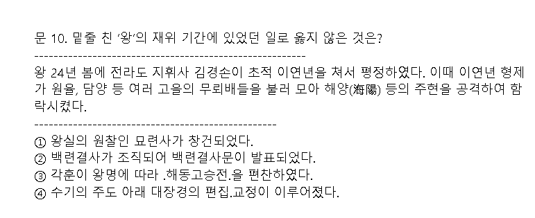

# 여진 정벌과 9성 개척 ( p.212  )

## 1. 여진과의 충돌

### 1.1 초기 여진 ( 아무것도 아님. )

- 여진은 한때 말갈이라 불리면서 오랫동안 고구려에 복속되어 있었다.

- 발해가 멸망한 후에 여진으로 불리며 발해의 옛 땅에서 반독립적 상태로 세력을 유지하였으며, 고려는 두만강 연안의 여진을 경제적으로 도와주면서 회유 · 동화 정책으로 포섭해 나갔다. ( 고려를 '부모의 나라' 라고 부름. )

## 2. 윤관의 여진 정벌 ( 중간 단계 성장. )

### 2.1 여진의 발흥

- 12세기 초 만주 하얼빈 지방에서 일어난 (완옌부 추장 아골타)가 여진을 통합하면서, 정주까지 남 하하여 고려와 충돌을 빚게 되었다.

### 2.2  별무반 편성( 1104, 숙종 9 )

- 설치 배경 : 기병 중심의 여진과의 1차 접촉에서 패한 고려는 여진을 보병만으로 상대하기는 어렵다고 판단하였다.

- 윤관의 건의로 편성 : 신기군(기병), 신보군(보병), 항마군(승병)으로 별무반을 편성하여 여진 정벌을 준비하였다.

- 성격 : 양천혼성군 - 귀족에서부터 양민 농민, 노비에 이르기까지 광범위한 계층

### 2.3  동북 9성 축조(1107, 예종 2 )

- (예종) 때 윤관은 별무반을 이끌고 천리장성을 넘어 여진을 북방으로 쫓아버리고, 동북 지방 일대에 9성을 쌓아 방어하였다.

### 2.4  9성 환부(1109, 예종 4 )

- 수비 곤란 : 여진의 계속된 침입으로 9성 수비에 어려움을 겪었고, 서북쪽의 거란과 대치하는 상황이 벌어져 여진 방어에만 힘쓸 수 없었다.

- 조건 수락 : 이에 고려는 다시 침략하지 않고 해마다 조공을 바치겠다는 여진의 조건을 수락하고 약 1년 만에 9성을 돌려주었다.

## 3. 금의 건국과 사대 외교

### 3.1 여진족의 금 건국 (1115)

- 여진족은 더욱 강성해져 만주 일대를 장악하면서 국호를 금이라 하고(1115), 요(거란)를 멸한 뒤(1126) 고려에 군신 관계를 맺고자 압력을 가해 왔다.

### 3.2  금의 사대 요구(군신 관계 요구) 수용 ( 1126, 인종 4 )

- 갈등 : 고려는 금의 사대 요구를 둘러싸고 정치적 분쟁을 겪었다.

- 수용 : 당시 집권자인 (이자겸)은 현실적으로 금과의 무력 충돌을 피하기 어려운 점을 고려하여 결국 (금의 군신 관계 요구를 받아 들였다.) 이는 정권 유지를 위하여 금과 평화 관계를 유지하는 것이 유리하였기 때문이었다.

- 결괴 : 태조 이래의 북진 정책이 좌절되었고, 고려 사회의 분열을 가속화하는 계기가 되었다. -> ( 모순1 : 이자겸의 난), ( 모순2 : 묘청의 서경 천도 운동 야기 )

-------

# 03 / 문벌 귀족 사회의 성립과 동요 ( p 214 )

## 1. 문벌 귀족 사회의 성립과 모순

### 1.1 성립

- 형성 : 성종 이후 중앙 집권적인 국가 체제가 확립됨에 따라 새로운 지배 새력이 형성 되었다.

- 의미 : 이들 중 (여러 세대에 걸쳐 중앙에서 고위 관직자들을 배출한 가문)을 문벌 귀족이라 부른다. ( 가문의 벌열화 ).

### 1.2 출신

- 지방 호족 출신으로 중앙 관료가 된 계열과, 신라 6두품 계통의 유학자들이었다.

### 1.3 정치

- 문벌 귀족은 (과거와 음서)를 통하여 관직을 독점하고, (중서문하성과 중추원의 재상)이 되어 정국을 주도해 나갔다.

- 음서 : 공신이나 5품 이상의 고위 관료의 자제등을 과거 시험 없이 등용하는 제도.

- 공음전 : 5품 이상 관료들에게 지급된 세습이 허용되는 토지

- 문벌 귀족의 보수성 : 좌주와 문생의 관계 ( 항맥 )

### 1.4 경제

- 관직에 따라 (과전)을 받고 (세습이 허용되는 공음전) 등의 혜택을 누렸을 뿐만 아니라, 권력을 이용하여 불법적으로 개인이나 국가의 토지를 소유하였다.

### 1.5 사회

- 가문과 문벌을 중시한 문벌 귀족들은 비슷한 부류들끼리 (폐쇄적 통혼 관계)를 형성하여 권력을 더욱 공고히 하였다. 특히 (왕실과 혼인 관계)를 맺어 (외척으로서의 지위)를 이용하여 정권을 장악하기도 했다.

### 1.6 모순과 갈등

- 원인 : 문벌 귀족 사회의 내부에서 정치권력의 독점과 경제적 특권의 확대를 둘러싼 분열이 일어났다.

- 문벌 귀족과 지방 출신 관료와의 갈등 : 과거를 통하여 진출한 지방 출신의 관료들 중 일부는 왕에게 밀착하여 왕권을 강화하고 보좌하는 측근 세력이 되어 문벌 귀족과 대립하였다.

- 대표 사건 : (이자겸의 난)과 (묘청의 난)은 이들 정치 세력 간의 대립과 갈등이 표면으로 드러난 사건이었다.

## 2. 이자겸의 난(1126, 인종 4, 모순 1 )

### 2.1 배경 ( 경원 이씨의 족벌 정치)

- 11세기 이래 대표적인 (문벌 귀족)인 경원(인주) 이씨 가문은 외척이 되어 80여 년간 정권을 잡았다.

- 경원 이씨는 이자연의 딸이 문종의 왕비가 되면서, 정치권력을 장악하기 시작 했다.

- 이자연의 손자인 (이자겸도 예종과 인종의 외척)이 되어 집권하였다.

- 이자겸은 예종의 측근 세력()을 몰아내고 인종이 왕위에 오를 수 있게 하면서, 그 세력이 막강해졌다. 이러한 이자겸의 권력 독점에 반대한 왕의 측근 세력은 왕을 중심으로 결짐하였다. 인종은 이자겸의 권력에 불안을 느껴 그를 제거하려 하였다.

### 2.2 과정

#### 1. 인종 측근 세력 축출

> 이자겸 
> 
> 예종의 장인
> 
> 인종의 외조부이자, 장인
> 
> 지국군사라고 자칭
> 
> 자신의 생일을 인수절이라 칭함
> 
> 아들을 출가시켜 현화사 불교 세력과 강력한 유대 관계

- 한안인 등 인종의 측근 세력인 반대파를 제거

- 도참설을 내세워 (척준경)과 함께 난을 일으켜 권력을 장악하였다 ( 1126 )

#### 2. 이자겸 몰락

- 인종이 척준경을 회유하여 이자겸이 척준경에 의해 물러난다.

- 척준경도 정지상(신진 세력, 묘청)의 탄핵으로 축출됨으로써 이자겸 세력이 몰락하였다.

### 2.3 결과

#### 1. 왕권 위축

- 왕궁 소실, 문벌 귀족의 권력 장악 과정에서 왕권이 약화 되었다.

#### 2. 서경 천도설 대두

- 개경의 지덕이 쇠했다는 풍수지리설과 서경 천도설이 대두되었다.

#### 3. 문벌 귀족 사회 분열

- 중앙 지배층 사이의 분열을 드러냄으로써 (문벌 귀족 사회의 붕괴를 촉진하는 계기)가 되었다.

#### 굴비의 어원

> 전남 영광 법성포에 유배된 이자겸은 소금에 절여 말린 조기를 임금(인종)에게 진상하면서, "선물은 보내도 굴한 것은 아니다."라는 의미로 굴비(屈非)라 적어 보냈다. 이는 오늘날 굴비의 어원이라 전해진다.

----

## 3. 묘청의 서경 천도 운동(묘청의 난, 1135,인종 13)

### 3.1 배경

#### 1.  ( 인종의 정치 개혁 추진 )

- 이자겸의 난 이후 인종은 "유신지교"를 반포(1127, 인종5)하여 실추된 왕권을 회복하고 민생을 안정시키며 국방력을 강화하기 위한 정치 개혁을 추진하였다.
  
  > 유신지교(維新之敎)
  > 
  > 고려 인종은 이자겸의 난(1126)이 진압된 후 묘청 일파의 요청으로 1127년(인종 5) 서경에 행차하여 새로운 정치를 펼치려는 의지를 밝히는 유신지교를 반포하였다. 그 내용을 일부 요약하면 다음과 같다.
  > 
  > 1. 방택에서 지신에게 제사를 지내 4교의 좋은 기운을 받아 들일 것.
  > 
  > 2. 수레와 의복의 제도는 검약하도록 힘쓸 것
  >    
  >    4. 농사를 권장하고 토지에 힘써 백성들의 식량을 넉넉하게 할 것
  >       
  >       6. 백성에게서 거두는 데는 법도가 있으니 정해진 조세와 공물 이외에는 함부로 거두어 들이지 말 것.

#### 2. ( 보수적 관리와 개혁적 관리의 대립 )

- 왕권 강화 과정에서 (김부식)을 중심으로 한 보수적 관리와 (묘청.정지상)을 중심으로 한 지방 출신의 개혁적 관리들 사이에 대립이 벌어졌다.

#### 3. ( 서경 천도 시도 )

- 묘청 세력은 풍수지리설을 내세워 서경(평양)으로 도읍을 옮겨, 개경의 보수적인 문벌 귀족 세력을 억압하고 왕권을 강화하면서 자주적인 혁신 정치를 시행하려 하였다.

- 인종의 동조하에 서경에 (대화궁) 이라는 궁궐과 (팔성당[신당])을 세우고 (황제를 칭할 것)과 (금을 정벌할 것)을 주장하였으나 개경파에 의해 좌절 되었다.

- 김부식이 중심이 된 개경 귀족 세력은 유교 이념에 충실함으로써 사회 질서를 확립 할 것을 주장하였다. 아울러 이들은 민생 안정을 내세워 (금)과 사대 관계를 맺었다.

> 개경파  VS 서경파

| 구분     | 개경파                       | 서경파                        |
| ------ | ------------------------- | -------------------------- |
| **인물** | 보수적 개경 문벌 귀족(김부식)         | 지방 출신 개혁 관리(묘청 · 정지상)      |
| **주장** | 민생 안정 강조 (금에 대한 사대)       | 칭제건원, 금국 정벌 주장             |
| **성격** | - 사대적, 보수적 - 신라 계승 의식 | - 자주적, 개혁적 - 고구려 계승 의식 |
| **사상** | 유교 이념 충실                  | 전통 사상 + 불교 사상, 풍수지리        |

> 서경 세력의 주장

> 개경 세력의 주장

> 김부식
> 
> - 대표적인 문벌 귀족, 신라 왕실의 후예
> 
> - 묘청의 난 진압
> 
> - 왕명에 따라 [삼국사기]를 편찬하였다.

### 3.2 경과

> 묘청 세력은 서경 천도를 통한 정권 장악이 어렵게 되자 서경에 (대위국) 을 건국하고 연호는 (천개) 군대를 (천견충의군)이라 하고, (묘청의 난, 1135)을 일으켰으나, 약 1년 만에 김부식이 이끄는 관군의 진압으로 실패하였다.

### 3.3 성격

#### 1. 지배층 내부의 분열

- (문벌 귀족 사회 내부의 분열)과 지역 세력 간의 대립이었다.

#### 2. 사상적 대립

- (풍수지리설이 결부된 자주적 전통사상(서경파)과 
  
  사대적 유교 정치 사상의 충돌(개경파)이었다.

#### 3. 상반된 계승 이념

- 고구려 계승 이념(서경파)과 신라 계승 이념(개경파)에 대한 갈등이 얽혀 일어난 것으로, 귀족 사회 내부의 모순을 드러낸 것이다.

### 3.4 영향

#### 1. 승문천무 현상 강화

- 문벌 귀족 세력이 강화되고, 승문천무 현상이 두드러져 (무신정변의 배경)이 되었다.

#### 2. 서경 세력 약화

- 서경의 지위가 하락하였고, 분사 제도도 폐지되었다.

### 3.5 신채호의 평가

- 단재 신채호는 (조선사 연구초)에서 묘청의 서경 천도 운동의 자주성을 높이 평가하여 (조선 역사상 일천년래 제일대사건)이라 평하였다.

----

# 3.5 현종 이후 ~ 무신 정변 이전의 왕대사

| 현종 (1009~1031, 8대)  목/ 강조의 정변 | - 지방 제도 정비(5도 양계 4도호부 8목), 연등회 · 팔관회 부활 - 현화사 건립, 초조대장경 조판, [7대 실록] 편찬 시작 - 주창수렴법 : 각 주에 창고 설치 -> 흉년에 빈민 대상 곡식 대여(의창 보완) - 면군급고법 : 고령의 노부모가 있는 정남 군역 면제 - 감목양마법 : 군마 확보 목적(기병 양성)                   |
| ------------------------------------- | ------------------------------------------------------------------------------------------------------------------------------------------------------------------------------------------------------------------- |
| **덕종 (1031~1034, 9대)**            | - 천리장성 착공 - [7대 실록] 완성                                                                                                                                                                                      |
| **정종 (1034~1046, 10대)**           | - 천리장성 완공                                                                                                                                                                                                           |
| **문종 (1046~1083, 11대)**           | - 경정전시과 실시, 녹봉제도 완비 - 한양을 남경으로 승격 - 최충의 문헌공도(9재 학당) 설립 - 동서 대비원 정비, 흥왕사 건립 - 삼복제(사형수 판결의 삼심제) - 향리의 승진(승급) 규정을 정함 - 기인선상법(1077): 기인의 인질 성격이 사라짐.                                            |
| **숙종 (1095~1105, 15대)**           | - 윤관의 별무반 편성 - 남경개창도감 설치(김위제 건의) - 서적포 설치, 기자 사당 건립  - 의천의 해동천태종 개창 (국청사 완공) - 주전도감 설치 및 화폐 주조 : 해동통보, 해동중보, 삼한통보, 동국통보, 활구(은병) 등                                                               |
| **예종 (1105~1122, 16대)**           | - 여진 정벌 -> 동북 9성 축조, 반환 - 7재(전문 강좌) · 양현고(장학 재단) 설치 - 청연각 · 보문각 설치 - 복원궁(도교 사원) 처음 건립 - 속현에 감무 파견, 혜민국 · 구제도감 설치 - 도이장가 지음 ( 개국공신 김락, 신숭겸 추모곡 ) - [해동비록] ( 1106 ) - [속편년통재] (1116, 홍관 ) |
| **인종 (1122~1146, 17대)**           | - 이자겸의 난 ( 1126, 인종 4 ) - 묘청의 난 ( 1135, 인종 13 ) - 김부식의 [삼국사기] 편찬 ( 1145, 인종 23 ) - 경사 6학 정비, 강예재 폐지 - [상정고금예문] 편찬(최윤의) -> 강화 피난기인 고종 21년(1234, 최우 집권기)에 금속활자로 인쇄 - 송의 사신 서긍 입국 ( [선화봉사고려도경] 저술) |

----

# 04 / 무신 집권기 ( 1170 ~ 1270 )

## 1. 무신 정변 (경인년의 난)

### (1) 배경

- 묘청의 서경 천도 운동 이후 문벌 귀족 지배 체제의 모순은 심화되었고, 지배층은 이와 같은 상황에 효과적으로 대응하지 못한 채 정치적 분열을 거듭하였다.

- 숭문천무 정책
  
  > ㄱ. 무신 차별 : 과거 제도에 무과를 거의 시행하지 않았고, 무신 최고 지위인 상장군, 대장군이 3품에 불과했으며 문신에 비해 무신이 차별 대우를 받았다. 군대의 총사령관도 문신이 임명되었다. 거란의 침략을 막은 강감찬과 여진 정벌에 나선 윤관 모두 문신으로 군대의 총사령관이 된 인물들이다.
  > 
  > ㄴ. 군인전 미지급 등 : 무신의 전시과 토지 분급이 문신보다 낮았고 군인전 미지급으로 인한 하급 군인들의 불만도 고조되고 있었다. 이러한 지배 체제의 모순이 정치적으로 폭발한 것이 무신 정변이었다(1170).
  > 
  > ㄷ. 의종의 실정 : 문신을 우대하며 무신을 차별하고 측근 세력을 키워 의존하며, 향락에 빠지는 등의 실정을 거듭하여 무신들의 불만이 커졌다.

### (2) 경과

- (정중부, 이의방, 이고) 등 무신들은 의종의 (보현원) 행차를 기회로 정변을 일으켜 다수의 문신을 죽이고 (의종을 폐하여 거제도로 귀양) 보낸 후 (명종을 옹립)하여 정권을 장악하였다 (1170, 경인난).
  
  

### (3) 결과

- 무신 정권 초기에는 무신들 간의 권력 다툼으로 국정이 혼란하였다. 정중부, 이의방 등은 권력을 장악하고 (무신들의 회의 기구인 중방을 통해 권력을 행사) 하였다.

- 이 시기에는 무신과 문신의 관직을 동시에 가질 수 있도록 한 (문무 겸직제)를 시행하여 무신이 (재신) 과 (추신)이 될 수 있게 하였다.

> 중방
> 
> 무신 정변 이전부터 있었으나 무신 정변 이후 최씨 정권 성립 이전까지 최고 권력 기구로 기능하였다.

## 2. 무신 정권의 변천

### (1) 정중부( 1170~1179, 명종 때 )

- (중방)을 중심으로 권력을 행사하면서 주요 관직을 독차지하고 토지와 노비를 늘려 나갔다. 또한, 저마다 사병을 길러 권력 쟁탈전을 벌였다.

### (2) 경대승 ( 1179~1183, 명종 때)

- 정중부를 제거하고 집권하였으며, (사병 집단)인 (도방)을 처음 설치하였다.

> 도방
> 
> 경대승은 신변에 위협을 느끼게 되어 스스로를 보호할 목적으로 결사대 100여 명을 자기 집에 머무르게 하고 그 이름을 도방이라 하였다. 이는 고려 시대 무신 정권의 사병 집단이며 숙위 기관이었다.

### (3) 이의민 ( 1183~1196, 명종 때 )

- (천민 출신)으로 김보당의 난 때 공을 세워 정계에 진출 하였다. 이후 (중방)을 중심으로 무신 정권의 권력을 잡았으나 피살 되었다.
  
  > 이의민의 아버지는 소금 장수이며, 어머니는 옥령사의 노비로서 천인 출신이었다. 1174년 조위총의 난을 진압하면서 급속히 출세하여 무인집정의 자리에 올랐다.

### (4) 최씨 정권의 성립

#### ① 최충헌( 1196~1219, 명종~고종 때 )

- 이의민을 제거하고 정권을 장악하였다. 그는 1197년에 명종을 폐하고 신종(1197~1204), 희종(1204~1211), 강종(1211~1213), 고종(1213~1259)을 옹립하였다.

| 봉사 10조 제시 (1196, 명종 26) | - 사회 개혁책으로 최충헌이 국왕에게 올림 - 제대로 된 개혁을 시도하지 않음.                                                                  |
| --------------------------- | ----------------------------------------------------------------------------------------------------------------- |
| **농장 확대**                   | - 전라도와 경상도 일대에 농장을 소유. (진주 지방 식읍으로 받아 경제권 장악) - 희종 때 (진강후)의 벼슬을 받고 (흥녕부)를 설치                              |
| **교정도감 설치 (1209)**      | - 관리의 감찰과 인사 행정 및 재정권까지 담당한 최고 집정 기관 - 장관인 교정별감은 최씨 일가가 대대로 세습 - 국정을 총괄하는 최고 정치 기구가 탄생하면서 중방의 권력은 크게 약화됨. |
| **도방 부활 (무단 정치 강화)**    | - 농민 항쟁 적극적 진압 - 삼별초(최우가 설치)와 함께 최씨 정권을 유지하는 권력적 기반                                                           |
| **조계종 후원**                  | - 왕실과 귀족의 교종과 사원을 억압하고 (선종 조계종)을 후원하였다.                                                                           |
| **문신 지위 향상**                | - (이규보), 진화 등을 우대하는 등 문신을 등용하여 무신을 견제하였다.                                                                         |

> 최충헌의 봉사 10조 ( 1. 왕은 속히 정전[연경궁]으로 환어할 것. )

#### ② 최우(최이, 1219~1249, 고종 때)

| 정방 설치                  | - 자신의 집에 정방을 설치하여 모든 관직에 대한 (인사권)을 장악하였다.                                                                                                                                                                                                                    |
| ---------------------- | ------------------------------------------------------------------------------------------------------------------------------------------------------------------------------------------------------------------------------------------------------------ |
| **서방 설치**              | - (문신)들의 숙위 가구 - (이규보), 이인로, 최자 등이 서방에서 활약                                                                                                                                                                                                           |
| **마별초 조직**             | - 최씨 정권의 사병 조직 중 하나로, (기병대)로 편성되었다. 몽골 기병의 영향을 받아 설치된 것으로 보인다.                                                                                                                                                                                               |
| **야별초 조직 (->삼별초)** | - 야간 순찰과 도둑을 단속하게 하였다. 이 야별초는 후에 삼별초로 확대 · 개편되었다.                                                                                                                                                                                                            |
| **대몽항쟁(강화 천도)**        | - 몽골과의 장기 항전을 고려하여 (강화도로 천도) 하였다 ( 1232 ) - 고려 고종은 1233년 최우에게 천도한 공을 인정하여 (진양후)에 봉하였고, 그의 집은 (진양부)가 되었다. - 부를 설치하여 왕자등과 동등한 지위를 공식적으로 인정받았다. - 강화도 천도 시기 [상정고금예문을 금속 활자로 인쇄하였다 (1234) - [팔만(재조)대장경을 조판(1236~51)]하며 부처의 힘으로 외적을 방어해 줄 것을 빌었다. |

- 강화 천도 (1232)
  
  > 최우는 몽골의 지나친 간섭과 조공 요구에 반발하여 장기 항전을 위해 강화도로 도읍을 옮겼다. 육지에 남게 될 백성들을 염려하여 천도에 반대하는 신하들도 있었으나, (이규보는 강화도 천도에 찬성) 하는 주장을 하여 최우의 계획을 옹호하였다.

> 삼별초
> 
> 좌별초 · 우별초 · 신의군
> 
> 경찰 · 전투 등 공적 임무 수행 -> 공적 군대에 준함.

#### ③ 최씨 정권의 특징

> 정치적으로는 안정되었지만 국가 통치 질서는 약화되었고 권력 유지에 급급하여 권력의 유지와 이를 위한 체제의 정비에 집착했을 뿐, 국가의 발전이나 백성들의 안정을 위한 노력에는 소홀하였다.

### (5) 무신 정권의 몰락 ( 1270년 강화도 -> 개경 환도 )

> 김준 이후 임연, 임유무 부자가 집권하였으며, 원종(1270) 때 임유무가 제거되면서 무신 정권은 끝났다. 이후 원 간섭기가 시작되었다.

## 3. 사회의 동요 ( 무신 정권에 대한 반발 )

| 정중부 (1170~1179) 4건        | - 김보당의 난 ( 1173, 명종 3년 ) - 교종 승려의 난 ( 1174, 명종 4년 ) - 조위총의 난 ( 1174, 명종 4년 ) - 공주 명학소 망이.망소이의 난 ( 1176, 명종 6년) |
| ------------------------- | -------------------------------------------------------------------------------------------------------------------------- |
| **경대승(1179~1183) 1건**     | - 전주 관노의 난 ( 1182, 명종 12년 )                                                                                                |
| **이의민(1183~1196) 1건**     | - 김사미.효심의 난(1193, 명종 23년 ) -> 무신 집권기 최대 규모의 민란                                                                             |
| **최충헌(1196~1219) 4건 만리최** | - 만적의 난 ( 1198, 신종 1년 ), 광명.계발의 난(1200, 신종 3년) - 이비.패좌의 난 (1202, 신종 5년) - 최광수의 난 (1217, 고종 4년 )                |
| **최우(1219~1249) 1건**      | - 이언년의 난 (1237, 고종 24년 )                                                                                                   |

### (1) 반(反) 무신의 난

#### ① 김보당의 난( 계사 난,경계의 난,  1173, 명종 3) 마이너스

> 최초의 (반 무신의 난)으로, 동북면 병마사 김보당이 (의종의 복위를 꾀하여 난)을 일으켰으나, 진압되고 이의민 등이 의종을 참혹하게 살해함으로써 이 난은 완전히 평정되었다.

#### ② 교종 승려(귀법사)의 난 ( 1174, 명종 4 ) 마이너스

> 문벌 귀족과 연결되었던 귀법사 등 (교종 계통의 승려)들이 무신 정권에 반발하여 난을 일으켰다.

#### ③ 조위총의 난 ( 1174, 명종 4, 서북계 지방의 민란 )

> (서경) 유수 조위총은 지방군과 농민을 이끌고 중앙의 무신들에게 3년간이나 항거하였으나 실패하였다. 조위총의 난에는 많은 농민이 가세하여 농민 항쟁의 성격을 띠었다.

### (2) 하층민의 봉기

> 무신 집권기에 지배층에 의한 대토지 소유는 더욱 늘어났고, 정치 싸움으로 인하여 중앙 정부의 지방 통제력이 약화되면서 농민과 천민의 대규모 봉기가 일어났다.

#### ① 양민들의 난 플러스

##### ㉠ 망이 · 망소이의 난 ( 1176, 명종 6, 남부 지방의 반란 )

> (공주 명학 소)에서 망이 · 망소이가 신분 해방을 외치며 봉기하였다. 이후 명학소를 (충순현으로 승격) 시켰고, 향·소·부곡이 점차 소멸되는 계기가 되었다.

##### ㉡ 김사미 · 효심의 난 ( 1193, 명종 23. 이의민이 지원함-why? 왕이 되려고 )

> 고려 명종 때인 1193년 김사미 세력과 효심 세력이 연합하여 일으킨 농민 봉기이다. (김사미는 운문(청도)) (효심은 초전(밀양 또는 울산)) 에서 난을 일으켰다.
> 
> 이들은 한때 경상도 전역을 장악하고 토벌군에 대항했으나 이듬해 진압되고 말았다.

##### ㉢ 광명 · 계발의 난 ( 1200, 신종 3 )

> (최충헌 집권기)에 경상도 합주(현 경남 합천)에서 노올부곡민이 진주민과 함께 지방관의 탐학에 항거하여 일으킨 반란이다.

    

#### ② 천민 · 노비들의 난

##### ㉠ 전주 관노의 난 (죽동의 난, 1182, 명종 12 )

> (경대승의 집권기)에 전주 관노의 난이 일어나 한 때 전주를 점령하였다.

##### ㉡ 만적의 난 ( 1198, 신종 1)

> (최충헌의 사노인) 만적은 사람이면 누구나 공경대부가 될 수 있다고 주장하였다. 그들은 신분 차별에 항거하며 정권 탈취를 시도하였다.

#### ③ 삼국 부흥 운동

#### ㉠ 고구려 부흥 운동

> (서경)에서 (고구려 부흥)을 표방한 (최광수의 난. 1217) 이 일어났다.

#### ㉡ 백제 부흥 운동

> (담양)에서 (백제 부흥)을 표방한 (이연년의 난. 1237)이 일어났다.

#### ㉢ 신라 부흥 운동

> 1193년 (운문, 초전)에서 (신라 부흥)을 표방한 (김사미·효심의 난. 1193)이 일어났고, 1202년에는 (경주)에서 (이비.패좌)가 주동이 되어 (신라 부흥)을 내걸고 (이비.패좌의 난)을 일으켰다.

- 반란 진압 후 최충헌은 동경을 경주로 격하시키는 등 잔족 세력을 색출 하였다.

## 4. 무신 정변의 영향

### (1) 정치 면

- 문벌귀족 사회가 붕괴되고 (관료 체제로의 전환.능력 위주)이 촉진 되었다.

- 왕권이 약화되고 무신들이 중방과 교정도감을 통해 권력을 독점하였다.

- 이의민, 김준 등 일부 천민 출신들이 권력층으로 등장하기도 하였다.

### (2) 경제 면

- (전시과 체제가 붕괴)되고 대토지 소유의 확대 농장이 증가하였다.

- 민생 피폐 : 국가의 수취와 집권층의 수탈이 심화되었다.

### (3) 사회 면

- 국가 통제력 약화 : 정치 싸움으로 인하여 중앙정부의 지방 통제력이 약화되었다.

- 신분제 동요 : 농민과 천민의 대규모 봉기가 일어났으며, 하층민 출신에서 출세한 자가 늘어났다. 전국적 봉기 2

### (4) 사상 면

- 신앙 결사 운동 : 불교계가 자기모순을 인식하고 개혁과 본연의 자세를 확립하려는 결사 운동이 일어났다.

- 조계종 개창 : 무신 정권의 후원으로 지눌이 선종 중심의 조계종을 개창하였다.

### (5) 문화 면

- 문화 침체 : 소외된 문신의 패관 문학과 은둔적 시조 문학이 발달하였으며, 문벌 귀족의 몰락으로 유학이 쇠퇴하였다.

- 민족 주체적 문화 발달 : 사회가 혼란스럽고 몽골 침입 등 국가적인 위기로 인하여 민족의 자주 의식이 강조된 사서가 편찬 되었다.

# 05 / 몽골과의 전쟁

## 1. 13세기 초 동아시아의 정세

### (1) 몽골의 팽창

#### ① 칭기즈 칸의 통일

> 13세기 초 오랫동안 부족 단위로 유목 생활을 하던 몽골족이 통일 된 국가를 형성하면서 금을 공격하여 북중국을 점령하였다.

#### ② 금의 쇠퇴

> 금의 지배하에 있던 거란족의 일부가 대요수국을 건국(1216)하였고, 여진의 잔여 세력이 두만강 지역에 동진국을 건국하였다(1217).

### (2) 여 · 몽의 접촉

#### ① 거란족의 침입

> 거란족의 일부가 몽골에 쫓겨 고려에 침입해 왔으나, 제천 방면에서 김취려에게 대파당하였다(1217).

#### ② 강동성의 역(1219)

> 이후 거란족이 다시 고려에 침입하였고, 고려군은 거란에 반격하여 강동성(평양 동쪽)에서 포위하였다. 이때 거란족을 추격해 온 몽골 및 두만강 유역에 있던 동진국의 군대와 연합하여 거란족을 몰아냈다.

### (3) 분쟁

#### ① 여 · 몽 협약

> 몽골은 거란족을 토벌해 주었다는 구실로 고려에 지나친 공물을 요구하였다(1219).

#### ② 저고여 피살(1225)

> 몽골 사신 저고여가 귀국길에 국경 지대에서 피살당하였다.

## 2. 몽골의 침입

### (1) 1차 침입(1231)

#### ① 발단

- (몽골 사신 저고여 피살 사건)을 구실로 몽골군이 침입해 왔다(1231).

#### ② 전개

- 몽골군이 의주를 점령한 후, (귀주성)에서 (박서)의 저항과 (충주)에서 (지광수와 노비군의 활약) 등에 부딪히자 길을 돌려 개경을 포위하였다.

#### ③ 결과

- 개경이 포위되자 고려 정부는 몽골의 요구를 수용하였고, 몽골은 서북면 지방에 다루가치(감찰관)를 배치하고 철수하였다.

### (2) 2차 침입(1232)

#### ① 발단

- 당시 집권자인 (최우)는 몽골의 무리한 조공 요구와 간섭에 반발하여 (강화도[강도]로 도읍)을 옮기고(1232, 고종 19), 장기 항전을 위한 방비를 강화하였다.

#### ② 전개 및 결과

- 이에 몽골은 다시 침입해 왔다. 그러나 (처인성[경기 용인] 전투) 에서 승려 출신 (김윤후)와 (처인 부곡민)들이 몽골의 장수 (살리타를 사살) 해 몽골군을 퇴각시키는 전과를 올렸고, 이후 처인 부곡은 현으로 승격되었다.

#### ③ 초조대장경 소실

- 몽골의 침입으로 (대구 부인사)에 보관되어 있던 초조대장경이 소실 되었다(1232)

### (3) 3차 침입 ( 1235 ~ 1239 )

#### ① 재조대장경 조판 착수(1236)

- (강화도)에서 최우는 부처의 힘으로 몽골군을 물리치겠다는 염원을 담은 (재조대장경[팔만대장경] 조판 사업)을 시행하였다.

#### ② 문화재 소실

- 경주의 황룡사 9층 목탑이 소실되었다 ( 1238 ).

### (4) 5차 침입(1253)

#### ① 발단

- 몽골은 고려 국왕의 친조와 출륙을 요구하며 다시 침입하였다.

#### ② 전개

- 김윤후(방호별감)가 이끈 (충주성 전투)에서 충주 관노와 잡류 별초는 몽골군에 대항하여 분전하여 침입을 격퇴하였다. 이후 충주는 국원경으로 승격되었다.

#### ③ 결과

- 왕족을 몽골에 보내고 강화를 맺었다.

### (5) 6차 침입(1254~1259)

> 몽골의 6차 침입 때에는 충주 다인철소민들이 몽골군을 격퇴하였다. 그 공훈으로 (다인철소는 익안현)으로 승격되었다.

### (6) 고려의 항전

#### ① 강화도의 고려 정부

> ㉠ 몽골의 침입에 대항하고자 최씨 무신 정권은 송악에서 강도(강화도)로 서울을 옮기고 장기 항전을 꾀하였다. 지방의 주 · 현민들에게는 산성이나 바다의 섬으로 들어가서 오랜 전쟁에 대비하게 하였다.

> ㉡ 강화도 정부는 부처의 힘으로 외적을 방어하겠다는 마음으로 (팔만대장경)을 조판하였다.

#### ② 일반 백성

##### ㉠ 장기 항쟁의 원동력

> 일반 백성들은 몽골의 침략에 자력으로 맞섰으며, 용감하게 대항하였다.

##### ㉡ 몽골군을 격퇴한 사례

- 처인 부곡

- 충주 다인철소

### (7) 결과

- 백성의 희생

- 국토의 황폐화

- ##### 문화재 소실
  
  - 대구 부인사의 대장경판(초조대장경, 교장)
  
  - 황룡사 9층 목탑

### (8) 무신 정권의 붕괴와 개경 환도(1270)

#### ① 무신 정권 몰락

> 고려 조정에서는 몽골과 강화를 맺으려는 온건파가 득세하여 최씨 정권이 무너지고 전쟁은 끝이 났다.

#### ② 몽골과의 강화

>  몽골이 고려와 강화를 맺고 고려의 주권과 고유한 풍속을 인정한 것은 고려를 직속령으로 완전히 정복하려던 계획을 포기한 것을 의미하며, 이것은 고려의 끈질긴 항전의 결과였다.

### (9) 삼별초의 항쟁(1270~1273). 공적인 역할. 사병.

#### ① 배경

> 삼별초는 최우가 치안 유지를 위해 설치한 야별초에서 분리된 좌별초와 우별초,
> 
> 그리고 몽골의 포로였다가 탈출한 군사로 이루어진 신의군을 합한 군사 조직으로 최씨 정권의 사병 역할도 수행하였다.
> 
> 삼별초는 고려 정부가 개경으로 환도하자 무신정권의 붕괴와 몽골과의 굴욕적 강화 체결에 반발하며 (배중손)의 지휘 아래 반기를 들었다.

#### ② 경과 : 강화도 -> 진도 -> 제주도

| 강화도     | - 고려 조정이 개경으로 환도한 후 강화산성에서 배중손의 지휘로 (승화후 온)을 왕으로 추대하고 반기를 들었다.                                                                                 |
| ------- | ---------------------------------------------------------------------------------------------------------------------------------------------- |
| **진도**  | - 장기 항전을 계획하고 (진도)로 옮겨 (용장성)을 쌓고 저항하였지만 여 · 몽 연합군의 공격으로 진도가 함락되었다.                                                                             |
| **제주도** | - 진도 함락 후에도 제주도로 근거지를 옮겨 (김통정)의 지휘 아래 계속 항쟁하였으나 결국 평정되었다. (항파두리 유적지, 항몽 순의비) - 원(몽골)은 1273년 삼별초의 항쟁을 진압한 후, 제주도에 (탐라총관부)를 설치하고 목마장을 경영하였다. |

##### 고려첩장불심조조

> 1271(원종 12년) 삼별초의 진도 정부가 일본에 보낸 외교 문서를 가마쿠라 막부가 경도 조정에 보내면서 이상하게 여긴 내용을 12조목으로 정리한 문서이다. 몽골이 일존을 공격할 가능성과 연대의 필요성, 군사적 지원 요청을 담고 있다.

#### ③ 장기 항쟁 가능 이유

> 삼별초의 장기적인 항쟁이 가능하였던 것은 몽골군이 접근하기 어려운 지리적 이점과 몽골에 굴복하는 것에 반발하는 일반 민중들의 적극적인 지원이 있었기 때문이었다.

#### ④ 의의

- 고려 무인의 항몽 정신과 자주성을 나타내는 것으로 볼 수 있다.

--- 

# 06 / 고려 후기의 정치 변동

## 1. 원의 내정 간섭

### (1) 일본 원정

#### ① 배경

> 몽골과 강화한 이후 고려의 자주성이 크게 손상되었다. 전쟁의 피해가 복구되지 않은 상태에서 고려는 두 차례 일본 원정에 동원됨으로써 막대한 희생을 강요하였다.