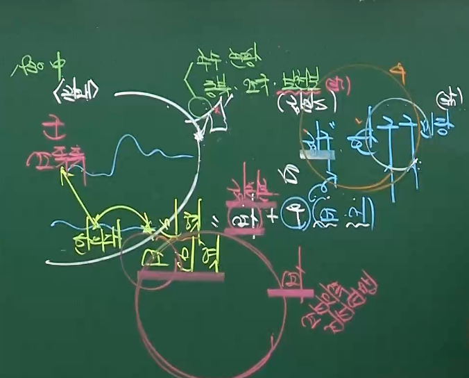

# 근대 문물의 수용과 근대 문화의 형성

## ( 근대 문물의 수용. 개항이후 )

### (1) 동도서기론(온건파) = 서양의 과학 기술 수용

> 군신. 부자. 부부. 붕우. 장유의 윤리는 도가 되고
> 
> 배. 수레. 군사. 농사. 기계의 편민이국 기가 됩니다.
> 
> 신이 변혁을 꾀하고 자 하는 것은 기이지 도가 아닙니다.

### (2) 조사 시찰단 ( 1881. 4. ) = 암행어사 신분. 일본

### (3) 영선사 ( 1881. 9. ) = 김윤식. 청 톈진의 기기국.                                           기기창 설립( 1883. 3. )

### (4) 1880년대 서양의 기계 도입. 외국 기술자 초빙.

### (5) 교육 입국 조서 = 갑오개혁 2차 . 교육 제도 개혁 필요성 인식

----

## ( 근대 시설의 수용 )

### (1) 무기 · 화폐주조 · 인쇄술 = 기기창(1883. 근대식 무기공장).                                                  전환국(1883. 화폐주조 기관.당오전).                                                  박문국(1883. 최초 관보 한성순보).                                                  광인사(1884)

### (2) 전기 = 전등(1887. 경복궁 건청궁에 최초로 전등을 가설).        한성 전기 회사(1898. 황실과 미국인 콜브란 합작. 서울 일부 지역)

### (3) 통신 = 우편( 갑신정변 우정국 폐지. 을미개혁 우편 사무 재개 ).                   1900  만국 우편 연합 가입 . 전신( 1884. 1885.)                   전화(1898. 미국인. 경운궁 처음 설치)

### (4) 교통 = 전차(1899. 한성 전기 회사. 서대문~청량리 구간 가설).                   철도(1899.경인선. 제물포~노량진.일본)                           (1905.경부선.1906.경의선.일본 군사적 목적)

### (5) 의료 = 광혜원(1885. 최초의 근대식 병원. 정부 설립. 미국인 알렌 운영.    제중원 개칭). 광제원(1900. 국립병원)

### (6) 건축 = 약현성당(1892. 우리나라 최초 고딕식 벽돌 건축물).                   명동성당(1898. 고딕 양식).                                                                 덕수궁(경운궁) 석조전(1910. 르네상스 양식)

----

## ( 개항 이후 신문의 간행 )

### (1) 한성순보 ( 1883 ~ 1884 ) = 박문국 10일에 한 번씩 간행.                우리나라 최초의 근대적 신문(순 한문)으로 관보적 성격.                   갑신정변으로 박문국이 파괴되면서 폐간.

### (2) 한성주보 ( 1886 ~ 1888 ) = 1885년 박문국 재설치.                                                       7일마다 간행.                                                       최초로 국한문을 혼용.

### (3) 독립신문 ( 1896. 4. ~ 1899. 12. ) = 최초의 민간 신문.                                                      정부 지원. 서재필이 간행.

> 이 신문은 조선만 위함을 가히 알 텃이요, 이 신문을 인연하여 내외 남녀 상하 귀천이 모두 조선 일을 서로 알 터이오...

#### ① 일간지로 발전 = 격일지에서 출발

#### ② 한글판 · 영문판 = 최초로 띄어쓰기 실시 국문 보급 기여

#### ③ 국민 계몽에 기여 = 서구 근대 사상과 학문 전파

#### ④ 폐간 ( 1899. 12. ) = 1898.12. 독립협회 해산되고 약 1년 후 종간호.

---- 

## ( 국내 주요 신문 )

### (1) 제국신문 ( 1898 ~ 1910 ) = 이종일. 이승만. 순 한글 신문.                                                      서민층과 부녀자가 주된 독자층.                                                      한글의 중요성 인식.                                                      신교육 발달과 실업의 발달 강조.

> 곧 이 신문이 우리 대황제 폐하의 당당한 대한국 백성에게 속한 신문
> 
> 이라는 뜻에서 지은 것이니 또한 중대하도다.

### (2) 황성신문 ( 1898 ~ 1910 ) = 남궁억. 유근. 국 · 한문 혼용체.                                                      양반 유생층 대상. 민족주의 성격.                                                      1905. 을사늑약 체결.                                                      장지연 [시일야방성대곡].                                                      [오건조약청체전말].                                                      유교구신론. 광무개혁[구본신참].                                                      보안회 후원. 의병 활동 비판.                                                      1910.8 한성신문. 폐간

> 이제 본사에서도 신문을 확장하려는 때를 맞아 국한문을 함께 쓰는 것은
> 
> 무엇보다도 대황제 폐하의 성칙을 따르기 위해서이며 ...

### (3) 매일 신문 ( 1898 ~ 1899 ) = 최초 일간신문. 기재원 이승만.

### (4) 대한매일신보 ( 1904 ~ 1910 ) = 양기탁 베델 창간.                                                              신민회 기관지 역할.                                                              순한글 · 국한문 · 영문 3 종류.                                                             독자층 · 발행 부수가 가장 많음.                                                              의병 호의적 평가.                                                      고종 을사조약 무효 선언 친서 발표.                                                       시일야방성대곡 영문 게재.                                                      국채 보상 운동 주도 확산 공헌.                     경술국치(1910) 이후 총독부 강제 인수 [매일신보 개칭]

> 그러므로 사람들은 모두 그 신문을 구독하여 한때 그 신문은 품귀상태에까지 
> 
> 이르렀고, 1년도 못 되어 매일 간행되는 신문이 7천 ~ 8천 장이나 되었다.

### (5) 만세보 ( 1906 ~ 1907 ) = 오세창. 천도교의 기관지.                                               국·한문 혼용체. 여성 교육. 여권 신장.                                               이인직 주필[혈의 누]. 일진회 공격 기사.                                       경영난 ( 1907. 대한신문. 친일 내각 기관지.)

### (6) 경향신문 ( 1906 ~ 1910 ) = 천주교 애국 계몽 운동 일환.                         서울 발간. 순 한글판 주간 신문 ( 프랑스 신부 발행 )

### (7) 국외 주요 신문 = 신한민보(미국). 대동공보. 해조신문(연해주)

### (8) 일제 탄압 = 신문지법 ( 1907. 7. ). 보안법 제정 ( 1907. 7. )

> 10. 신문지는 매회 발행에 앞서 먼저 내부 및 그 관할 관청에 각 2부를 납부해야 한다.

> 1. 내부대신은 질서를 유지하기 위하여 필요한 경우에 결사의 해산을 명할 수 있다.

----

## ( 근대적 교육 기관의 설립 )

### (1) 원산학사 ( 1883 ) = 함경도 덕원. 최초 근대식 사립 학교.                                         근대 학문. 무술 교육

> 덕원(원산) 부사 정현석이 장계를 올립니다. 신이 다스리는 이곳은 
> 
> 해안의 요충지에 있고 아울러 개항지가 되어 소중함이 다른 곳에 비할 바가 못 됩니다...

### (2) 동문학 ( 1883 ) = 정부 지원 묄렌도르프 설립.                                     관립 외국어 교육 기관. 통역관 양성.                                     오전/오후.

### (3) 육영공원 ( 1886 ) = 최초의 근대식 관립 학교.                                         고위층 자제 대상. 근대 학문 교육.                                         길모어, 헐버트[사민필지].                                         벙커 미국인 선교사 초빙 교육.                                         1894 재정난 폐교

> 조 · 미 수호 통상 조약 체결 이후 보빙사로 미국에 다녀온 민영익은
> 
> 영어를 본격적으로 가르칠 수 있는 근대적 교육 기관의 설립을 계획하여
> 
> 1886년 육영공원을 설립하고 헐버트, 길모어 등 미국인 교사를 초빙하였다.
> 
> 육영공원은 좌원과 우원으로 나누어 좌원에는 젊은 현직 관리를 학생으로 받고,
> 
> 우원에는 아직 관직에 나가지 않은 명문가 자제들을 입학시켰ㅎ다.

### (4) 개신교 선교사들의 학교 = 배재. 이화[최초 여성].                                                    경신. 정신. 숭실.

### (5) 교육입국 조서 반포 ( 1895. 2. ) = 갑오개혁

> 국민들은 나라를 위하는 마음으로 덕과 체와 지를 기를지어다.
> 
> 왕실의 안전이 국민[신민]들의 교육에 있고, 
> 
> 국가의 부강도 국민들의 교육에 있도다.

### (6) 관립 학교 설립 = ( 1895 ) 한성 사범 학교.

### (7) 교과서 편찬 = ( 1907, 현채 ) [ 유년필독 ]

### (8) 찬양회 조직 = ( 1898 ) 순성 여학교 설립. 최초 여권 운동 단체.

### (9) 민족 운동가들의 사립학교 설립 = 오산(1907. 이승훈).                                                                 대성(1908. 안창호).                                                           서전서숙(1906. 이상설. 북간도).

### (10) 일제의 탄압 = 사립학교령 ( 1908 ). 출판법 ( 1909 ).

-----

## ( 국사연구 애국계몽 운동 시기 )

### (1) 신채호 = 대한매일신보 [ 독사신론 . 1908 ]                                                      민족주의 사학의 발판 마련.                                                                   [ 역사와 애국심의 관계 . 1908 ]. [ 을지문덕전 ].                    [ 최도통전(최영)]. [ 이순신전 ]. [이태리 건국 삼걸전].

> 민족을 버리면 역사가 사라질 것이며, 
> 
> 역사를 버리면 민족의 그 국가에 대한 관념이 크지 않을 것이니
> 
> 오호라 역사가의 책임이 그 역시 중하다. 동국주족 단군 후예

> 오호라 어떻게 하면 우리 이천만의 귀에 항상 애국이란 한 글자가 울리게 할까

### (2) 황현 = 매천야록 저술. 국권 피탈 개탄 절명시 남기고 자결

> 요사한 기운 뒤덮어 천제성도 자리를 옮기니..
> 
> 새와 짐승도 슬피 울고 산과 바다도 고통에 못이겨 찡그리는데...
> 
> 인간으로 태어나 선비 노릇하기 참으로 어렵구나

### (3) 유길준 = [서유견문. 1889탈고. 1895 출판 ]. 국 ·한문 혼용체.     조선문전 [ 1897. 최초 국어 문법서 ]. 대한문전 [ 1909. 문법서 ]

### (4) 주시경. 지석영 = 국문 연구소 [1907. 우리말 표기법 통일 노력]

----

## ( 문학 )

### (1) 최남선 = 해에게서 소년에게 ( 1908 ) 현대시 효시.                                          소년 창간호 게재. 자주성보다는 근대성 추구.

> 처얼썩 처얼썩 척 쏴아아...

### (2) 최초의 신소설 = 이인직 혈의누 ( 1906. 만세보 ).                                   안국선 금수회의록 ( 1908 ).                                   이해조 자유종 ( 1910 ).

----

## ( 예술 )

### (1) 창가 = 서양식 악곡에 우리말 가사를 붙여 부르는 노래.                  경부철도가 ( 1908 )

### (2) 연극 = 최초의 서양식 극장인 원각사 설립                                                       ( 1908-1909. 이인직.) '은세계' '치악산' 창극 공연.

----

## ( 종교 )

### (1) 천주교 = 1886 조 · 프 수호 통상 조약 이후 선교 자유 획득.                      고아원. 양로원 설립. 경향신문 애국 계몽 운동 참여

### (2) 개신교 = 1880년대 서양 선교사들 입국 포교 시작. 서양 의술 보급

### (3) 불교 = 한용운 '조선 불교 유신론' 혁신 주장

### (4) 유교 = 박은식 '유교 구신론 1909' 주자학 대신에                                          실천 지향적인 양명학을 강조. 대동사상(평등) 주장.               대동교(1909) 창시. 친일 유교 단체 '대동학회' 저항하였다.

> 유교계에 세 가지 큰 문제 .. 개량구신의 의견을 바치노라

### (5) 천도교 = 일진회 대항 동학을 천도교로 개칭 ( 1905 ) 만세보 발간.

### (6) 대종교 = 3종사 서일. 나철. 오기호. 김교헌 단군 신앙 발전(1909) / 국권피탈 이후 간도 · 연해주 항일 독립 운동 전개

----

## ( 일제의 침략과 국권 피탈 )

### (1) 제 1차 영 · 일 동맹 ( 1902 ) = 일본이 청에서의 영국 이권 승인.                                         영국은 한국에서의 일본의 특수 권익 승인.

### (2) 러시아의 용암포 무단 점령 ( 1903 ) = 한국의 용암포 강제 점령.

### (3) 국외 중립 선언 ( 1904. 1. ) = 대한 제국은 전쟁에 말려들지 않기 위해 국외 중립 선언

### (4) 러 · 일 전쟁 발발 ( 1904. 2. ) = 일본군 기습 시작. 일본 승리

### (5) 한 · 일 의정서 ( 1904. 2. ) = 군사 전략상 필요한 요충지 사용 강제 체결 = 상호

> 1. 시정 개선에 관한 충고를 받아 들인다.
>    
>    4. 대일본제국 정부는 전항의 목적을 성취하기 위하여 군사 전략상 필요한 지점을 상황에 따라 차지하여 이용할 수 있다.
>    
>    5. 대한 제국 정부와 대일본제국 정부는 상호 간에 승인을 거치지 않고 후일 본 협정의 취지에 반하는 협약을 제 3국과 체결 할 수 없다.

### (6) 제 1차 한 · 일 협약 ( 1904. 8. ) = 외국인 고문 파견 정치.                         재정 고문 메가타 / 외교 고문 미국인 스티븐스

> 1. 일본인 1명을 재정 고문에 초빙
> 
> 2. 외국인 1명을 외교 고문 외부에서 초빙

### (7) 일제의 한국 지배에 대한 열강의 승인 ( 1905 )

#### ① 가쓰라 · 태프트 밀약 ( 1905. 7. 미 · 일 ) = 미국 필리핀 독점 권익

#### ② 제 2차 영 · 일 동맹 ( 1905. 8. ) = 영국 인도 특수 권익

#### ③ 포츠머스 조약 ( 1905. 9. 러 · 일 ) = 일본 한국 독점 지배

### (8) 제 2차 한 · 일 협약 ( 1905. 11. 을사조약 = 을사늑약 )

> 1. 재동경 외무성 경유 ...
> 
> 2. 일본국 정부의 중개
> 
> 3. 1명의 통감을 두되 통감은 오로지 외교 ...

#### ① 이토 히로부미 군대 동원 궁궐 포위 을사조약 체결 강요 을사 5적

#### ② 외교권 박탈 -> 통감부 설치 ( 1906. 2. ) = 이토 히로부미 초대 통감

### (9) 고종의 저항. 민족의 저항 = 상소(이상설, 조병세). 자결(민영환). 시일야방성대곡(장지연. 황성신문 게재). 을사의병(민종식.최익현.신돌석). 5적 암살단(나철. 오기호). 고종 을사조약 무효 선언 친서 발표 ( 대한매일신보 ). 헐버트 미국 특사 파견 ( 1905 ). 헤이그 특사파견( 1907 이위종. 이상설. 이준 ). = 고종 강제 퇴위. 순종 즉위

### (10) 제 3차 한 · 일 신협약 ( 1907. 7. 정미 7조약. 차관정치 ) = 각 부에 일본인 차관 임명. 통감부의 권한 확대

> 1. 통감의 지도 
> 
> 2. 통감의 승인
> 
> 3. 통감의 동의
> 
> 4. 통감이 추천 ..

### (11) 대한 제국 군대 해산 ( 1907. 8) =  부수 비밀 각서 군대 해산( 정미의병 )

### (11) 기유각서 ( 1909. 7. ) = 사법권과 감옥 사무권 박탈

### (12) 경찰권 박탈 ( 1910. 6. )

### (13) 한 · 일 병합 조약 ( 1910. 8. 경술국치 ) =  조선 총독부 설치. 이완용. 데라우치. 대한제국에서 조선이라 불리움. 이태왕(고종). 이왕(순종) 호칭 격하

----

## ( 조선총독부 1910~1945 ) = 헌병 경찰 통치

### (1) 육해군 대장 출신 임명. 조선 총독 일왕에 직속. 일본 내각의 통제를 받지 않았다. 정무총감. 5부 9국. 경무총감. 헌병대

### (2) 중추원 = 한국인 회유 기구. 3.1운동이 일어날 때까지 단 한번도 정식 소집이 없었다. 3급 3심제

## ( 헌병 경찰에 의한 무단 통치 1910~1919 ) = 제복. 대검 착용

### (1) 헌병 사령관이 중앙의 경무총감.

### (2) 범죄즉결레(1910). 경찰범 처벌 규칙(1912). 조선 형사령(1912). 조선 태형령(1912. 조선인에게만 적용된 악법)

> 13. 본령은 조선인에 한하여 적용한다.

### (3) 105인 사건( 1911 ) = 안명근. 데라우치 총독 암살 사건 조작. 신민회 회원

### (4) 사립 학교 규칙(1911). 서당 규칙(1918). 13도 12부 220군

## ( 민족 분열을 꾀한 문화 통치 1919~1931. 사이토 )

> 조선 통치의 방침인 일시동인의 대의를 존중하고...

### (0) 제복 · 착검 폐지 / 태형령 폐지 ( 1920 ). 중추원 확대

### (1) 3.1 운동 = 문화 통치 전환. 친일파 양성

### (2) 친일 단체 = 대동동지회(선우순). 교풍회(윤치호)

> 친일 분자를 귀족.양반.유생.부호.실업가.교육가 등에 침투시켜 ...

### (3) 총독임명 = 무관총독만을 임명 개정 문관 자격 부여 .                 실제로 문관 총독이 임명된 경우는 없었다.

### (4) 보통경찰제 = 경찰수와 장비 · 예산 증가. 고등 경찰 제도

### (5) 언론 · 출판의 자유 허용 = 1920년 조선일보 · 동아일보 발행 허용 = 1940년 폐간

### (6) 교육 · 역사 = 1922년 2차 조선교육령.                                                                      조선사 편찬 위원회 -> 조선사 편수회 ( 1925 )

### (7) 지방 자치 = 도 평의회. 부 · 면 협의회 설치. 형식적인 지방 자치

### (8) 치안 유지법 제정 ( 1925 - 1945 ) = 반정부 · 반체제 운동과 사유 재산제를 부인하는 사회주의 단체의 조직 · 활동 탄압 법률

> 국체 변혁 또는 사유 재산 제도를 부인하는 것을 목적으로 결사를 조직하거나
> 
> 또는 그 뜻을 알고도 이에 가입한 사람은 10년 이하의 징역 또는 금고에 처한다 ...
> 
> ( 1928 ) 개정 - 사형 · 무기 까지 확장 / 목적 수행을 위한 행위를 돕는 자 포괄 처벌 

### (9) 6.10 만세 운동 ( 1926 ). 광주 학생 항일 운동 ( 1929 ). 조선어학회 사건 ( 1942 ) 처벌

----

## ( 민족 말살 통치 = 1930년대 이후 . 우각기. 미나미. )

### (1) 세계 경제 대공황 발생 ( 1929 ) = 대륙침략 본격화

### (2) 대동아 공영권 천명 = 만주사변 ( 1931 ). 상해 사변 ( 1932 ).                                           만주국 수립( 1932 ).                                    중 · 일 전쟁 ( 1937. 7. ). 태평양 전쟁 ( 1941 ).

### (3) 황국 신민화 정책 = 내선일체. 일선 동조론 ( 역사 왜곡 ).             궁성 요배. 신사 참배 ( 1936 ). 황국 신민 서사 암송( 1937 ).             창씨개명 ( 1939 ). 조선어 사용 금지.                                                  우리말 · 우리 역사 교육 금지

### (4) 통제 정책 = 조선 사상범 보호 관찰령 ( 1936 ).                           국민 정신 총동원 조선 연맹 ( 1938 ). 애국반 설치 ( 1938 ).           조선일보 · 동아일보 폐간 ( 1940 ). 국민학교령 ( 1941 ).                조선 사상범 예방 구금령 ( 1941 ). 조선어 학회 사건 ( 1942 ).

### (5) 사상 보호 단체 대화숙 ( 1937 ) = 사상범 된 자 가입 시켜 감시

----

## ( 토지와 산업의 약탈 = 1910년대 )

### (1) 토지 조사 사업 ( 1910 ~ 1918 ) = 임시 토지 조사국 ( 1910 ).                                                                토지 조사령 ( 1912 ).                                                          근대적 소유권과 지세 제도 확립.

> 1. 토지의 조사 및 측량은 본령에 의한다.
>    
>    4. 토지 소유자는 조선 총독이 정하는 기간 내에 .. 임시 토지 조사 국장에게 신고해야 한다.

### (2) 기한부 신고제 = 신고절차 복잡. 신고 기간도 짧아. 소유권 분쟁

### (3) 미신고 토지 등 약탈 = 궁방전 · 역둔토 등 전 국토의 40%를 총독부가 차지

### (3) 농민의 몰락 = 소작농이 경작권. 도지권. 입회권 박탈.                               기한부 계약의 소작농으로 전락. 농민 유민화.                               식민지 지주제 확대.

### (4) 토지 불하 = 총독부의 지세 수입이 늘어났고 몰수된 토지는 동양 척식 주식회사 ( 1908 ) 일본인 지주에게 헐값으로 넘겨주었다.

### (5) 회사령 ( 1910 ~ 1920 ) = 허가제. 기업설립 시 총독의 허가를 받도록 규정.

> 1. 회사의 설립은 조선 총독의 허가를 받아야 한다.

### (6) 총독부의 전매 사업 = 인삼. 소금. 담배 전매. 한국인의 기업 활동 억압

### (7) 기간산업 독점 = 철도. 항만. 도로 일본인 독점 경영

### (8) 호남선(1914). 경원선(1914). 건설 = 한반도에 X자형 간선 철도망 완성

### (9) 삼림령(1911) · 어업령(1911) · 지세령(1914) · 광업령(1915) ·임야 조사령 ( 1918 )

> 토지 조사령. 태형령 1912

----

## ( 쌀 수탈 = 산미 증식 계획 과 일본 자본의 조선 지배 1920년)

### (1) 산미 증식 계획 ( 1920 ~ 1934 ) = 제 1차 세계 대전 중 일본의 공업화 추진. 쌀 폭동 발생 ( 1918 ). 부족한 식량 한국에서 착취

#### ① 1920년 부터 15년 계획으로 쌀 920만 석 증산 목표

#### ② 토지 개량(수리 시설 확충. 밭을 논으로) · 농사 개량(품종 개량 비료 사용 확대)

#### ③ 세계 경제 공항과 일본의 농업 공황으로 쌀 가격이 폭락하자 일본 농민 보호를 위해 중단 ( 1934)

#### ④ 증산량 보다 수탈량이 훨씬 많음 · 한국인의 1인당 쌀 소비량 감소 ·    만주에서 잡곡을 수입하여 보충

#### ⑤ 미곡 중심 단작형 농업 구조화 = 미 단작화 경제 구조 파행성 심화

### (2) 회사령 폐지 ( 1920 ) = 회사 설립의 신고제 전환 · 자유로운 한국 침투 목적 · 일본 기업 진출 본격화 · 부전강 수력 발전소 ( 1926 ) · 흥남 질소 비료 공장 ( 1927 ) · 김성수 [경성 방직 주식회사] 등 일부 민족 기업이 성장하기도 함.

### (3) 연초 전매령 ( 1921 ). 일본 상품에 대한 관세 철폐 ( 1923 )

### (4) 신은행령 ( 1928 ) = 조선인 소유 중소 규모 은행 · 일본 은행                                         강제 합병

-----

## ( 전시 수탈 체제 = 1930년대 이후 )

### (0) 경제 대공황 ( 1929 ) · 병참 기지화 정책

> 일본 내지에서는 중공업 부문에 투입할 여공을 모집하는 것이 아주 어렵고
> 
> 공업용 토지는 아주 비싼 곳을 매입해야 한다...

### (1) 병참 기지화 정책 = 식민지 공업화 정책

### (2) 남면북양 정책 = 산미 증식 계획 중단. 공업 원료 증산 정책 ·     남부 지방 농민 면화 재배 · 북부 지방 농민 양 사육 강요

### (3) 경공업 정책에서 중화학 공업체제로 전환 = 농공병진

### (4) 농촌 진흥 운동 ( 1932 ~ 1940 ) = 사회주의 계열 '혁명적 농민 조합 운동' 이 광범위하게 전개 · 농촌 사회 통제 · 자력갱생

#### ① 소작 조건 개선 시도 = 조선 소작 조정령(1932) · 조선 농지령(1934)

#### ② 춘궁퇴치 · 자력갱생 = 농민들의 생활을 더욱 어렵게 함.

> 생각건대 농촌 진흥의 요체는 구성 분자인 개개 농민이 자주 독립,
> 
> 연구궁리, 근검역행하고 각자의 업을 아끼고, 직분을 기꺼워하고 ...

> 7. 소작지의 임대차 기간은 3년 이상으로 해야 한다.

### (5) 국가 총동원법 제정 ( 1938. 4. ) = 중 · 일 전쟁( 1937 )

> 4. 칙령이 정하는 바에 따라 제국 신민을 징용하여 총동원 업무에 종사할 수 있게 할 수 있다.

### (6) 국민 정신 총동원 조선 연맹 ( 1938. 7. ) = 애국반 조직

### (7) 지원병제 ( 1938 ) · 학도 지원병 ( 1943 ) · 징병제 ( 1944 )

> 7월 20일, 학생들과 체조를 하고 있었는데 면사무소 직원이 징병영장을 가져왔다...

### (8) 징용령 ( 1939 ) · 근로 보국대 ( 1938. 6. ) · 여자 정신 근로령(1944. 8. )

### (9) 산미 증식 계획 재개 ( 1940 ) · 미곡 공출 및 식량 배급제 실시

### (10) 가축 증식 계획 · 전쟁 물자 수탈 · 생활 필수 물자 통제령(1941) · 물자 통제령 ( 1941 ) · 식량 관리령

### (11) 지원병 -> 국가총동원법 -> 징용령 -> 학도 지원병 -> 징병제

---

## ( 1910년대 항일 운동 = 비밀 결사 = 채응언 )

### (1) 복벽주의(대한제국회복) · 주권재민(공화주의)

### (2) 독립 의군부 ( 1912 . 복벽주의 ) = 임병찬(거문도. 순국) ·         고종의 밀명을 받아 전국 의병장과 유생을 규합하여 조직 ·        국권 반환 요구 서신 · 군대식 조직 · 전국 의병 봉기 (전쟁 ) 계획

#### ① 임병찬 = 최익현 제자 · 을사늑약 체결 반발 1906년 태인 의병 · 순창에서 최익현과 함께 체포되어 대마도(쓰시마섬) 유배 · 1914년 체포 · 1916년 거문도 순국

> 어떤 자들은 말하기를 한국민은 이미 동화하였다 합니다.
> 
> 그러나 진정으로 기쁘게 복종한 자는 몇백 명을 넘지 못하였으며...
> 
> 우리 한국이 윤리의 근원에 밝고 효제충신한 행실을 닦으며 임금을 사랑하는 ...

### (3) 대한 광복회 ( 1915. 공화주의 ) = 경상도 일대(대구 결성) ·      전국 조직 확대 · 한말 의병 계열과 애국 계몽 운동 계열 연합 단체

#### ① 1913 경북 풍기 광복단 + 1915 대구 조선 국권 회복단

#### ② 공화정체의 근대 국가 수립을 목표로 삼고 군대식 조직

#### ③ 총사령 : 박상진 / 부사령 : 김좌진

#### ④ 군자금 모집 · 친일파 처단 · 만주에 지부 설치

#### ⑤ 만주의 독립 운동 단체 (  부민당. 신흥학교 ) 연락을 꾀함.

#### ⑥ 복벽주의를 청산하고 공화주의 주장. 해산 이후 일부는 의열단 활동

> 1. 부호의 의연금 및 일인이 불법 징수하는 세금을 압수하여 무장을 준비한다.
>    
>    5. 본회의 군사 행동 · 집회 · 왕래 등 모든 연락 기관의 본부를 [상덕태 상회]에 두고..
>    
>    6. 일인 고관 및 한일 반역자를 수시 수처에서 처단하는 [행형부]를 둔다.
> 
> 오인은 대한 독립 광복을 위하여 오인의 생명을 희생해 이바지함은 물론...
> 
> 천지신명에게 맹서해 고함.

### (4) 조선 국권 회복단 ( 1915, 공화주의 ) = 3.1 운동 참여 이시영

### (5) 조선 국민회 ( 1915, 공화주의 ) = 하와이 대조선 국민군단(1914. 박용만) 국내 지부 장일환

### (6) 기타 단체 = 송죽회. 기성단. 자립단. 선명단. 민단 조합. 조선 산직 장려계

----

## ( 국외 독립운동 기지 건설 = 만주. 연해주. 중국. 미주 )

### (1) 남만주(서간도) = 삼원보 건설 · 이회영 · 이시영 · 이상룡 ·         신민회 인사를 중심으로 유하현 삼원보를 건설 · 신한민촌

#### ① 경학사 ( 1911 ) = 대종교 · 신민회 중심 신흥 강습소 설치

#### ② 부민단 ( 1912 ) = 이상룡 중심 백서 농장 건설 훈련 + 농사 병행

#### ③ 한족회 ( 1919 ) = 3 · 1 운동 이후 부민단 확대 개편

#### ④ 서로 군정서 ( 1919 ) = 군정부 기능

#### ⑤ 신흥 강습소(1911. 경학사) -> 신흥 중학교(1913. 부민단) -> 신흥 무관학교(1919. 한족회)

### (2) 북간도(명동·용정) = 중광단 ( 1911 ) · 간민회 ( 1913 )  · 대한 국민회( 1919 ) · 서전서숙 ( 1906 · 용정 · 이상설 ) · 명동학교( 1908 · 명동 )

#### ① 중광단 ( 1911 ) = 대종교인 서일을 중심으로 북간도에서 조직. 1919 북로 의정서군으로 개편 · 이후 김좌진 사령관으로 북간도에 가장 강력한 독립군단 편성

#### ② 대한 국민회 ( 1919 ) = 국민회군

#### ③ 밀산부 한흥동 ( 1909 ) = 이상설 · 토지매입 · 한민 학교

### (3) 연해주 = 블라디보스토크의 신한촌 · 이상설

#### ① 이상설 = 1904 협동회 회장 · 1905 을사늑약 반대 상소 ·                 1906 북간도 용정에 서전서숙 건립 · 1907 헤이그 특사 파견 ·                 1909 밀산부 한흥동 건설 · 1910 13도 의군 및 성명회 조직 ·                 1911 권업회 조직 · 1914 대한 광복군 정부 조직(정통령) ·                 1917 니콜리스크에서 병으로 서거

#### ② 한민회 ( 1905 ) = 연해주 지역 한국인 자치 기구 · 한민 학교 설립 · 해조신문 · 대동 공보 발행

#### ③ 성명회 ( 1910 ) = 이상설. 유인석. 이범윤 한 · 일 합방 부당성 규탄

> 한국인은 세계 속에서 대한국의 이름을 간직하고 한국인이라는 지위를 
> 
> 계속 지켜 가기로 다짐하였습니다... 한국인은 자유를 위해 죽을 각오가 되어 있습니다.

#### ④ 권업회 ( 1911 ) = 이상설. 유인석. 홍범도 권업신문 발간(신채호)

#### ⑤ 광복회 ( 1912 ) = 신채호. 이동휘. 무장투쟁론

#### ⑥ 대한 광복군 정부 ( 1914 ) = 이상설. 이동휘. 임시정부수립 계기 마련

#### ⑦ 전로 한족회 중앙총회 ( 1917 ) = 러시아 내에서 한인 권리 보호

#### ⑧ 한인 사회당 ( 1918 ) = 한인 최초의 사회주의 정당. 이동휘 중심

#### ⑨ 대한 국민 의회 ( 1919 ) = 전로 한족회 중앙 총회가 개편 · 상하이 대한민국 임시 정부로 통합

#### ⑩ 13도 의군 ( 1910 ) = 이상설. 유인석. 고종에게 군자금 요청

### (4) 중국 관내 = 동제사. 대동 보국단. 신한 혁명당. 신한 청년당

#### ① 동제사 ( 1912. 상하이 ) =  신규식. 박은식. 신채호. 조소앙. 청년 교육

#### ② 대동 보국단 ( 1915. 상하이 ) = 신규식. 박은식. 잡지 [진단] 발간

#### ③ 신한 혁명당 ( 1915. 베이징 ) = 이상설. 신규식. 박은식. 대동단결선언(1917) - 임시 정부 수립의 신호탄 ( 주권 재민 사상 )

> 대동단결선언 ( 1917 ) - 상하이에서 발표 . 임시 정부 수립의 신호탄
> 
> 융희 황제가 삼보(영토. 인민. 주권)를 포기한 경술년(1910) 8월 29일은 ...
> 
> 구한국의 마지막 날은 즉 신한국 최초의 날이니. 무슨 까닭인가.
> 
> 우리 동지는 당연히 삼보를 계승하여 ...

#### ④ 신한 청년당 ( 1918. 상하이 ) = 김규식. 여운형. 신채호. 파리 강화 회의에 김규식 파견

### (5) 미주 = 대한인 국민회. 흥사단. 대조선 국민 군단. 숭무학교

#### ① 대한인 국민회 ( 1910. 샌프란시스코 ) = 박용만. 이승만

#### ② 흥사단 ( 1913. 샌프란시스코 ) = 안창호. 기독교 중심 단체. 동우회(1926) 개편 ( 1929 )

#### ③ 대조선 국민 군단 ( 1914. 하와이 ) = 박용만.

#### ④ 기타 = 멕시코 숭무학교 ( 1910 ) = 에네켄

---

## ( 3. 1 운동  1919 )

### (1) 대외적 배경 = 민족자결주의 · 대한(무오) 독립 선언 · 2·8 독립 선언 · 파리 강화 회의에 독립 청원

#### ① 민족 자결 주의 = 윌슨(1918. 파리 강화 회의) · 레닌(1917.약소국 지원. 러시아 혁명 )

> 윌슨이 말한 민족 자결은 독일과 같은 패전국이 지배하던 식민지에만 적용되는 것으로, 미국이나 일본과 같은 전승국의 식민지는 그 대상에서 제외

#### ② 대한(무오) 독립 선언(1919. 2. 만주) = 대종교 계열 중광단 중심 조소앙 작성

> 궐기하라 독립군 ! 독립군은 일제히 천지를 휩쓸라 !
> 
> 개, 돼지 .. 육탄 혈전으로 독립을 완성하라

#### ③ 2·8 독립 선언(1919. 일본) = 최팔용 등 도쿄 유학생들이 조선 청년 독립단 조직 이광수가 작성한 독립 선언서와 민족 대회 소집 청원서 발표

> 1. 우리는 한·일 합병이 우리 민족의 자유의사에서 비롯되지 않았으며 ...
>    
>    4. 우리 민족은 일본에 대하여 영원한 혈전을 선언한다.

#### ④ 파리 강화 회의에 독립 청원 = 신한 청년당 김규식 파견 1919

### (2) 대내적 배경 = 무단 통치에 대한 반발 · 고종의 서거 · 독립 만세 운동 준비

#### ① 고종의 서거(1919. 1) = 일본이 독살하였다는 설 확산

### (3) 3·1 운동의 발발 ( 1단계 ) = 서울 · 태화관 · 탑골 공원 · 비폭력주의 · 기미(3·1)독립 선언서 · 공약 삼장

#### ① 손병희·이승훈·한용운 민족 대표 33인 중 29인 = 태화관에서 독립 선언서 낭독 · 자진체포

#### ② 학생 · 시민  = 탑골공원 독립선언서 낭독 · 비폭력 주의

#### ③ 기미 독립 선언서 = 오등은 이에 아 조선의 독립국임과 조선인의 자주민임을 선언하노라

#### ④ 공약 삼장 = 결코 배타적 감정으로 일주하지 말라 · 일체의 행동은 가장 질서를 존중 · 한용운 · 건국의 시원 단군조선

### (4) 도시 확산(2단계) · 농촌 확산(3단계) = 무력 저항 운동으로 발달

#### ① 3·1 운동 당시 가장 많이 투옥된 계층은 농민이었다.

> 터졌구나 터졌구나 ! 조선 독립의 소리. 10년을 참고 참아 인제 터졌네

### (5) 일제의 탄압 = 화성 제암리 학살 사건 ( 1919. 4. 15 )

### (6) 3·1운동의 한계 = 구심점 부재 · 비폭력 노선의 한계.

### (7) 3·1운동의 의의 = 승전국의 식민지에서 일어난 최초의 반제국주의 민족운동.

### (8) 3·1운동의 영향 = 문화 통치 · 대한민국 임시 정부 수립 · 본격적 항일 무장 독립 투쟁을 전개하는 계기 · 중국의 5·4 운동 · 인도의 비폭력·불복종 운동 등에 영향

----

## ( 대한민국 임시 정부 수립 = 1919. 9. )

### (1) 대한 국민 의회 ( 1919. 3. 연해주) = 대통령 손병희 · 부통령 박영효 · 국무총리 이승만 · 헌법을 제정하지 않았으나 3권 분립

### (2) 대한민국 임시 정부 ( 1919. 4. 11. 상하이) = 신한 청년당 중심 ·     임시 의정원  · 대한민국 임시 헌장 공포 · 이승만 국무총리

> 1. 대한민국은 민주 공화제로 한다.
> 
> 2. 대한민국은 임시 정부가 임시 의정원의 결의에 의하여 이를 통치한다.
> 
> 3. 대한민국의 인민은 남녀 귀천 및 빈부의 계급이 없고 일체 평등하다.

### (3) 한성 정부 ( 1919. 4. 국내 ) = 13도 대표 국민 대회 · 이승만 집정관 총재 · 이동휘 국무총리 총재

### (4) 임시 정부의 통합 = 연해주의 대한 국민 의회를 흡수 · 입법기관형성 · 한성 정부의 법통 계승 행정부 조직 =>  상하이에 대한민국 임시 정부가 탄생 ( 1919. 9. )

> 1. 대한민국은 대한 인민으로 조직한다.
> 
> 2. 대한민국의 주권은 대한 인민 전체에 있다.

### (5) 민주 공화제 · 대통령제 = 대통령 이승만 · 국무총리 이동휘 · 초대 경무국장 김구

### (6) 3권 분립 = 입법 기관(임시 의정원) · 사법 기관(법원) · 행정 기관(국무원) 우리나라 최초 3권 분립 민주 공화제 정부

### (7) 중앙 조직 = 임시 의정원(입법부) · 국무원(행정부) · 법원(사법)

### (8) 비밀 연락 조직 = 연통제 · 교통국

#### ① 연통제 실시 = 비밀 행정 조직망 · 황해도 북부 · 경기 · 충청 · 서간도 · 북간도 · 서울 총판 · 각 도에 독판 · 군과 면 군감 면감

#### ② 교통국 = 통신 기관 정보 수집

### (9) 군자금 조달 = 이륭 양행 · 백산 상회(1914. 부산. 안희제) · 애국 공채(독립 공채) · 인두세 징수 · 의연금 자금 충당

### (10) 외교 활동 = 파리 위원부 · 구미 위원부 · 만국 사회당 대회 · 소련과 비밀 협정

#### ① 파리 위원부 = 신한 청년당 김규식 외무총장 임명 · 독립 청원서

#### ② 구미 위원부 = 이승만 워싱턴 회의

### (11) 군사 활동 = 군무부 설치 · 육군 무관 학교 · 광복군 사령부 ·     광복군 총영 · 서로 군정서 · 북로 군정서 · 미국 한인 비행사 양성소

### (12) 독립 신문 간행 = 임시 정부의 기관지로 독립신문 간행 · 배포 1925년 폐간 · 사료 편찬소 [이광수.안창호. 한·일 관계 사료집 간행]  

----

## ( 임시 정부의 시련과 재정비 )

### (1) 연통제 · 교통국 붕괴(1921) / 이념 대립 / 외교활동 성과 저조 / 이승만의 위임 통치 청원안 제출(1919. 2. 25)

### (2) 국민대표 회의 ( 1923 ) = 박은식(1925.11 서거) · 김창숙 · 원세훈 등 14명은 1921년 2월 국민대표 회의 소집을 제창하고 나섰다.

#### ① 창조파(임시 정부 해산·무력투쟁 새정부) = 신채호 · 박용만 · 문창범

#### ② 개조파(임시 정부 개편·외교중심 정부) = 안창호

#### ② 현상유지파(임시 정부 유지 ) = 김구 · 이동녕

### (3) 결과 = 많은 민족 운동가들이 임시 정부에서 이탈

## ( 국민대표 회의 이후의 임시 정부 )

### (1) 이승만 탄핵(1925) 박은식 2대 대통령(1925. 3.)

#### ① 국무령 중심의 내각 책임제 (1925. 2차개헌)

#### ② 국무위원 중심의 집단 지도 체제 (1927. 3차개헌)

#### ③ 한인 애국단 결성 (1931) = 이봉창 · 윤봉길 의거 · 중국 국민당 지원

#### ④ 1932. 4. 윤봉길 상하이 훙커우 공원 투탄 의거

#### ⑤ 1940년 중국 국민당 정부를 따라 충칭에 자리 잡음.

### (2) 충칭 이동 이후의 임시 정부 체제 정비

#### ① 한국 독립당 결성 ( 1940. 5. ) = 위원장 김구

#### ② 한국 광복군 창설 ( 1940. 9. ) = 충칭 정착 · 총사령관 지청천 · 참모장 이범석

> 대한민국 임시 정부는 대한민국 원년(1919)에 정부가 공포한
> 
> 군사 조직법에 의거하여 광복군을 조직...

##### 1. 1940년 9월 신흥 무관학교 출신의 독립군과 중국 각지 활동 청년 = 임시 정부 직속 무장 부대 충칭에서 창설

##### 2. 중국 국민당 정부에게 재정적 지원 · 연계

##### 3. 대일 · 대독 선전 포고 (1941. 추축국)

##### 4. 조선 의용대 흡수 = 1942 김원봉이 이끈 조선 의용대 제 1지지대 흡수

##### 5. 영국군과 연합 작전 = 1943 미얀마 · 인도 참전

##### 6. 국내 진공 작전 계획 = 1945. 5. 독수리 작전 / 미국 전략 정보국 ( OSS ) / 국내 정진군을 편성·훈련하였으나 일제의 항복으로 무산

#### ③ 4차 개헌 ( 1940. 10. ) = 주석 중심제 헌법 개정 · 주석(김구) 중심의 단일 지도 체제

##### 1. 1차(1919. 9. 임시헌법) = 대통령 중심제. 3권 분립 · 이승만

##### 2. 2차(1925. 4. 임시헌법) = 국무령 중심의 내각 책임제 · 김구

##### 3. 3차(1927. 3. 임시약헌) = 국무 위원 중심의 집단 지도 체제 · 국무위원

##### 4. 4차(1940.10. 임시약헌) = 주석 중심 체제 · 김구

##### 5. 5차(1944. 4. 임시헌장) = 주석 · 부주석 체제 · 김구 · 김규식

#### ④ 대한민국 건국 강령 발표 ( 1941. 11. ) = 조소앙 삼균주의

> 정치의 균등화요 경제의 균등화요 교육의 균등화이다.
> 
> 국비에 의한 의무 교육제 실시.

> 2. 전국의 토지와 대생산기관의 국유가 완성되고 전국 학령 아동의 전체가 고급 교육의 무료 수학이 완성되고 보통선거제도가 구속 없이 완전히 실시되어...

#### ⑤ 대일 선전 포고 ( 1941. 12. ) = 태평양 전쟁 · 독일 (추축국)

> 우리는 3천만 한국 인민과 정부를 대표하여 삼가 중·영·미·소·캐나다 기타 제국의
> 
> 대일 선전이 일본을 격패하게 하고 동아를 재건하는 가장 유요한 수단이 됨을 
> 
> 축하하여 이에 특히 다음과 같이 서명한다
> 
> 1. 한국 전 인민은 현재 이미 반 침략 전선에 참가하였으니 한 개의 전투 단위로서 추축국에 선전한다.

#### ⑥ 임시 정부의 좌·우익 통일 전선 구축 ( 1942 ) = 민족주의 좌파 세력 김원봉의 조선 민족 혁명당을 임시정부로 받아들임. 한국 광복군에 김원봉이 이끈 조선 의용대 일부를 흡수 · 통합 군사력 강화

#### ⑦ 영국군과 연합 작전 ( 1943 ) = 영국군의 요청 · 인도 · 미얀마 전선에 한국 광복군 공작대 파견

#### ⑧ 5차 개헌 ( 1944 ) = 주석(김구) · 부주석제(김규식) 채택

### (3) 대한민국 임시 정부의 의의와 한계 = 최초의 민주공화제 정부 · 민족 연합 정부 · 대중적 기반 결여 · 내부 갈등 · 조선 독립 동맹과의 통합 실패

----

## ( 국내 항일 무장 투쟁 )

### (1) 천마산대 · 구월산대 · 보합단

## ( 학생 항일 운동 )

### (1) 6 · 10 만세 운동 ( 1926 ) = 조선 공산당(사회주의) + 천도교(민족주의) · 순종의 인산일 시위 계획 사전 발각 · 조선학생과학연구회 시위 계획 추진 · 일제 치안유지법을 적용하여 탄압

#### ① 민족주의 계열과 사회주의 계열과의 연대의 계기 마련 = 신간회 창설(1927)

> 마음껏 통곡하고 복상하자 ..
> 
> 우리의 철천지 원수는 자본 '제국주의' 일본이다.
> 
> 1. 조선은 조선인의 조선이다 !
> 
> 2. 학교 용어는 조선어로 !

### (2) 광주 학생 항일 운동 ( 1929. 11. ) = 신간회의 지원 · 전국 학생 참여 · 만주 및 일본 지역까지 확산 · 신간회 조사단 파견 · 민중 대회 좌절 · 독서회(비밀 결사 단체) 참여 = 3·1운동 이후 일어난 최대 규모의 항일 민족 운동

> 학생. 대중이여 궐기하라 ! 검거된 학생은 우리 손으로 탈환하자!

---

## ( 의열단 1919 )

### (1) 김원봉 · 윤세주 · 만주 길림성 · 신흥 무관학교 출신 중심 .

### (2) 조선 혁명 선언 ( 1923 ) = 신채호 의열단 선언문 · 외교·자치·문화·실력 양성 비판 · 민중의 직접 혁명을 통한 독립 쟁취 .

### (3) 무정부주의 · 무장 투쟁 · 조선 혁명 선언 을 활동 지침으로 삼음.

### (4) 5파괴(총독부·동양척식·매일신보·경찰서·일제중요기관) /                7가살(조선 총독 이하 고관 · 일본 군부 수뇌· 대만 총독 ·매국노·친일파·적탐(밀정) · 반민족적 귀족)

> 이제 폭력의 목적물을 대략 열거하건대,
> 
> 조선 총독 및 각 관공리, 일본 천황 및 각 관공리 , 정탐노, 매국적, ..
> 
> 중상하는 자는 폭력으로써 대응할지니라.

> 강도 일본이 우리의 국호를 없이 하며 우리의 정권을 빼앗으며..
> 
> 우리는 '외교' · '준비' 등의 미몽을 버리고 민중 직접 혁명의 수단을 취함을 
> 
> 선언하노라. 민중은 우리 혁명의 대본영이다. 폭력은 우리 혁명의 유일한 무기이다.

### (5) 박재혁 ( 1920 . 부산 ) / 최수봉 ( 1920. 밀양 ) / 김익상 ( 1921. 조선 총독부 ) / 김익상·오성륜·이종암 ( 1922. 다나카 저격 황포탄 의거 실패) / 김상옥 ( 1923. 종로 경찰서 ) / 김지섭 ( 1924. 일본 황궁 이중교 ) / 나석주 ( 1926. 동양 척식주식회사 · 조선 식산 은행 ) =                   박상옥 지섭주?

### (6) 군대 육성 추진 = 중국 황포 군관 학교에 입학 · 조선 혁명 간부 학교 설립 · 민족 혁명당 결성

#### ① 중국 황포 군관 학교에 입학 ( 1926 ) = 김원봉 · 군사 훈련 · 정치 교육

#### ② 조선 혁명 간부 학교 설립 ( 1932 )

#### ③ 민족 혁명당 결성 ( 1935. 난징 )

> 1. 천하에 정의로운 일을 맹렬히 실행 한다.
>    
>    9. 일이 구를 위하여 구가 일을 위하여 헌신함
>    
>    10. 단의 뜻에 배반한 자는 척살 한다

## ( 한인 애국단 1931 )

### (1) 만보산 사건(1931. 7.) · 만주 사변(1931. 9.) · 김구 상하이 한인 애국단 조직

> 네 소원이 무엇이냐 하고 하느님이 내게 물으시면,
> 
> 나는 서슴지 않고 내 소원은 독립이오 하고 대답할 것이다.

### (2) 이봉창 도쿄 일왕 폭살 기도 사건 ( 1932. 1. ) = 중국 신문은 '일본 국왕이 불행히도 명중하지 않았다' 라고 기사를 게재 · 상하이 사변(1932. 1) 의 구실

> 그 길로 함께 안공근의 집에 가서 선서식을 하고 
> 
> 폭탄 두 개와 300원을 주면서 선생은 마지막 가시는 길이니 이 돈을 아끼지 말고...

### (3) 윤봉길 훙커우 공원 의거 ( 1932. 4. ) = 상하이 훙커우 공원 · 일본군 총사령관 시라카와 육군 대장 등 고관들이 죽거나 중상 · 중국 영토 내에서 우리 민족의 무장 독립 활동을 승인 · 한인 특별반 ·     한국 광복군(1940) 창설되는 바탕.

> 군의 목숨은 머지않아서 이 세상을 떠날 것이다.
> 
> 나는 조국의 광복과 민족의 자유를 위하여 위대한 희생자가 되려는
> 
> 군에게 혁혁한 성공이 길이길이 군과 함께 머물러 있기를 충심으로 바라는 바이다.

### (4) 이덕주 · 유진만 ( 1932. 4 ) = 조선 총독 암살 실패

### (5) 최흥식 · 유상근 ( 1932. 5 ) = 중국 다롄 일본 고관 암살 미수

### (6) 기타 의열 투쟁 = 강우규 박은식 대한국민노인동맹당(대한 노인단) · 사이토 마코토 마차에 폭탄 / 다물단 · 박열 · 조명하 · 남화한인청년연맹(1930) · 대한애국청년당(1945) 경성 부민관 의거

----

## ( 무장 독립 운동 전개  1920년대 ) = 보 훈 청 간 군 자 3 미쓰 3 만 연합

### (1) 봉오동 전투 ( 1920. 6. ) =  홍범도 대한 독립군 중심 · 군무 도독부군(최진동) · 군민회군(안무) = 대한 북로독군부군

> 왕청현 봉오동 행군하다가 일본군 3백 명을 발견하였다.

### (2) 훈춘 사건 ( 1920. 10. ) = 출병 구실 조작 · 마적 훈춘 지역 습격 · 대규모 군대의 만주 출병 명분으로 삼았다.

### (3) 청산리 대첩 ( 1920. 10. ) = 독립 전쟁 사상 최대 규모의 승리(봉오동 전투 10배) · 북로 군정서군 중심 · 홍범도 대한 독립군 · 국민회군 · 도독부군 ·대한 의민단 등 독립군 연합 부대 · 백운평 · 완루구 · 천수평 · 어랑촌 전투 등 10여 차례 일본군 대파

#### ① 10. 21 = 백운평 · 완루구

#### ② 10. 22 = 천수평 · 어랑촌

#### ③ 10. 23 = 맹개골 · 만기구

#### ④ 10. 24-25 = 천보산

#### ⑤ 10. 26 = 고동하

### (4) 간도 참변 ( 1920. 10. ) = 경신참변 · 봉오동·청산리 대첩 보복

### (5) 대한 독립 군단 결성 ( 1920. 12. ) = 북만주 밀산부 · 서일(총재)

### (6) 자유시 참변 ( 1921 ) = 소련(부대 편성과 부대 간의 지휘권 분쟁 · 상하이파(다수) vs 이르쿠츠크파(소수)

### (7) 3부 성립 ( 1923 ~ 1925 ) = 자유시 참변 이후 · 대한 통의부(1922) -> 통의부 · 의근부 분열 ( 1923 ) -> 참의부 · 정의부

#### ① 참의부(임시 정부 육군 주만 참의부. 1923~1929) = 임시 정부의 직할 부대

#### ② 정의부 ( 1924 ~ 1929 ) = 지청천 · 길림과 봉천의 남만주 일대 3부중규모가 가장 큼

#### ③ 신민부 ( 1925 ~ 1929 ) = 김좌진 등 대종교 계통 인사 · 북만주 일대

#### ④ 민정 조직(자치행정 담당) + 군정 조직(독립군의 훈련과 작전 담당)

### (8) 미쓰야 협정 ( 1925. ) = 재만 한인 단속 방법에 관한 협약 ·독립군 탄압 상호 협정 · 만주 독립군 활동 위축

### (9) 3부 통합 운동 = 1920년대 말 국민부(남만주) · 혁신 의회(북만주) 재편 · 1930년 초반 만주의 항일 독립 전쟁 주도

#### ① 혁신 의회 ( 1928 ) = 북만주 · 김좌진 · 지청천 · 1930 한국 독립당 개편 · 그 아래에 한국 독립군 결성

#### ② 국민부 ( 1929 ) = 남만주 · 조선 혁명당 + 조선 혁명군(총사령관:양세봉)

---

## ( 한 · 중 연합 작전 1930년대 이후 ) = 양세형 의 영흥 / 지독호 쌍사자대동

### (1) 만주 사변 발발 ( 1931. ) = 만주국 ( 1932. ) · 미쓰야 협정 결렬

### (2) 한 · 중 연합 작전( 1932 ) = 한국 독립군(지청천) + 중국 호로군 / 조선 혁명군(양세봉) + 중국 의용군

#### ① 한국 독립군(지청천) + 중국 호로군 = 쌍성보 ( 1932 ) · 경박호 ( 1933 ) · 사도하자 ( 1933 ) · 동경성 ( 1933 ) · 대전자령 ( 1933 ) 일본군 격파

#### ② 조선 혁명군(양세봉) + 중국 의용군 = 영릉가 ( 1932 ) · 흥경성 ( 1933 )

> 1. 한국 독립군과 중국 호로군의 합의 내용
>    
>    중동 철도를 경계선으로 ...
> 
> 2. 조선 혁명군과 중국 의용군의 합의 내용
>    
>    중국과 한국 양국의 군민은 한뜻으로 일제에 대항하여 싸우고...

### (3) 한 · 중 연합군 활동의 약화 = 지청천 독립군과 함께 중국 본토 이동 · 한국 광복군 창설에 참여

----

## ( 1930년대 만주 지역 항일 독립 투쟁 )

### (1) 항일 유격대 = 추수 · 춘황 투쟁 ( 1931 ) · 중국 공산당의 주도 · 동북 인민 혁명군 조직 ( 1933 ) · 동북 항일 연군 개편 ( 1936 )

### (2) 조국 광복회 조직 ( 1936 ) = 동북 항일 연군의 조선인 간부들은 1936년 반일 민족 통일 전선을 실력하고 독립적인 인민 정부를 수립한다는 목적 -> 조국 광복회  · 보천보 전투 ( 1937. 일제행정관청 승리 )

## ( 중국 관내 ~ 1930년대 후반 )

### (1) 민족 혁명당 ( 1935. 난징 ) = 한국 대일 전선 통일 동맹(1932) · 1935 의열단 (김원봉 · 좌익) + 한국 독립당 (조소앙. 우익)

#### ① 김구 등 대한민국 임시 정부를 고수하려는 독립운동가는 처음부터 불참

#### ② 의열단 ( 사회주의 계열 )의 주도로 우익 계열인 조소앙 지청천 탈퇴

#### ③ 민족 혁명당은 조선 민족 혁명당 개편 ( 1937 )

> 1. 국내 혁명 대중을 중심으로 내외 전 민족적 혁명 전선을 결성한다
> 
> 2. 국내 무장 부대를 조직하여 총동원을 준비한다.
> 
> 3. 적 세력에 아부하는 반동 세력을 박멸한다.
> 
> 4. 국외 무장 부대를 확대 강화한다.
> 
> 5. 해외 아 민족의 총단결을 촉성한다.

### (2) 조선 민족 혁명당 ( 1937 ) = 좌익 세력 통합 · 조선 민족 전선 연맹 · 한커우 조선 의용대

#### ① 조선 의용대 ( 1938 ) = 중국 관내에서 결성된 최초 한인 무장 부대 · 조선 민족 전선 연맹 산하의 군사 조직 · 본토 우한(한커우) 김원봉 창설

#### ② 1940년 이후 분열 = 김두봉 화북 이동 세력 조선 의용군 편입/             김원봉 잔류 세력 한국 광복군 편입 ( 1942 )

> 조선 민족 전선 연맹의 기치 아래 일치단결하였다.

### (3) 한국 국민당 ( 1935. 항저우 ) = 김구

### (4) 한국 독립당 결성 ( 1940. 5. 우익 세력 통합 ) = 한국 국민당(김구) + 한국 독립당(조소앙) + 조선 혁명당 (지청천) / 대한민국 임시 정부의 여당 역할 담당

### (5) 한국 광복군 창설 ( 1940. 9. 충칭.신흥무관독립군) = 1942년 김원봉의 조선 의용대 흡수 군사력 보강

## ( 화북 지역의 무장 투쟁 1940 )

### (1) 화북 조선 청년 연합회 ( 1941. 1. ) = 조선 의용대 화북 지대 결성 · 태항산 일대  · 호가장 전투 · 반소탕전

### (2) 화북 조선 독립 동맹 ( 1942. 7. ) = 위원장 김두봉 · 사회주의자 · 국민의 자유와 평등 규정 공화국 수립 강령

### (3) 조선 의용군 편성 ( 1942. 7. ) = 조선 의용대 화북 지대를 조선 의용군으로 개편 · 중국 공산당 팔로군과 함께 항일전 참여 · 중국의 국공 내전 참전 · 북한 인민군 편입

---

## ( 사회 주의 운동 세력의 대두 1920 )

### (1) 사회 주의 사상의 유입 = 3 · 1 운동 이후 · 노동 · 농민

#### ① 조선 청년 연합회 ( 1920. 수양과 계몽의 성격 )

#### ② 서울 청년회 ( 1921 ) = 국내 청년 · 지식인 최초 사회주의 단체

#### ③ 조선 청년 총동맹 ( 1924 ) = 민족주의 · 사회주의 계열 분열 수습

#### ④ 조선 공산당 결성 ( 1925 ) = 무산자 (1922) + 신사상 (1923) + 화요회(1924) + 북풍회 (1924) - 일제의 탄압 치안유지법(1925) 1928년 해산

### (2) 여성 운동 = 조선 여성 동우회 ( 1924 ) · 근우회 ( 1927 )

#### ① 조선 여성 동우회 ( 1924 ) = 종래의 계몽적 여성 교육론 비판 · 사회주의적 여성 해방론 주장 · 서울에서 창립

#### ② 근우회 ( 1927 ) = 김활란 · 여성의 단결 · 지위 향상 · 신간회 자매단체 · 1931년 신간회가 해소되면서 해체

> 오너라 ! 단결하자 ! 분투하자 ! 조선 자매들아 ! 미래는 우리의 것이다.

### (3) 소년 운동 = 천도교 소년회 ( 1921 ) · 방정환 · 어린이날 제정(1922) · 잡지 [어린이] 발간 ( 1923 )

### (4) 형평 운동 = 갑오개혁(1894. 신분제 폐지) 백정 출신 호적 (도한 · 붉은점 ) 차별

#### ① 조선 형평사 조직 ( 1923 ) = 경남 진주 · 이학찬 · 1927년 전국 조직 발전 · 신분 해방 운동을 넘어 민족 해방 운동의 성격까지 내포 · 1930년대 중반 이후 회원들의 순수한 경제적 이익 향상 운동으로 그 성격이 변화 · 1935년 친일적 단체인 대동사로 바뀜.

#### ② 형평사 전 조선 대회 개최 ( 1925 ) = 백정 사회적 차별 철폐

> 공평은 사회의 근본이고 애정은 인류의 본령이다.
> 
> 그러한 까닭으로 우리는 계끕을 타파하고
> 
> 모욕적인 칭호를 폐지하며 교육을 장려하고
> 
> 우리도 참다운 인간이 되는 것을 기하자는 것이 우리의 주장이다.
> 
> 직업의 구별이 있다고 한다면 금수의 생명을 빼앗는 자는
> 
> 우리들만이 아니다.

## ( 국내 민족 유일당 운동 )

### (1) 민족주의 계열 = 1920년대 실력 양성 운동 큰 성과를 거두지 못함 ( 대학. 물산 장려 )

#### ① 이광수 · 최린 ( 자치론자. 타협론자. 1924. 동아일보 ) = 일제 식민지 지배 인정

> 왜 지금의 조선 민족에게는 정치적 생활이 없나...
> 
> 일본이 한국을 병합한 이래로 조선인에게는 모든 정치적 활동을 금지한 것이
> 
> 제 1의 원인이요 
> 
> 우리는 무슨 방법으로나 조선 내에서 허하는 범위 내에서 
> 
> 일대 정치적 결사를 조직하여야 한다는 것이 우리의 주장이다.

#### ② 비타협적 민족주의자 = 이상재 · 안재홍

### (2) 신간회의 창립과 활동 ( 1927 ~ 1931 )

#### ① 6·10 만세 운동 ( 1926. 6. ) = 순종 인산일 기점 · 민족주의 + 사회주의

#### ② 조선 민흥회 창립 ( 1926. 7. ) = 조선 물산 장려회 중심 + 서울 청년회

#### ③ 정우회 선언 ( 1926. 11. ) = 사회주의 단체인 정우회가 민족주의 세력과 제휴한다는 사회주의 운동의 새로운 방향을 밝힌 것

> 민족주의적 · 부르주아적 성격을 분명히 인식함과 동시에
> 
> 과정상의 동맹자적 성질도 충분하게 인정하여,
> 
> 그것이 타락되지 않는 한 적극적으로 제휴하여...

#### ④ 창립 ( 1927. 2. ) = 민족 유일당 · 민족 협동전선 표방 · 비타협적 민족주의 계열과 사회주의 계열 일부가 결성 · 이상재(회장) · 홍명희(부회장)

#### ⑤ 신간회 3대 강령 = 우리는 정치적 · 경제적 각성을 촉구한다. 우리는 민족의 단결을 공고히 한다. 우리는 기회주의를 일체 부인한다.

#### ⑥ 한국인 본위의 교육 실시( 고등교육 X ) · 착취 기관 철폐 ( 동양 척식 주식회사 폐지) · 일본인의 조선 이민 반대 · 순회 강연 · 광주 학생 항일 운동 지원 · 민중 대회 계획 ( 개최 X )

##### 1. 노동 · 농민 운동 지원 = 원산 노동자 총파업(1929) 지원 / 단천 / 갑산 화전민 학살 사건 진상 규명 운동

##### 2. 광주 학생 항일 운동 지원(1929. 11) = 진상 조사단 파견

##### 3. 수재민 구호 활동

#### ⑦ 해소 ( 1931 ) = 일제 탄압 · 집행부의 우경화  · 코민테른의 노선 변화 · 민족주의자들의 반대 속에 사회주의자들의 해소 주장이 가결 · 일제 강점기 최대 규모의 항일 사회 운동 단체

----

## ( 민족 실력 양성론의 대두 ) = 민족주의 계열 중심. 사회진화 . 사회주의 X

### (1) 민족 기업 육성 = 경성 방직 주식회사 · 평양 메리야스 ·백산 상회 · 고무신 공장 등이 성장

### (2) 물산 장려 운동 ( 민족주의 ) = 평양시작 · 전국 확산 · 회사령 폐지 이후 일본의 자본 진출이 본격화 · 관세 면제하려 하자 ....

#### ① 내 살림 내 것으로. 조선 사람 조선 것으로 = 조만식 ( 1920. 조선 물산 장려회 )

#### ② 유사 단체의 활동 = 자작회(1922) · 토산 애용 부인회(1923)

#### ③ 일본 상품 배격 · 국산품 애용 · 일제 탄압 ( 총독부 )

### (3) 한계 = 토산물 가격 상승 · 사회주의자들의 비판 · 타협 운동 변질 · 일본과의 경쟁력 부족

> 실상을 말하면 노동자에게는 이제 새삼스럽게 물산 장려를 말할 필요가 없는 것이다.

### (4) 민립 대학 설립 운동 = (제2차 조선 교육령 1922. 일본)

#### ① 조선 민립 대학 기성회 ( 1923 ) = 1920년 창설된 조선 교육회 · 총독부에 대학 설립 요구 거부 ·  1922년 이상재를 대표로 하는 민립 대학 기성 준비회가 결성

> 심오한 지식과 학문은 고등 교육이 아니면 불가하며...
> 
> 대학의 설립이 아니고는 다른 방도가 없도다.

#### ② 모금 운동 전개 = 한민족 1천만이 한 사람이 1원씩 · 1000만원 모금 운동 전개

#### ③ 1924 경성 제국 대학 설립 = 한국인의 불만 무마 시도

#### ④ 1924-25 남부 지방 가뭄과 전국적인 수해 = 모금 운동 어려움 · 실패

### (5) 문맹 퇴치 운동 = 야학 설립 운동 1920년대 · 언론사 중심 1930년대. 조선일보 · 동아일보 ( 1920 - 1940 )

#### ① 조선일보의 문자 보급 운동(1929~1934) = 아는 것이 힘 · 배워야 산다 농촌에 한글 교재 배부 · 큰 성과

#### ② 동아일보의 브나로드 운동 (1931~1934) = 배우자! 가르치자! 다 함께 브나로드! · 심훈 [상수록]

#### ③ 조선어 학회 1931

#### ④ 일제에 의해 1935년 금지

----

## ( 농민운동 [소작 쟁의] 1920년대 ~ 1930년대 )

### (1) 일제의 경제 수탈 = 토지 조사 사업 · 산미 증식 계획 · 농민의 상당수가 소작농으로 전락

### (2) 지주의 과도한 수탈 · 사회주의 사상의 영향

### (3) 암태도 소작쟁의 ( 1923.8-24.8 ) = 생존권 요구 투쟁 · 악질 지주 문재철 · 소작료 40%로 낮추는 데 성공

### (4) 조선 노농 총동맹 (1924 )에서 분립 · 조선 농민 총동맹 ( 1927 ) · 불이흥업 소작 쟁의 ( 1929 ) + 자작농 유입

### (5) 사회주의 세력 연계 · 혁명적 농민 조합(적색 농민조합 · 비합법적 조직 ) = 항일 민족 운동의 성격으로 발전 (  1930년대 전반 )

### (6) 조선 총독부의 대응 = 1932년부터 농촌 진흥 운동 추진 · 소작 조정령 ( 1932 ) · 조선 농지령 ( 1934 ) 미봉책에 불과

> 3. 임대인이 마름 등 소작지의 관리자를 둘 때에는 조선 총독이 정하는 바에 의하여 부윤, 군수 또는 도사에게 신청한다.
>    
>    7. 소작지의 임대차 기간은 3년 이하로 할 수 없다.

### (7) 1930년대 후반 ( 중 · 일 전쟁 이후 ) = 일제 탄압 세력 약화

----

## ( 노동 운동 [ 노동 쟁의 ] 1920년대 ~ 1930년대 )

### (1) 조선 노동 공제회(1920) = 우리나라 최초 전국적인 노동 운동 단체 · 생존권 투쟁

### (2) 부산 부두 노동자 파업(1921) = 최초 대규모 연대 파업 · 임금 인상 10~20%

### (3) 경성 고무 공장 아사 동맹 파업(1923) = 여성 노동자

### (4) 조선 노농 총동맹(1924)

### (5) 조직의 분화 ( 1927 )   = 조선 농민 총동맹 · 조선 노동 총동맹

### (6) 원산 노동자 총파업 사건 ( 1929 )

#### ① 1928. 9. 영국인 경영 원산 석유회사 일본인 감독이 한국인 구타

#### ② 전국 각지에서 성금을 보내왔고, 일본의 부두 노동자들도 동조 파업 전개 · 중국. 소련. 프랑스 노동자들이 격려 전문

#### ③ 신간회(1927~1931)의 지원

#### ④ 노동자들이 자유 복업을 결정하여 원산 총파업 실패

#### ⑤ 일제 강점기 최대 규모의 노동 운동으로 발전

### (7) 일본 제국주의 타도 · 농민 계급 해방 = 1930년대 일제의 탄압 강화

#### ① 사회주의와 연결된 비합법적 조직인 혁명적 노동조합 ( 적색 노동조합) 형태로 전개 · 중·일 전쟁 이후 강제 해산

#### ② 체공녀 강주룡의 평양 평원 고무공장 파업 ( 1931 ) = 임금 삭감 항의

### (8) 농민 · 노동 운동의 공통점 = 사회주의 영향 · 합법적 생존권 투쟁 · 비합법적 항일 민족 운동

---

## ( 만주와 연해주 동포 )

### (1) 만주 시련 = 간도 참변(1920) · 미쓰야 협정 (1925) · 만보산 사건(1931. 7 )

### (2) 연해주 한인 집단촌 · 독립 운동 단체 = 한민회(1905) · 13도 의군(1910) · 성명회(1910) · 권업회(1911) · 대한 광복군 정부 (1914) · 대한 국민 의회(1919)

### (3) 연해주 시련 = 자유시 참변 · 연해주 한인의 중앙아시아 강제 이주 ( 1937 )

## ( 중국(상하이) · 일본 · 미주 동포 )

### (1) 중국 동포 = 동제사 · 대동 보국단 · 신한 청년당

### (2) 일본 동포 = 2·8 독립 선언 ( 1919 ) · 관동 대학살(1923)

### (3) 미주 동포 = 대한인 국민회(1910) · 신민회 · 한인 협성회 · 대조선 국민 군단 (박용만) / 워싱턴 구미 위원부 / 사진 결혼

-----

## ( 의식주 · 도시 변화 )

### (1) 청계천을 경계로 북촌(한국인 거리) · 남촌(일본인 거리)

### (2) 1920~1930년대 = 모던보이 · 모던 걸 · 신여성(1923) · 별건곤(1926) · 삼천리(1929)

> 혈색 좋은 흰 피부가 드러날 만큼 반짝거리는 엷은 양말에 ...

### (3) 1940년대 = 국민복 · 여성 작업복 몸빼 바지 · 영단주택(서민) · 토막집(빈민)

----

## (일제의 식민지 교육 · 문화 정책)

### (1) 제 1차 조선 교육령 ( 1911 ) = 보통 학교 수업 연한 4년 · 사립학교 축소 · 중등 교육 기회 제한 · 우민화 교육 [ 대학(고등)교육 금지]

#### ① 사립학교 규칙(1911) · 개정 사립학교 규칙(1915) 총독부 인가

#### ② 서당 규칙 ( 1918 ) = 개량 서당 탄압 인가제에서 허가제

### (2) 제 2차 조선 교육령 ( 1922 ) = 보통 학교 수업 연한 6년 · 대학교육 허용 · 조선어 필수 과목 지정 · 민립 대학 설립 운동 탄압 (경성 제국 대학 . 1924 )

### (3) 제 3차 조선 교육령 ( 1938. 심상소학교령 ) = 조선어 선택 과목(수의 과목) 전환 · 황국 신민 서사 암송 강요 · 내선일체 · 보통학교를 (심상) 소학교 · 고등 보통 학교를 중학교 · 1941 국민학교령 공포

### (4) 제 4차 조선 교육령 ( 1943 ) = 학도 근로령 · 조선어·조선역사 교육 금지·폐지

### (5) 한국사 왜곡 = 조선사 편수회(1925) [조선사 · 조선사료 총간 · 조선사 길잡이 ] · 청구 학회(1930)

### (6) 식민사관의 전개 = 타율성론[만선 사관] · 일선 동조론 · 당파성론 · 정체성론 · 식민지 근대화론

----

## ( 한국사의 연구 - 민족주의 사학 )

### (1) 백암 박은식 = 태백광노 · 무치생 별호

#### ① 민족정신을 '조선 혼'이라 인식

#### ② 한국통사(금서) · 한국독립운동지혈사 · 대동고대사론 저술

> 나라는 가히 멸할 수 있으나, 역사는 가히 멸할 수 없으니
> 
> 대개 나라는 형이나 역사는 신이기 때문이다.

### (2) 단재 신채호 = 화랑도 ·묘청 낭가사상 [ 숭무정신 . 선 ]

#### ① 고대사 연구 · 독사신론 [대한매일신보] · 을지문덕

#### ② 의열단 행동 강령 [ 1923. 조선 혁명 선언 ]

#### ③ 고대사 연구 [ 조선상고사 ] - 역사는 아 · 비아 투쟁

#### ④ [ 조선사 연구초 · 묘청 ]

### (3) 위당 정인보 = '조선의 얼' 강조

#### ① 한국 고대사 특정 주제 설정 [ 조선사 연구 ]

#### ② 5천년간 조선의 얼 [동아일보]

### (4) 호암 문일평 = '조선 심' '조선 사상' 강조

#### ① 한·미 50년사

### (5) 조선학 운동 ( 1934 ) = 정인보 · 안재홍 · 문일평 다산 서거 99주년 기념 [여유당전서] 간행 계기로 전개 · 실학

## ( 한국사의 연구 - 사회경제 사학 )

### (1) 유물사관[마르크스.물직적인 생산력] 근거 = 식민 사학의 정체성 이론 반박 · 민족주의 사학자들 정신 사관 비판

### (2) 백남운 = 한국사 세계사적인 보편성 위에 체계화

#### ① 조선 사회 경제사 ( 1933 )

> 세계사의 일원론적 역사 법칙에 따라
> 
> 다른 여러 민족과 거의 같은 발전 과정을 거쳐왔다.
> 
> 3. 아시아적 봉건 사회의 특질

#### ② 조선 봉건 사회 경제사 ( 1937 )

#### ③ 해방 이후 조선 민족의 진로 ( 1946 ) = 연합성 신민주주의 제창

## ( 한국사의 연구 - 실증 사학 )

### (1) 실증적·객관적 [랑케] 고증주의 표방 일본 학계의 영향을 받음

### (2) 진단 학회 ( 1934 ) = 이병도 · 손진태 · 기관지 [ 진단학보 ]

### (3) 청구학회 역사 왜곡 저항 · 문헌 고증에 치우침 · 역사 인식 부재

> 인간 생활 전체의 이해에 있어서는 개개의 인간의 행위가
> 
> 정밀하고 정확하게 알려질 것이 필요하다.

## ( 한국사의 연구 - 신민족주의 사학 )

### (1) 1940년대 이후 신채호의 민족주의 사학 계승 · 역사적 사실 재평가 · 민족사 체계화

### (2) 안재홍 = [신민족주의와 신민주주의. 1945. 9.] 극좌·극우 배격 양자 통합 이념 제시 · [조선상고사감. 1947. ] 신채호 고대사 연구 계승 · 발전

### (3) 손진태 = [조선 민족사 개론] · [국사대요] · 계급 투쟁보다는 신민족주의 바탕 민족 내부의 균등과 단결 · 1932 조선민속학회 창설 · [조선민속] 창간

> 계급 투쟁은 민족의 내부 분열을 초래한 것이며 ...

----

## ( 국어 연구와 한글 보급 )

### (1) 국문 연구소 ( 1907 - 1910 ) = 주시경 · 지석영

### (2) 조선어 연구회 ( 1921 ) = 최현배 · 가갸날(한글날 제정. 1926) · 잡지 [한글] 창간 ( 1927 )

### (3) 조선어 학회 ( 1931 ) = 한글 맞춤법 통일안과 표준어 제정 · 외래어 표기법 통일안을 제정 · 우리말 큰사전 편찬 시도 · 실패

### (4) 조선어 학회 사건 ( 1942 ) = 조선어 학회 회원 29명을 치안 유지법 위반으로 투옥 · 조선어 학회 해산

----

## ( 민족 교육 운동 )

### (1) 조선 교육회 ( 1920 ) 창설 = 민립 대학 설립 운동 (1922)

### (2) 개신교 = 교육 · 의료 · 신사참배 거부 운동 · 1911년 105인 사건

### (3) 천주교 = 고아원 · 양로원 · 잡지 [경향] · 의민단(1919) 무장 항일 투쟁

### (4) 대종교(1909) = 나철 · 오기호 · 중광단 · 북로군정서군 결성

### (5) 천도교 = 제 2의 3·1운동을 계획 ( 1922 ) · [개벽] [어린이] [신여성] 간행

### (6) 불교 = 한용운 조선 불교 유신회 조직 ( 1921 )

### (7) 원불교 = 박중빈 창시 ( 1916 ) · 불교의 현대적 생활화 · 새 생활 운동 전개 · 남녀평등

## ( 과학 대중화 운동 )

### (1) 안창남 고국 방문 비행 ( 1922 )

## ( 문학과 예술 활동 )

### (1) 1910년대 = 이광수 [무정. 1917. 매일신보]

### (2) 1920년대 = 창조 · 폐허 · 백조 현실문제 소극적·도피적

#### ① 저항문학 = 김소월 '진달래꽃' / 한용운 '님의 침묵 1926' / 이상화 '빼앗긴 들에도 봄은 오는가 1926'

### (3) 1920년대 중반 신경향파 = 프로 문학 · 사회주의 영향 · 1925. 카프(KAPF. 조선 프롤레타리아 예술가 동맹)

### (4) 1930년대 이후 = 현실 도피적 경향 · 순수 문학 경향

### (5) 음악 = 창가. 1910. 트로트. 1930년대 중반

### (6) 미술 = 1940. 이중섭. 소

### (7) 연극 = 토월회(1923) · 극예술연구회(1931)

### (8) 영화 = 나운규 아리랑(1926) · 조선 영화령(1940) 제정으로 탄압

> 영진이라는 광인이 살고 있었다.

### (9) 체육 = 1936. 제11회 베를린 올림픽 대회 . 손기정 마라톤 우승 · 애국가

