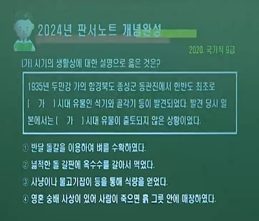
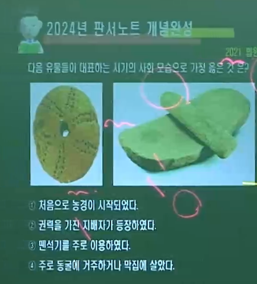
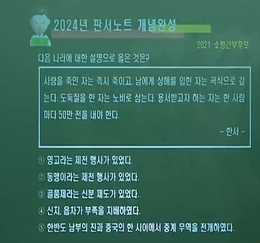
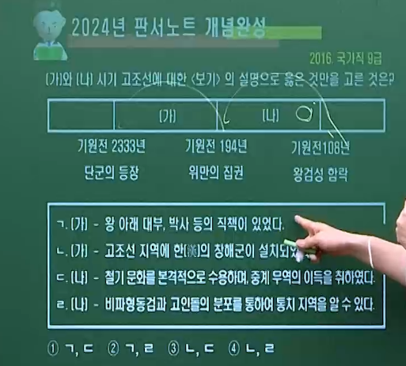
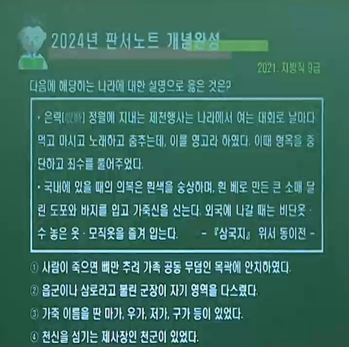

## (  역사의 의미 )

### (1) <mark>사실</mark>로서의 역사 = 객관적 의미의 역사

#### ① 역사가 랑케 = "오직 역사적 사실로 하여금 이야기하게 해야 한다"

#### ② 독일어의 게슈히테 = 과거에 일어난 일

#### ③ 한자의 역 = 겪다 · 지나다

#### ④ <mark>역사에서의 객관적 진리는 존재한다</mark>

#### ⑤ 실증주의 사관 ( 사실 자체 강조 ) = 1876년, 강화도 조약 체결 등

### (2) <mark>기록</mark>으로서의 역사 = 주관적 의미의 역사

#### ① 역사가 크로체 · 콜링우드 · 카 = 모든 역사는 현재의 역사이다 / 과거와 현재의 끊임없는 대화

#### ② 그리스어의 히스토리아 = 탐구를 통해 획득한 지식

#### ③ 한자의 사 = 기록된 문서, 기록한다.

#### ④ <mark>역사가의 주관적 가치 판단이 개입되면 역사는 달라질 수 있다.</mark>

#### ⑤ 상대주의 사관 ( 역사가의 해석 강조 ) = <고려사>의 우왕 · 창왕에 대한 평가 / <조선왕조실록> 광해군에 대한 평가

### (3) 한국사의 <mark>보편성과 특수성 </mark>

#### ① <mark>보편성</mark> = 국가와 민족을 초월한 전세계 인류의 공통점

##### ⒜ 자유 · 평등 · 박애 · 평화  · 행복 등 공통적인 이상

##### ⒝ 선사 시대의 전개 ( 구석기 > 신석기 > 청동기 ) / 유교 · 불교

#### ② <mark>특수성</mark> = 지역 환경에 따라 나타나는 특징

##### ⒜ 고유 언어  · 풍속 · 종교  · 예술 · 사회 제도 등

##### ⒝ 우리 불교 = 현세 구복적 · 호국적 성격 / 우리 유교 = 충 · 효 · 의 강조

----

## ( 구석기 시대 )

### (1) <mark>시기</mark> = 약 70만년 전 ∽ 1만년 전

#### ① 불 · 언어 · 도구 사용 시작

#### ② 우리나라에 사람이 살기 시작했으나, 우리 민족이라 볼 수 없음 (이동생활)

### (2) 도구 = <mark>뗀석기(타제석기)</mark>

#### ① 사냥용 : 찍개 · 팔매돌 · 슴베찌르개 · 주먹도끼

#### ② 조리용 : 긁개 · 밀개 · 자르개

### (3) 시대 구분 = 전기 · 중기 · 후기

#### ① <mark>전기</mark> = 하나의 석기를 <mark>여러 용도</mark>로 사용

##### ⒜ 찍개 · 주먹도끼 · 주먹찌르개

#### ② <mark>중기</mark> = 하나의 석기를 <mark>하나의 용도</mark>로 사용

##### ⒜ 르발루아 기법 사용 = 밀개 · 긁개

##### ⒝ 격지를 잔손질하여 석기 제작

#### ③ <mark>후기</mark> = <mark>쐐기</mark> 등을 이용해 같은 형태의 석기(돌날격지) 여러 개 제작

##### ⒜ <mark>슴베찌르개 (창의 기능)</mark>

### (4) <mark>경제</mark> = <mark>수렵(사냥) · 채집 · 어로 </mark>

### (5) 주거 = <mark>이동</mark> 생활 > 동굴 · 막집 ( <mark>제천 창내</mark> ) · 바위그늘

### (6) 사회 = 평등한 공동체적 생활 · 무리 중에서 경험이 많고 지혜로운 사람이 <mark>지도자</mark> ( 지배자 X )

### (7) <mark>예술</mark> = 『<mark>공주 석장리</mark>』 · 『<mark>단양 수양개</mark>』 ☞ 고래  · 물고기 등을 새긴 조각 발견 · 사냥감의 버성을 비는 주술적 의미

#### ① <mark>경기 연천 전곡리</mark>(전기) = 동아시아 최초 아슐리안형 <mark>주먹도끼</mark> 발굴

#### ② <mark>충남 공주 석장리</mark>(후기) = <mark>남한 최초 발굴(1964)</mark> ☞ 우리나라 구석기 시대 존재 증명

#### ③ <mark>함북 종성 동관진</mark>(후기) = <mark>한반도 최초 구석기 유적 발견(1933)</mark>

#### ④ <mark>충북 청원 두루봉 흥수굴</mark>(후기) = <mark>흥수아이 · 장례 풍습 확인</mark>

----

## ( 신석기 시대 )

### (1) 시기 = B.C 8천 년 전 or 1만 년 전

#### ① 정착 생활을 시작한 <mark>신석기 시대에 청동기 시대를 거치면서</mark> 우리 민족의 기틀 형성 ☞ <mark>신석기 후반 농경이 시작 됬기 때문에</mark>

### (2) 도구 = <mark>간석기(마제석기)</mark> · 토기(이른 민무늬 초기·빗살무늬)

#### ① 돌괭이 · 돌삽 · 돌보습 · 돌낫 · 돌도끼 · 농경굴지구 · 갈돌 · 갈판

#### ② <mark>이른 민무늬 토기(최초)</mark> · <mark>덧무늬</mark> 토기 · 눌러찍기무늬(<mark>압인문</mark>) 토기

#### ③ <mark>빗살무늬 토기(후기에 제작)</mark> = 밑이 뾰족함 첨저형 ( 서울 암사동 ) · 편평한 화분모양의 평저형 ( 강원 양양 오산리 )

### (3) 경제 = 농경 생활의 시작 ( <mark>신석기 혁명. 후반</mark> 농경 및 목축 시작 )

#### ① 원시적 농경 ( 조 · 피 · 수수  ·기장 ), <mark>벼농사 X</mark>

#### ② 신석기 후반 농경 및 목축 시작 = <mark>탄화된 좁쌀</mark> 출토 ( <mark>황해도 봉산 지탑리 · 평양 남경</mark> )

#### ③ <mark>수렵 · 채집 · 어로가 여전히 식량을 얻는 중요한 수단</mark> = 그물과 작살 · 돌이나 뼈로 만든 낚시 등으로 고기잡이

#### ④ 가까운 지역 및 일본과 교류 = 흑요석 · 경남 창녕 비봉리 유적의 통나무배 · 일본 조몬토기

### (4) 주거 = <mark>정착 생활의 시작</mark> ( 강가 · 바닷가 )

#### ① <mark>움집</mark> = <mark>원형 · 모서리가 둥근 방형  · 가운데 화덕 위치 · 반지하식 가옥</mark>

#### ② 출입문은 남쪽 / 저장 구덩에 식량 저장

### (5) 사회 = <mark>여전히 평등 사회</mark>

#### ① <mark>씨족사회</mark>  ☞ <mark>부족사회로 확대 · 모계 사회</mark>(경제 활동에서 여성의 비중 大) <mark>족외혼</mark>을 통해 ...

#### ② 원시 수공업 = <mark>가락바퀴(방추차) · 뼈바늘</mark> 출토 ☞ 옷 · 그물 제작 · 사용

#### ③ 원시 신앙 발생 = <mark>애니미즘 · 샤머니즘 · 토테미즘 · 기타 </mark>

##### ⒜ 애니미즘 = 모든 자연물 · 자연 현상에 정령이 있다고 믿고 숭배하는 신앙

##### ⒝ 샤머니즘 = 인간과 영혼 · 하늘을 연결시켜주는 존재인 무당과 그 주술을 믿는 신앙

##### ⒞ 토테미즘 = 자기 부족의 기원을 특정 동물 · 식물에 연결시켜 숭배하는 신앙

### (6) <mark>예술</mark> = 흙으로 빚은 얼굴상(강원 양양 오산리) · 조개껍데기 가면 (인천 옹진 소야도 · 부산 동삼동) · 조가비 또는 짐승의 뼈 , 이빨로 만든 치레걸이

#### ① <mark>서울 암사동</mark> = 국내 최대 신석기 마을 유적 · 빗살무늬 토기 등 출토

#### ② <mark>부산 동삼동</mark> = 남해안 일대 가장 규모가 큰 패총 발견 · 일본 교역 근거 ☞ 흑요석

#### ③ <mark>평양 남경 · 황해도 봉산 지탑리</mark> = 탄화된 곡물 ( 조· 피 ) 출토

#### ④ <mark>강원 양양 오산리 · 제주 한경 고산리</mark> = 흙으로 빚어 구운 사람 얼굴 · 덧무늬 · 흑요석 출토

#### ⑤ <mark>창녕 비봉리</mark> = 통나무 배(목선) 발견

----

## ( 청동기 시대 )

### (1) 시기 = B.C. 2000년경 ∽ B.C. 1500년경에 시작

#### ① <mark>북방식 시베리아 계통</mark> ( 중국 계통 X · 황하 X · 은·주 X · 내몽골 지역 오르도스식 X )

### (2) 도구 = <mark>귀하고 재질이 무름</mark> ☞ 무기(군장)·제사용품·장신구로 사용 · <mark>청동제 농기구 X </mark>

#### ① <mark>비파형 동검</mark> = 요령식 동검 · 무기·의식용

#### ② <mark>거친무늬 거울</mark> = 조문경 · 장신구

#### ③ <mark>간석기 = 농기구( 반달돌칼· 곡식추수용 )</mark> · 바퀴날 도끼 · 홈자귀 · 돌괭이 · 돌도끼 · 간돌검

#### ④ 토기

##### ⒜ 덧띠 새김무늬 토기 = 신석기 시대 말기부터 등장한 토기로 청동기 시대의 가장 이른 시기를 대표함

##### ⒝ <mark>미송리식 토기</mark> = <mark>손잡이</mark>, 표면에 집선 무늬 ☞ 주로 청천강 이북 · 요령성 · 길림성 일대 분포

##### ⒞ <mark>민무늬 토기</mark> = 청동기 시대의 대표적 토기

##### ⒟ <mark>붉은 간토기</mark>, 부여 <mark>송국리형</mark> 토기, 강계 공귀리형 토기, 구멍무늬 토기, 팽이형 토기

### (3) 경제 = <mark>벼농사 시작( 일부 저습지. 탄화미 발견 )</mark> · 그러나 조 · 보리 · 콩  ·수수 등 <mark>밭농사 중심</mark>

#### ① <mark>어로 활동이나 조개 채집의 비중 감소</mark> ☞ 패총이 많이 발견되지 않음

#### ② <mark>사유재산제 및 계급 발생</mark> = 농업 생산 증가 ☞ 잉여생산물(군장의 출현 · 사유재산제 ) ☞ 도시의 형성 ☞ 국가의 형성

### (4) 주거 = 산간 · 구릉 지형(<mark>배산임수</mark>) 에 취락 형성

#### ① 움집

##### ⒜ 형태 = <mark>직사각형(장방형)</mark> · <mark>지상가옥화 · 주춧돌 사용</mark>

##### ⒝ <mark>화덕</mark>의 위치 = <mark>한쪽 벽으로 이동</mark>

##### ⒞ 저장구덩 = 따로 설치하거나 한쪽 벽면을 밖으로 돌출 시킴

#### ② 주거용 외에 창고 · 공동 작업장  · 집회소 · 공공 의식 장소 등도 만듦 · 마을 주위에 <mark>목책</mark>이나 <mark>환호</mark> 등의 방어 시설 조성

### (5) 사회 = <mark>사유 재산제로 인한 계급 분화 </mark>

#### ① 권력과 경제력을 갖춘 지배 계급( <mark>군장 = 족장</mark> ) 등장 ☞ <mark>군장 국가의 형성</mark>

#### ② 무덤양식

##### ⒜ <mark>고인돌</mark> = 형태 『<mark>북방식·탁자식</mark>』 『<mark>남방식·바둑판식</mark>』 / 유적 『<mark>고창·화순·강화 고인돌 유적</mark>』 ☞ <mark>유네스코 세계 문화 유산 등재</mark> / 의미 『청동기 시대 지배층(족장) 의 무덤 ☞ <mark>계급 발생을 보여줌.</mark>

##### ⒝ <mark>돌무지 무덤</mark> = 돌로 쌓아 만든 무덤 · <mark>청동기 ∽ 삼국시대</mark>까지 만들어짐.

##### ⒞ <mark>돌널 무덤</mark> = 돌을 다듬어서 관을 만들고 위에 판석을 덮은 무덤.

#### ③ <mark>남녀의 역할 분화</mark> = 남성은 전쟁과 같은 바깥일 · 여성은 주로 집안일 담당 ☞ <mark>부계 중심 사회</mark>

#### ④ 청동기 제작과 관련된 <mark>전문 장인 출현</mark> · <mark>선민사상</mark>을 내세워 주변 지역 정복 활동

### (6) 예술 및 유적지

#### ① <mark>벼농사 유적지 (탄화미 출토)</mark> = <mark>부여 송국리</mark> ☞ 남한 최대 규모의 취락 · <mark>목책과 환호</mark>의 흔적 / <mark>여주 흔암리</mark> 등

### (7) 청동기에서 철기로 넘어가며 나타난 예술 · 유적지

#### ② <mark>바위그림 ( 암각화 )</mark>

#### ③ <mark>울산 울주 대곡리 반구대</mark> = <mark>고래</mark> 사냥의 성공과 풍성한 수확 기원

#### ④ <mark>고령 양전동 ( 장기리 ) 알터</mark> = 동심원(<mark>태양</mark>숭배) · 삼각형 등 기하학 무늬

---

## ( 철기 시대 )

### (1) 시기 = <mark>B.C. 5C 경 중국의 전국시대 유이민으로부터 전래</mark>

### (2) 도구 · 경제 = <mark>철제 무기</mark> 사용 · 정복전쟁 심화 · <mark>연맹왕국 등장</mark>

#### ① <mark>철제 농기구 사용</mark> = <mark>최초의 금속제 농기구</mark> ☞ <mark>농업 생산력 ↑</mark>

#### ② <mark>청동기</mark> = 세형동검 『한국식 동검』 / 잔무늬 거울 『세문경』 / 거푸집 『용범』 = 청동기 제작 틀 (직접 제작 증거) ☞ <mark>의기화 · 독자화</mark>

#### ③ 토기 = 민무늬 토기  · 덧띠 토기(입술 단면에 원형·방형·삼각형의 덧띠를 붙인 토기) · 검은 간 토기 등

### (3) 주거 = 지상식 주거 · 부뚜막(온돌 사용) 등장 『하남 미사리 유적』 · 반움집(초가 지붕) · 귀틀집(통나무 이용)

### (4) 사회 · 예술 · 유적지 = <mark>중국과의 교류</mark> · 무덤양식

#### ① <mark>한자사용</mark> = 붓 출토 『<mark>창원 다호리 유적</mark>』

#### ② <mark>중국 화폐 출토</mark> = <mark>명도전 · ( 오수전 · 반량전 ☞ 『경남 사천 늑도 유적 출토』 ) · 왕망전 </mark>

#### ③ 무덤 양식

##### ⒜ (나무) <mark>널무덤(토광묘)</mark>

##### ⒝ <mark>독무덤(옹관묘)</mark>

##### ⒞ <mark>주구묘(마한의 무덤 양식)</mark>

##### ⒟ <mark>돌덧널무덤 (석곽묘)</mark>

----

## ( 고조선의 건국과 발전 )

### (+) <mark>세력 범위 유물 </mark>= 『북파거미』 <mark>북방식(탁자식) 고인돌</mark> · 비파형 동검 · 거친무늬 거울 · 미송리 토기 = 위만조선 X

### (0) 단군(고조선)에 관한 기록

#### ① 고려 충렬왕

##### ⒜ <mark>삼국유사 = 일연</mark> ☞ 신화의 내용이 <고기>에 수록되어 있었음  · 여고동시

##### ⒝ 제왕운기 = 이승휴

#### ② 조선 15C - 16C

##### ⒜ 단종 = 세종실록지리지

##### ⒝ 세조 = 응제시주 : 권람

##### ⒞ 성종 = 동국여지승람 : 노사신 / 동국통감 : 서거정

##### ⒟ 16C 중종 = 표제음주동국사략 : 유희령

#### ③ 고조선 관련 <mark>중국 기록</mark>

##### ⒜ <mark>관자 = 최초 기록</mark> · 제나라와의 교역 기록 · 춘추전국시대에 편찬

##### ⒝ 산해경 · 사기 · <mark>한서</mark> 지리지 ☞ <mark>8조법 중 3개 조항</mark>

#### ④<mark> 고조선 8조법</mark>

##### ⒜ 사람을 죽인 자는 즉시 죽인다 = <mark>생명 · 노동력 중시</mark>

##### ⒝ 남에게 상처를 입힌 자는 곡식으로 갚는다 = <mark>농경 사회</mark>

##### ⒞ 도둑질을 한 자는 노비로 삼되, 용서받고자 하는 자는 50만전을 내야 한다 = <mark>사유 재산 중시 · 계급 사회 · 노비제 발생 · 화폐 사용</mark>

### (1) 건국 이야기(시기) = <mark>B.C 2333 청동기 문화를 바탕</mark>으로 단군왕검이 고조선 건국 ( <mark>여고동시</mark> )

#### ① 단군(제사장) + 왕검( 정치적 군장 ) = <mark>제정일치</mark>

#### ② 요령 및 대동강 유역을 중심으로 발전

#### ③ <mark>은 · 주 ( 청동기 )</mark> ☞ 기자(조선왕) 16C 사림

### (2) <mark>춘추 · 전국 ( 철기 1 ) = 고조선 </mark>

#### ① B.C. 4C 경 요서를 경계로 <mark>연과 대립</mark> ( 스스로 왕이라 칭함 .)

#### ② B.C. 3C 초 진개(연)의 침입 ☞ <mark>서쪽 2천리 상실</mark>

#### ③ <mark>중심지 이동</mark> = 요령 ☞ 대동강 유역  

### (3) <mark>진·한 교체기 = 고조선 ☞ 위만조선</mark>

#### ① 부왕·준왕 = 강력한 왕 등장 · <mark>왕위 세습</mark> · 『상·대부·장군·박사』 등 관직 정비

#### ② <mark>위만</mark>의 고조선 망명 ☞ 준왕의 신임으로 <mark>박사</mark>에 임명 · 서쪽 변경 수비 담당

#### ③ <mark>준왕 축출</mark> ☞ 준왕은 남쪽 진국으로 내려가 한왕이 됨

#### ④ <mark>단군 조선 계승 근거</mark> = 입국 시 상투 · 조선인의 옷(오랑캐옷) + 『조선』을 그대로 국호로 사용 + 토착민 출신 고위 관리 多

### (4) <mark>한 무제 ( 철기 2  ·중계무역 ) = 위만조선</mark>

#### ① <mark>철기 문화의 본격적 수용 ( 처음 수용 X )</mark> · 철기 2를 바탕으로 농업 · 수공업 · 상업 · 무역 발달

#### ② <mark>활발한 정복 사업</mark> ☞ 진번 · 임둔 정복 

#### ③ <mark>중계 무역 이익 독점</mark> = 『예』 와 『진』 의 『한』과의 직접 교역 차단

#### ④ <mark>관직 정비</mark> = 왕 · 태자 · 비왕 · 상[국무 장관] · 대신  · 경 · 장군 등

### (5) <mark>한 무제의 침입 = 위만조선 멸망</mark>

#### ① <mark>B.C. 128 창해군 설치 </mark>= 『예』의 남려 투항 · 위만조선 압박

#### ② <mark>B.C. 109 섭하 사건</mark> = 섭하가 조선 비왕 '장' 살해 ☞ 우거왕이 요동 도위 섭하 살해

#### ③ <mark>B.C. 108 왕검성 함락 </mark>= 한 무제의 침입 · 1차전 패수 승리 · 지배층 내분 ☞ 조선 상 역계경 남하 『진국 망명』 · 우거왕 피살

### (6) B.C. 108 이후 = 위만조선 멸망

#### ① <mark>한 군현(4군) 설치 『낙랑·진번·임둔·현도』</mark>☞ 토착민의 대항 / 법조항 60여 개 조로 증가

----

## ( 부여 )

### (0) 풍습

#### ① 장사를 후하게 지냄 (<mark>후장</mark>) · 여름에 <mark>얼음</mark>을 넣어 장사

#### ② <mark>국왕의 장례에 옥갑</mark> 사용

#### ③ <mark>여섯 가축의 이름으로 관명</mark>을 정함

#### ④ <mark>곽은 사용하나 관은 쓰지 않음</mark>

#### ⑤ <mark>『예왕지인』</mark> 이라는 글귀가 있는 안장

### (1) 위치

#### ① <mark>만주 송화강 유역 평야지대</mark>

#### ② <mark>동이 지역 중 가장 넓고 평탄</mark>

#### ③ <mark>토질은 오곡을 가꾸기에 적당</mark> = 과일은 생산되지 않았다(삼국지)

#### ④ 사람들 <mark>체격 大 · 강직 · 용맹 · 근엄 · 후덕</mark>

### (2) 정치

#### ① 중앙(왕) + 마가 · 우가 · 저가 · 구가 = <mark>5부족 연맹체(사출도)</mark>

#### ② 관리 = <mark>대사자 · 사자</mark>

#### ③ <mark>1세기 초에 이미 왕호 사용</mark> = 일시적 왕위 부자 상속 3C

#### ④ <mark>흉년 · 재해 발생시 왕에게 책임을 물음</mark>

#### ⑤ 가(加) 들이 왕 추대 ☞ <mark>왕권 미약</mark>

### (3) 경제

#### ① 농경 · 목축 발달 ( <mark>반농반목</mark> )

#### ② 특산물 = <mark>말 · 주옥(적옥) · 모피</mark>

### (4) 사회 · 문화

#### ① <mark>형사취수제</mark> = 지배층의 혼인 풍습

#### ② <mark>우제점법</mark> = 소를 죽여 굽으로 길흉을 점침

#### ③ <mark>흰 옷 숭상 · 은력 사용 · 순장(왕이 죽으면 신하를 같이 묻음)</mark>

#### ④ 4조목 ( 법률 )

##### ⒜ 살인죄 = <mark>사형 (가족은 노비로 ☞ 연좌제)</mark>

##### ⒝ 절도죄 = <mark>12배 배상 ( 1책 12법 )</mark>

##### ⒞ <mark>간음죄 · 투기죄(시체 찾으려면 우마로 배상) = 사형</mark>

### (5) 제천행사 = <mark>영고 ( 12月 )</mark> ☞ 수렵 사회의 전통 · 전쟁 시에도 행함

### (6) 변화

#### ① 3세기 말 선비족의 침략으로 쇠퇴

#### ② <mark>5세기 말 고구려에 편입 ( 494 · 문자왕 )</mark>

#### ③ <mark>연맹왕국 단계에서 멸망</mark>

----

## ( 고구려 )

### (0) 풍습

#### ① 장례 = <mark>혼인 때부터 수의 마련 · 금·은·돈·폐백을 후하게 사용(후장)</mark>

#### ② <mark>돌무지 무덤 조성</mark> = 무덤 앞에 소나무와 잣나무를 심기도 함

#### ③ <mark>거처의 좌우에 큰 집을 짓음</mark> = 귀신 제사 · 영성과 사직 및 기자신에게도 제사

### (1) 위치

#### ① <mark>졸본 산간지역 ( 압록강 지류 동가강 )</mark>

#### ② <mark>사람들 성품 흉악, 급하고 노략질 좋아함</mark>

#### ③ <mark>졸본성 ☞ 국내성 천도 ( 1C 유리왕 )</mark>

### (2) 정치

#### ① <mark>5부족 연맹체 · 부여의 별종 = 계루부 · 절노부 · 순노부 · 관노부 · 소노부</mark>

#### ② <mark>1세기 초에 이미 왕호 사용</mark>

#### ③ 왕 아래 <mark>상가 · 고추가</mark> 등 대가 존재 = 각기 <mark>사자 · 조의 · 선인</mark> 등 관리를 거느림

#### ④ <mark>제가회의</mark> = 가(加 · 부족장)들의 회의

### (3) 경제

#### ① <mark>약탈 경제(옥저·동예로부터 공물 수취)</mark> ☞ <mark>부경</mark>(약탈물 보관 창고)

#### ② 특산물 = <mark>맥궁</mark>

#### (4) 사회·문화

#### ① <mark>서옥제 ( 노동력 중시 · 모계사회 유습 )</mark> = 신부집 뒤에 서옥을 짓고 자식을 낳아 장성하면 아내를 데리고 신랑집으로 돌아감

#### ② <mark>중대범죄 사형 ( 감옥 없음 ) ☞ 그 가족은 노비로 삼음 = 제가회의 결정</mark>

#### ③ 관모 = 절풍 · 책 등

#### ④ <mark>부여와 유사한 풍습 ( 1책 12법 · 형사취수제 · 점복 )</mark>

### (5) 제천행사 = <mark>동맹 ( 10月 )</mark> ☞ 추수감사제 · <mark>국동대혈(수혈)</mark>에서 제사

### (6) 변화 = <mark>중앙 집권 국가</mark>로 발전

---

## ( 옥저 )

### (0) 풍습

#### ① <mark>가족 공동무덤 ( 골장제 · 세골장 )</mark> = 시체를 가매장 후 뼈를 추려 <mark>목곽(나무 덧널)에 안치</mark> / 목곽 입구에 <mark>쌀 항아리</mark>를 매달아 놓음

#### ② 고구려와 같이 부여족의 한 갈래

### (1) 위치 = <mark>함경도 동해안 ( 고구려 대마동산 동쪽 )</mark>

### (2) 정치 = <mark>군장(읍군·삼로·후) 국가 ( 왕 X · 군장이 지배 )</mark>

### (3) 경제 = <mark>토지 비옥 · 해산물(어물·소금) 풍부 ☞ 고구려에 공납</mark>

### (4) 사회·문화

#### ① <mark>민며느리제 ( 매매혼 · 예부제 )</mark> = 여자가 어렸을 때 남자 집에서 성장 후 남자가 예물을 치르고 혼인

### (5) <mark>제천행사 ( 기록상 없음 )</mark> · 변화 ( <mark>고구려에 복속됨 ) · 군장국가 단계에서 멸망</mark>

## ( 동예 )

### (0) 풍습

#### ① <mark>병을 앓거나 사람이 죽으면 옛 집을 버리고 새 집을 지어 삶</mark>

#### ② <mark>범토템 ( 호랑이 숭배 )</mark>

#### ③ <mark>집터 = 철(凸)자형 , 여(呂)자형</mark>

### (1) 위치 = <mark>강원도 북부 동해안</mark>

### (2) 정치 = <mark>군장(읍군·삼로·후) 국가 ( 왕 X · 군장이 지배 )</mark>

### (3) 경제 = <mark>토지 비옥 · 해산물(어물·소금) 풍부</mark>

### (4) 경제 = <mark>방직 기술 발달 ( 명주 · 삼베 )</mark> / 특산물 ( <mark>단궁 · 과하마 · 반어피</mark> )

### (5) 사회·문화 = <mark>책화</mark> ( 다른 부족 영역 침범 시 노비·소·말 변상) / <mark>족외혼</mark>

### (6) 제천행사 = <mark>무천 ( 10月 )</mark>

### (7) 변화 = <mark>고구려에 복속 됨 ( 군장국가 단계에서 멸망)</mark>

----

## ( 삼한 )

### (0) 풍습

#### ① <mark>편두</mark>( 아이가 태어나면 돌로 머리를 눌러 납작하게 함. ) · <mark>문신</mark> (변한 · 진한)

#### ② 무덤 = <mark>주구묘(마한) · 옹관묘(독무덤. 마한)</mark>

#### ③ 주거 = <mark>토실(마한)</mark>

#### ④ 악기 = 광주 신창동 현악기

#### ⑤ 장례 = <mark>소나 말 순장(마한)</mark> · <mark>새 깃털 함께 매장 ( 진한 · 변한 )</mark>

### (1) 위치 = <mark>한반도 남부 지역</mark>

### (2) 정치

#### ① <mark>연맹왕국 ( 78개 소국 연맹 )</mark>

##### ⒜ <mark>마한(54국) = 경기 · 충청 · 전라 지역</mark>

##### ⒝ <mark>변한(12국) = 김해 · 마산 지역</mark>

##### ⒞ <mark>진한(12국) = 대구 · 경주 지역</mark>

#### ② 마한 목지국 지배자가 삼한 주도 = <mark>마한왕(진왕)</mark>으로 추대

#### ③ 군장

##### ⒜ <mark>대군장 = 신지 · 견지</mark>

##### ⒝ <mark>소군장 = 읍차 · 부례</mark>

### (3) 경제

#### ① <mark>저수지 축조 ☞ 벼농사 발달 </mark>

##### ⒜ 김제 벽골제 · 밀양수산제 · 제천 의림지 · 상주 공검지

#### ② <mark>두레 ( 공동 노동 조직 )</mark>

#### ③ 양잠 성행 ☞ <mark>비단옷</mark>

#### ④ <mark>변한의 철 생산 多</mark> ☞ <mark>낙랑 · 왜 수출</mark> = 철을 교역에서 <mark>화폐(덩이쇠)</mark> 처럼 사용

### (4) 사회 · 문화

#### ① <mark>제정 분리 </mark>

##### ⒜ 군장 = 정치적 지배자

##### ⒝ 천군(제사장) = 신성 지역인 <mark>소도(별읍) 관할</mark> · 농경과 종교에 대한 의례 주관 · 군장 세력이 못미침

#### ② 주거 = <mark>반움집(초가지붕) · 귀틀집(통나무집)</mark>

### (5) 제천행사 = <mark>수릿날 ( 5月 ) · 계절제 ( 10月 )  </mark>