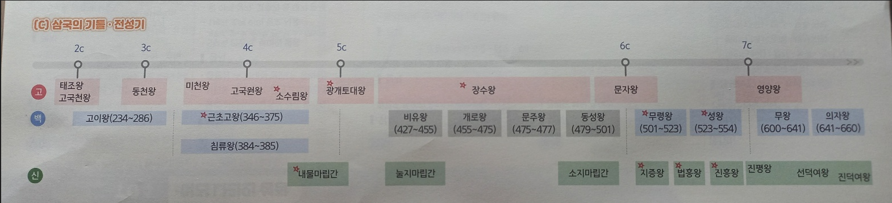
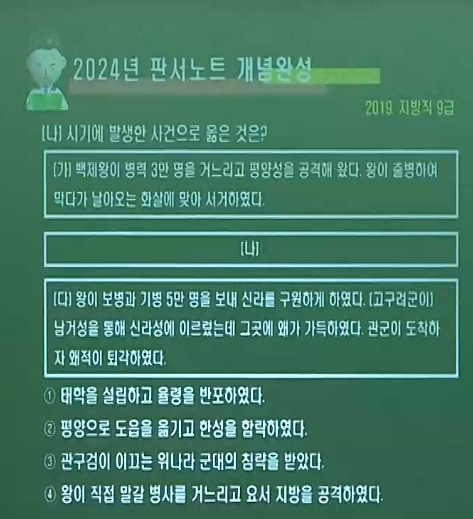
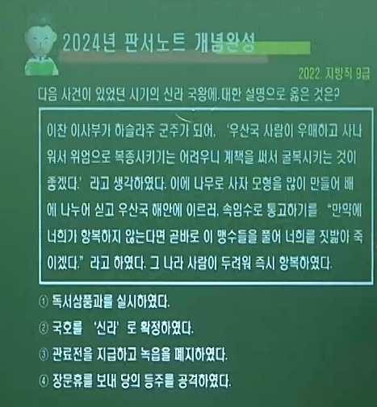
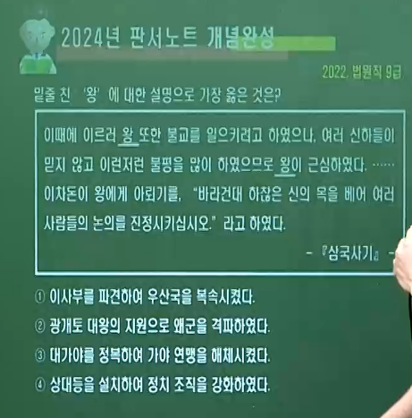
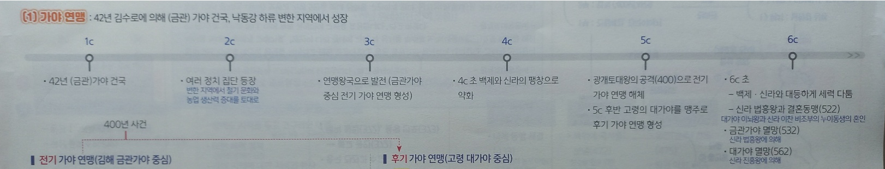
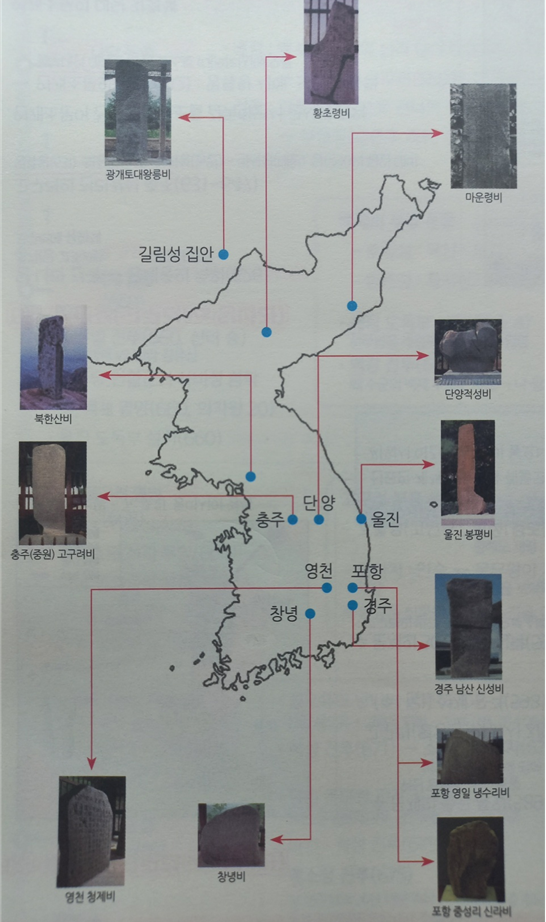

# 1. 삼국 ∽

## ( A 삼국의 기틀 )

### (🥇) 👑고구려 태조왕 ( 53 ∽ 146 )

- #### 1️⃣ 🤴계루부 고씨 왕위 독점 세습 ( 형제 상속 )
  
  #### 2️⃣ 🗡 <mark>(동) 옥저 복속 · 동예 공격</mark>
  
  #### 3️⃣ 🗡 <mark>요동 · 현도군 공격</mark>

### (🥈) 👑 백제 고이왕 ( 234 ∽ 286 )

- #### 1️⃣ 🤴왕위 <mark>형제 상속</mark>
  
  #### 2️⃣ 🌊 한강 유역 완전 장악 ( 목지국 병합 )</mark>  ⛳
  
  #### 3️⃣ 👲 낙랑 · 대방 · 말갈을 밀어내면서 <mark>영토 확장</mark> 🗾
  
  #### 4️⃣ 👔 관복제 (자 · 비 · 청 ) / 남당 설치 ( 정사를 보는 관청 )

### (🥉) 👑내물마립간 ( 356 ∽ 402 )

- #### 1️⃣ 🤴 박·석·김씨 교대 ☞ 김씨 왕위 세습 ( 형제 상속 )
  
  #### 2️⃣ ⛳진한 지역 거의 차지 ( 🌊낙동강 동쪽 )
  
  #### 3️⃣ 👲 고구려를 통해 전진과 수교
  
  #### 4️⃣ 🎖 왕호를 마립간으로 개칭
  
  #### 5️⃣ 👺 왜구 격퇴 ( 400 ) = 광개토대왕의 지원 ➡ 🗿광개토대왕릉비 · 🥥호우명 그릇(415 · 장수왕 3년 )

----

## ( B 고구려 ▪ 백제 ▪ 신라 1C ∽ 6C  )

### (🥇) 🏳‍🌈BC. 37. 주몽(동명왕)이 졸본(오녀산성)에서 건국

- #### 1️⃣🤝부여 계통 유이민 + 압록강 유역 토착 세력
  
  #### 2️⃣🚩 AD 3. 2대 유리왕(황조가) 때 국내성(환도성) 천도

### (🥇) 👑고구려 태조왕 ( 53 ∽ 146 )

- #### 1️⃣ 🤴계루부 고씨 왕위 독점 세습 ( 형제 상속 )
  
  #### 2️⃣ 🗡(동) 옥저 복속 · 동예 공격
  
  #### 3️⃣ 🗡요동 · 현도군 공격

### (🥇) 👑 고국천왕 179 ∽ 197

- #### 1️⃣ 🔱5부 개편 ( 부족적 ➡ <mark>행정적</mark> )
  
  #### 2️⃣ 🤴 왕위 부자상속
  
  #### 3️⃣ ⚖ 진대법 실시 ( <mark>춘대추납 194</mark> )
  
  - ##### 🅰 🧙‍♀️ 국상 <mark>을파소</mark>의 건의
  
  - ##### 🅱 📊<mark>왕권 ↑ · 귀족 견제 · 농민 안정</mark>

### (🥇) 동천왕 227 ∽ 248

- #### 1️⃣ 🗡서안평 공격 ➡ 👲위 관구검의 침입 ➡ 🏳환도성 · 국내성 함락
  
  #### 2️⃣ 👲<mark>중국 오와 수교</mark> ( 위 견제 )

### (🥈) 고이왕 234 ∽ 286 ( 관직 ▪ 관등 ▪ 관복 ▪ 율령 )

- #### 1️⃣ 🤴 왕위 형제 상속 / 2️⃣ 🔱6좌평 16관등제  ▪ ⚖율령 반포
  
  #### 3️⃣ 👔 관복제 ( 자 ▪ 비 ▪ 청) / 4️⃣ 🌊한강 유역 완전 장악 ( 목지국 병합 ) ⛳
  
  #### 5️⃣ 👲낙랑 ▪ 대방 ▪ 말갈을 밀어내면서 영토 확장 🗾

### (🥇) 중천왕 248 ∽ 270

- #### 1️⃣ 관나부인 ▪ 중천왕의 비 ▪ 장발미인으로 유명 ▪ 고구려 관노부 출신으로 왕후를 모함 ( 질투죄 ) 하다 처형됨.

  

### (🥇) 👑 미천왕 300 ∽ 331

- #### 1️⃣ ⛳서안평 점령( <mark>311</mark> )
  
  #### 2️⃣ 👲낙랑 · 대방군 축출( <mark>313 · 314</mark> ) ➡ 🌊 대동강 유역 확보 🗾

### (🥇) 👑고국원왕 ( 사유· 331 ∽ 371 )

- #### 1️⃣ 👲선비족 전연 ( 모용황 ) 침입 ➡🏳수도 ( 환도성 ) 함락 <mark>342</mark>
  
  - ##### 🅰 😈🏛미천왕릉이 도굴 당함
  
  #### 2️⃣ 💯<mark>백제 근초고왕의 침입</mark> ➡ 평양성에서 전사 <mark>371</mark> ☠
  
  - ##### 🅰 👻고구려왕 사유(고국원왕)가 유시에 맞아 숨졌다.

### (🥈) 근초고왕 346 ∽ 375

- #### 1️⃣ 황해도 지역을 두고 고구려와 대결 ( ⚔ 평양성 전투 ➡ 고국원왕 전사 👻)
  
  #### 2️⃣ ⛳마한 세력 정복 ( 전라도 남해안 진출 ▪ 가야 지역 지배권 행사 )
  
  #### 3️⃣ 👲요서 ▪ 산둥 및 👺일본 규슈 지방 진출 ( 💱고대 무역권 형성 ▪ 왜왕 ⛓칠지도 하사 ▪ 동진과 수교  )  🚢
  
  #### 4️⃣ 🤴 왕위 부자 장속
  
  #### 5️⃣ 🧙‍♀️ 고흥 📓 『 서기 』  편찬 ( 375 )
  
  #### 6️⃣ 🧙‍♀️ 아직기(한자) ▪ 왕인(천자문▪논어) 일본 파견

### (🥇) 👑 소수림왕 371 ∽ 384 ( 재 기틀 )

- #### 1️⃣ 👲북중국 (전 진)과 수교 ➡ 🧙‍♂️불교 공인 <mark>372</mark> ( 순도 )
  
  #### 2️⃣ 🏫태학 설립 <mark>372</mark> · ⚖율령 반포 <mark>373</mark>

### (🥈) 침류왕 384 ∽ 385

- #### 1️⃣ 🧙‍♂️ 불교 공인 384 👲 ( 동 진 ) (인도 🧙‍♂️ 승려) 마라난타 전래

### (🥉) 내물마립간 356 ∽ 402

- #### 1️⃣ ⛳진한 지역 거의 차지 ( 낙동강 동쪽 ) ⛳
  
  #### 2️⃣ 박▪석▪김씨 교대 왕위 ➡ 🤴김씨 왕위 세습 ( 형제 상속 )
  
  #### 3️⃣ 🎖 왕호를 마립간으로 개칭
  
  #### 4️⃣ 👲전진과 수교 ( 고구려를 통해 ) = 전진에 🧙‍♀️사신 파견 (382)
  
  - ##### 🧙‍♀️ 위두를 파견해 전진의 왕 부견에게 특산물을 보냄 ➡ 💱신라와 중국의 최초 교역
  
  #### 5️⃣ 👺 왜구 격퇴 (400) = 광개토대왕의 지원 🗿 광개토대왕릉비 ▪ 호우명 그릇🥥 ( 415. 장수왕 3년 )
  
  

### (🥇) 👑 광개토대왕 ( <mark>담덕</mark>. 391 ∽ 413 )

- #### 1️⃣  🎖 '영락' 연호 사용 = 최초 연호
  
  #### 2️⃣ 👲 후연(요동) ▪ 비려 (395) ▪ 숙신 (398) 정벌 ⛳
  
  #### 3️⃣ 백제(아신왕) 공격 ( 396 ) 🗡 아단성 등 백제의 58성 7백 촌락 공략 ➡ 🌊 <mark>한강 이북</mark> 진출  ⛳
  
  #### 4️⃣ 신라(내물왕)를 지원해 👺왜구 격퇴 (400) ➡ 전기 가야 연맹 해체❌
  
  #### 5️⃣ 동부여 정벌 ( 410 ) / 평양에 9개 사찰 창건 (392) / 백제의 관미성 공격 및 함락 (392) ⚔

- > ##### 💯 영락 6년(396) 병신년에 왕이 몸소 수군을 이끌고 잔국(백제)을 토벌하였다. 백잔주(아신왕)가 항복하고 스스로 『이제부터 영원토록 노객(신하)가 되겠습니다. 라고 맹세하였다. - 광개토대왕릉비-

- > ##### 💯 영락 9년(399) 기해에 백잔이 맹세를 저버리고 왜와 화통하였다. 왕은 평양으로 행차하여 내려갔다. 그러자 신라왕이 사신을 보내어 왕에게 고하기를,  『왜인이 나라 경내에 가득 차 성지를 부수고 노객(내물마립간)으로 하여금 왜의 민으로 삼으려 하니, 이에 왕께 귀의하여 구원을 요청합니다』라고 하였다. - 광개토대왕릉비-

- > ##### 💯 영락 10년(400) 경자년, (왕이) 보병과 기병 5만을 보내 신라를 구원하게 했다. 남거성을 거쳐 신라성(경주) 에 이르니, 그곳에 왜군이 가득하였다. 관군이 도착하자마자 왜적이 퇴각하여 그 뒤를 지체없이 쫓아 임나가라의 종발성에 이르니 성이 곧 항복하였다.  -광개토대왕릉비-

### (🥇) 👑 장수왕 ( 거련. 413 ∽ 491 )

- #### 1️⃣ 💱 남북조 동시 다면 외교
  
  #### 2️⃣ 🗿 광개토대왕릉비 ( 414. 중국 지린성 지안 )
  
  #### 3️⃣ 🚩평양 천도 ( 427 )  ➡ 🗾 남진 정책
  
  #### 4️⃣ ⚔ 백제 한성 함락 ( 475 )  🆚 👻 백제 개로왕 전사
  
  #### 5️⃣ ⛳ 흥안령 일대 지두우 분할 점령
  
  #### 6️⃣ 🌊<mark>한강 전 지역</mark> 및 <mark>죽령∽남양만</mark>을 연결하는 ⛳영토 확보  =  🗿충주(중원 ) 고구려비 = 🌊 남한강 차지

### (🥉) 눌지마립간 417 ∽ 458

- #### 1️⃣ 🤝 나▪제(백제 비유왕) 동맹 433
  
  #### 2️⃣ 🤴 왕위 부자 상속 ▪ 🧙‍♂️불교 전래 ( 공인 X ) = 고구려 🧙‍♂️묵호자가 전래
  
  #### 3️⃣ 🧙‍♀️ 복호와 미사흔 귀국 ( 박제상의 노력 ) = 📓 망부석(치술령) 설화

### (🥈) 비유왕 427 ∽ 455

- #### 1️⃣ 🤝(신라 눌지 마립간) 나▪제 동맹 체결 433 = 💥고구려 장수왕의 남하 정책에 대항

### (🥈 ) 개로왕 455 ∽ 475

- #### 1️⃣ 👲북위에 📩국서를 보냄 472 = ❌장수왕 협공 위한 원병 요청 실패
  
  #### 2️⃣ 🏳 한성 함락 475 🆚 🗡고구려 장수왕의 공격
  
  - ##### 🅰 🧙‍♂️바둑 승려 도림 첩자 / 👻개로왕 전사  ( 🎖 부여경 , 근개루)

### (🥈) 문주왕 475 ∽ 477

- #### 1️⃣ 🚩웅진(공주) 천도  475 / 📉왕권 약화 ▪ 📈귀족 세력 강화

### (🥉) 소지마립간 479 ∽ 500

- #### 1️⃣ 🔱6촌을 6부의 행정구역으로 개편 📝
  
  └ 내을(나을) 에 신궁 설치 487
  
  #### 2️⃣ ⚜우역 설치 ( 487 ) / 🛒시장 개설 ( 490. 경주 )
  
  #### 3️⃣ 💍백제 동성왕과 결혼동맹  ( 493 ) = 이벌찬 비지의 딸을 시집 보냄

### (🥈) 동성왕 479 ∽ 501

- #### 1️⃣ 📈사회 안정 ▪ 국력회복 시작 / 💍결혼 동맹  ( 493 ) = 신라 소지마립간
  
  #### 2️⃣ ⛳탐라국 복속 498  / 👻백가에게 살해됨 501

### (🥇) 문자왕 491 ∽ 519

- #### 1️⃣ ⛳부여 복속 494  / 🗾고구려 최대 영토 확보

----

## ( C 고구려 ▪ 백제 ▪ 신라 6C ∽ )

### (🥉) 지증왕 ( 500 ∽ 514 )

- #### ☑ [금석문]🗿 포항 중성리 신라비 501 ▪ 🗿 영일(포항) 냉수리 신라비 503

- #### 1️⃣ ☠순장 금지 및 📝🐮우경 실시 ( 502 )
  
  #### 2️⃣ 주에 🧙‍♀️군주 파견 505 = 첫 군주 🧙‍♀️이사부
  
  ##### └ 📝🔱주 ▪ 군 ▪ 현 정비 ( 주군제 실시 )
  
  #### 4️⃣ 한화 정책
  
  - ##### 🅰국호 = 사로국 ➡ 🆔신라 ( 503 )
    
    ##### 🅱왕호 = 마립간 ➡ 🎖 왕 ( 중국식 )
  
  #### 5️⃣ ⚜동시 및 👁🕍동시전(시장 감독 관청) 설치 ( 509 )
  
  #### 6️⃣ 🧙‍♀️이사부의 ⛳우산국(울릉도) 복속 ( 512 )
  
  #### 7️⃣ ⚜아시촌 소경 설치 ( 514 )

- 

### (🥈) 무령왕 ( 501 ∽ 523, 영동대장군 백제 사마왕 )

- #### 1️⃣ 🔱『22담로』 (지방에 대한 통제력 강화) 설치 및 🧙‍♀️ 왕족 파견 📝
  
  #### 2️⃣ 👲중국 남조의 양나라와 수교 ▪ 남조의 영향 = 🧱🏛무령왕릉(벽돌무덤)
  
  > ##### 💯 『영동대장군 백제 사마왕』은 나이가 62세 되는 계묘년 5월 임진일인 7일에 돌아가셨다. 을사년 8월 갑신일인 12일에 안장하여 대묘에 올려 모시며, 기록하기를 이처럼 한다.
  
  #### 3️⃣ 👲양나라에 🧙‍♀️사신을 보내 여러 차례 고구려를 격파했다는 📩서신을 전함.
  
  #### 4️⃣ 🧙‍♀️ 단양이 ▪ 고안무(유학 전파) 👺일본 파견

- 고구려 ▪ 말갈 연합군 격퇴 ( 507 ) / 금강 이북의 일부 영토 회복 / 영산강 유역 정비 ▪ 섬진강 유역 차지 ( 대가야 억압 )

### (🥉) 법흥왕 ( 514 ∽ 540 )

- #### 1️⃣ 📝율령 반포 = 근거 ➡ 🗿울진 봉평 신라비
  
  #### 2️⃣ 🔱17관등제  ▪ 👔공복제정 ( 자 ▪ 비 ▪ 청 ▪ 황 )
  
  #### 3️⃣ 👨‍✈️병부 ▪ ⚖상대등 설치  / 🔱골품제 정비
  
  #### 4️⃣ 💍대가야 (이뇌왕)와 결혼동맹 ( 522 )
  
  #### 5️⃣ 🧙‍♂️ 불교 공인 ( 527 ) = 👻이차돈 순교  계기
  
  - ##### 🅰 └ 『불교 전래』는 눌지마립간 ( 417 ∽ 458 )
  
  #### 6️⃣ ⛳금관가야 정복  ( 532 ) = 🏳 김구해 항복
  
  #### 7️⃣ 🎖『건원』 연호 사용 ( 536 )

- 

### (🥈) 성왕 ( 523 ∽ 554, 명농 )

- #### 1️⃣ 🚩『사비』 천도  ( 538 ) / 국호 🆔 『남부여』  개칭
  
  #### 2️⃣ 🔱『22부』 설치 ( 중앙 관청 확대 정비 )
  
  #### └🔱 수도 『5부』 ▪ 지방 『5방』 정비 ( 방군제 )
  
  #### 3️⃣ 🌊한강 하류 수복 ⛳ ( 551 ) = 신라 진흥왕과 결합
  
  #### 4️⃣ 🧙‍♂️ 불교 진흥 ➡ 🎖 전륜성왕 ▪ 미륵 자처 / 🧙‍♀️겸익 등용
  
  #### └ 👺일본에 불교 전파  ( 노리사치계. 552 )
  
  #### 5️⃣ 💔나▪제 동맹 결렬 ( 553 ) ➡ ⚔관산성(신라. 옥천) 전투  ( 554 )
  
  - ##### 🅰 🤴진흥왕의 배신 ➡ 🌊한강 하류를 신라에게 빼앗김 😈
    
    ##### 🅱 ❌명농(성왕)   🆚 🗡신라(관산성) 공격  ➡ 👻 고간 도도에게 전사

- > ##### 💯 "왕이 신라를 습격하기 위해 직접 기병과 보병 50명을 거느리고 밤에 구천에 이르렀는데, 신라의 복병이 나타나 그들과 싸우다가 난병들에게 살해 당했다. "  『삼국사기』

- > ##### 💯 "왕이 가량과 함께 관산성을 공격하였다. 신주의 군주인 김무력이 주의 군사를 이끌고 나아가 교전하였는데, 비장인 삼년산군의 고간 도도가 급히 쳐서 왕을 죽였다." 『삼국사기』

### (🥉) 진흥왕 ( 540 ∽ 576 )

- #### 1️⃣ 👨‍✈️화랑도를 ⚜국가적 조직으로 개편
  
  #### 2️⃣ 🛕 황룡사 ▪  🛕 흥륜사 건립
  
  ### 3️⃣ 고구려 🧙‍♂️ 승려 『혜량』  🎖 『국통(승통)』 임명
  
  #### └ 그 아래 주통 ▪ 군통을 두어 교단 정비
  
  #### 4️⃣ 🧙‍♀️거칠부 📓 『국사』 편찬 ( 545 ) = 🧙‍♀️이사부 건의
  
  #### 5️⃣ 🤝백제 성왕과 연합  ➡ 🌊한강 상류 확보 ⛳ ( 551 ) ➡ 🗿단양 적성비(🗾영역 확장 비석) ( 551 )
  
  #### 6️⃣ 백제가 회복한 🌊한강 하류 확보 ⛳ ( 553 )
  
  - ##### 🅰  ⚜ 신주 설치 ( 553 ) ➡ ⚔ 관산성 전투 ( 554 )
    
    ##### 🅱 🗿 북한산비(1️⃣순수비. 🤴왕이 직접 순행) 건립 ( 555 or 568. )
  
  #### ☑ 🌊한강 유역 차지로 👲중국과 🚢황해(당항성)를 통해 직접 교역 발판 마련
  
  #### 7️⃣ 🗿 창녕비( 2️⃣ 순수비. 561 ) ➡ ⛳대가야 정복 (👨‍✈️사다함▪🧙‍♀️이사부 활약 562 )
  
  #### 8️⃣ 🗡 고구려 공격 (🗾함경도<함흥평야> 진출) ➡ 🗿황초령비▪마운령비 ( 568 )
  
  #### 9️⃣ 🎖 연호 사용 = 개국 ▪ 대창 ▪ 홍제
  
  #### 🔟 ⚜ 품주 설치 ( 💰 재정 담당 관청 )

### (🥉 ) 진지왕 576 ∽ 579

- #### 1️⃣ 정치가 어지럽고 음란하다는 이유로 화백 회의에 의하여 폐위

---

## ( D 가야 연맹 ) = 42년 김수로에 의해 (금관) 가야 건국 · 낙동강 하류 변한 지역에서 성장

### (1) 전기 가야 연맹 ( 김해 금관가야 중심 )

- #### 1️⃣ 🛕김해 대성동 고분군 ( 금관가야 시대 고분군 )
  
  #### 2️⃣ ⛓철제 판갑옷 · 파사석탑  · 파형동기 ( 💎일본제 청동기 = 왜 교류 증거 )
  
  #### 3️⃣ ⚔ 400년 사건 = ❌전기 가야 연맹 해체 ➡ 🤝5C 후반 고령의 대가야를 맹주로 후기 가야 연맹 형성

### (2) 정치

- #### 1️⃣ 🤴김수로 ( 👸부인 허황후 ➡ 👲인도 아유타국 출신 ) = 🎖뇌질청예
  
  #### └ 📓 건국 설화 ( 구지가 ) = 거북아 거북아 .. 머리를 내어놓아라
  
  #### 2️⃣ 📈 3C = 김해의 금관 가야가 중심이 되어 연맹왕국으로 발전
  
  #### 3️⃣ 📉 4C 초 =  백제와 신라의 팽창으로 약화
  
  #### 4️⃣ ⚔ 4C 말 ∽ 5C 초 = 400년 사건 ▪ ❌전기 가야 연맹 해체
  
  - ##### 🅰 ⚠ 신라를 후원( 왜구 격퇴 ) 하는 🗡 광개토대왕의 공격(400)으로 몰락 📉
  
  #### 5️⃣ ❌ 멸망 = 6C 신라 법흥왕 🆚 금관가야 멸망 532  ( 구형왕 김구해 항복 )
  
  #### ☑ ⚔포상 8국의 난  = 😈 3C 초 남해안 일대의 8개의 소국이 가야를 침공한 사건 ➡ 🤝신라에 구원 요청 ➡ 👨‍✈️신라가 군대를 파견해 구원

### (3) 경제

- #### 📈👩‍🌾벼농사와 ⛓철기 문화 발전  ▪ ⛓덩이쇠를 💰화폐처럼 사용

- #### 💱중계 무역 = 풍부한 ⛓철 생산과 🚢해상 교통을 이용해 👲낙랑과 👺왜의 규슈 지방 연결 < 낙랑과 왜에 수출 >

-----

## ( E 후기 가야 연맹 < 고령 대가야 중심 > )

### (1) 정치

- #### 1️⃣ 📓 대가야 시조설화 = 이진아시왕 ( 🎖 뇌질주의 ▪ 김수로와 형제 )
  
  #### 2️⃣ 🤝 5C 후반 = 고령 대가야 중심의 후기 가야 연맹 형성
  
  #### 3️⃣ 💥5C 말 ∽ 6C 초 = 백제 ▪ 신라와 대등하게 세력 다툼
  
  - ##### 🅰 ⛳전라도 지역 ( 남원 ▪ 임실 ) 진출  = 🏔소백산맥 너머 호남 동부 지역까지 영역 확장 🗾
    
    ##### 🅱 💍신라 법흥왕과 결혼동맹  ( 522 ) ➡ 국제적 고립 탈피 목적
    
    ##### 🆎🗡 6C 신라 법흥왕 🆚 ❌금관가야 멸망 ( 532 )   ( 구형왕 김구해 항복 )
  
  #### 4️⃣ 대외 관계 = 👲중국 남조 ( 남제 ) 에 🧙‍♀️사신 파견
  
  #### 5️⃣ ❌멸망 = 6C 중반 신라 진흥왕 🆚 대가야 멸망  ( 562. 연맹왕국단계 )
  
  - ##### 🅰 🧙‍♀️우륵 = 신라(진흥왕) 망명 후 신라인들에게 가야금 전수 = 충주 탄금대

### (2) 경제

- #### 1️⃣ 👩‍🌾농업 생산 기반과 ⛓제철 기술 ( 풍부한 철산지 보유 )을 바탕으로 급성장 📈
  
  #### 2️⃣ 👲중국 ▪ 👺왜와 교역 💱

### (3) 유적지

- #### 1️⃣ 🛕 고령 지산동 고분군 ( 대가야 시대 고분군 )
  
  #### 2️⃣ ⛓ 판갑옷과 투구 ▪ 👑 금동관

---

