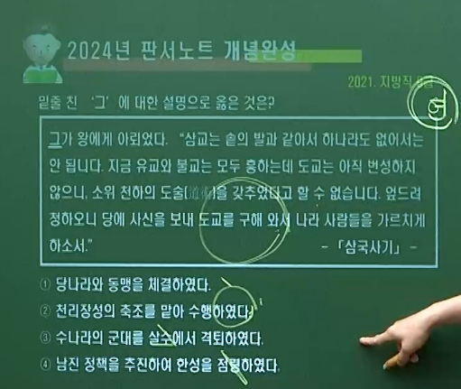
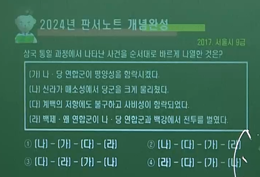
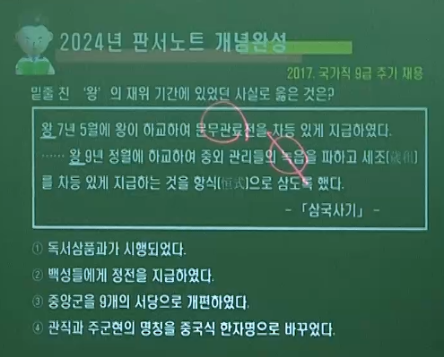
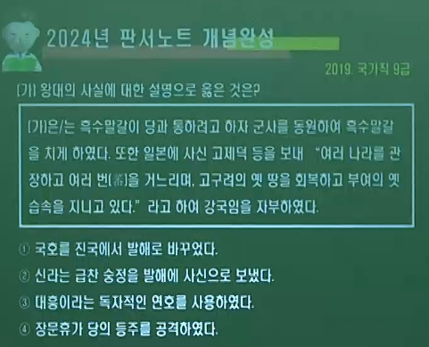
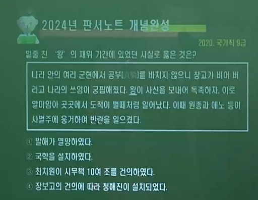

# 1. 삼국 6C 말 ∽ 7세기 전쟁 ( 고구려.수나라.당나라)

----

## ( A 수나라. 당나라 전쟁 )

### 1️⃣ 🥇  🆚 👹🏅  여 ▪ 수 전쟁 589 ∽ 614

- #### 🅰 을지문덕 살수대첩 612

### 2️⃣ 🥇  🆚 👹🏅  여 ▪ 당 전쟁 626 ∽ 645

- #### 🅰 양만춘 안시성 전투 645

### 3️⃣ 🥈  🆚 🥉  대야성(합천) 전투 642

---

### (👹🏅  수나라. 여▪수 전쟁. 589 ∽ 614 )

- #### 1️⃣ 👹🗾수 문제의 중국 통일 ( 589 )
  
  #### 2️⃣ 🤴🗡고구려 ( 영양왕 )의 요서 지방 (수나라) 선제 공격 ( 598 )
  
  #### 3️⃣ 👹🗡수 문제의 30만 대군 침략 ( 598 ) ➡ 고구려의 반격 ▪ 질병 ▪ 태풍으로 실패 ❌
  
  #### 4️⃣ 👹 수 양제의 100만 대군 침입 ( 612 ) ➡  ⚔살수(청천강) 대첩 ( 612 ) 고구려 🧙‍♀️을지문덕 🆚 수나라 👲우중문
  
  > ##### 💯 신묘한 계책은 천문을 꿰뚫고 기묘한 방책은 지리를 통달하였소. 싸워서 이긴 공은 이미 높으니 『족함을 알거든( 도교 사상 )』 그치기를 바라노라.
  
  #### 5️⃣ 🗡3차 침입(613) - 수 양제 2차 ▪ 🗡4차 침입(614) - 수 양제 3차
  
  #### 6️⃣ 🏳 👹수나라 멸망 = 🏗무리한 토목공사와 ⚔고구려 침략 전쟁으로 국력 소모

### (🥉 진평왕. 579 ∽ 632. 🎖연호 '건복')

- #### 1️⃣ ⚜중앙관서 설치 = 🔱위화부 ▪ 예부 ▪ 조부
  
  #### 2️⃣ 🗡👍고구려의 온달 격퇴 ( 590 ) = ⚔아단성 전투
  
  #### 3️⃣ 🗿남산 신성비 건립 ( 591 )
  
  #### 4️⃣ 🧙‍♂️원광 = 📓세속오계 ▪ ✍걸사표 지음
  
  #### 5️⃣ 👲수에 📝『걸사표』 📩보냄 = 🗡고구려 공격 요청 ( 611 )

### (🥇  영양왕. 590 ∽ 618 )

- #### 1️⃣ 👻온달의 전사 ( 590 )
  
  #### 2️⃣ 🗡요서 지방 선제 공격 ( 598 ) = 왕이 말갈 군사를 이끌고...
  
  #### 3️⃣ 👹수문제의 침입 ( 598 )
  
  #### 4️⃣ 🧙‍♀️이문진 📓< 신집 5권 > 편찬 ( 600 )
  
  #### 5️⃣ 👺일본에 🧙‍♂️혜자 ( 595 ) 와 🧙‍♂️담징 파견 ( 610 )
  
  #### 6️⃣ 👹수 양제의 침입 ( 612 ) ➡ ⚔👍을지문덕의 살수대첩 ( 612 )

### (🥈  무왕. 600 ∽ 641 )

- #### 1️⃣ 🚩익산 천도 시도 = 🛕왕궁리 유적 ➡ 📝유네스코 세계 문화유산 등재
  
  #### 2️⃣ 🕍미륵사(익산) ▪ 🕍왕흥사 건립
  
  #### 3️⃣ 🗿 익산 미륵사지 석탑 건립 ( 639 )
  
  #### 4️⃣ 👺일본에 🧙‍♀️관륵 ▪ 🧙‍♀️미마지 파견

### (🥇  영류왕. 618 ∽ 642 )

- #### 1️⃣ 👲당으로부터 📓도교 유입 ( 624 )
  
  
  
  #### 2️⃣ 🏔천리장성 축조 시작 ( 631 )
  
  #### 3️⃣ 👨‍🎤⚔연개소문의 정변 ( 642 ) = 👨‍🎤🗡영류왕 시해 ➡ 👑보장왕 옹립

### (🥉  👸선덕여왕. 632 ∽ 647. 🎖 연호 '인평' )

- #### 1️⃣ 🗡백제(의자왕)의 공격 ➡ 🏳 🏟40여 성을 비롯한 대야성 함락 ( 642 ) ⚔ 대야성 (합천) 전투
  
  #### 2️⃣ 🧙‍♀️김춘추가 🤴고구려(보장왕 ▪ 연개소문)를 찾아가 도움 요청🤝 ➡ 억류되었다가 탈출 ❌
  
  #### 3️⃣ 👨‍🎤비담(상대등) ▪ 👨‍🎤염종의 난 ( 647 ) ➡ 🧙‍♀️김춘추 ▪ 🧙‍♀️김유신이 진압 ( 👑진덕여왕 즉위년 )
  
  #### 4️⃣ 🗿분황사 ▪ 🗿분황사 모전석탑 건립
  
  #### 5️⃣ 🕍영묘사 창건 ▪ 🕍통도사 창건 ( 🧙‍♂️자장 )
  
  #### 6️⃣ 🏗첨성대 축조 ▪ 🗼황룡사 9층 목탑 건립 = 🕍황룡사는 진흥왕 때 건립
  
  #### 7️⃣ 📝3대 예언 = 꽃 ▪ 개굴 ▪ 죽음

### (🥈  의자왕. 641 ∽ 660. 🎖 해동증자 )

- #### 1️⃣ ⚔🏟👍신라의 40여 성 함락
  
  #### 2️⃣ ⚔대야성(합천) 전투 승리 ( 642 )
  
  - ##### 🅰 🧙‍♀️백제 윤충 🆚 👨‍✈️신라 김품석 (김춘추 사위)
  
  #### 3️⃣ ⚔황산벌 전투 ( 660 ) 패배
  
  - ##### 🅰 👨‍✈️백제 계백 🆚 🧙‍♀️신라 김유신
  
  #### 4️⃣ 🏳백제 멸망 ( 660 ) = 🆚나▪당 연합군에 의해 🏟사비성 함락❌

### (🥇  보장왕. 642 ∽ 668 )

- #### 1️⃣ 🧙‍♀️김춘추의 방문 ( 642 ) = ⚔대야성 전투 642 패배 이후 원병 요청❌
  
  #### 2️⃣ 👹🗡당태종의 침입 ➡ 🧙‍♀️⚔👍양만춘의 안시성 전투 승리 645
  
  #### 3️⃣ 🏔천리장성 완성 ( 647 ) = 🧱부여성(농안) ∽ 비사성(대련)
  
  #### 4️⃣ 👨‍🎤❌연개소문 사망 ( 666 ) ➡ 🏳고구려 멸망 ( 668 )

### (🥉  👸진덕여왕. 647 ∽ 654, 🎖 연호 『태화』 ➡ 『영휘』 )

- #### 1️⃣ ⚜집사부와 창부 설치
  
  #### 2️⃣ ❤나▪당 동맹 결성 ( 648. 🧙‍♀️김춘추 )
  
  #### 3️⃣ 👲중국식 🥻의관 착용 ▪ 🧙‍♀️진골은 아홀 을 들게 함.
  
  #### 4️⃣ 🎖연호 『태화』 ➡ 👲🎖당나라 연호 『영휘』 로 변경 ( 650 )
  
  #### 5️⃣ ✍🎼태평송을 지어 👲당 고종에게 전함📩 ( 650 ) = 당나라의 태평성대를 기리는 내용 💮

### (👹🏅  당나라. 여▪당 전쟁. 626 ∽ 645 )

- #### 1️⃣ 👲당 나라 건국 = 초기 (당 고조)에는 고구려 유화책 🤝
  
  #### 2️⃣ 👑당태종의 즉위 ( 626 ) = 💥 고구려 압박
  
  #### 3️⃣ 🏔고구려의 천리장성 축조 ( 631 ∽ 647 )
  
  - ##### 🅰 영류왕(631) ∽ 보장왕(647)
    
    ##### 🅱 🧱부여성(농안) ∽ 비사성(대련). 당(수X) 침입 대비
  
  #### 4️⃣ 👨‍✈️연개소문이 천리장성 축조를 감독하면서 군사력 장악
  
  - ##### 🅰⚔ 연개소문의 정변 ( 642 ) = 영류왕 시해 ▪ 보장왕 옹립
  
  - - ##### └ 동부대인 대대로의 아들 ▪ 스스로 (대)막리지에 오름
    
    - ##### 📝연개소문의 대당 강경책 ➡ 🗡당 태종의 침입
  
  #### 5️⃣ ⚔👍양만춘의 안시성 전투 승리 ( 645 )

----

## ( B 삼국의 통일 과정 )

### 1️⃣ ❤ 나 ▪ 당 동맹 648

### 2️⃣ 🥈 백제 멸망 660

### 3️⃣ 🥇  고구려 멸망 668

### 4️⃣ 💔 나 ▪ 당 전쟁 670 ∽ 676

### 5️⃣ 🏳‍🌈 🥉  신라 문무왕 삼국통일 676

-----

### ( 🥉 나 ▪ 당 동맹 648 )

- #### 1️⃣ 배경 = 🤴백제 의자왕의 👸신라 선덕여왕의 🏟❌대야성 함락 ( 642 )
  
  #### └ 🧙‍♀️김춘추가 🤴고구려(보장왕 ▪ 연개소문)에 도움 요청 ( 거절 ) ❌
  
  #### 2️⃣ 전개 = 🧙‍♀️김춘추(진덕여왕)가 👲당으로 건너가 ❤나 ▪ 당 동맹 체결 ( 648 )
  
  #### └ 👑무열왕( 🤴김춘추 즉위. 654 ∽ 661 )

### ( 🥉 무열왕 김춘추. 654 ∽ 661 )

- #### 1️⃣ 👨‍⚖️🤴최초의 진골 출신 왕
  
  #### 2️⃣ ⚔👍황산벌 전투 승리 ( 660 )
  
  #### 3️⃣ 💯 ⛳백제 정복 ( 660 )
  
  > ##### 🧙‍♂️김유신 ( 595 ∽ 673 )
  > 
  > ##### 금관가야 왕족 출신 / 구해왕(증조부) ▪ 김무력(조부) ➡ 👨‍⚖️신라 진골 출신 / 진골 출신 👨‍⚖️김춘추를 🤴왕으로 추대하는 데 공헌 ( 누이 문희가 김춘추와 혼인 ) / ⚔황산벌 전투 승리 ( 660 ) / 사후 (흥덕왕 때) 🎖흥무대왕으로 추존

### ( 🥈  백제 멸망 660 )

- #### 1️⃣ ⚔👍황산벌 전투 ( 660 ▪ 신라 승 )
  
  #### └ 🧔백제 계백 🆚 🧙‍♂️신라 김유신
  
  #### 2️⃣ ❤나 ▪ 당 연합군의 🏟사비성 함락 ➡ 🏳백제 멸망 ( 660. 의자왕 20 )
  
  #### 3️⃣ 👲⛳웅진 도독부(공주) 설치 ( 660 ) ⬅ 😈당의 한반도 지배 야욕

### ( 🥉 문무왕. 661 ∽ 681 )

- #### 1️⃣ 👨‍🎤백제 부흥군의 🏟❌주류성을 함락 ( 663 )
  
  #### 2️⃣ 🧔안승을 🎖보덕국왕에 임명 ( 664 )
  
  #### 3️⃣ ⚔👍매소성 전투 ( 675 ) 🆚 승리
  
  #### 4️⃣ ⚔👍기벌포 전투 ( 676 ) 🆚 승리
  
  #### 5️⃣ 🏳‍🌈 삼국 통일 완성 ( 676 )

### ( 🥈  백제의 부흥 운동 663 ∽ 665 )

- #### 1️⃣ 🧙‍♀️왕자 부여 풍 추대
  
  #### 2️⃣ 🏟주류성 = 🧔복신 ▪ 도침 / 🏟임존성 : 👨‍🎤흑치상지(투항) ▪ 지수신(저항)
  
  #### 3️⃣ 👲⛳계림 도독부(경주) 설치 ( 663. 4) = 🤴문무왕을 🎖계림주 대도독으로 임명 ⬅ 😈당의 한반도 지배 야욕
  
  #### 4️⃣ ⚔백강 전투 ( 663. 8 ) = 👺왜 수군의 🤝백제 부흥군 지원 ➡ ❤나▪당 연합군에게 패배 ❌
  
  #### 5️⃣ 🏔🤝📝취리산 회맹 ( 665 ) = 🧙‍♀️부여 융과 🤴신라 문무왕 사이에 체결

### ( 🥇  고구려 멸망 668 )

- #### 1️⃣ 🧔연정토의 신라 투항 ( 666 )
  
  #### 2️⃣ ❤🗡나▪당 연합군의 공격 ➡ 🏟❌평양성 함락 ▪ 멸망 ( 668 )
  
  #### 3️⃣ 👲⛳안동 도호부(평양) 설치 ( 668 ) ⬅ 😈당의 한반도 지배 야욕

### ( 🥇  고구려 부흥 운동 ∽674 )

- #### 1️⃣ 🏟오골성 (고연무) ▪ 🏟한성(황해도 재령. 검모잠)
  
  #### 2️⃣ 🏟금마저 = 익산 (안승) ⬅ 🤴문무왕이 지원
  
  #### └ 🧔안승을 🎖보덕국왕에 임명 ( 674 )
  
  #### ☑ 🧔안승은 🤴신문왕 때 ( 683 ) 👨‍⚖️진골 귀족으로 편입

### ( 👹🏅  나▪당 전쟁 670 ∽ 676 )

- #### 1️⃣ 🧔🗡설오유의 당나라 공격 670
  
  ##### └ 신라 설오유 + 고연무 연합 ➡ 🌊압록강을 건너 👹당나라 공격
  
  #### 2️⃣ ⚔석성 전투 671 ➡ ⚜소부리주(사비) 설치 671 ➡ ⛳백제 땅에 대한 지배권 확보 👹
  
  #### 3️⃣ 👹당의 문무왕 관작 삭제 674❌ ➡ 당은 문무왕의 아우 🧔김인문을 🤴신라왕에 책봉
  
  #### 4️⃣ ⚔마전  ▪ 적성 전투 675
  
  #### 5️⃣ 💯 매소성 전투 ( 675 ) ➡ 👹당 이근행의 20만 대군 격파❌ ➡ 🏳‍🌈신라의 전쟁 주도권 장악 ▪ ⛳안동 도호부(평양.668)를 요동으로 축출(676. 2)
  
  #### 6️⃣ 💯 기벌포 전투 ( 676. 11 ) ➡ 👹당 설인귀 수군 섬멸 ❌
  
  #### 7️⃣ 🏳‍🌈삼국 통일 완성 ( 676. 🤴문무왕 ) ➡ ⛳🌊대동강 ∽ 원산만

----

## ( C 신라의 시대 구분 )

### 1️⃣ 삼국사기 ( 김부식 ) - 왕권

### 2️⃣ 삼국유사 ( 일연 ) - 왕호

----

### 💯🥉 신라의 시대 구분 ( 삼국사기 🆚 삼국유사 )

- #### 1️⃣ 삼국사기 ( 김부식 )
  
  #### 🅰 박혁거세 ∽ 선덕▪진덕여왕 = 상대 / 성골 / 국왕 중심의 귀족 정치 ( 상대등의 권한 강화 )
  
  #### 🅱 무열왕 ∽ 혜공왕 = 중대 / 진골(무열왕계) / 왕권 📈 (시중 중심)
  
  #### 🆎 선덕왕 ∽ 경순왕 = 하대 / 진골∽내물왕계 / 왕권 📉

- #### 2️⃣ 삼국유사 ( 일연 )
  
  #### 🅰 박혁거세 ∽ 지증왕 = 상고 / 고유 왕명
  
  #### 🅱 법흥왕 ∽ 진덕여왕 = 중고 / 불교식 왕명
  
  #### 🆎 무열왕 ∽ 경순왕 = 하고 / 중국식 시호

---

## ( D 신라 중대의 정치 )

### 1️⃣ 🤴국왕과 🧙‍♀️집사부(시중) 📈

### 2️⃣ 👨‍🎓 6두품 ( 국왕의 정치적 조언자 ▪ 행정실무 담당 ) 📈

### 3️⃣ 🤵 상대등 📉

### 4️⃣ 🐲🥇 발해의 건국과 발전

---

### (  🥉 태종 무열왕 김춘추. 654 ∽ 661 )

- #### 1️⃣ 👨‍⚖️🤴최초의 진골 출신 왕
  
  #### 2️⃣ ⚜사정부(👁백관 감찰) 설치 659
  
  #### 3️⃣ ⛳백제 정복 660
  
  #### 4️⃣ ⚜집사부 🧙‍♀️시중 권한 강화⬆ =  🧙‍♂️상대등 세력 억제 ⬇
  
  #### 5️⃣ 👲중국식 🆔시호 사용 / ⚖갈문왕제 폐지❌ / 군진 설치 : 북진 설치

### ( 🥉  문무왕 661 ∽ 681 )

- #### 1️⃣ ⛳고구려 정복 668 / ⚜외사정(👁지방 감찰관 파견) 설치 673
  
  #### 2️⃣ 🏳‍🌈삼국 통일 완성 ( 676 )
  
  #### 3️⃣ 🗿🌅대왕암에 장례 = 🔥불교식 화장 / 수중릉

### ( 🥉  신문왕 681 ∽ 692 )

- #### 1️⃣ 🧙‍♂️김흠돌의 난 ( 681 ) ➡ 👨‍⚖️진골 귀족 숙청 ❌(👑왕권의 전제화)
  
  #### 2️⃣ 🧔안승의 👨‍⚖️진골귀족 편입 및 🚩경주 이주 ( 683 )
  
  - ##### 🅰 👨‍🎤대문의 난 ( 684. 금마저 ) 진압 ❌ ➡ 🏰보덕국 소멸
  
  #### 3️⃣ ⛺관료전 지급 ( 687 ) = 문무 관리에게 수조권 지급
  
  - ##### 🅰 💰조세 수취만 가능
  
  #### 4️⃣ 🌄녹읍 폐지 ( 689 ) = 귀족 경제 기반 약화 ▪ 녹봉 지급
  
  - ##### 🅰 💰조세 ▪ 💎특산물(공납) ▪ 👨‍🌾노동력 가능
  
  #### 5️⃣ 🏖식읍 제한 = 공을 세울 때 줌 ▪ 수조권 + 👨‍🌾노동력 징발 + 👑세습 인정
  
  #### 6️⃣ 🕍감은사 건립 ( 682 ) ▪ 🍾만파식적 (대나무 피리) 제작 = 왕실의 안정과 평화 상징 💮
  
  #### 7️⃣ 🚩달구벌 ( 대구 ) 천도 시도 = ❌실패

### ( 🥉 신문왕의 제도 정비 )

- #### 1️⃣ ✡지방개편 = 🔱9주 5소경  = 🕌서원소경 ▪ 🕌남원소경 설치
  
  #### 2️⃣ 🕎군사개편 = 👨‍✈️ 9서당 (중앙군) ▪ 💂‍♂️10정 (지방군.군사)
  
  #### 3️⃣ 🏫국학 설치 ( 682 ) = 🛐유교 정치 이념 확립
  
  #### 4️⃣ 🔯중앙개편 = ⚜공장부 ▪ ⚜예작부 설치 ➡ 💮중앙 14부 완성

### ( 🥉 효소왕 692 ∽ 702 )

- #### 1️⃣ 신문왕의 아들 = 일길찬 김흠운 (김흠돌 X) 의 외손자
  
  #### 2️⃣ 🏰왕경 ( 경주 ▪ 금성 )에 🛒서시 ▪ 🛒남시 설치
  
  - ##### 🅰 이를 감독하는 🕌서시전 ▪ 🕌남시전 설치

### ( 🐲🥇  제1대 고왕 대조영. 🎖천통. 698 ∽ 719 )

- #### 1️⃣ 🦞거란족 이진충의 난 ( 696 )을 틈타 이주 ➡ 🏞천문령에서 당군(이해고) 격파
  
  #### 2️⃣ 🏔동모산 기슭에 『진』 건국 ( 698 )
  
  #### 3️⃣ 🆔국호를 발해로 변경 ( 713 ) ➡ 👹당나라 현종에 의해 🎖발해군왕 에 책봉되면서 변경
  
  #### ☑ 🧙‍♂️고구려 출신(고구려 옛 땅에 발해 건국) / 지배층 다수는 🧙‍♀️고구려인  / 👨‍🌾피지배계층(주민) = 👨‍🌾고구려 + 🧔말갈인 ➡ 주민의 다수는 🧔말갈인

### (🐲🥇  발해의 고구려 계승 근거 ➕ )

- #### 1️⃣ 🏰상경 궁궐터의 🛏온돌 ▪ 🎇석등 ▪ 🌸와당(연꽃무늬 기와) ▪ 🛋치미( 지붕 장식 )
  
  #### 2️⃣ ♋불상 ( 이불병좌상 ) ▪ 🏛굴식 돌방무덤의 모줄임 구조 ( 정혜공주 묘 )
  
  - ##### 🅰 문왕의 둘째 딸 , 육정산 고분군 = 정혜공주
  
  #### 3️⃣ 멸망 후 = 발해 유민 (왕자 대광현 등) 고려에 대거 망명

### (🐲🥇  발해 당의 영향 ⛔ )

- #### 1️⃣ 🏰상경성 ▪ 🛣주작대로 = 👹당의 수도 🏰장안성 모방
  
  #### 2️⃣ ⚜3성 6부 ▪ 🏫주자감(문왕) ▪ 🧱영광탑(전탑=벽돌탑) ▪ 🛐유학의 발달
  
  #### 3️⃣ 🧱벽돌무덤 ( 용두산 고분군 정효공주 묘 )

### (🐲🥇  발해사 연구 서적 )

- #### 1️⃣ 고려 시대 이승휴 📓<제왕운기> = 발해를 최초로 우리 역사 속에 편입
  
  #### 2️⃣ 조선 후기
  
  - ##### 🅰 유득공 📓<발해고> = 『남북국』용어를 처음 사용
    
    ##### 🅱 한치윤 <해동역사> = 발해를 고구려 ▪ 백제 ▪ 신라 ▪ 고려와 같은 비중으로 다룸
    
    ##### 🆎 정약용 <아방강역고> = 발해사를 우리 민족사로 다룸.
    
    ##### 🅾 안정복 <동사강목> = 발해를 말갈의 역사로 기록
    
    ##### 🆑 이종휘 <동사> = 발해를 고구려의 후계자로 인정
  
  #### 3️⃣ 한말 장지연 <대한강역고> = 정약용의 『아방강역고』를 현대식으로 증보
  
  #### 4️⃣ 일제 강점기 신채호 <조선상고사> = 발해▪신라 양국 시대론

### ( 🥉 성덕왕 702 ∽ 737 )

- #### 1️⃣ 🧙‍♂️🖼공자의 화상 국학 안치 ( 717 ) = 당나라로부터 공자와 제자들의 화상을 들여옴
  
  #### 2️⃣ 🛣정전 지급 ( 722 ) = 토지 및 백성에 대한 지배력 강화 ▪ 농민 경제 안정 ▪ 국가의 역역 파악 강화 = 백성들에게 영토를 주는 제도
  
  #### 3️⃣ 📝백관잠 지음 = 관료들이 지켜야 할 덕목 제시
  
  #### 4️⃣ 🔔상원사 동종 제작 ( 725 )
  
  #### 5️⃣ 당의 요청으로 발해 공격 ( 실패 )
  
  - ##### 🅰 당과의 관계 회복 ➡ 대동강 ∽ 원산만 신라 영토 인정
  
  #### 6️⃣ 전사서 설치 713 제사 관장 / 누각(물시계) ▪ 누각전 설치 718

### ( 🐲🥇  제 2대 무왕 대무예. 🎖인안. 719 ∽ 737 )

- #### 1️⃣ 👹당 ▪ 🥉 신라와 대립 💥
  
  #### 2️⃣ 👲돌궐 ▪ 👺일본 등과 연결하면서 👹당과 🤴신라 견제
  
  ##### └ 👺 일본과 처음 통교 🤝일본도 = 상경용천부 ➡ 동경용원부 ➡ 일본
  
  #### 3️⃣ 👺 일본에 📩국서 전달 ( 고구려 계승 표방 )
  
  - ##### 🅰 고구려 옛 땅을 수복하고 부여의 유속을 이어받았다.
  
  #### 4️⃣ 🗾⛳북만주 일대 장악
  
  #### 5️⃣ 🧙‍♂️장문휴의 🕌등주 ( 덩저우 ) 공격 ( 732 )
  
  - ##### 🅰 🐱‍👤흑수부 말갈이 👹당과 연결 시도 ➡ 🧙‍♀️🗡대문예로 하여금 🐱‍👤흑수 말갈을 공격케 함. ➡ 그러나 🧙‍♀️🏳대문예가 👹당에 투항했다.
    
    ##### 🅱 🧙‍♂️장문휴가 산둥반도 🕌등주 선제 공격 ➡ 등주자사 👻위준을 죽임.
  
  #### 6️⃣ 🏔요서 지역에서 👹당군과 격돌💥➡ 마도산 전투 ( 733 )
  
  #### 7️⃣ 🥉  통일신라(성덕왕)의 발해 공격 ( 733 ) ⬅ 당의 요청으로

### ( 🐲🥇  제 3대 문왕 대흠무. 🎖대흥▪보력. 737 ∽ 793 )

- #### 1️⃣ 당과 친선 = 🎖발해국왕 762
  
  #### 2️⃣ 🔯중앙제도 = ⚜3성 6부제 ▪ 🏫주자감(교육기관) 설치
  
  #### 3️⃣ 🚩수도 천도  = 🛤중경 ➡ 🏰상경 755 ➡ 🏯동경 785
  
  #### 4️⃣  🥉  신라와 교류 = 🛣신라도 개설
  
  - ##### 🅰 상경용천부 ➡ 동경용원부 ➡ 남경남해부 ➡ 신라
  
  #### 5️⃣ 👺일본에 📩국서 전달 ( 🎖고려국왕 ▪ 🎖천손 자처 ) = 고구려 계승 의식
  
  - ##### 🅰 문왕 = 고려 국왕 🎖대흠무 ( 일본도 발해왕을 🎖고려왕으로 표현)
  
  #### 6️⃣ ♋불교 전륜성왕 이념 수용 ▪ 🎖황상 칭호 사용
  
  ##### └ 대흥보력효감금륜성법대왕
  
  #### 7️⃣ 👹💥(안 ▪ 사의 난)을 틈타 🌊요하까지 영토 확장
  
  ##### └ 당나라 중기에 👹안녹산과 👹사사명이 일으킨 반란

### ( 🥉  경덕왕 742 ∽ 765 )

- #### 1️⃣ 녹읍 부활 ( 757 ) ➡ 전제 왕권 동요 📉
  
  #### 2️⃣ 한화 정책 ( 왕권 📈 하기 위한 노력 )
  
  - ##### 🅰 중시 ➡ 시중으로 격상
    
    ##### 🅱 전국 지명 중국식으로 개칭
    
    ##### 🆎 국학(신문왕. 682 ) ➡ 태학감으로 개칭
  
  #### 3️⃣ 천문박사 ▪ 누각박사를 둠

### ( 🥉 경덕왕 문화적 전성기 )

- #### 1️⃣ 🏗석굴암 ▪ 🏗불국사 창건 시작 ( 🧙‍♀️김대성)
  
  #### └ 혜공왕 때 완성 🗿(석굴암) ▪ 🛕(불국사)
  
  #### 2️⃣ 🏗 성덕대왕 신종 주조 시작
  
  ##### └ 혜공왕 때 완성 🔔( 성덕대왕 신종 )
  
  #### 3️⃣ 🏔만불산 제작 ➡ 당에 헌상
  
  #### 4️⃣ 🎼월명사 『제망매가』 ▪ 『도솔가』 / 충담사 『찬기파랑가』 ▪ 『안민가』

### ( 🥉 혜공왕 765 ∽ 780 )

- #### 1️⃣ 🤴8세에 즉위 , 왕권 📉
  
  #### 2️⃣ 👨‍🎤대공 ▪ 대렴의 난 ( 768 ) ➡ 👨‍🎤96 각간의 난 ( 768 )
  
  #### 3️⃣ 👨‍🎤김지정의 난 ( 780 ) ➡ 🤴 혜공왕 피살 ❌
  
  #### 4️⃣ 김양상 ( 훗날 선덕왕 ) / 김경신( 훗날 원성왕 ) 이 진압

----

## ( E 신라 하대의 정치 )

### 1️⃣ 🤴 국왕 ▪ 🧙‍♀️시중 ▪ 👨‍🎓6두품 📉

### 2️⃣ 👨‍🎓 6두품 = 반(反) 신라화 ➡ 👨‍🚒호족과 결탁

### 3️⃣ 🤵 상대등 ▪ 진골 귀족 📈 ▪ 귀족 연합 정치

### 4️⃣ 🐲🥇 발해 세력

### ( 🤵🥇 진골 귀족 )

- #### 1️⃣ 골품 제도에 집착 ➡ 특권적 지위만을 유지

### ( 👨‍🚒🥈 호족 )

- #### 1️⃣ 사회가 혼란해지면서 지방에 호족이라 불리는 새로운 세력이 성장
  
  - ##### 🅰 중앙 귀족 출신 = 권력 투쟁에서 밀려나 지방에서 세력을 키운 몰락한 중앙 귀족 ( 🧙‍♀️김주원 등 )
    
    ##### 🅱 해상 세력 = 당 ▪ 일본과의 무역에 종사하면서 재력과 무력을 축적하여 성장한 세력 ( 🚢 작제건 )
    
    ##### 🆎 군진 세력 = 변방 수비를 위한 군대가 사병 세력으로 변질 ( 🧔 장보고 )
    
    ##### 🅾 초적 세력 = 몰락한 농민과 하층민을 중심으로 한 농민 반란군이 지방 세력으로 변하거나 흡수 ( 양길 ▪ 궁예 )
    
    ##### 🆑 촌주 출신 = 지방 토착 세력인 촌주 출신이 성장한 세력
  
  #### 2️⃣ 중앙 정부의 통제에서 벗어나면서 반(半) 독립적인 세력으로 성장
  
  #### 3️⃣ 자기 근거지( 지방 세력 )에 성을 쌓고 군대 보유 ( 행정권과 군사권 장악 )
  
  #### 4️⃣ 스스로 성주 또는 장군이라 칭함.

### ( 👨‍🎓🥉 6두품 )

- #### 1️⃣ 골품제 사회 비판 ➡ 새로운 정치 이념 제시 ➡ 진골 귀족에 의하여 뜻을 펼칠 수 없었음.
  
  - ##### 🅰 최치원 = 당 유학 ➡ 빈공과 급제 / 당에서 <토황소격문>으로 문필의 대공을 세움 ➡ 귀국 후 진성여왕에게 시무 10조 건의 🅱 저서 : 계원필경(현존 최고 문집) ▪ 제왕연대력 ▪ 중산복궤집 ▪ 4산 비문(지증, 진감, 낭혜, 대숭복사비) 🆎 호는 고운 , 고려 현종 때 『문창후』에 추시되어 문묘에 배향 ( 1020 )
  
  - ##### 🅱 최승우 = 당 유학 ➡ 빈공과 급제 ➡ 귀국 후 견훤의 책사 역할 ➡ 『대견원기고려왕서』 작성 = 927년 후백제 왕 견훤을 대신하여 고려 왕건에게 보낸 서신
  
  - ##### 🆎 최언위 = 당 유학 ➡ 빈공과 급제 ➡ 경순왕이 고려에 투항하자 고려의 문신으로 활동 = 『낭원대사오진탑비명』 을 지음
  
  - ##### 🅾 김운경 = 821년 헌덕왕 때 빈공과 최초 합격
  
  #### 2️⃣ 은거하거나 호족 세력과 연계하여 사회 개혁 추구
  
  #### 3️⃣ 선종 = 견성오도 ▪ 불립문자 ▪ 교외별전 ➡ 골품제 비판 ▪ 호족과 연계 ( 지방을 근거로 성장 )
  
  #### 4️⃣ 기타 = 유학(6두품 ▪ 도당유학생) / 풍수지리설(도선) / 도교▪노장 사상 등이 유행

---

### ( 🥉 선덕왕 김양상. 780 ∽ 785 )

- #### 1️⃣ 신라 하대의 시작 ▪ 귀족 연립 정권
  
  #### 2️⃣ 패강진 설치 ( 황해도. 782 )

### ( 🥉 원성왕 김경신. 785 ∽ 798 )

- #### 1️⃣ 🤵🥇 상대등 김경신이 원성왕 즉위 = 김주원(무열계)를 제치고 ∽
  
  #### 2️⃣ 독서삼품과 실시 ( 788 )

### (🐲🥇  성왕 대화여. 793 ∽ 794. 🎖중흥)

- #### 1️⃣ 🚩🏯동경용원부 ➡ 🏰상경용천부로 다시 천도

### ( 🥉 소성왕 799 ∽ 800 )

- #### 1️⃣ 국학의 학생에게도 🌄녹읍 지급 ( 청주 거노현 )

### ( 🥉  헌덕왕 809 ∽ 826 )

- #### 1️⃣ 급찬 숭정을 발해에 사신으로 파견 812
  
  #### 2️⃣ 도의가 당에서 귀국 ( 821 ) = 남종선 도입
  
  #### 3️⃣ 👨‍🚒  김헌창의 난 ( 822 ) = 김주원의 아들 ▪ 웅천주(공주)도독 ▪ 국호 장안 ▪ 연호 경운
  
  #### 4️⃣ 👨‍🚒  김범문의 난 ( 825 ) = 김헌창의 아들, 경기도 여주에서 반란

### (🐲🥇  제10대 선왕 대인수. 🎖건흥. 818 ∽ 830 )

- #### 1️⃣ 대조영의 아우인 대야발의 4대손 ➡ 왕의 계보가 대야발 직계로 바뀜.
  
  #### 2️⃣ 대부분 말갈족 복속 ▪ 요동 진출 ➡ 옛 고구려 땅 회복
  
  #### 3️⃣ 남쪽으로는 신라와 🗾국경(대동강∽원산만) 접함.
  
  #### 4️⃣ ✡지방 제도 완비 = 🔱5경 15부 62주 (경 부 주)
  
  #### 5️⃣ 중국이 🎖해동성국 이라 부름 ➡ 최대 전성기

### ( 🥉 흥덕왕 826 ∽ 836 )

- #### 1️⃣ 장보고 청해진(완도) 설치 ( 828 )
  
  #### 2️⃣ 사치금지령 ( 834 )

### ( 👨‍🎓 선종 🧙‍♂️도선 827 ∽ 898 )

- #### 1️⃣ 선종 9산 선문 중의 하나인 동리산문의 승려
  
  #### 2️⃣ 응얌풍수설의 대가
  
  #### 3️⃣ 개성 ▪ 평양 ▪ 한양이 국가의 중심지가 될것을 예언

### ( 🥉  👸 진성여왕 887 ∽ 897 )

- #### 1️⃣ 삼대목 편찬 ( 888 ) = 대구화상 ▪ 위홍 편찬 향가집 ( 현존 X )
  
  #### 2️⃣ 👨‍🌾원종 ▪ 애노의 난 ( 889. 사벌주=상주 ) = 정부의 강압적 조세 수취에 반발
  
  #### 3️⃣ 👨‍🚒🥈 견훤의 봉기 ( 892. 무진주 점령 )
  
  #### 4️⃣ 👨‍🚒🥈 궁예가 양길의 부하가 됨 ( 892 )
  
  #### 5️⃣ 👨‍🎓🥉 최치원 시무 10여 조 건의 ( 894 ) ➡ 수용되지 못함
  
  #### 6️⃣ 🗼합천 해인사 길상탑 건립 ( 895 ) = 탑지는 최치원이 지음
  
  #### 7️⃣ 👨‍🎤 적고적의 난 ( 896 )
  
  #### 8️⃣ 쟁장 사건 ( 897 ) = 당에 간 발해 사신이 신라 사신보다 윗자리에 앉을 것을 청하다 거절 당한 사건

### (🐲🥇  제 15대 애왕 대인선. 906 ∽ 926 )

- #### 1️⃣ 등제 서열 사건 ( 906 ) = 최언위(신라) 와 오광찬(발해)의 빈공과 순위 다툼
- #### 2️⃣ 🦞거란의 침입으로 멸망 926 = 🦞거란 야율아보기에 의해 상경의 홀한성 함락

### (🦞 거란의 동단국 926 ∽ 936 건설)

- #### 1️⃣ 발해 멸망 후 발해 옛 땅에 거란이 세운 국가

### (🐲🥇  발해 부흥 운동 = 실패 )

- #### 1️⃣ 후발해 929 ∽ 936
  
  #### 2️⃣ 정안국 936 ∽ 986
  
  #### 3️⃣ 흥료국 11세기 초

### ( 🥉  경순왕 김부. 927 ∽ 935 )

- #### 1️⃣ 경애왕 피살 ( 927 ) 이후 즉위 = 👨‍🚒🥈 견훤의 공격 ▪ 포석정
  
  #### 2️⃣ 신라의 마지막 왕 ➡ 935년 고려 왕건에게 황복