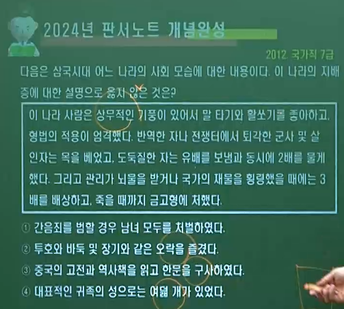

# 1. 고구려 ▪ 백제 ▪ 신라 / 통일신라 ▪ 발해  ➡ 통치체제 ▪ 사회모습

---

## ( A 삼국 초기  )

### 1️⃣ 🥇 고구려 = ⚖제가회의

### 2️⃣ 🥈 백제 = ⚖정사암 회의

### 3️⃣ 🥉 신라 = ⚖화백회의 ( 만장일치제 )

### 4️⃣ 🧙‍♂️부족적 성격 ▪ 🤴⬇왕권 미약 ▪ ✡지방행정 = 성 ▪ 촌 단위

---

## 1. ( 🧙‍♀️귀족 합의제 ▪ 🧙‍♂️수상 ▪ 🔱관등 )

- ### (🥇 고구려 ) = ⚖ 제가회의
  
  > #### 💯 감옥이 없고, 범죄자가 있으면 제가들이 모여서 논의하여 사형에 처하고 처자는 몰수하여 노비로 삼는다.
  
  #### 2️⃣🧙‍♂️수상 = 🎖국상 ▪ 대대로 ▪ 막리지
  
  #### 3️⃣🔱관등 = 10여 관등
  
  - > ##### 🅰 🧓∽형 = 연장자 ▪ 족장의 성격
    > 
    > ##### 🅱 💰∽사자 = 조세 수취 ▪ 행정적 성격
  
  ----

- ### (🥈 백제 ) = ⚖정사암(천정대) 회의
  
  > #### 💯 호암사(사비=부여)에 정사암이란 바위가 있다. 국가에서 재상을 뽑을 때 후보자 3∽4명의 이름을 써서 상자에 넣어 바위 위에 두었다.
  
  #### 2️⃣🧙‍♂️수상 = 🎖상좌평
  
  #### 3️⃣ 🔱관등 = 16관등 ( 🎖∽솔 . 🎖∽덕 )
  
  ----

- ### (🥉  신라 ) = ⚖화백 회의 (만장일치제) ▪ 🧙‍♂️의장 : 상대등
  
  > #### 💯 큰일이 있을 때는 반드시 중의를 따른다. 이를 화백회의라 부른다. 한 사람이라도 반대하면 통과하지 못하였다.
  
  #### 2️⃣ 🧙‍♂️수상 = 🎖상대등
  
  #### 3️⃣ 🔱관등 = 17관등 ( 🎖∽찬 . 🎖∽나마 ) ▪ ⚜경위제(중앙)

---

## 2. ( 🔯중앙  )

- ### (🥇 고구려 )
  
  #### 1️⃣ ⚜내평(내무) ▪ ⚜외평(외무) ▪ ⚜주부(재정)
  
  ---

- ### (🥈 백제 )
  
  #### 1️⃣ ⚜6좌평 ( 내신 ▪ 내두 ▪ 내법 ▪ 위사 ▪ 조정 ▪ 병관좌평 ) 🤴고이왕 👔<자▪비▪청> ➡ 🤴성왕 때 ⚜22부로 확대
  
  - #### 🅰⚜외관 10부 : 중앙 정무 / ⚜내관 12부 : 왕실 사무
  
  ---

- ### (🥉 신라 )
  
  #### 1️⃣ ⚜병부 ▪ ⚜위화부 ▪ ⚜집사부 등

---

## 3. ( ✡지방  ▪ 🕎군사 = 🧙‍♂️지방관 ➡ 👨‍✈️군대지휘관 )

- ### (🥇 고구려 = 5부 5부 욕살 )
  
  #### 1️⃣ 🏰수도 = ⚜5부
  
  #### 2️⃣ 🕌지방 = ⚜5부 『 🧙‍♂️ 지방관 욕살 ➡  👨‍✈️군대 지휘관 』
  
  - #### └ 유사시 👨‍✈️대모달 ▪ 말객 (중앙 무관직) 등이 군대 지휘
  
  - #### 🅰🏡 하위기관 = ⚜성 『👨‍🌾 처려근지 ,  👨‍🌾 도사 』
  
  #### 3️⃣ ☸특수지역 = ⚜3경 ( 국내성 ▪ 평양성 ▪ 한성 [황해도 재령] )
  
  #### 4️⃣ 🦸‍♂️청소년 군사 단체 = 선비
  
  --- 

- ### (🥈 백제 = 5부 5방 방령 )
  
  #### 1️⃣ 🏰수도 = ⚜5부
  
  #### 2️⃣ 🕌지방 = ⚜5방 『 🧙‍♂️지방관 방령 ➡ 👨‍✈️군대 지휘관 』
  
  - #### └ 💂‍♂️ 700 ∽ 1,200 명의 군사를 거느림.
  
  - #### 🅰  🏡 하위기관 = ⚜군 『👨‍🌾군장 』 / ⚜성 『 👨‍🌾성주 , 👨‍🌾도사 』
  
  #### 3️⃣ ☸특수지역 = ⚜22담로(🤴무령왕. 🤵왕족파견)
  
  #### 4️⃣ 🦸‍♂️청소년 군사 단체 = 수사
  
  ---

- ### ( 🥉 신라 = 6부 5주  군주 )
  
  #### 1️⃣ 🏰수도 = ⚜6부
  
  - #### └ 🔯중앙군  = 👨‍✈️서당 ( 모병에 의한 직업 군인 ) 거느림
  
  #### 2️⃣ 🕌지방 = ⚜5주 『🧙‍♂️지방관 군주 ➡ 👨‍✈️군대 지휘관 』
  
  - #### └ ✡지방군  = 주 단위로 설치한 부대인 💂‍♂️정 (6정) 거느림.
    
    #### 🅰 🏡 하위기관 = ⚜군 『👨‍🌾당주 』 / ⚜성 『👨‍🌾도사 』
  
  #### 3️⃣ ☸특수지역 =⚜2소경
  
  - #### └ [ 🚩중원경(충주) ▪ 🚩동원경(강릉) 🦹‍♂️ 사신파견 ]
    
    #### 1️⃣『🚩국원소경( 충주. 진흥왕 )  ▪ 🚩북소경( 강릉. 선덕여왕 )』 / 2️⃣ 🚩아시촌소경( 함안 추정. 지증왕 )
  
  #### 4️⃣ 🦸‍♂️청소년 군사 단체 = 화랑도

----

## ( B 삼국 후기 )

### 1️⃣ ♻행정적 성격

### 2️⃣ 🔯중앙 집권 체제 형성 ( 🤴왕권 강화📈 )

- #### 🅰 🔱관등제 정비
  
  #### 🅱 ✡지방행정 조직과 🕎군사 조직의 일원화

### 3️⃣ ✡지방 행정 = ⚜부 ▪ 방 ▪ 주 단위로 개편 / 🧙‍♀️지방관 = 👨‍✈️군대지휘관

### 4️⃣ 🥉  통일신라 ( 중앙 ▪ 지방  ▪ 군사 )

### 5️⃣ 🐲🥇  발해 ( 중앙 ▪ 지방 ▪ 군사 )

----

## 1. (🔯 중앙 )

- #### 🤴법흥왕(1) = 👨‍✈️(병부. 군사)

- #### 🤴진평왕(5) =  👨‍💻(위화부. 인사) / 👨‍🚒(승부. 육상교통) / 🤵(조부. 조세.공물) / 👨‍🏫(예부. 교육▪의례) / 🧕(영객부. 사신접대)

- #### 👸진덕여왕(3) = 👨‍⚖️(좌이방부. 형률) / 👨‍💼(창부. 재정) / 👨‍🎤(집사부. 국가기밀. 시중[중시] )

- #### 🤴무열왕(1) = 🕵️‍♂️(사정부. 백관감찰)

- #### 🤴문무왕(2) = 👩‍⚖️(우이방부. 형률) / 👨‍🏭 (선부. 선박 사무)

- #### 🤴신문왕(2) = 👨‍🔧(공장부. 수공업) / 👷‍♂️(예작부. 건축▪토목)

- ### ( 🥉 통일 신라 )
  
  #### 1️⃣ 👨‍🎤집사부 포함 14관부 ( 집사부 이하 13부 )
  
  #### 2️⃣ 🔱13개의 관부가 병렬적으로 독립
  
  #### 3️⃣ ⚜각 부의 장관은 여러 명인 경우가 많았음 ( 복수 장관제 )
  
  #### 4️⃣ 👨‍🎤집사부 장관 시중(중시) 지위 강화 ▪ 🕵️‍♂️사정부 설치 (백관 감찰)
  
  #### 5️⃣ 👨‍🔧공장부 ▪ 👷‍♂️예작부 설치 ( 🤴신문왕 ) ➡ 14부 체제 완성 💮
  
  #### 6️⃣ 🏫국학 설립 ( 🤴 신문왕. 682 )

- ### ( 🐲🥇 발해(당나라) )

- #### 1️⃣ ⚜3성 6부 ⛔ = 당의 3성 6부제 수용 / 🆔명칭과 ♻운영은 독자성 유지
  
  - #### 👨‍⚖️정당성(상서성) = 정령 제정▪왕명 집행.  장관 : 🧙‍♀️대내상 국정 총괄
    
    - #### └ 🔱6부 = 이원적 통치 체제 ▪ 유교적 명칭
      
      - #### 🅰 🛐좌사정(3) = 👨‍💻충부(이부) / 🤵인부(호부) / 👨‍🏫의부(예부)
      
      - #### 🅱 ♋우사정(3) = 👨‍✈️지부(병부) / 👩‍⚖️예부(형부) / 👷‍♂️신부(공부)
  
  - #### 👨‍🎤선조성(문하성) = 정책 심의 ▪ 왕명 반포. 장관 : 🧙‍♀️좌상
  
  - #### 👩‍⚖️중대성(중서성) = 정책 입안 ▪ 왕명 작성. 장관 : 🧙‍♀️우상
  
  #### 2️⃣🕵️‍♂️ 중정대(어사대) = 관리 감시 ▪ 감독 ▪ 감찰
  
  #### 3️⃣👨‍🎓 문적원(비서성) = 📓서적 관리
  
  #### 4️⃣👨‍🏫 주자감(국자감) = 중앙의 최고 교육 기관 (문왕)
  
  #### 5️⃣👨‍💼 사장시 = 💰재정기관 ( 재물의 보관과 무역 업무 )

----

## 2. ( ✡ 지방 )

- ### ( 🥉 통일 신라 )
  
  #### 1️⃣ ⚜9주 5소경 체제 ( 🤴신문왕 )
  
  - #### 🅰 ⚜9주 = ♻행정 기능 강화 ▪ 주의 장관으로 🧙‍♂️총관(➡ 도독) 파견 / 🆔총관(661. 문무왕1)의 명칭이 🆔도독(785. 원성왕1) 변화.
    
    #### = ⚜주 아래 🔱군 . 현을 두어 지방관 파견
    
    #### = ⛺촌은 👨‍🌾토착 세력인 촌주가 다스림
  
  - #### 🅱 ⚜5소경 = 군사 ▪ 행정상 요지 / 소경의 장관으로 🦹‍♂️사신 파견
    
    #### = 북원경(원주) ▪ 중원경(충주) ▪ 서원경(청주) / 남원경(남원) / 금관경(김해)
    
    #### = 5소경 설치 목적 ➡ 수도 경주가 지역적으로 치우쳐 있는 것을 보완 ➡ 각 지방의 균형 발전 도모
  
  #### 2️⃣ 주에 외사정 파견 (🤴문무왕) = 🕵️‍♂️지방관 감찰
  
  #### 3️⃣ 상수리 제도 = 지방 세력을 통제하기 위해 이들을 수도에 와서 거주하게 하던 제도 ➡ 고려 시대 기인 제도로 계승
  
  #### 4️⃣ 특수행정구역 = 향 ▪ 부곡 ( 소 X )
  
  
  
  ### (🐲🥇 발해 )

- #### 1️⃣ 5경 15주 62주 ( 선왕 )
  
  - #### 🅰 5경 = 상경용천부 ▪ 중경현덕부 ▪ 서경압록부 ▪ 동경용원부 ▪ 남경남해부 ➡ 전략적 요충지
  
  - #### 🅱 15부 = 지방 행정의 중심 ▪ 도독 파견
  
  - #### 🆎 62주 = 부 아래 하부 행정 단위 ▪ 자사 파견
  
  #### 2️⃣ 현 = 현승 파견
  
  #### 3️⃣ 촌락 = 수령이라 불리는 촌장(토착 세력)을 매개로 지배
  
  - #### └ 발해의 촌장(수령)은 말갈인이었을 것이라는 설과 고구려인이라는 설이 있다.

---

## 3. ( 🕎 군사 )

- ### (🥉  통일신라 )
  
  #### 1️⃣ 🔯9서당 ( 👨‍✈️중앙군 ) = 모병제 / 신라(3.녹.자.비), 고구려(1.황), 백제(2.백.청), 말갈(1.흑), 보덕국인(2.벽.적)으로 편성 ( 민족 융합 정책 )
  
  #### 2️⃣ ✡10정 ( 💂‍♂️지방군 ) = 기병군단 / 9주에 1정씩 배치, 🗾북쪽 국경 지대인 한주 ( 한산주 ) 에 2정 배치
  
  #### 3️⃣ 군진 설치 = 패강진 ( 선덕왕. 782. 황해도 ) ▪ 혈구진 ( 문성왕. 844. 강화도 )

- ### (🐲🥇  발해 )
  
  #### 1️⃣ 🔯10위 ( 중앙군 ) = 🏰왕궁과 수도 경비 ➡ 👨‍✈️대장군 ▪ 장군이 통솔
  
  #### 2️⃣ 지방 행정 조직에 따라 지방군을 편성하여 지방관이 지휘 ➡ 농병 일치의 군대 ▪ 행정과 군사 조직의 일원화
  
  #### 3️⃣ 국경 요충지에는 따로 독립된 부대를 두어 방어

----

## ( C 👨‍👨‍👧‍👧삼국의 사회 )

### 1️⃣ 삼국 시대 이전 ( 부여 ▪ 초기 고구려 ▪ 삼한 )

- #### 🅰 🧙‍♂️지배 계층 ( ⚔전쟁 참여 권리 O )
  
  - #### 🧙‍♂️(대)가(加) = 부족장 세력 ▪ 호민을 통해 읍락 지배
  
  - #### 👨‍💼호민 = 경제적으로 부유한 계층 ex) 고구려 호민 = 좌식자(전사 집단)
  
  #### 🅱 피지배 계층 ( 전쟁 참여 권리 X )
  
  - #### 👨‍🌾하호 = 농업에 종사하는 평민 ex) 부여의 하호 : 전쟁 시 식량 공급
  
  - #### 🧟‍♂️노비 = 주인에게 예속되어 생활하는 천민층

### 2️⃣ 삼국 시대 ( 전쟁 노비가 많았음 )

- #### 🅰 🧙‍♂️귀족 = 왕족 ▪ 옛 부족장 세력 ( 중앙 귀족으로 재편성 )
  
  #### 🅱 👨‍🌾평민 = 대부분 농민으로서 자유민 ▪ 조세 납부 ▪ 노동력 징발 대상
  
  #### 🆎 🧟‍♂️천민(노비) = 전쟁 노비 ▪ 부채 노비 ➡ 연좌제 적용

---

### (🥇 고구려 )

- #### 1️⃣ 🤠씩씩한 기풍 ( 상무적 기풍 )
  
  #### 2️⃣ 🧙‍♂️지배층 = 왕족 고씨를 비롯한 5부 출신의 귀족들
  
  - #### 🤴계루부(왕족) / 👸절노부(연나부.왕비족) / 소노부(연노부) / 관노부 / 소노부
  
  #### 3️⃣ ⚖법률
  
  - #### 🅰 👨‍🎤반역자 = 🔥화형에 처한 후 다시 목을 베었고, 그 가족을 🧟‍♂️노비로 삼음.
    
    #### 🅱 🏳적에게 항복 ▪ ❌전쟁 패배자 = ⛔사형
    
    #### 🆎 🐱‍👤도둑질한 자 = 12배 배상 ( 1책 12법 )
  
  #### 4️⃣ 혼인
  
  - #### 🅰 🧙‍♂️지배층 = 👨‍❤️‍💋‍👨형사취수제 ( 전쟁 미망인 보호 , 남편 집안 재산 보호 ) ▪ 서옥제
    
    > ##### 고국천왕 사후 왕후 우씨가 고국천왕의 동생인 연우(산상왕)과 결혼
    
    #### 🅱 👨‍🌾평민층 = 💑자유연애 결혼 ▪ 남자 집에서 돼지고기와 술을 보낼 뿐 다른 예물은 주지 않았음
    
    > ##### 신부집에서 재물을 받으면 딸을 팔았다고 여겨 부끄럽게 생각함.
  
  #### 5️⃣ ♻진대법(고국천왕. 을파소) = 🌼춘대🍂추납 ▪ 빈농구제 ▪ 국가 💰재정 및 👨‍✈️국방력 유지 ▪ 🤵귀족 세력 성장 억제📉 ➡ 👑왕권 강화📈

### (🥈 백제 )

- #### 1️⃣ 🤠상무적 기풍 ( 말타기 ▪ 활쏘기를 즐김 )
  
  #### 2️⃣ 👨‍👨‍👧‍👧언어 ▪ 풍속 ▪ 의복은 고구려와 큰 차이가 없었음.
  
  #### 3️⃣ 🧙‍♂️지배층 = 왕족 부여씨와 🤵8성의 귀족
  
  - #### 진 ▪ 해 ▪ 사 ▪ 연 ▪ 협 ▪ 국 ▪ 백 ▪ 목씨 ➡ 진씨 해씨가 👸왕비족
  
  - #### 📓중국 고전 및 역사책을 즐겨 읽음 ▪ 🈸능숙한 한문 구사 ▪ 🕌관청 실무에도 밝음
  
  - #### 고구려와 마찬가지로 🏋️‍♂️🤸‍♀️🤾‍♂️투호와 바둑 ▪ 장기 등의 오락을 즐김
  
  #### 4️⃣ 법률
  
  - #### 🅰 👨‍🎤반역 ▪ 🏳전쟁에서 퇴각 ▪ 👿살인자 = ⛔사형 (목을 벰)
    
    #### 🅱 🐱‍👤도둑질한 자 = 🥈2배 배상 동시에 귀양 보냄
    
    #### 🆎 🐱‍👤뇌물 ▪ 국가 재물 횡령 = 🥉3배를 배상하고 죽을때까지 ⚰금고형
    
    #### 🅾 👩‍🦰간음한 여자 = 남편 집의 🧟‍♂️노비로 삼음
  
  #### 5️⃣ 🖼양직공도 백제 사신도 ( 6C . 양나라 ) 기록 내용
  
  - #### 백제는 마한에서 시작된 나라
  
  - #### 백제는 요서지방 차지 ▪ 고구려와 말씨 및 옷차림 유사
  
  - #### 무령왕(여륭)의 고구려 격파 ▪ ☸22담로 설치
  
  

### (🥉 신라 )

- #### 1️⃣ 화백회의
  
  - #### 🅰 씨족 사회의 전통
    
    #### 🅱 만장일치의 귀족 합의제 = 집단 간 부정 방지와 결속 강화
    
    #### 🆎 귀족의 단결과 왕권 견제 = 국왕과 귀족 간의 권력 조절
  
  #### 2️⃣ 화랑도(미륵 신앙) = 원시 사회의 청소년 집단에서 기원 ▪ 씨족 사회의 전통
  
  - #### 🅰 화랑 ( 귀족 자제 중에서 선발 ) + 낭도 ( 귀족은 물론 평민까지 포함 ) ➡ 계층 간 대립과 갈등 조절 ▪ 완화
    
    #### 🅱 교육적 기능 ( 지 ▪ 덕 ▪ 체 연마 )
    
    #### 🆎 진흥왕 때 국가적 조직으로 개편
    
    #### 🅾 진평왕 때 원광 법사(걸사표)가 세속 5계를 남겨 행동 규범 제시 = 사군이충 ▪ 사친이효 ▪ 교우이신 ▪ 임전무퇴 ▪ 살생유택
    
    #### 🆑 임신서기석 ( 화랑의 충성 다짐 ) = 지금부터 3년 이후까지 충도를 지키고 잘못이 없기를 맹세한다 . 진흥왕 or 진평왕
  
  #### 3️⃣ 중위제(특진 제도) = 골품제 보완
  
  - #### 🅰 비진골 관료층의 불만 해소 목적
    
    #### 🅱 6관등(아찬) 內 4등급 , 10관등 (대나마) 內 9등급 , 11관등(나마) 內 7등급으로 세분화
    
    
  
  #### 4️⃣ 골품 제도의 특징 = 중앙집권화 과정에서 성립된 신분제
  
  - #### 🅰 왕경 ▪ 소경의 귀족들을 대상으로 함. ( 지방민에 대한 규정 X )
    
    #### 🅱 엄격한 신분제도 = 개인의 사회 ▪ 정치 활동 범위 + 일상생활까지 규제 ( 가옥 ▪ 규모 ▪ 장식물 ▪ 복색이나 수레 )
    
    #### 🆎 진골 = 모든 관등에 임명 가능 ▪ 1(이벌찬)∽5(대아찬)관등 독점 ▪ 자색 공복 독점
    
    #### 🅾 6두품 ( 득난. 대족장 출신 ) ➡ ex) 설계두
    
    - #### 1️⃣ 6관등(아찬) 까지 승진 가능 ( 대아찬 X )
      
      #### 2️⃣ 중앙 ▪ 지방 장관직에는 오르지 못함
      
      #### 3️⃣ 시랑 ▪ 경과 같은 차관직까지만 차지 가능
    
    #### 🆑 관등( 골품 X )에 따라  ➡ 복색 결정 / 6(아찬)∽9(급벌찬) 비색 공복 / 10(대나마)∽11(나마) 청색 공복 / 12(대사)∽17(조위) 황색 공복 ❓ < 진골은 모든 관등에 임명 가능 하기 때문에 >
    
    #### 🚼 관등 승진의 상한선 ➡ 골품에 따라 제한
    
    #### 🈴 통일 이후 3두품에서 1두품 ➡ 평민화

----

## ( E 남북국의 사회 = 통일신라 ▪ 발해 )

### 1️⃣ 통일 신라 = 통일 후 민족 통합 노력

- #### 🅰 삼국 통일의 의의
  
  > ##### 삼국이 지니고 있던 혈연적 동질성과 문화적 공통성을 바탕으로 하여 우리 민족 문화가 발전하는 계기가 됨.
  
  #### 🅱 유민 포용 정책
  
  > ##### 통일 전쟁 과정에서 백제와 고구려의 옛 지배층에게 신라 관등을 주어 포용 , 통일 후 백제와 고구려 유민을 9서당에 편성
  
  #### 🆎 일통삼한 의식의 형성
  
  > ##### 신라의 지배층은 삼한(삼국)이 하나가 되었다는 자부심을 가지게 됨.

### 2️⃣ 신라 중대와 하대 비교

- #### 🅰 신라 중대
  
  - #### 1️⃣ 왕권 및 집사부 시중 📈 / 상대등 📉
    
    #### 2️⃣ 진골 귀족 = 중앙 관청의 장관직 독점
    
    #### 3️⃣ 6두품 = 국왕을 보좌하며 정치적 진출 활발 ➡ 집사부 시랑직 진출 ( 국왕의 정치적 조언자 ▪ 행정 실무 담당 )
    
    #### 4️⃣ 골품제 변화 = 하급 신분층에서부터 구분이 점차 희미해 짐 ➡ 3∽1두품은 평민과 동등하게 간주
  
  #### 🅱 신라 하대 ( 신라 말, 8세기 후반 이후 )
  
  - #### 1️⃣ 귀족들의 정권 다툼과 대토지 소유 확대 ➡ 국가 재정 악화.강압적 조세징수 ➡ 자영농 몰락 ( 소작농.초적.화전민.노비로 전락 ) ➡ 원종▪애노의 난을 시작으로 전국적 봉기
    
    - ##### 🅰 상대 - 선덕여왕 = 비담 ▪ 염종의 난 ( 647 )
    
    - ##### 🅱 중대 - 신문왕 = 김흠돌의 난 ( 681 )
      
      ##### └ 혜공왕 = 대공▪ 대렴의 난 ( 768 ) / 96각간의 난 ( 768 ) / 김지정의 난 ( 780 )
    
    - ##### 🆎 하대 - 헌덕왕 = 김헌창의 난 ( 822 ) / 김범문의 난 ( 825 )
      
      ##### └ 문성왕 = 장보고의 난 ( 846 )
      
      ##### └ 진성여왕 = 원종▪애노의 난 ( 889 ) / 적고적의 난 ( 896 )
    
    #### 2️⃣ 지방 호족의 등장 = 농장(경제) + 사병(군사) + 선종 및 풍수지리(사상) 반(反) 독립적 지방 세력
    
    #### 3️⃣ 6두품 = 반(反) 신라적 경향 ➡ 호족 세력과 결탁
    
    #### 4️⃣ 신라 하대의 대표적 인물 = 장보고 , 최치원 ▪ 최승우 ▪ 최언위 ( 6두품 . 빈공과 합격 )

### 3️⃣ 통일신라의 생활

- #### 🅰 도시의 발달
  
  - #### 경주(금성) = 정치와 문화의 중심지 , 귀족들이 모여 살고 국제 무역품이 모여드는 대도시
  
  - #### 5소경 = 지방의 문화 중심지 ➡ 옛 백제,고구려,가야의 일부 지배층은 물론 신라의 수도에서 이주한 귀족들 거주
  
  #### 🅱 귀족의 생활
  
  - #### 주거생활 = 금입택(호화주택) ▪ 사절유택(계절에 따라 즐기는 진골 귀족들의 별장 ) / 안압지(저수) . 임해전(별궁) / 신당서(섬). 가축을 활로 잡아 먹음.
  
  - #### 수입원 = 지방에 소유한 대토지와 목장 등에서 나오는 수입 / 서민 상대로 고리대업
  
  - #### 사치품 선호 = 국제 무역을 통하여 들어온 진기한 사치품 선호 ➡ 흥덕왕의 사치 금지령 ➡ 장보고 " 청해진 " 엔닌
  
  #### 🆎 평민의 생활
  
  - #### 자신의 토지를 경작하며 근근이 생활
  
  - #### 가난한 농민들은 귀족의 토지를 빌려 생계 유지
  
  - #### 귀족에게 진 빚을 갚지 못하여 노비로 전락하는 경우 多

### 4️⃣ 발해

- #### 🅰 지배층 = 왕족인 대씨와 고씨 등 고구려계 + 일부 말갈족
  
  #### 🅱 피지배층 = 발해의 주민 중 다수가 말갈인 ▪ 고구려 전성기 때부터 고구려에 편입된 종족 ▪ 이들 중 일부는 지배층이 되거나 촌락의 우두머리가 되어 국가 행정 보조
  
  #### 🆎 사회모습 = 당의 제도와 문화 수용 ▪ 고구려와 말갈 사회의 전통적 생활 모습 유지 / 타구와 격구 놀이 유행 ( 당을 통해 전래, 발해 사신 왕문구 일행은 889년에 일본에 가서 격구를 하였음 )
  
  #### 🅾 지식인 = 당에 유학(도당 유학) 하여 빈공과 응시 ➡ 신라인과 수석 다툼 ( 등제서열 사건 )
  
  #### 🆑 여성의 지위가 비교적 높은 편 ➡ 여사라는 여성 교사의 개인 지도를 받기도 하였음. 일부일처제 확립 ▪ 부부 합장묘가 많음.

----

## ( D 수취제도. 토지. 경제. )

### 1️⃣ ☘삼국

- #### 🅰 농업 중심의 경제 생활 ➡ 토지에 대한 관심 📈 ➡ 왕토사상( 모든 국토는 왕토. 관념적 )
  
  #### 🅱 민생 안정책
  
  - #### 구휼 정책 = 고구려의 진대법(2C 고국천왕. 을파소. 춘대추납. 왕권 강화 및 국가 재정 확보 목적)
  
  - #### 농업 진흥책 = 철제 농기구 보급 ▪ 우경 장려 ▪ 황무지 개간 권장(경작지 확대) ▪ 저수지 축조 ▪ 수리
  
  #### 🆎 토지 측량 단위
  
  - ##### 고구려 : 경무법 ( 밭이랑 기준 )
  
  - ##### 백제 : 두락제 ( 파종량 기준 )
  
  - ##### 신라 : 결부법 ( 수확량 기준 )

### 2️⃣ 🥉통일신라

- ### 🅰 토지 제도의 변천
  
  - #### 신문왕 7년 ( 687 ) = 문무 관료전을 지급하되, 차등을 두었다.
  
  - #### 신문왕 9년 ( 689 ) = 내외관의 녹읍을 혁파하고 매년 조를 내리되, 차등이 있게 하여 이로써 영원한 법식을 삼았다.
  
  - #### 성덕왕 21년 ( 722 ) = 처음으로 백성에게 정전을 지급하였다.
  
  - #### 경덕왕 16년 ( 757 ) = 여러 내외관의 월봉을 없애고, 다시 녹읍을 나누어 주었다. ( 녹읍 부활 )
  
  - #### 소성왕 원년 ( 799 ) = 청주 거노현(현 거제)으로 국학생의 녹읍을 삼았다. ( 국학의 학생에게도 녹읍 지급 )
  
  
  
  ### 🅱 민정 문서 ( = 촌락문서, 신라장적, 정창원 문서 )
  
  - #### 발견 장소 = 1933년 『일본 동대사(도다이사) 정창원(쇼소인)』 발견
  
  - #### 조사 지역 = 5소경 중 하나인 서원경(청주) 주변의 『4개 촌락』 ( 사해점촌, 살하지촌 등)
  
  - #### 작성 목적 = 조세 수취 및 노동력 징발의 자료 ➡ 국가 재정 확보 목적
  
  - #### 작성 방식 = 촌주가 매년 변동 사항을 조사하여 두었다가, 『3년마다』 작성
  
  - #### 조사 대상 = 호구 ▪ 인구 ▪ 토지 ▪ 기타
    
    #### 🅰 호구 = 호(戶)는 인정(人丁)의 다과(사람의 많고 적음)에 따라 『9등급』으로 나누어 조사
    
    #### 🅱 인구 = 연령별 ▪ 성별에 따라 『6등급』으로 분류하여 조사
    
    #### 🆎 토지
    
    - #### 내시령답 ( 일종의 관료전 )
    
    - #### 관모답 ( 관청 경비 충당 )
    
    - #### 촌주위답 ( 촌주에게 지급 )
    
    - #### 마전 ( 마[麻] 공동 경작 )
    
    - #### 연수유답 ( 농민들에게 지급된 정전으로 추정, 민전 ) = 민정 문서에 기록된 총 토지 면적의 90⁒ 이상 차지
    
    
  
  ### 🆎 민정 문서 심화
  
  - #### 신라 효소왕 4년 ( 695 ) or 경덕왕 14년 ( 755 ) or 헌덕왕 7년 ( 815 )에 작성된 것으로 추정
  
  - #### 노비도 조사 대상 ( 약 5⁒ ) = 지역 경제에 차지하는 비중 크지 않음
  
  - #### 인구의 증감 ( 변동내용 ) 기록 ⭕
  
  - #### 토지의 종류와 면적 기록 / But 면적의 증감 ❌
  
  - #### 중하연 이하의 호들이 보임
  
  - #### 내시령답 ▪ 관모답 등 공동 경작 ( 소작 ❌ )

### 3️⃣ 🐲🥇발해

- #### 밭농사 중심 > 논농사 일부 지역

- #### 솔빈부의 말, 발해 삼채
  
  > ##### 귀하게 여기는 것에는 태백산의 토끼, 남해부의 곤포(다시마), 책성부의 된장, 부여부의 사슴, 막힐부의 돼지, 솔빈부의 말, 현주의 포(베), 옥주의 면(누에솜), 용주의 주(명주), 위성의 철, 노성의 쌀, 미타호의 붕어가 있고 과일에는 환도의 오얏(자두), 낙유의 배가 있다. 『신당서』

- #### 발해관 ( 산둥반도에 위치 )

- #### 여성의 지위 ⬆ ( 여장군 홍라녀, 의자매 )
  
  -----

### 1. ( 💰수취제도 )

- #### ( ☘삼국 )
  
  #### 1️⃣ 조세 = 재산의 정도에 따라 호(3등급)를 나누어 곡물과 포 차등 징수 / 토지 생산성이 높지 않아 토지보다 노동력 중시 ( 인두세 중심 )
  
  #### 2️⃣ 공납 = 지역 특산물(현물) 징수
  
  #### 3️⃣ 역 = 왕궁 ▪ 성 ▪ 저수지 등을 축조 시 15세 이상의 남자 동원

- ### ( 🥉통일신라 )
  
  #### 1️⃣ 조세 = 생산량의 ⅒ 수취 ( 통일 이전보다 완화 )
  
  #### 2️⃣ 공납 = 촌락 단위로 그 지역의 특산물 수취
  
  #### 3️⃣ 역 = 16 ∽ 60세 남자 대상 ➡ 군역과 요역 부과

- ### ( 🐲🥇발해 )
  
  #### 1️⃣ 조세 = 조 ▪ 보리 ▪ 콩 등 곡물 수취
  
  #### 2️⃣ 공물 = 베 ▪ 명주 ▪ 가죽 등의 특산물 수취
  
  #### 3️⃣ 부역 = 궁궐 ▪ 관청 등의 건축 시 농민 동원

### 2. ( 👨‍👨‍👧‍👧경제 생활 )

- #### ( ☘삼국 )
  
  #### 1️⃣ 귀족(풍족한 생활) = 본인 소유 토지 및 노비, 고리대 이용 농민 토지 강탈 ▪ 국가에서 지급한 녹읍(관료 귀족) 식읍(왕족 및 공신) ➡ 수조권 + 노동력 징발권
  
  #### 2️⃣ 농민(궁핍한 생활) = 자작 or 소작 , 척박한 토지(시비법 미발달 ➡ 휴경지多), 4∽5세기 철제 농기구 보급 ➡ 6C 널리 사용 ( 우경의 확대 )

- #### ( 🥉통일신라 )
  
  #### 1️⃣ 귀족 = 식읍 및 녹읍을 통한 농민 지배, 당과 아라비아에서 수입한 사치품 사용, 토지▪노비▪목장▪금입택▪사절유택 소유
  
  #### 2️⃣ 농민 = 척박한 토지 소유 ( 시비법 미발달 ), 무거운 세금 부담(전세, 공물, 역 등), 과중한 지대 부담 ( 수확량의 절반 이상 )
  
  #### 3️⃣ 향 ▪ 부곡민 = 농민보다 더 많은 공물 부담 ➡ 일반 농민보다 형편이 어려움
  
  #### 4️⃣ 노비 = 왕실, 관청, 귀족, 절 등에 소속, 주인의 필수품 제작 및 일용 잡무 담당, 주인 대신 농장 관리 및 주인의 땅 경작

### 3. ( 🚢 대외 무역 )

- #### ( ☘삼국 )
  
  #### 1️⃣ 특징 = 4C 이후 낙랑을 축출하면서 크게 발달, 공무역 형태
  
  #### 2️⃣ 고구려 = 주로 남북조 및 유목민인 북방 민족과 무역
  
  #### 3️⃣ 백제 = 중국 남조 ( 양나라 ) 및 왜와 무역
  
  #### 4️⃣ 신라
  
  - #### 한강 유역 진출 이전 = 고구려와 백제를 통해 중국과 무역
  
  - #### 한강 유역 진출(진흥왕) 이후 = 당항성을 통하여 중국과 직접 교역

- ### ( 🥉통일신라 )
  
  #### 1️⃣ 주요 국제 무역항 = 울산 ▪ 당항성 ▪ 영암
  
  #### 2️⃣ 최대 무역항 = 울산항 ( 이슬람 상인까지 왕래 )
  
  #### 3️⃣ 대당 무역
  
  - #### 🅰 8C 이후 당과의 관계 개선 ➡ 무역 번성 (공무역과 사무역 발달)
    
    #### 🅱 무역로 1 = 전남 영암 ➡ 상하이
    
    #### 🆎 무역로 2 = 경기도 남양만(당항성) ➡ 산둥반도
    
    #### 🅾 신라인의 대당 진출 = 산둥반도와 양쯔강 하류에 신라방 ▪ 신라촌 ( 신라인의 거주지 ) / 신라소(자치기관) ▪ 신라관(여관) ▪ 신라원(절) 설치
  
  #### 4️⃣ 대일 무역 = 처음에는 교류 제한으로 무역 성행 못함 ➡ 8C 이후 활발
  
  #### 5️⃣ 장보고의 활동 = 당에 건너가 무령군 소장으로 활동하다가 귀국
  
  - #### 🅰 완도에 청해진 설치 ( 828. 흥덕왕 3 ) ➡ 남해안 황해의 해상 무역권 장악. 흥덕왕 사치 금지령
    
    #### 🅱 당 ▪ 신라 ▪ 일본을 잇는 국제 무역 주도
    
    - ##### 교관선(무역선) / 견당매물사(당에 파견한 무역 사절) / 회역사(일본에 파견한 무역 사절)
    
    #### 🆎 산둥 반도 적산촌에 법화원 건립 = 일본 승려 엔닌의 『입당구법순례행기』에 기록
    
    #### 🅾 신무왕(신라 45대 왕. 839) 즉위에 공을 세움
    
    #### 🆑 장보고의 난 ( 846. 문성왕 8 ) = 딸을 문성왕과 혼인시키려 하앴으나 실패 ➡ 귀족들에 의해 제거

- ### ( 🐲🥇발해 )
  
  #### 1️⃣ 대당 무역 발달
  
  - #### 🅰 영주도(육로) ▪ 조공도(해로) 이용, 무역 비중 가장 큼
    
    #### 🅱 발해관(발해의 사신들이 머물던 여관) 설치 = 당나라가 산둥 반도 덩저우에 설치
  
  #### 2️⃣ 대일 무역 발달 = 한번에 수백 명이 오갈 정도로 활발 ➡ 일본도 이용
  
  #### 3️⃣ 신라와의 무역 = 신라도를 이용하여 교류 ( 상경 ➡ 동경 ➡ 남경 ➡ 동해안을 따라서 신라로 )
  
  #### 4️⃣ 수출품 = 모피 ▪ 인삼 등 토산물 / 불상, 자기 등
  
  #### 5️⃣ 수입품 = 비단 , 책 (귀족 수요품)
  
  #### 

### 4. ( 👨‍🔧수공업 ▪ 🧔상업 )

- #### ( ☘삼국 )
  
  #### 1️⃣ 수공업 = 관청(관영) 수공업 . 기술 우수한 노비와 장인 이용 ➡ 국가 수요품 생산
  
  #### 2️⃣ 상업 = 농업 생산력이 낮아 수도 같은 도시에만 시장 형성
  
  - #### 신라의 시장
    
    - #### 🅰 5C 말 경주에 시장 개설 ( 소지 마립간 )
      
      #### 🅱 6C 초 동시 및 동시전(시장 감독 관청) 설치 ( 지증왕 )

- #### (🥉통일신라 )
  
  #### 1️⃣ 성장 배경 = 통일 후 경제력 성장 📈 ➡ 농업 생산력 ⬆ ➡ 경주의 인구 및 상품 생산 증가
  
  #### 2️⃣ 수공업 = 관청 정비(관영 수공업) . 장인과 노비 이용 물품 제작
  
  - #### 어아주, 조하주 등 고급 비단을 생산하여 당나라에 보냄.
  
  #### 3️⃣ 상업 = 시장의 증가 . 지방 중심지 및 교통의 요지에 시장 개설 (물물교환 형태 )
  
  - #### 🅰 서시와 남시 설치 ( 효소왕 )

- #### ( 🐲🥇발해 )
  
  #### 1️⃣ 농업 = 밭농사 중심(조.보리.콩) / 일부 지역에서 벼농사. 기후 조건의 한계 . 철제 농기구 사용, 수리 시설 확충
  
  #### 2️⃣ 목축 발달 = 돼지, 말, 소 등 사육 ( 특히 솔빈부의 말은 주요한 수출품)
  
  #### 3️⃣ 수렵 활발 = 담비 모피, 녹용, 사향 생산 ▪ 수출
  
  #### 4️⃣ 상업 = 수도 상경 및 도시와 교통 요충지에서 발달
  
  #### 5️⃣ 기타 = 어업, 수공업(철▪구리▪금▪은 등 금속 가공업, 도자기업, 직물업) . 발해 삼채 = 당삼채의 영향을 받은 발해의 독자적 도자기

---