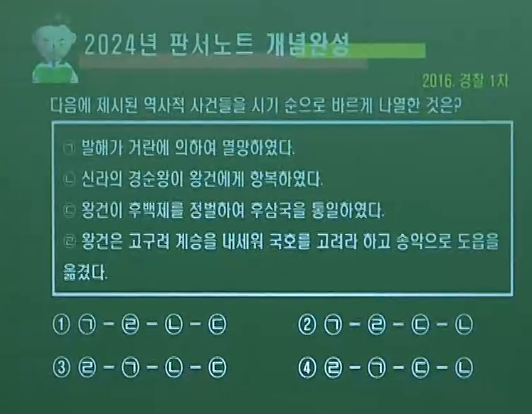
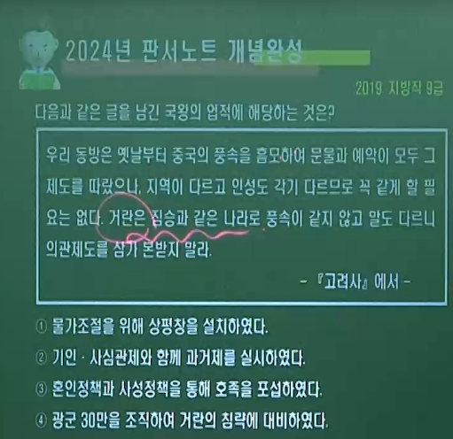
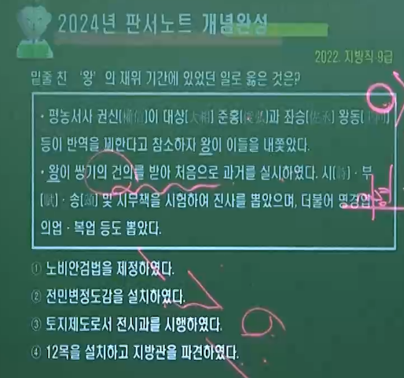
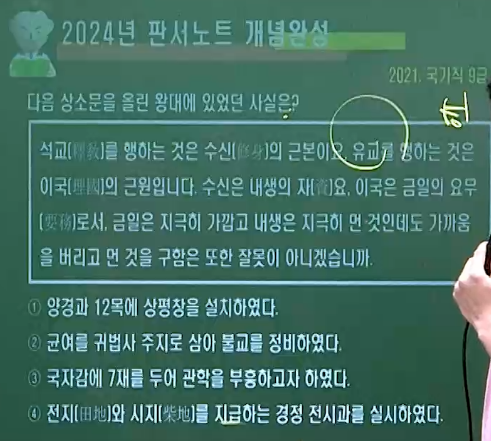
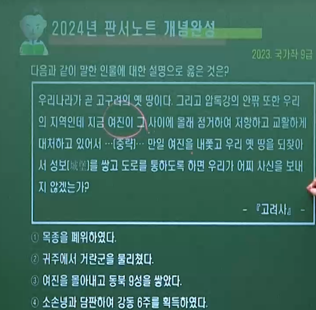
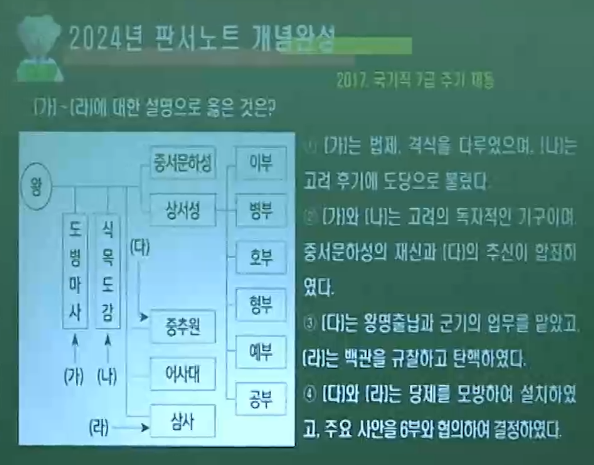
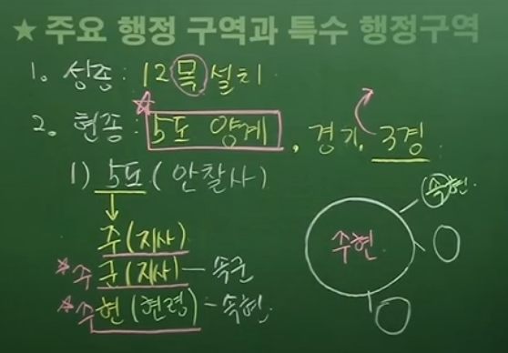
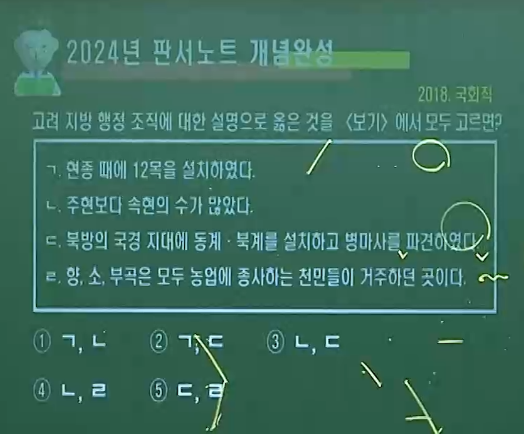

# 1. 후삼국의 성립과 통일 과정∽ 고려초기 왕의 업적과 정치제도, 거란의 1∽3차 침입

---

## ( A 후백제 ▪ 후고구려 ▪ 고려 ▪ 발해멸망 ▪ 신라 항복 ➡ 후삼국 통일 )

---

### 1️⃣👨‍🚒🥈후백제 건국 (900) 견훤 ( 상주 호족 아지개의 아들 )

- #### 🅰 무진주 봉기 ( 892 ) ➡ 전라도 지방의 군사력과 호족 세력을 토대로 완산주(전주)에 도읍을 정하고 후백제 건국 ( 900 )
  
  #### 🅱 세력 범위 = 차령산맥 이남의 충청도와 전라도 지역 차지 ( 우세한 경제력을 토대로 군사적 우위 확보 )
  
  #### 🆎 외교관계 = 중국의 후당 ▪ 오월, 일본 등과 외교 관계를 맺는 등 국제적 감각을 갖춤
  
  #### 🅾 한계 = 신라에 적대적(신라를 공격하여 경애왕을 죽임.) 지나친 조세 수취, 호족 포섭 실패
  
  > ##### 견훤은 상주 가은현 사람이다. 본래 성은 이씨였는데 나중에 견으로 성씨를 삼았다. 아버지 이자개는 농사를 지으며 생활하다가 뒤에 집안을 일으켜 장군이 되었다. 처음에 견훤이 태어나 젖먹이로 강보에 싸여 있을 때 아버지가 들에서 밭을 갈면 어머니가 밥을 나르느라 아이를 숲속에 두었더니, 호랑이가 와서 젖을 먹였다. 『삼국사기』

### 2️⃣ 🦹‍♂️🥇후고구려  건국 (901) 궁예 ( 신라 왕족의 후예 )

1. #### 🅰 권력 투쟁에서 밀려남. 신라에 적대적 ( ex. 부석사에 걸려 있는 신라 왕의 초상에 칼부림 ) ➡ 북원(원주) 지방의 초적 양길의 휘하에서 세력을 키움. / 기훤의 부하 ( 891 ) ➡ 양길의 부하 ( 892 )
   
   #### 🅱 세력 확장 = 강원도 ▪ 경기도 ▪ 황해도까지 세력 확장 ➡ 송악에 도읍을 정하고 후고구려 건국 ( 901 ) ➡ 🎖 마진(904) ➡ 🎖 태봉 (911)
   
   - #### ⛳금성(나주) 점령 ( 903 ) = 궁예의 신하 왕건이 후백제 세력권 내의 금성을 공략하여 점령
   
   #### 🆎 🚩천도 = 송악 ➡ 🚩철원 ( 905 )
   
   - #### 연호 = 무태 ( 904 ) ➡ 성책 ( 905 ) ➡ 수덕만세 ( 911 ) ➡ 정개 ( 914 )
   
   #### 🅾 체제정비
   
   - #### 광평성 (국정 총괄) 장관 : 광치내
   
   - #### 내봉성 설치 ( 내무 ▪ 백관의 서무담당)
   
   - #### 9관등제 실시
   
   #### 🆑 한계 = 지나친 조세 수취 , 전제 정치 ( 미륵 신앙 이용 )
   
   > ##### 궁예는 신라 사람으로, 성은 김씨이고 아버지는 47대 헌안왕 의정이며, 어머니는 헌안황의 후궁이었다. 머리를 깎고 승려가 되어 스스로 선종이라 이름하였다. 선종이 왕이라 자칭하고 사람들에게 이르기를 이전에 신라가 당나라에 군사를 청하여 고구려를 격파하였기 때문에 옛 서울 평양은 오래 되어서 풀만 무성하게 되었으니, 내가 반드시 그 원술르 갚겠다. 라고 하였다. 『삼국사기』

### 3️⃣ 🦅🏆고려 건국 (918 고구려 계승을 내세워 국호를 고려로 함. )

- #### 🅰 왕건이 궁예를 축출하고 고려 건국 ( 918 ) ➡ 송악 천도 ( 919 )
  
  #### 🅱 정책 = 신라에 대해 적극적인 우호 정책, 후백제와 대립, 중국 5대의 여러 나라와 외교 관계를 맺음.
  
  - ##### 중국의 정세 : 907년 당 멸망 후 5대 10국의 혼란기 ( 5호 16국 X )

#### ☑ 견훤이 신라의 대야성을 공격하여 함락함 ( 920 )

### 4️⃣ 🐲🥇발해 멸망 (926)

- #### 🅰 거란의 침략으로 멸망
  
  #### 🅱 발해 왕자 대광현 고려 망명 ( 934 ) ➡ 태조의 우대, 동족의식을 분명히 함. ( 대광현에게 왕씨 성(왕계)과 관직 하사 )

### 5️⃣ ⚔공산(대구) 전투 (927)

- #### 🅰 견훤의 신라 공격(경애왕 살해) ➡ 신라 고려에게 도움 요청
  
  #### 🅱 고려 🆚 후백제 ➡ 고려 신숭겸 ▪ 김락 등 전사 ➡ 후백제 승리

### 6️⃣ ⚔고창(안동) 전투 (930) = 고려 🆚 후백제 ➡ 고려 승리

### 7️⃣ 🏳견훤의 고려 투항 (935. 6) = 양주를 식읍으로 지급

- #### 🅰 견훤의 첫째 아들인 신검의 반란으로 신검과 금강 간의 정권 다툼
  
  #### 🅱 견훤 금산사 유폐 ➡ 탈출하여 고려 투항

### 8️⃣ 🏳🥉통일신라 항복 (935. 12) = 경주를 식읍으로 지급

- #### 🅰 신라의 마지막 왕 경순왕(김부)이 고려에 항복 ( 고려는 전쟁없이 신라를 통합 )

### 9️⃣ ⚔선산 일리천 전투 ( 936 ) = 고려 🆚 후백제(신검) ➡ 고려 승리

### ☑🏳‍🌈고려 후삼국 통일  (936)

----

## ( B  🦅🏆  고려 초기 왕들의 업적 = 호족 연계 )

----

### 1️⃣ 💯태조 (연호 🎖천수. 918 ∽ 934 )

- #### 🅰 철원에서 송악으로 천도 ( 919 ), 중국 5대 여러 나라와 외교 관계
  
  #### 🅱 태봉의 관제를 중심으로 신라와 중국의 제도를 참고하여 정치 제도 마련
  
  #### 🆎 개국 공신과 지방의 호족들을 관리로 등용

### 2️⃣ 혜종 943 ∽ 945

- #### 🅰 왕규의 난 발생 ( 945 ) = 태조 사후 왕권의 불안 ( 태조 혼인 정책 부작용 )
  
  #### └ 경기도 광주 호족 출신 왕규의 난 발생 ➡ 왕요(정종)와 결탁한 왕식렴의 개입으로 실패 ❌

### 3️⃣ 정종 945 ∽ 949

- #### 🅰 서경 천도 시도 실패 ❌
  
  #### 🅱 광학보 설치 ( 946. 승려들의 면학을 위한 장학재단 )
  
  #### 🆎 광군 조직 및 광군사 설치 ( 947. 거란 침입 대비 )

### 4️⃣ 💯광종 (왕소. 🎖광덕.준풍 ) 949 ∽ 975

- #### 🅰 칭제건원 = 황제를 칭하고, 🎖광덕 ▪ 🎖준풍 등 독자적 연호 사용
  
  #### └ 🚩개경을 『황도』 로, 🚩서경을 『서도』로 칭함.
  
  #### 🅱 👔백관의 공복 제정 = 4색 공복제 ( 자색. 단색. 비색. 녹색. )
  
  #### └ 지배층의 위계질서 확립 목적

### 5️⃣ 경종 975 ∽ 981

- #### 🅰 반동 정치 = 광종 때의 개혁 세력 제거 ( 복수법 = 보복법 ) 실행
  
  #### 🅱 시정 전시과 제정 ( 976 ) = 공복 제도와 역분전 제도를 토대로 전시과 제도 『처음』 실시
  
  #### 🆎 훈전 지급 ( 977 ) = 개국 공신과 통일 전쟁 중 태조에게 투항한 후삼국 성주들에게 포상으로 지급 ( 최고 50결에서 최하 20결 지급 )

---

### ( 🦅🏆  💯 태조 왕건. 연호🎖천수. 918 ∽ 934 )

- #### 1️⃣ 민생 안정
  
  - #### 🅰 취민유도 ( 수취체제 개편. 세율을 ⅒로 낮춤)
    
    #### 🅱 흑창 설치 ( 고구려의 진대법 계승. 성종 때 의창으로 개편)

- #### 2️⃣ 호족 통합 ▪ 견제책
  
  - #### 🅰 혼인정책 (정략 결혼) ▪ 사성정책(왕씨성 하사)
    
    #### 🅱 기인 제도 ➡ 지방 호족(향리) 자제를 인질로 삼음.
    
    #### └ 통일신라의 상수리 제도 계승
    
    > ##### 💯 건국 초에 향리의 자제를 뽑아 서울(개경)에 볼모로 삼고, 또 출신지의 일에 대한 자문에 대비하게 하였는데, 이를 『기인』 이라 한다. - 고려사
    
    #### 🆎 사심관 제도 = 1호 사심관 김부(경순왕)
    
    > ##### 💯 태조 18년 신라왕 김부(경순왕)가 항복해 오니, 신라국을 없애고 경주라 하였다. 김부로 하여금 경주의 사심이 되어 부호장 이하의 임명을 맡게 하였다. 이에 여러 공신이 이를 본받아 각기 자기 출신 지역의 사심이 되었다. 사심관은 여기에서 비롯되었다. - 고려사
    
    #### 🅾 본관제(토성제) 실시 = 지방 호족의 거주지를 본관으로 삼아 성씨 하사

- #### 3️⃣ 북진정책
  
  - #### 🅰 평양을 서경으로 삼고 중시(북진 전진 기지), 분사제도 실시
    
    #### 🅱 거란에 대한 강경책 = 만부교 사건 ( 942 )
    
    #### └ 거란이 보낸 낙타 50필을 만부교 아래에서 굶어 죽게 함.
    
    #### 🆎 영토확장 = 청천강 ∽ 영흥만 에 이르는 국경선 확보 (기존 대동강)

- #### 4️⃣ 『훈요 10조』 = 후대 왕들이 지켜야 할 정책 방향 제시
  
  > - ##### 왕위계승은 적자적손 원칙 ( but 예외 인정 )
  >   
  >   ##### └ 장자가 불초할 때에는 인망 있는 자가 대통을 이을 것
  > 
  > - ##### 💯연등회 ▪ 팔관회 행사를 소홀히 하지 말 것
  > 
  > - ##### 💯차현 이남의 사람을 등용하지 말 것
  > 
  > - ##### 불교를 장려할 것, 사원 건립 시 도선의 풍수사상에 맞게 지을 것
  > 
  > - ##### 💯서경을 중시할 것(100일 이상 머물 것), 거란과 같은 야만국의 풍속을 배격할 것
  > 
  > - ##### 간언을 따르고 참소(참언)을 멀리하며 부역을 고르게 하여 민심을 얻을 것. 신료들의 녹봉은 나라의 규모를 보아 정한 것이니 함부로 증감하지 말것. 경사를 보아 지금을 경계할 것

- #### 5️⃣ 『정계』 와 『계백료서』 를 지어 신하들의 임금에 대한 도리 제시

- #### 6️⃣ 역분전 지급 ( 940 ) = 공신들의 경제적 기반 마련, 논공행상
  
  #### └ 관계의 고하 X. 인품(선악)▪공로 기준

- #### 7️⃣ 예산진 행차 및 조서 반포 ( 934 ) = 지배층의 녹읍 백성에 대한 애민 통치 강조

### ( 🦅🏆  💯 광종 . 🎖 왕소🎖광덕🎖준풍 . 949 ∽ 975 )

- #### 1️⃣ 주현 공부법 실시 ( 949 ) = 주현 단위로 조세와 공물의 액수를 정하여 징수
  
  #### └ 국가 재정 확보 및 중앙 집권 확립 목적

- #### 2️⃣ 노비 안검법 실시 ( 956 ) = 불법으로 노비가 된 자를 조사하여 양인으로 해방
  
  #### └ 왕권 강화 ▪ 호족 약화 ▪ 국가 재정 기반 확대

- #### 3️⃣ 과거제 실시 ( 958 ) = 후주에서 귀화한 쌍기의 건의
  
  #### └ 문예와 유교 경전을 시험하여 문반 관리 선발
  
  #### └ 유학을 익힌 신진 인사 등용 ( 신구 세력의 교체 도모 )

- #### 4️⃣ 대상 ▪ 준홍 ▪ 좌승 왕동을 모역죄로 숙청 ( 960 )

- #### 5️⃣ 송과 통교 ( 962 ) = 중국의 5대 10국을 통일한 송과 국교 체결
  
  #### └ 경제적 ▪ 문화적 목적 . 이후 연호 변경 ( 🎖건덕 )

- #### 6️⃣ 제위보 설치 ( 963 ) = 기금을 마련한 뒤 이자로 빈민 구제

- #### 7️⃣ 불교 정책
  
  > - ##### 화엄종 중심 교종 통합 + 법안종 중심 선종 통합 노력
  > 
  > - ##### 귀법사 창건 ( 주지 : 균여 ) . 왕사(탄문) ▪ 국사(혜거) 제도 실시
  > 
  > - ##### 승과 제도 실시 ( 합격자에게 승계를 주고, 승려의 지위 보장 )
  > 
  > - ##### 중국에 36명의 승려를 파견하여 법안종을 배우도록 함
  > 
  > - ##### 제관과 의통을 남중국에 파견하여 천태학에 대한 관심을 보임.

- #### 8️⃣ 논산 관촉사 석조 미륵보살 입상 건립 ( 은진미륵. 968년 추정 )

---

## ( C 🦅🏆 고려 초기 왕들의 업적 2 = 6두품▪문벌귀족 연계 / 🦞🏅 거란의 1차 ▪ 2차 ▪ 3차 침입 )

---

### 1️⃣ 💯 성종 981 ∽ 997 ( 체제완성. 최승로. 거란(요)의 1차 침입 )

- #### 신라 6두품 출신의 유학자들이 국정 주도 = 유교 정치 실현
  
  #### 🅰 최승로 = 5조 정적평 . 시무 28조
  
  - #### 💯 5조 정적평 = 5대 왕( 태조 ∽ 경종 )의 치적에 대한 평가
    
    #### └ 태조 (이상적 군주) / 광종을 주로 비판
    
    #### └ 노비환천법 실시 = 광종 때 방량시킨 노비를 다시 환원
    
    #### └ 과거제 정비 = 광종 때 관리를 너무 많이 뽑아....
  
  - #### 💯 시무 28조 = 대표 4가지 주장
    
    #### 🅰 지방관 파견 주장 = "청컨대, 외관을 두소서 !" ➡ 12목에 목사(지방관) 파견 ➡ 향리 제도 마련 ( 지방 중소 『호족』들을 향리로 편입 )
    
    #### └ 호족의 향리화 ▪ 향리 제도의 신설 ▪ 호장.부호장 직제 마련
    
    #### └ 『당대등 ➡ 호장』, 『대등 ➡ 부호장』 으로 개칭
    
    #### 🅱 유교적 통치이념 확립, 유교와 불교의 공존 주장 = "불교는 수신, 유교는 치국의 근원이다 ! "
    
    #### 🆎 연등회 ▪ 팔관회 축소 , 불교의 폐단만 비판 ( 탄압 X )
    
    #### 🅾 왕권의 전제화 견제, 귀족 정치 지향
    
    > ##### 💯 시무 28조 핵심 요약.
    > 
    > - ##### 5. 중국과의 사무역 금지 ( 호족이 사무역을 함. )
    > 
    > - ##### 💯7. 지방관 파견 ( 외관을 두소서 )
    > 
    > - ##### 9. 👔중국 및 신라의 제도에 의하여 『공복(관리가 입는 옷)』 착용
    > 
    > - ##### 11. 중국의 학문과 윤리, 정치 제도는 따라야 하지만, 풍속은 우리 것을 따를 것 = 『의복(우리의 옷차림. 생활)』. 거마
    > 
    > - ##### 💯13. 연등회 ▪ 팔관회 행사 축소
    > 
    > - ##### 19. 삼한 공신 자손 등용  ▪ 우대
    > 
    > - ##### 💯20. 불교는 수신의 도, 유교는 치국의 도
    > 
    > - ##### 21. 토속적인 신앙 의례 폐지
  
  

- #### 🦞🏅거란의 1차 침입  ( 993 ) ➡ 서희 강동 6주 확보
  
  - #### 🅰 배경
    
    - #### 고려의 북진 정책 = 942 태조 왕건 『만부교 사건』
    
    - #### 고려의 친송 정책 = 962 광종 『송과 국교 체결』
    
    #### 🅱 전개
    
    - #### 1️⃣ 거란의 정안국 격파 ( 986 ) = 발해 유민이 세운 국가
    
    - #### 2️⃣ 소손녕의 80만 대군 고려 침입 ➡ 서희의 외교 담판 (여진 길막 )
    
    #### 🆎 결과
    
    - #### 거란과 교류할 것을 약속 ( 송과 외교 관계 단절 약속 )
    
    - #### 압록강 동쪽 강동 6주 확보
      
      #### └ 1.흥화진 ( 의주 ), 2.용주 ( 용천 ), 3.통주 ( 선주 ), 4. 철주( 철산),5. 귀주 ( 구성 ) ,6.곽주 ( 곽산 )
    
    

### 2️⃣ 목종 997 ∽ 1009

- #### 🅰 개정 전시과 실시 / 최충 문과의 장원으로 급제

### 3️⃣ 💯현종 1009 ∽ 1031 ( 강조의 정변 목종 폐위 ➡ 현종 즉위 )

- #### 🎖대량원군

- #### 🦞🏅거란의 2차 침입  ( 1010 )
  
  - #### 🅰 배경 = 고려의 송과 친선 유지, 거란을 멀리함. ➡ 강조의 정변(1009)을 구실로 침략 ( 강조가 목종을 폐위시키고 현종 옹립 )
    
    #### 🅱 전개
    
    - #### 1️⃣ 거란 성종의 40만 대군 침략 ➡ 개경함락 ➡ 현종 나주 피난
    
    - #### 2️⃣ 강조가 통주에서 패배하여 포로가 됨 ➡ 거란 성종의 회유를 거절 ➡ 처형
    
    #### 🆎 결과
    
    - #### 양규의 흥화진 전투 활약 ( 보급로 차단 ) ➡ 현종의 친조(입조)를 조건으로 물러남. (강화)

- #### 🦞🏅거란의 3차 침입 ( 1018 )
  
  - #### 🅰 배경 = 현종의 입조 약속 불이행 , 거란의 강동 6주 반환 요구 거부
    
    #### 🅱 전개 = 거란 소배압의 10만 대군 침략
    
    #### 🆎 결과 = 강감찬의 흥화진 전투 ( 1018 ) 와 귀주대첩 ( 1019 ) 승리
    
    #### └ 가죽으로 물을 막아 터트림 ( 흥화진 )

- #### 1️⃣ 지방제도 정비 ( 5도 양계 4도호부 8목 )
  
  #### 2️⃣ 연등회 ▪ 팔관회 부활
  
  #### 3️⃣ 현화사 건립 ▪ 초조대장경 조판 ▪ 7대 실록 편찬 시작 (덕종 때 완성)
  
  #### 4️⃣ 향리 정원제 ▪ 향리 공복제 ▪ 주현공거법 ( 향리의 과거 응시 자격 보장 )
  
  #### 5️⃣ 주창수렴법 = 각 주에 창고 설치 ➡ 흉년에 빈민 대상 곡식 대여 (의창 보완)
  
  #### 6️⃣ 면군급고법 = 고령의 노부모가 있는 정남 군역 면제
  
  #### 7️⃣ 감목양마법 = 군마 확보 목적 ( 기병 양성 )
  
  #### 8️⃣ 거란 침입의 영향 = 송 ▪ 거란 ▪ 고려의 세력 균형 유지
  
  #### └ 나성축조(개경. 현종) = 강감찬 건의, 도성 수비 강화
  
  #### └ 천리장성 축조 = 압록강 어귀 ∽ 동해 도련포까지 축조 ( 덕종. 1033 ∽ 정종. 1044)
  
  #### └ 문화 : 『7대 실록』 / 『초조대장경』 조판

----

### ( 🦅🏆 💯 성종 981 ∽ 997. 체제완성. 시무 28조 수용 )

- #### 1️⃣ 중앙 = 2성 6부, 중추원 ▪ 삼사, 도병마사 ▪ 식목도감 설치
  
  #### └ 문산계(중앙 문▪무관) / 무산계(지방 향리▪탐라왕족▪여진 추장 등) 부여

- #### 2️⃣ 지방 = 12목 설치 ( 목사 파견 ) ▪ 전국을 10도로 개편 ( 10도제 )
  
  #### └ 경주를 동경으로 승격 ( 987 )

- #### 3️⃣ 사회
  
  - #### 🅰 의창 ( 흑창 확대 )
    
    #### 🅱 상평창 설치 ( 물가 조절 기관 ) = 개경 ▪ 서경 ▪ 12목에 설치
    
    #### 🆎 연등회 ▪ 팔관회 폐지

- #### 4️⃣ 교육
  
  - #### 🅰 국자감 정비. 지방에 경학박사와 의학박사 파견.
    
    #### 🅱 과거제 정비. 향학 설치.
    
    #### 🆎 도서관( 비서성 ㅡ 개경, 수서원 ㅡ 서경) 설치
    
    #### 🅾 문신월과법 = 문신들에게 매월 시부(時賦)를 지어 바치게 함.

- #### 5️⃣ 경제 = 건원중보(철전) 발행

- #### 6️⃣ 기타 = 분사 제도 정비, 재면법 실시(농작물의 작황 정도에 따라 세금 감면), 자모정식법(고리대 이자가 원곡을 초과하지 않도록 제한 )

-----

## ( D 🔯고려의 중앙 통치 조직 = ⚜2성 6부 『당의 3성 6부 영향』  )

----

### 1️⃣ ⚜ 2성 6부 = 당의 영향 ( 당의 3성 : 중서성.문하성.상서성 ) ➡ 고려는 중서성과 문하성을 합해 『중서문하성』으로 만듦.

- ### 🅰 2성 = 중서문하성 ▪ 상서성 / 6부 = 이.병.호.형.예.부
  
  - ### 🛕중서문하성(재부, 최고관서) = 장관 : 🧙‍♂️문하시중( 종1품,국정총괄 )
    
    ### └1️⃣ 👩‍⚖️재신(2품 이상. 국가 정책 심의.) = 상서성의 6부 판사직 겸임
    
    ### └2️⃣ 👨‍🎤낭사(3품 이하. 정치 잘못 비판)
  
  - ### 🕍상서성 = 장관 : 👨‍⚖️상서령 ( 명예직 종1품 ) ➡ 실질적 장관은 좌우복야 / 실제 정무를 나누어 담당하는 6부를 두고, 정책의 집행 담당
    
    ### ➡ 🔱6부 = 장관 : 🦹‍♂️상서 ( 정 3품. 실제 행정 업무 담당 )
    
    - #### 👨‍💻이부(문관의 인사. 공훈) / 👨‍✈️병부(무관의 인사. 국방)
    
    - #### 🤵호부(호구, 공부, 조세 징수) / 👩‍⚖️형부(법률, 재판, 노비문제)
    
    - #### 👨‍🏫예부(의례,제사,외교,교육,과거) / 👷‍♂️공부(제작, 조달, 토목)

### 2️⃣ 🏟중추원(추부) ▪ 🏙삼사 = 송의 영향

- ### 🅰 🏟중추원(추부) = 군사 기밀과 왕명 출납
  
  - ### ➡👨‍💼추밀 ( 추신, 2품 이상 ) = 군국 기무, 군사 기밀
    
    ### ➡ 💂‍♂️승선 ( 3품 ) = 왕명 출납. 궁궐 숙위
  
  ### 🅱 🏙삼사 = 송과는 달리 단순히 화폐 ▪ 곡식 출납에 대한 회계만 담당

### 3️⃣ 🕵️‍♂️어사대 = 정치의 잘잘못을 논하고 관리의 비리 감찰 ▪ 탄핵 및 풍속 교정

### 4️⃣ 🏛대간 (대성, 성대) = 🤴왕과 🧙‍♀️고위 관리의 활동 지원 또는 제약 ➡ ♻정치 운영의 견제와 균형 = 🗝서경 ▪ 📢간쟁 ▪ 📦봉박

- ### 🅰 구성원
  
  - #### 1️⃣ 🕵️‍♂️어사대의 관원 ( 대관 ) = 관리 비리 감찰 ▪ 탄핵
    
    #### 2️⃣ 🛕중서문하성의 👨‍🎤낭사 ( 간관. 3품 이하 ) = 정치 잘못 비판

- ### 🅱 권한 ( 어사대 감찰 ▪ 탄핵 기능 포함 )
  
  - #### 1️⃣ 🗝서경 = 모든 관리 임명 / 법령의 개정 ▪ 폐지 등에 동의 및 거부
    
    #### 2️⃣ 📢간쟁 = 왕의 잘못을 논함
    
    #### 3️⃣ 📦봉박 = 잘못된 왕명을 시행하지 않고 돌려 보냄

### 5️⃣ 🏰도병마사 = 🗾국방 문제 담당 ( 임시 기구 )

- #### ➡ 충렬왕 때 도평의사사로 개칭 ( 상설화 )

- #### 도병마사의 변천
  
  - #### 성종 = 동서북변병마사의 판사제에서 비롯됨.
  
  - #### 현종 = 도병마사로 정비
  
  - #### 무신집권기 = 중방 강화로 인해 약화
  
  - #### 충렬왕 = 도평의사사로 개칭 ( 상설화. 국정 전반을 관할하는 최고 정무 기구로 발전 )
  
  - #### 조선 정종 = 의정부로 개칭

### 6️⃣ 🕋 식목도감 = ⚖법제(법률) 및 격식 제정 ( 임시 기구 )

### 7️⃣ ( 🏰도병마사 + 🕋 식목도감 ) = 재추 회의 합좌 기구

- ### 🅰 구성원
  
  - #### 1️⃣ 🛕중서문하성의 👩‍⚖️재신 ( 2품 이상. 국가 정책 심의. )
    
    #### 2️⃣ 🏟중추원의 👨‍💼추밀 ( 2품 이상. 추신. 군국 기무. 군사 기밀. )

- ### 🅱 권한(특징)
  
  - #### 1️⃣ 🔆고려의 독자성을 보여주는 관청
    
    #### 2️⃣ 💮귀족 합의 ( 만장 일치 )
    
    #### 3️⃣ ✨고려 귀족 정치의 특징을 보여줌.

- > ##### 💯 국가가 도병마사를 설치하여 시중 ▪ 평장사 ▪ 참지정사 ▪ 정당문학 ▪ 지문하성사로 판사를 삼고, 판추밀 이하로 사를 삼아 , 큰일이 있을 때 회의하였기 때문에 합좌 라는 이름이 붙게 되었다. 그런데 이는 한 해에 혹 한 번 모이기도 하고, 여러 해 동안 모이지 않기도 하였다. 『역옹패설』

----

## ( E ♻고려의 기타 행정기관 )

---

### 1️⃣ 🕌춘추관 = 실록 및 역사 편찬

### 2️⃣ 🏪한림원 = 왕의 교서와 외교 문서 작성

### 3️⃣ 🏬보문각 = 경연과 궁중 서적 관리

### 4️⃣ 🏦비서성 = 축문 작성과 경적 담당

### 5️⃣ 🪐사천대 = 천문 관측 담당

### 6️⃣ 🏥태의감 = 왕실의 의약과 질병 치료 담당

### 7️⃣ 🏩통문관 = 외국어 교육 및 통역

### 8️⃣ 🏤전중성 = 왕실 ▪ 친족의 족보 관장

----

## ( F ✡ 고려의 지방 행정 조직 = ⚜5도 양계 4도호부 8목 / 3경 / 경기 )

## ( G 🕎 고려의 군사 조직 = 중앙군(2군 6위) ▪ 지방군(주현군.주진군) ▪ 특수군 )

----

### 1️⃣ 향리 = 속현 ▪ ( 향 ▪ 소 ▪ 부곡 ) / 조선의 향리와 비교할 것 !

- #### 조선의 향리 = 6방 구성 / 수령의 실무 보좌 / 세습적 아전화 / 관인화 제한 ➡ 모든 군현에 지방관 파견 = 고려의 향리보다 지위가 낮음.
  
  #### └ 고려는 속현에 지방관을 파견하지 않고, 향리가 속현을 다스리므로, 지위가 높음.

- #### 🅰 출신
  
  - #### 중소 호족 출신 / 중앙관제에 편입되지 못한 토착세력
  
  - #### 향직세습하며 조세 ▪ 공물 징수 , 노역징발 등
  
  - #### 실제적 행정실무 담당 / 향리의 통치 기구 : 읍사(邑司)

- #### 🅱 특전
  
  - #### 향리의 공복제정, 외역전 지급
  
  - #### 신분 세습, 과거 응시 가능

### 2️⃣ 중앙군 ( 2군 6위 )

- #### 🅰 2군 = 응양군 ▪ 용호군 ➡ 국왕 친위 부대
  
  #### 🅱 6위 = 수도 경비와 국경 방어
  
  - #### 좌우위 ▪ 신호위 ▪ 흥위위 = 주력부대(중앙군의 70% 이상)
  
  - #### 금오위 = 경찰 업무 / 천우위 = 의장 업무 / 감문위 = 궁궐 ▪ 성문 수비
  
  #### 🆎 직업 군인으로 편성 ▪ 군적에 올라 군인전이 지급 됨.
  
  - #### ➡ 역은 자손에게 세습(군반씨족), 중류층
  
  #### 🅾 중방 = 2군 6위의 지휘관인 상장군(정3품) ▪ 대장군(종3품)으로 구성
  
  - #### ➡ 최고위 무신들로 구성된 회의(합좌) 기구 ▪ 군사 문제 논의
  
  #### ☑ 장군방 = 장군(정4품)들의 회의 기관

### 3️⃣ 지방군 ( 주현군 ▪ 주진군 )

- #### 군적에 오르지 못한 일반 농민 중 16세 이상 ( 16∽59세 )의 장정들로 조직 = 토지(군인전) 지급 X

- #### 🅰 주현군 = 예비군 ▪ 5도
  
  - #### 정용군 ▪ 보승군 ▪ 일품군으로 구성
  
  - #### 지방관의 지휘를 받아 외적 방비 / 치안 유지 / 노역에 동원
  
  - #### 농민 의무병(병농일치) 으로 평상시에 생업 종사 ➡ 유사시 동원
  
  #### 🅱 주진군 = 상비군 ▪ 양계
  
  - #### 국경 수비 , 둔전을 경작하며 군량미 충당 (둔전병)
  
  - #### 좌군 ▪ 우군 ▪ 초군 등으로 구성

### 4️⃣ 특수군 = 광군 ▪ 별무반 ▪ 삼별초 ▪ 마별초 ▪ 연호군

- #### 🅰 광군 = 거란 침입 대비 목적으로 정종 때 설치, 주현군의 모체가 됨.
  
  #### 🅱 별무반 = 숙종 때 윤관이 여진 정벌을 위해 조직
  
  - #### ➡ 양천 혼성군 = 산관, 양인, 승려, 노비 등 광범위한 계층 동원
    
    #### ➡ 신기군(기병) / 신보군(보병) / 항마군(승병) 으로 구성
  
  #### 🆎 삼별초 = 최우 때 편성
  
  - #### ➡ 좌별초 ▪ 우별초 ( 야별초에서 분리 ) + 신의군(몽골에 잡혔던 포로 )
  
  #### 🅾 마별초 = 최우가 편성한 기병부대
  
  #### 🆑 연호군 = 왜구의 침입에 대비해 고려말 우왕 때 설치, 양천혼성군

---

### 1️⃣ ⚜양계 = 동계 ▪ 북계 ➡ 군사적인 특수 지역

- #### 북방의 국경 지대에 설치

- #### 병마사 파견 = 3품 / 임기 6개월 / 양계에 상주
  
  - #### ➡ 주진군 지휘 ▪ 국경 방어

- #### 국방상 요충지에 진 설치 ( 진장 파견 )

### 2️⃣ ⚜5도 = 양광도 ▪ 경상도 ▪ 전라도 ▪ 서해도 ▪ 교주도

- #### ➡  상설 행정 기관이 설치되지 않은 일반 행정 단위
  
  #### ➡  5도 아래 = 주 ▪ 군 ▪ 현 설치 / 말단 조직 ( 향▪소▪부곡 / 촌 )
  
  ### 🅰 안찰사 파견 = 5∽6품 / 임기 6개월 / 경직으로 도내의 지방 순찰
  
  - ### ↔ 조선의 관찰사 = 당상관 / 임기 1년 / 감영 O
  
  - ### ↔ 양계의 병마사 = 3품 / 임기 6개월 / 양계에 상주 ➡ 병마사 직급이 안찰사 보다 높음.
  
  ### 🅱 주 ▪ 군 ▪ 현 = 주 ▪ 군 에는 자사, 현에는 현령 파견
  
  - ### 주현에 지방관 파견 ⭕ ↔ 속현에 지방관 파견 ❌
    
    - #### 모든 주▪군▪현에 지방관을 파견 한 것은 아니다.
    
    - #### 주현 보다 속현이 더 많다. 속현은 향리가 다스린다.
  
  
  
  #### 🆎 말단 조직 ( 향 ▪ 부곡 ▪ 소 = 특수 행정 구역)
  
  - #### 향 ▪ 부곡 ( 농업 종사 ) / 소 ( 수공업 ▪ 광업품 생산 종사 )
  
  - #### 신분상 양민 ( but 일반 군현민에 비해 차별 )
    
    - #### 이사 ❌ 세금 많이 내 . 과거 시험 볼수 없어.
  
  - #### 역 ▪ 진 ( 각각 육로 교통과 수로 교통 종사 )
  
  - #### 공주 명학소 ( 1176 )의 난을 계기로 점차 소멸
  
  #### 🅾 말단조직 ( 촌 )
  
  - #### 촌장(토착세력)이 관할

### 3️⃣ ⚜4도호부 8목 ( 성종 때 12목이 나뉜 것. )

- ### 🅰 4도호부 = 군사적 방비의 중심지 역할
  
  #### ➡ 안변 도호부, 안북 도호부, 안서 도호부, 안남 도호부

- ### 🅱 8목 = 지방 일반 행정의 중심지 , 목사 파견
  
  #### ➡ 목을 중심으로 도(道) 형성 ( 교주도에 설치 X )

### 4️⃣ 3경 = 개경(개성) ▪ 서경(평양) ▪ 동경(경주)

- #### 🅰 장관 : 유수관 . 풍수지리설과 관계

- #### 🅱 문종 때 남경(한양) 설치 , 동경 대신 남경이 3경에 포함 됨.

### 5️⃣ 경기 = 개경 주변의 군현을 묶은 행정 구역

- #### 🅰 왕실에 물자 공급. 수도 방어

----