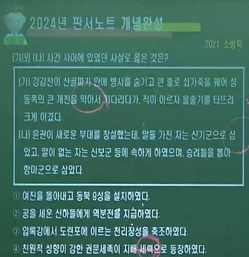
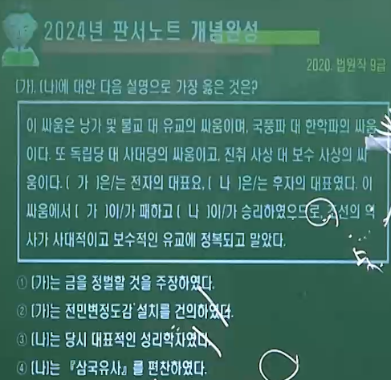
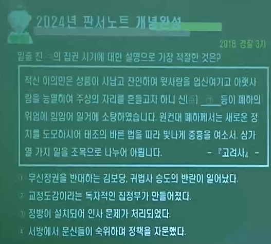
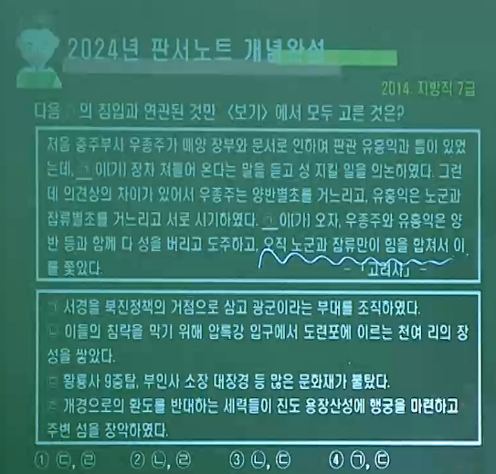
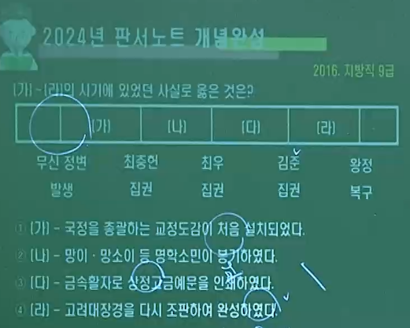

# 1. 고려 문벌귀족 시기∽ 무신집권기 (중기)

----

## ( A 🦅🏆현종 이후 ∽ ⚔👑무신정변(1170) 이전의 왕대 )

----

### 1️⃣ 👨‍🎓🥉문벌귀족

- #### 여러 세대에 걸쳐 중앙에서 고위 관직자를 배출한 가문

- #### 호족 ▪ 신라 6두품 계통 유학자 ( ex.최승로 )
  
  #### └ 성종 이후 새로운 🥉지배층으로 등장

- #### 🎢음서를 통해 관직 독점 ▪ 🛤공음전 ( 5품 이상. 세습 ⭕)
  
  #### └ 음서 = 과거 시험 없이 관직에 오르는 제도

- #### 🎎폐쇄적 혼인관계 ( 비슷한 부류끼리. 왕실과의 혼인 관계 )
  
  #### └ 외척으로 권력 장악

### 2️⃣ 👹 여진(금) 🆚 🦅🏆 고려

- #### ⚔1차 전투에서 👹여진족 🏴‍☠️승리 ( 숙종. 🕎별무반설치. 1104 )

- #### ⚔2차 전투에서 👹여진족 🏳패배 ( 예종. 🗾동북 9성. 1107 )

- #### 👹🏆금의 건국 ( 1115 ) ➡ 금의 🤼‍♂️사대 요구 수용 ( 인종. 이자겸. 1126 )

### 3️⃣ 👨‍🎤이자겸의 난 ( 1126. 인종 4 )  🆚 🧙‍♀️왕의 측근 세력

- #### 👨‍🎤이자겸( 경원 = 인주 이씨 )이 🧙‍♀️한안인 제거 1122 ❌
  
  #### └ 🤴인종의 외조부(왕의 친척) ▪ 🎊인수절(생일) ▪ 🎖지군국사
  
  #### └ ♋현화사 불교 세력과 강력한 👭유대 관계 ( 아들 출가 )

### 4️⃣ 👨‍🚒묘청의 난 ( 1135. 인종 13. 서경파 ) 🆚 🧙‍♂️개경파

- #### 👨‍🚒 서경파 ( 묘청 ▪ 정지상 ) = 지방 출신 개혁 관리
  
  #### 🅰 🚩서경 천도 ▪ 🗡👹금 정벌 ▪ 🎖칭제건원
  
  #### 🅱 🏋️‍♀️자주적 ▪ 개혁적 ▪ 🤠고구려 계승 의식
  
  #### 🆎 💐전통 사상 + ♋불교 및 ☯풍수지리

- #### 🧙‍♂️ 개경파 ( 김부식 ) = 보수적 개경 문벌 귀족
  
  #### 🅰 🚩❌서경 천도 반대 ▪ 💮민생안정 강조 ( 👹🤼‍♂️금에 대한 사대 )
  
  #### 🅱 🕴사대적 ▪ 보수적 ▪ 🏳‍🌈신라 계승 의식
  
  #### 🆎 🛐유교 이념 충실
  
  ---

## ( 🦅🏆문종 1046 ∽ 1083 중기 전성기. 초기 여진 )

- ### (👹여진)
  
  > #### 말갈이라 불리며 고구려에 복속
  > 
  > #### 발해 멸망 이후 여진이라 불림
  > 
  > #### 고려를 부모의 나라로 섬김 ➡ 고려는 회유 ▪ 동화책으로 포섭

- ### 1️⃣ 🏕경정전시과 실시 ▪ 💰녹봉제도 완비
  
  ### 2️⃣ 🏔한양을 🌄남경으로 승격
  
  ### 3️⃣ 🧙‍♂️최충의 🏫문헌공도 ( 9재 학당 ) 설립 = 🧬사학 12도의 융성
  
  ### 4️⃣ 🏥동서 대비원 정비 ▪ 🕍흥왕사 건립
  
  ### 5️⃣ ⚖삼복제 ( 사형수 판결의 삼심제 ) / 🧚‍♂️향리의 승진 규정을 정함
  
  ### 6️⃣ ⚖기인선상법 ( 1077 ) = 기인의 인질 성격이 사라짐.

## ( 🦅🏆숙종 1095 ∽ 1105. 여진 1차 전투. 패배 )

- ### (👹🏅)  👳‍♂️완옌부의 추장 아골타가 여진 통합🏳‍🌈
  
  - #### 1104. 임간과 👨‍✈️윤관이 👹여진과의 ⚔전투에서 패배 🏳
  
  - #### 🏇기병 중심의 👹여진족에 대응하기 위해 👨‍✈️윤관의 📝건의로 🕎별무반 설치 ( 1104 )
  
  - #### 🕎별무반 = 🏇기병(신기군) ▪ 💂‍♂️보병(신보군) ▪ 🦹‍♂️승병(항마군)

- ### 1️⃣ 🦹‍♂️의천의 ♋해동천태종 개창 = 🕍국청사 완공 ( 1097 )
  
  ### 2️⃣ 🏙주전도감 설치 및 💰화폐 주조
  
  ### = 📀해동통보 ▪ 📀해동중보 ▪ 📀삼한통보 ▪ 📀동국통보 ▪ ⚱활구(은병)
  
  ### 3️⃣ 🕌서적포(국자감) 설치
  
  ### 4️⃣ ⛩기자사당 건립 = 평양에 설치 ▪ 제사
  
  ### 5️⃣ 🏗남경개창도감 설치 ( 김위제 건의 )

## (🦅🏆 예종 1105 ∽ 1122. 여진 2차 전투. 여진➡금 건국 )

- ### (👹🏅) 👨‍✈️윤관의 🕎별무반이 🗾천리장성을 넘어 여진을 축출❌
  
  - ### 🗾동북 9성 축조 ( ⛳승리. 1107 )
  
  - ### 🗾동북 9성 🛡수비의 어려움 ➡ 👹여진의 🎁조공 약속🤝
  
  - ### 🗾동북 9성 📦환부 ( 1109 )
  
  - ### 👹🏅 여진족의 세력 📈 ➡ 만주 일대 장악
  
  - ### 👹🏆 금 건국 ( 👳‍♂️아골타. 1115 )

- ### 1️⃣ 🏫7재 ( 전문강좌 ) ▪ 🏙양현고 ( 장학기금 ) = 관학 진흥책
  
  ### 2️⃣ 🏫청연각 ▪ 🏫보문각 설치 = 학문연구 및 경연 도입. 시행
  
  ### 3️⃣ 🏛☯복원궁 ( 관. 도교사원 ) 처음 건립
  
  ### 4️⃣ 🤵감무 파견. 🏥혜민국. 🏥구제도감 설치
  
  ### 5️⃣ 🎼도이장가 지음 = 개국공신 김락 ▪ 신숭겸 추모곡
  
  ### 6️⃣ 📓해동비록 ( 1106 ) / 📓속편년통재 ( 1116. 홍관 )

## ( 🦅🏆인종 1122 ∽ 1146  )

- ### (👹🏆) 금의 팽창 ➡ 1125 🦞거란(요) 멸망 시킴 ❌
  
  - ### 1127 ⛳송 수도 점령 ➡ 송은 금을 피해 💨🔰남송 건국
  
  - ### 👹🏆 금이 고려에 🤼‍♂️사대 요구 ( 군신 관계 )
  
  - ### 1126 👨‍🎤이자겸이 👹금의 🤼‍♂️사대 요구 수용🤝

- ### 1️⃣👨‍🎤이자겸의 난 ( 1126. 인종 4 )
  
  - ### 🅰🤴인종과 🧙‍♀️측근 세력 ( 김찬, 안보린 ) 이 👨‍🎤이자겸 제거 시도 실패 😱
    
    #### └  👨‍🎤이자겸이 ♾도참설을 믿고 👩‍🎤척준경과 👑왕위 찬탈 ( 🥤독살 ) 시도
  
  - ### 🅱 👩‍🎤척준경의 👨‍🎤이자겸 배신, 이자겸 제거 ( 🌅영광 유배. 굴비 일화 ) ➡ 🧙‍♀️정지상이 👩‍🎤척준경 탄핵 🚫
  
  - ### 🆎 🛕🔥왕궁 소실 ▪ 👑📉왕권 약화 ▪ ⛳서경천도론 대두
    
    #### └ 👨‍🎓🥉문벌 귀족사회의 붕괴 촉진 계기

- ### 2️⃣ 👨‍🚒묘청의 난 ( 1135. 인종 13 )
  
  - ### 🅰 👨‍🚒묘청 일파의 요청으로 🤴인종의 📓『유신지교』 📝15조 반포 ( 1127. 서경 )
  
  - ### 🅱👨‍🚒서경파 ( 묘청 ▪ 정지상 ) 🆚 🧙‍♂️개경파 ( 김부식 )
    
    #### └ 묘청의 서경 천도 주장 ➡ 개경파의 반발 💥
  
  > #### 💯 👨‍🚒서경파의 주장
  > 
  > ##### 묘청 등이 국왕에게 건의하기를, "신 등이 볼 때, 서경(평양) 임원역의 땅은 음양가들이 말하는 대화세라, 만약 이곳에 궁궐을 세워 옮기시면 가히 천하를 합칠 수 있습니다." - 고려사
  > 
  > #### 💯 🧙‍♂️개경파의 주장
  > 
  > ##### 금년 여름에 서경 대화궁에 30여 개소나 벼락이 떨어졌으니, 만약 그곳이 길한 땅이라면 하늘은 반드시 그와 같지 않을 것이니 그곳에 재난을 피하러 간다는 것은 잘못이 아닙니까? - 고려사
  
  - ### 🆎 🛕서경에 🏰대화궁 ( 1129 ), 🏰팔성당 건립
  
  - ### 🅾 👨‍🚒묘청이 서경에서 반란😈
    
    #### └ 🆔국호: 대위국 🎖연호: 천개 👨‍✈️군대: 천견충의군
  
  - ### 🆑🧙‍♂️김부식이 이끄는 💂‍♂️관군이 진압 ▪ 👨‍🎓문벌귀족 권력 ⬆
    
    #### └ ✒문치주의 강화 ▪ 🧔숭문천무 풍조 심화 ➡ ⚔무신정변 발생 배경
  
  - ### 🚼🛕서경의 지위 하락📉 ▪ ⚜분사제도와 🔱3경 제도 폐지
    
    #### └ 묘청의 난 이후 🧙‍♂️김부식이 왕명을 받아 📓『삼국사기』 편찬 ( 1145 )
  
  - ### 🈴👨‍💻신채호가 『조선사연구초』에서 '조선 역사상 제일대사건'으로 평가

- > #### 💯 신채호의 서경 천도 운동 인식
  > 
  > ##### 묘청의 천도 운동에 대하여 역사가들은 단지 왕사가 반란한 적을 친 것으로 알았을 뿐인데 이는 근시안적인 관찰이다... 만약 김부식이 패하고 묘청이 이겼더라면 조선사가 독립적 ▪ 진취적으로 진전하였을 것이니 이것이 어찌 일천년래 제일대사건이라 하지 아니하랴 . - 조선사 연구초
  
  - 

----

## ( B 무신 정권 1170 ∽ 1270 의 성립 / 몽골과의 항쟁 )

- ### 문무 겸직제 시행
  
  - #### 무신은 정3품인 상장군까지만 올라갈수 있었지만 무신 집권기에는 무신과 문신의 관직을 동시에 가질 수 있도록 한 문무 겸직제를 시행하여 무신이 재신과 추신이 될 수 있게 함.

----

### 1️⃣ 🤴18대 의종 1146 ∽ 1170

### 2️⃣ 🤴19대 명종 1170 ∽ 1197

- #### ⚔👑 정중부.경대승.이의민

- #### 🅰 무신정변 ( 1170. 경인년의 난. 권력기반 : 중방 )
  
  - #### (숭문천무) 현상 팽배 ➡ 김부식 아들 김돈중의 정중부 수염 태운 사건
  
  - #### (🤴의종의 향락)과 하급 군인들의 (군인전 미지급)
    
    #### ➡ 보현원 사건 ( 정중부 등이 문신 살해 )
  
  - #### ( 정중부 ▪ 이의방 ▪ 이고 등이 문신들을 죽이고 정권 장악 )
  
  - #### ( 🤴의종 폐위 ( 거제도 유배 ) ➡ 🤴명종 옹립 )

- #### 🅱 ⚔👑 최충헌의 봉사 10조 ( 1196. 명종 26 )
  
  - #### 💯이의민 제거 후 왕에게 올림.
  
  > #### 1조 왕은 정전(연경궁)으로 환어할 것.
  > 
  > #### 2조 필요 이상의 관원을 도태시킬 것.
  > 
  > #### 3조 토지 점유를 시정할 것
  > 
  > #### 4조 조부를 공평히 할 것
  > 
  > #### 10조 인물을 가려 관리를 등용할 것
  
  - #### ➡ 신종 . 희종 . 강종 . 고종 옹립

### 3️⃣ 🤴23대 고종 1213 ∽ 1259

- #### ⚔👑 최충헌. 최우( 최이 ) = 권력기반 : 교정도감

- #### 🏇🏆 강동의 역 ( 1219 ) = 여 ▪ 몽 협약 ( 1219. 형제의 맹약. 김취려 )
  
  #### 1️⃣ 🏇🏆 1차 침입 ( 1231 ) = 여 ▪ 몽 간의 화의 성립 (서북면 다루가치 파견 )
  
  - #### 저고여 피살 ➡ 살리타 침입 ➡ 박서 항전(귀주성)
  
  - #### 지궁수와 노군 ▪ 잡류별초의 항전 ( 충주 )
  
  #### 2️⃣ 🏇🏆 2차 침입 ( 1232 ) = 최우 강화도 천도 ( 1232 )
  
  - #### 살리타 재침입 ➡ 처인성 전투 ( 김윤후. 처인 부곡민 ) 살리타 사살
  
  - #### 처인 부곡 현으로 승격 / 초조대장경 소실 ( 1232 )
  
  - #### 🏇🏆 3차 침입 ( 1235 ∽ 1239 ) = 팔만대장경 조판 시작 ( 1236 )
    
    - #### 황룡사 9층 목탑 소실 ( 1238 )

- #### 5️⃣ 🏇🏆 몽골 5차 침입 ( 1253 ) = 김윤후(방호별감) 충주 몽골 격퇴
  
  - #### 충주는 국원경으로 승격
  
  #### 6️⃣ 🏇🏆 몽골 6차 침입 ( 1254 ∽ 1259 )  = 충주 다인철소 주민 몽골 격퇴 ( 1254 )
  
  - #### 충주 다인철소 ➡ 익안현으로 승격

- #### 최의 피살 ( 무오정변. 1258. 최씨 정권 몰락 ) ➡ 몽골과 강화 체결 ( 1259. 고종 46 )

### 4️⃣ 🦅🤴24대 원종 1260 ∽ 1274

- #### ☑ 세조 구제 ( 1260 )
  
  - #### 쿠빌라이( 이후 원 세조 즉위 ) ▪ 원종(세자) 간의 합의
  
  - #### 불개토풍의 원칙 ▪ 고려 고유의 풍속을 인정

- #### 1️⃣ 고려 개경환도 ( 1270 )
  
  - #### 최의 피살 ▪ 몽골과 강화 체결 ➡ 원종이 임유무를 제거함으로써 무신 정권 완전 붕괴

- #### ☑ 고렵첩장 불심조조 ( 1271. 원종 12년 )
  
  - #### 삼별초의 진도 정부가 일본에 보낸 외교 문서를 가마쿠라 막부가 경도 조정에 보내면서 이상하게 여긴 내용을 12조목으로 정리한 문서
  
  - #### 몽골이 일본을 공격할 가능성과 연대의 필요성, 군사적 지원 요청을 담음.

- #### 2️⃣ 삼별초의 항쟁 ( 1270 ∽ 1273 )
  
  - #### 강화도 = 개경 환도에 반발하여 배중손의 지휘 아래 승화후 온을 왕으로 추대
  
  - #### 진도 = 배중손 지휘 아래 진도로 이동 ➡ 용장(산)성을 쌓고 저항 ➡ 여▪몽 연합군에게 진압
  
  - #### 제주도 = 김통정 지휘 아래 제주도로 이동 ➡ 항파두리성을 쌓고 저항 ➡ 여▪몽 연합군에게 진압 = 탐라총관부 설치 ( 1273 )

### 5️⃣ 무신 정권의 몰락

- #### 최우에 이어 최항 ➡ 최의 ➡ 김준(김인준) ➡ 임연 ➡ 임유무 집권 ➡ 1270년 원종 때 임유무가 제거되고 개경으로 환도하면서 무신 정권 몰락

### 6️⃣ 무신 정변의 영향

- #### 정치 = 왕권 약화 ▪ 문벌 귀족 사회의 붕괴 ( 관료 체제로의 전환 촉진 )
  
  - #### 통치 질서 문란 ▪ 일부 천민 출신(이의민 ▪ 김준 등)이 권력층 등장

- #### 경제 = 전시과 체제 붕괴 ▪ 지배층의 대토지 소유 확대 (농장 증가)
  
  - #### 국가의 세금 수취와 무신들의 수탈 심화 ➡ 민생 피폐

- #### 사회 = 국가 통제력 약화 ( 무신들의 권력쟁탈전 ➡ 지방 통제력 약화)
  
  - #### 신분제 동요 ( 농민과 천민의 대규모 봉기 발생 )

- #### 사상 = 신앙 결사 운동 전개, 선종 발달
  
  - #### ex) 지눌 (조계종)과 혜심(지눌의 제자) ➡ 최씨 무신 정권의 후원

- #### 문화 = 문벌 귀족의 몰락으로 유학 쇠퇴
  
  - #### 소외된 문신의 패관 문학 및 은둔적 시조 발달
  
  - #### 민족 자주 의식이 강조된 사서 편찬 ( 『동명왕편』 『해동고승전』 )

---

### ( ⚔👑 정중부 『🤴명종』 1170 ∽ 1179 )

- #### 🅰 중방 중심 = 무신정변 직후부터 최충헌이 권력을 잡을 때까지 최고 권력 기구
  
  #### 🅱 이의방 제거 1174

- #### 1️⃣ 동북면병마사 김보당의 난 ( 1173. 계사의 난 ) 평정 ⛔
  
  - #### 무신정권 타도 및 의종 복위 주장 ➡ 이의민의 의종 살해
  
  #### 2️⃣ 교종 승려 ( 귀법사 )의 난 ( 1174 ) ⛔
  
  #### 3️⃣ 서경유수 조위총의 난 ( 1174 ) 평정 ➕
  
  - #### 서경(평양)에서 무신정권에 대항해 군사를 일으킴.
  
  #### 4️⃣ 공주 명학소 망이 ▪ 망소이의 난 ( 1176 ) ➕
  
  - #### 🅰 명학소가 충순현으로 승격 ➡ 향▪부곡▪소가 점차 소멸되는 계기
    
    #### 🅱 남적, 아주 ( 충남 아산 ) 지역까지 세력 확장

### ( ⚔👑 경대승 『🤴명종』 1179 ∽ 1183 )

- #### 🅰 중방 중심 ▪ 도방 최초 설치 ( 사병집단 ▪ 신변 보호 )
  
  #### 🅱 정중부 제거 및 집권 ▪ 1183 병으로 사망

- #### 1️⃣ 전주 관노의 난 ( 1182. 죽동의 난 )
  
  - #### 군인 + 노비 참여

### ( ⚔👑 이의민 『🤴명종』 1183 ∽ 1196 )

- #### 🅰 중방 중심 ▪ 천민 출신 ▪ 정중부의 부하 ▪ 경대승 사망 후 정권 장악
  
  #### 🅱 최충헌에 의해 제거 ( 1196 )

- #### 1️⃣ 김사미(운문) ▪ 효심(초전)의 난 ( 1193 )
  
  - #### 농민 봉기 ▪ 신라 부흥 운동 ▪ 이의민이 지원

### ( ⚔👑 최충헌 『🤴명종.고종』 1196 ∽ 1219 ) =  🎖진강후

- #### 🅰 교정도감 설치 ( 1209 ) ➡ 중방 약화 / 이의민 제거
  
  #### 🅱 도방 부활, 이규보 등 문신 등용
  
  #### 🆎 진주 지방을 식읍으로 받음 ➡ 진강후 책봉(희종)
  
  #### 🅾 흥녕부(진강부) 설치 = 진주 지방 관리 목적
  
  #### 🆑 전라 ▪ 경상 일대 농장과 노비 소유
  
  #### 🚼 조계종(지눌) 후원

- #### 1️⃣ 만적의 난 ( 1198. 신종 1. 개경 )
  
  - #### 최충헌의 사노비 ▪ 노비들의 신분 해방 운동
  
  - #### 정권 탈취 목표
  
  > ##### 💯 국가에서 경계 이래 고관이 천민계급에서 많이 나왔으니, 장상이 어찌 씨가 따로 있으랴. 때가 오면 누구나 할 수 있는 것이다. - 고려사 -

- #### 2️⃣ 이비 ▪ 패좌의 난 ( 1202. 신종 5 )
  
  - #### 신라 부흥 운동 ▪ 경주 지역의 민란

- #### 3️⃣ 최광수의 난 ( 1217. 고종 4 )
  
  - #### 고구려 부흥 운동 ▪ 서경

### ( 🏇🏆 강동의 역 1219 )

- #### 배경 = 몽골의 금 공격 ➡ 북중국 점령 ➡ 거란족 복속

- #### 전개 = 몽골에 쫓겨온 거란족의 일부가 고려의 강동성(평양 동쪽) 점거

- #### 결과 = 고려 ▪ 몽골 ▪ 동진국 합세 ➡ 거란(대요수국) 격퇴 (김취려 활약)
  
  - #### 여 ▪ 몽 협약 ( 1219. 형제의 맹약 ) . 몽골은 고려에 막대한 공물 요구

### ( 🏇🏆 1차 침입 1231 )

- #### 배경 = 고려에 몽골 사신으로 왔던 저고여 피살 ( 1225 )

- #### 전개 = 몽골 살리타 침입 ➡ 박서의 항전 (귀주성 전투)
  
  - #### 지광수와 노군 ▪ 잡류별초의 항전 (충주)

- #### 결과 = 고려의 강화 요청
  
  - #### 여 ▪ 몽 간의 화의 성립 ( 서북면에 다루가치 파견 )

- 

### ( 🏇🏆 2차 침입 1232 )

- #### 배경 = 고려 고종과 최우의 강화 천도 ( 1232 )
  
  - #### 장기 항전을 위해 강화도로 피난

- #### 전개 = 살리타 재침입 ➡ 처인성 전투 (김윤후와 처인 부곡민의 살리타 사살 )

- #### 결과 = 몽골군 퇴각 ➡ 처인 부곡은 현으로 승격
  
  - #### 대구 부인사에 보관되어 있던 초조대장경 소실 ( 1232 )

### ( ⚔👑 최우 『🤴고종』 ( 1213 ∽ 1249 ) = 🎖진양후

- #### 🅰 정방 설치 ( 모든 관직 인사권 장악 )
  
  - #### 최우 집에 설치. 임원 : 정색승선
  
  #### 🅱 서방 설치 ( 문신들의 숙위 기구 )
  
  - #### 이규보 ▪ 이인로 ▪ 최자 등이 활약
  
  #### 🆎 마별초 조직 ( 기병대 )
  
  #### 🅾 야별초 조직 ( ➡ 삼별초로 개편 )
  
  #### 🆑 강화 천도 ( 1232 ) 이규보 찬성
  
  #### 🚼 진양후로 책봉되고, 그의 집이 진양부가 됨.
  
  #### 🚼 '상정고금예문'을 금속활자로 인쇄 ( 1234 )

- #### ( 🏇🏆 3차 침입 1235 ∽ 1239 )
  
  - #### 강화에서 팔만대장경 조판 시작 ( 1236 ) - 화엄종 승통 수기
  
  - #### 황룡사 9층 목탑 소실 ( 1238 )

- #### 1️⃣ 이연년 형제의 난 ( 1237 )
  
  - #### 백제 부흥 운동 ▪ 담양

----