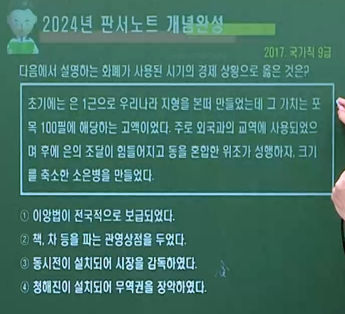

# 1. 고려 원간섭기 ∽ 사회▪경제▪토지▪신분▪무역

---

## ( A 원의 내정간섭 )

- #### 전공 ▪ 몽골 귀족과의 혼인 ▪ 몽골어에 능숙하여 출세하는 사람들이 많았음. = 조인규 : 평양 조씨 , 조비 父

- #### 몽골 풍 유행 = 변발 , 몽골식 복장 (호복,발립▪철릭), 몽골어 확산(궁중과 지배층 중심), 족두리, 수라상, 연지곤지, 소주, 만두, 순대, 설렁탕, 언어 ∽치 등

- #### 고려양 = 고려의 의복, 그릇, 음식 등의 풍습이 몽골에 전해짐

- #### 결혼도감 설치 ( 1274. 원종 ) = 원의 공녀 요구(수령 옹주 묘지명)로 설치 ➡ 조혼 ▪ 예서제 성행

----

### 1️⃣ 일본 원정

- #### 1차 ( 1274. 충렬왕 1 ) ➡ 정동행성 설치 ( 1280 )
  
  - #### 정동행성 = 일본 원정을 위한 기구, 장(長)인 승상은 고려 국왕, 원정 실패 후에도 유지 ➡ 내정 간섭 기구로 삼음

- #### 2차 ( 1281. 충렬왕 7 )

- #### 일본 막부의 저항과 태풍으로 실패

### 2️⃣ 영토 상실

- #### 쌍성총관부 ( 1258. 철령 이북 = 화주 = 영흥 )
  
  - #### ➡ 공민왕 때 무력으로 수복

- #### 동녕부 ( 1270. 서경. 자비령 이북 )  / 탐라총관부 ( 1273. 제주도 )
  
  - #### ➡ 충렬왕 때 반환 됨

### 3️⃣ 호칭 격하

- #### 짐 ▪ 폐하 ▪ 태자 ➡ 고 ▪ 전하 ▪ 세자

- #### 조 ▪ 종 ➡ 왕 ( 원에 충성 의미로 '충'자를 넣음 )

### 4️⃣ 관제 격하

- #### 중서문하성 + 상서성 ➡ 첨의부

- #### 6부 ➡ 4사
  
  - #### 이부 ▪ 예부 ➡ 전리사
  
  - #### 병부 ➡ 군부사
  
  - #### 호부 ➡ 판도사
  
  - #### 형부 ➡ 전법사
  
  - #### 공부 폐지

- #### 중추원(추밀원) ➡ 밀직사

- #### 어사대 ➡ 감찰사

- #### 도병마사 ➡ 도평의사사 (개칭)

### 5️⃣ 독로화 = 고려 세자를 원에 인질로 머물게 함.

### 6️⃣ 심양왕 = 고려 왕 견제 수단

### 7️⃣ 입성책동 = 고려 부원배들이 원으로 하여금 고려에 행성을 세우도록 획책

- #### 충선왕 ▪ 충숙왕 ▪ 충혜왕 때 제기됨.

### 8️⃣ 기타 원 간섭 관련

- #### 원의 부마국 = 원의 공주를 왕비로 ∽

- #### 다루가치 = 감찰관 ▪ 내정 간섭

- #### 순마소 = 치안 ➡ 반원 인사 색출

- #### 겁령구 = 원 공주를 따라온 사속인

- #### 만호부 = 원 영향으로 설치된 군사조직

- #### 결혼도감(공녀 요구) ➡ 조혼 유행 ▪ 예서제

- #### 응방 = 매(해동청) 징발

- #### 중조 = 충렬 ▪ 충선, 충숙 ▪ 충혜왕

### 9️⃣ 세조구제 ( 충렬왕. 1278 )

- #### 호구조사를 고려의 자율에 맡길 것.

- #### 고려 다루가치를 폐지할 것

- #### 고려 주둔 몽골군을 철수시킬 것

- #### 홍차구와 부원배를 소환할 것.

-----

## ( B 원 간섭기 왕대사 )

----

### ( 🏇🏅 충렬왕 1274 ∽ 1298. 1298 ∽ 1308. 왕비 제국대장 공주 )

- #### 1️⃣ 전민변정도감 ( 원종. 공민왕. 우왕 때에도 설치 )

- #### 2️⃣ 일본 원정 동원 ( 원과 함께 두 차례 )

- #### 3️⃣ 홍자번의 편민 18사 건의 ( 개혁 시도 )

- #### 4️⃣ 💯안향의 성리학 전래 💯 삼국유사(일연)
  
  - #### 섬학전 ( 안향의 건의. 장학 재단 ) 설치

- #### 5️⃣ 경사교수도감 설치 = 7품 이하 관리들에게 경전과 역사 교육

- #### 6️⃣ 문묘 (공자 사당) / 묘련사 창건

### ( 🏇🏅 충선왕 1298. 1308∽1313. 왕비 계국대장 공주 )

- #### 1️⃣ 왕비 계국대장 공주, 조비(조인규의 딸) ➡ 조비무고사건으로 충선왕 퇴위( 1308년 복위 )
  
  - #### 원에 소환 ➡ 원 무종 옹립에 기여 ➡ 심양왕에 봉해짐 ➡ 충렬왕이 죽자 복위

- #### 2️⃣ 개혁 기구
  
  - #### 🅰 사림원 설치 ( 정방 폐지: 정방은 후에도 존폐를 거듭함 )
  
  - #### 🅱 전농사 설치 ( 권문세족 농장 해체 기구 )

- #### 3️⃣ 각염법 제정 ➡ 의염창 설치 ➡ 소금전매제 실시
  
  - #### 권문 세족과 사원의 독점 방지 목적

- #### 4️⃣ 재상지종(권문세족) 발표 = 왕실과 혼인 가능한 가문 규정
  
  - #### 철원 최씨 . 해주 최씨 . 공암 허씨 . 평강 채씨 . 청주 이씨. 당성 홍씨. 황려 민씨 . 횡천 조씨 . 파평 윤씨 . 평양 조씨

- #### 5️⃣ 만권당 설치 = 충숙왕에게 양위 후 원 (북경)으로 가서 설치
  
  - #### 고려의 이제현, 원의 조맹부, 요수, 염복 등 원나라 학자 초빙
  
  - #### 학문 연구 및 문화 교류

### ( 🏇🏅 충숙왕 1313∽30. 32∽39 )

- #### 1️⃣ 제폐사목소 설치 ➡ 찰리변위도감 개칭

- #### 2️⃣ 사심관 제도 폐지 ( 1318 )

- #### 3️⃣ 반전도감 ( 원에 갈때 비용 마련 )

- #### 4️⃣ 평양에 기자 사당 (숭인전) 건립

### ( 🏇🏅 충혜왕 1330∽32. 39∽44 )

- #### 1️⃣ 편민조례추변도감 설치

- #### 2️⃣ 기존의 은병을 대신해 소은병 발행

### ( 🏇🏅 충목왕 1344 ∽ 48 )

- #### 1️⃣ 정치도감 설치

- #### 2️⃣ 💯경천사지 10층 석탑 ( 원의 영향. 대리석 ) 건립

### ( 🏇🏅 💯공민왕 1351 ∽ 1374. 왕비 노국대장공주 )

- #### 반원 ▪ 자주 ▪ 왕권 강화 정책 = 14세기 중국의 원 ▪ 명 교체기를 이용하여 개혁 추진
  
  - #### 명 건국 = 1368 ( 공민왕 17 )

- #### 공민왕의 개혁 실패 이유 = 원의 간섭, 홍건적과 왜구의 침입, 권문세족의 반발, 신진사대부 세력 미약, 공민왕 시해 ( 자제위 소속 홍륜 등에 의해 살해 )

- #### 1️⃣ 몽골풍 ( 호복. 변발 ) 폐지 ( 1352 )

- #### 2️⃣ 정방 폐지 (1352 ) = 목은 이색 주도

- #### 3️⃣ 첨설직 설치 ( 1354 ) = 홍건적 ▪ 왜구를 격퇴한 군공 포상을 위한 명예직

- #### 4️⃣ 기철로 대표되는 친원파 숙청 ( 1356 )

- #### 5️⃣ 고려 내정 간섭 기구인 정동행성 이문소 폐지 ( 1356 )

- #### 6️⃣ 무력으로 쌍성총관부 수복 ( 1356 ) = 철령 이북의 땅 수복
  
  - #### 유인우, 이자춘(이성계 父)의 활약

- #### 7️⃣ 원의 연호 폐지, 관제 복구 ( 1356 )

### ( 👲🎏홍건적(한족 반란군)의 침입. 1359. 1361. )

- #### 시기 = 공민왕 때 ( 원 ▪ 명 교체기 )

- #### 1️⃣ 1차 침입 ( 1359 ) = 모거경 등 홍건적 4만 침입 ➡ 서경 함락
  
  - #### 이승경 ▪ 이방실 격퇴

- #### 2️⃣ 2차 침입 ( 1361 ) = 사유 등 홍건적 10만 침입 ➡ 개경 함락
  
  - #### 공민왕 복주(안동) 피신 = 안동 놋다리 밟기 놀이의 유래

### ( 👲🎏홍건적의 침입 이후 🏇🏅공민왕의 정책 )

- #### 1️⃣ 홍건적의 1차 침입 ( 1359 )

- #### 2️⃣ 홍건적의 2차 침입 ( 1361 ) ➡ 공민왕 복주(안동) 피신 ➡ 흥왕사의 변 ( 1363 ) = 친원파 김용의 공민왕 시해 시도

- #### 3️⃣ 🏇원나라 장수 나하추의 침입 ( 1362 ) ➡ 이성계가 격퇴

- #### 4️⃣ 전민변정도감 설치 ( 1366 ) = 권문세족의 토지와 노비 몰수
  
  - #### 노국공주 사망 ( 1365 ) ➡ 전민변정도감 설치 ( 판사 : 신돈 )

- #### 5️⃣ 성균관 정비 ( 1367. 유학 교육 강화 )
  
  - #### 신진사대부 등용, 권문세족 견제 목적
  
  - #### 이색을 성균관 대사성에 임명, 과거제 정비 ( 1368 )

- #### 6️⃣ 요동 공략 ( 1369 ∽ 1370 ) ➡ 이성계 ▪ 지용수의 요양(동녕부) 공격
  
  - #### 동녕부 = 충렬왕 이후 서경에서 요양으로 이동

- #### 7️⃣ 자제위 설치 ( 1372 )

### ( 👺🎌 왜구의 침입 1376. 1380. 1380. 1383. 1389. )

- #### 🏇🏅우왕 시기 ( 1374 ∽ 1388 )

- #### 1️⃣ 홍산 대첩 ( 1376 ) = 최영이 홍산(부여)에서 왜구 토벌
  
  - #### 호기가 ( 최영 )

- #### 🅰 정몽주 일본 파견 ( 1377 ) ➡ 왜구의 단속 요청, 수백 명의 포로 귀환 / 💯 청주 흥덕사에서 『불조직지심체요절』 간행 ( 1377 )
  
  - #### 현존 세계 최고 금속활자 인쇄본 ( 프랑스 국립도서관 하권 소장 )

- #### 🅱 최무선 건의로 화통도감 설치 ( 1377 )

- 

- #### 2️⃣ 진포 대첩 ( 1380 ) = 최무선이 진포(금강 하구)에서 화포를 사용하여 왜선 500척 대파, 최초로 화포 사용
  
  > ##### 💯 우왕 6년 ( 1380 ) 8월 추수가 거의 끝나갈 무렵 왜구는 500여 척의 함선을 이끌고 진포로 쳐들어와 충청 ▪ 전라 ▪ 경상도의 3도 연해의 주군을 돌며 약탈과 살육을 일삼았다. 고려 조정에서는 나세, 최무선, 심덕부 등이 나서서 최무선이  만든 화포로 왜선을 모두 불태웠다. - 고려사

- #### 3️⃣ 황산 대첩 ( 1380 ) = 이성계가 황산(남원 운봉)에서 왜구 격퇴
  
  - #### 조선 선조 때 황산대첩비 건립 ( 일제 강점기에 훼손 )
  
  > ##### 💯 이성계가 이끄는 토벌군이 남원에 도착하니 왜구는 인월역에 있다고 하였다. 운봉을 넘어온 이성계는 적장 가운데 나이가 어리고 용맹한 아지발도를 사살하는 등 선두에 나서서 전투를 독려하여 아군보다 10배나 많은 적군을 섬멸케 하였다 - 고려사

- #### 4️⃣ 관음포 대첩 ( 1383 ) = 정지가 관음포(남해)에서 왜구 격퇴

- #### 🅾 명의 철령위 설치 통고 ( 1388 ) ➡ 이성계의 요동 정벌 출병 ➡ 위화도 회군 ( 1388 )

- #### 🏇🏅 창왕 시기 ( 1388 ∽ 1389 )

- #### 1️⃣ 박위의 쓰시마 ( 대마도 ) 정벌 ( 1389 )
  
  - #### 이종무의 쓰시마 정벌은 세종 원년 ( 1419 )

- #### 2️⃣ 상서사가 설치되면서 정방 완전 폐지

### ( 🏇🏅 공양왕 1389 ∽ 1392 )

- #### 1️⃣ 과전법의 제정 ( 1391 )

----

## ( C 고려의 신분 제도 ▪ 사회 제도 )

----

### 1️⃣ 본관제 시행 = 이름 앞에 출신지를 표기하게 한 제도

- #### 태조 왕건이 후삼국 통일 과정에서 각 지방의 호족에서 성씨를 하사하며 시행 됨

- #### 🅰 정책
  
  - #### 고려 정부는 본관제로 위계질서를 세우고, 향촌 사회를 통제함
  
  - #### 본관을 떠나 이주하는 것은 법으로 엄격히 금지
  
  - #### 관리가 되어 개경으로 올라오거나 혼인을 하는 경우만 제한적으로 허락
  
  - #### 다른 지역으로 이주해도 호적에는 원래의 본관을 기재하였음
  
  - #### 관리가 중범죄를 저지르면 본관지로 돌려보내는 귀향형에 처했음.

- #### 🅱 영향
  
  - #### 본관은 개인의 사회적 지위까지 영향을 끼쳤으며, 성씨가 없는 일반 백성은 자신이 거주하는 지역을 본관으로 삼아 성씨처럼 사용함. (토성)

### 2️⃣ 고려 사회 신분제 ( 원칙 = 양천제 )

- #### 문벌 귀족 사회 ( 신분제 사회 ) / 개방적 사회 ( 신분 이동 가능 )

- #### 대가족 중심 사회 / 성씨 사용 보편화 = 본관제. 평민의 성 보유 (토성)

- #### 🅰 양인 ( 자유민 )
  
  - #### 양반 ( 귀족 ) = 문무 관리 ( 문무 고위 관리 )
    
    - #### 왕족, 5품 이상 고위 관료 ➡ 음서 및 공음전 혜택
    
    - #### 죄를 지으면 귀향형 = 본관으로 돌려보냄
    
    - #### 유력한 가문과 서로 중첩 혼인 ( 폐쇄적 혼인 관계 )
    
    - #### 변화 : 문벌 귀족 ( 고려 중기 ) 🆚 권문세족( 원 간섭기 )
    
    - #### 개방적 = 지방 향리 자제도 과거를 통해 귀족화 ⭕
      
      - #### 중앙 귀족에서 낙향하여 향리로 전락 (귀향)
  
  - #### 중간 계층 ( 중류층 ) = 남반, 서리, 하급 장교(직업 군인), 향리 등
    
    - #### ➡ 직역 세습, 국가로부터 토지를 받음
    
    - #### 통치 체제의 하부 구조를 맡아 중간 역할 담당 = 지배층과 피지배층 사이에 위치 / 지배 기구의 말단 행정직 담당
    
    - #### 잡류 (중앙 관청 서리) / 남반 (궁중 실무) / 역리( 역 관리)
    
    - #### 향리 ( 지방 행정 실무 ) / 군반 (직업군인, 하급장교)
      
      - #### 상층 향리 (호족출신) = 지방 세력 중 과거 합격률 가장 높음
        
        - #### 호장 ▪ 부호장을 대대로 배출 . 지방의 실질적 지배층 . 하층 향리와 구별됨
        
        - #### 호장(향리직 우두머리) 은 부호장과 함께 해당 고을의 모든 향리가 수행했던 말단 실무 행정 총괄
      
      - #### 하층 향리 = 말단 행정직 ▪ 행정 실무 담당
    
    - 
  
  - #### 양민 ( 평민 ) = 백정 ( 일반 농민 ) , 상인, 수공업자, 향 ▪ 소 ▪ 부곡민
    
    - #### 농민(백정) ▪ 상인 ▪ 수공업자 = 조세 ▪ 공납 ▪ 역 부담 ➡ 일반 농민인 백정이 양민의 대다수 차지
    
    - #### 특수행정구역 = 향 ▪ 부곡민(농업) , 소 주민(수공업, 광업), 역 주민( 육로 교통), 진 주민 (수로 교통) = 거주 이전 자유 ❌, 세금 多, 과거 응시 X
    
    - #### 신량역천 = 어간 ▪ 생선간, 염간, 목자간, 철간, 봉화간
    
    - 

- #### 🅱 천민 = 공노비 ▪ 사노비 ▪ 기타
  
  - #### 공노비
    
    - #### 입역노비 = 궁중 ▪ 관청에 소속, 급료 받고 생활
    
    - #### 외거노비 = 지방 거주 ▪ 농업에 종사 ▪ 수입 중 규정된 액수 관청 납부
  
  - #### 사노비
    
    - #### 솔거노비 = 귀족이나 사원에서 직접 부리는 노비 ▪ 주인 집에 거주, 잡일 담당
    
    - #### 외거노비 = 주인과 따로 삶. 농업에 종사. 주인에게 신공 납부. 소작 및 토지 소유 가능. 양민 백정과 비슷한 경제생활 = 독립된 경제 생활 영위 가능
  
  - #### 노비의 처우
    
    - #### 일천즉천(신분) = 부모 중 한쪽이 노비면 자식도 노비
    
    - #### 천자수모(소유권) = 어머니 쪽 소유주에게 귀속
    
    - #### 동색혼 = 같은 신분끼리 결혼
    
    - #### 재산으로 간주 = 매매 ▪ 상속 ▪ 증여의 대상
    
    - #### 성(姓) 소유 불가 . 승려 ❌.
    
    - #### 신분 상승 가능. But 원칙적으로 관직 진출 불가
    
    - #### 소유주가 각기 다른 노(奴)와 비(婢)가 혼인하더라도 가정을 이루는 것이 가능함.
  
  - #### 기타
    
    - #### 화척(도살업), 양수척(버들고리 장수), 재인(광대), 기생
      
      - #### ➡ 거란 ▪ 여진족 출신 多, 호적 등록 ❌, 국역 부담 ❌

### 3️⃣ 특수 행정 구역 ( 향 ▪ 부곡 ▪ 소)

- #### 🅰 향 ▪ 부곡 ▪ 소에 거주하는 주민의 지위
  
  - #### 형벌을 받을 때 노비와 동등하게 취급, 일반 군현의 양민과 결혼할 수 없었음.
  
  - #### 과거 응시 X . 승려가 되는 것을 금지
  
  - #### 부모 중 한쪽이 특수 지역 주민이면, 자녀도 특수 지역에 소속

- #### 🅱 향 ▪ 부곡 ▪ 소 등 특수 지역의 향리
  
  - #### 중앙의 서리나 하급 관리가 될 수 있었지만 과거 응시에 제한을 받거나 과거 승진에 한계가 있었음.

- #### 🆎 향 ▪ 부곡 = 일반 농업 생산 지역

- #### 🅾 소 ▪ 장 ▪ 처 = 세 . 공물. 요역 중 특정 부문의 수취를 위해 설치된 지역

- #### 🆑 역 ▪ 진 = 교통 ▪ 운송과 관련된 일을 하는 지역

----

## ( D 고려 시대 지배 세력의 변화 )

### 1️⃣ 초기 : 👨‍🚒호족

- #### 출신 = 몰락한 중앙 귀족. 군진 ▪ 토착 세력 등

- #### 풍수지리사상 + 선종

- #### 농장(경제) ▪ 사병(군사)

### 2️⃣ 중기 : 👨‍🎓문벌귀족

- #### 성종 때 대두 ( 출신 = 호족 ▪ 6두품 등 )

- #### 과거 ▪ 음서 통해 관직 독점. 공음전 ▪ 과전

- #### 교종 계열 지지. 훈고학

- #### 대표 가문 = 경원 이씨(이자겸), 파평 윤씨(윤관), 해주 최씨(최충), 경주 김씨(김부식) 등

### 3️⃣ 무신집권기 : 👨‍✈️무신

- #### 무신정변을 통해 집권

- #### 선종(조계종) 지지

- #### 중방 ▪ 교정도감 ▪ 정방을 중심으로 정치

- #### 대농장 소유 ▪ 대몽 항쟁

### 4️⃣ 원간섭기 : 🤵권문세족

- #### 주로 음서로 관직 진출 , 중앙의 부재지주 = 자기 땅이 지방에 있다. 부재 중입니다 ...

- #### 수구적, 친원적, 친불교적 (불교 타락)
  
  - #### 장생표, 사원수공업 ⬆

- #### 도평의사사(도당) , 정방(인사권), 첨의부 장악

- #### 대농장 소유 ( 산천 경계, 모수사패 활용)

- #### 권력 : 가문의 권위 < 현실적 관직

- #### 왕실 또는 자신들 상호 간 중첩혼

- 

### 5️⃣ 말기 : 🦸‍♂️신진사대부

- #### 지방 향리 출신 ▪ 무신집권기 이래 과거를 통해 중앙 관리로 진출 (사대부. 이규보.최자) ➡ 공민왕 때 지배 세력으로 성장

- #### 행정 실무에 능한 학자적 관료

- #### 친명적, 성리학 수용, 불교 비판 = 원과의 관계를 끊을 것을 주장

- #### 지방 중소 지주

----

## (E 고려의 사회)

----

### 1️⃣ 향도

- #### 기원 = 신라 609년(진평왕 31) 경에 김유신을 중심으로 조직
  
  - #### 용화향도 (화랑도) 라고 지칭

- #### 개념 = 매향 활동을 하는 불교 신앙 조직, 미륵을 만나 구원받고자 향나무를 바닷가에 묻음. 향리와 농민이 함께 모여 있는 조직 = 향리가 조직 주도
  
  - #### 사천 매향비 = 1387년 향나무를 묻고 세운 것으로, 내세의 행운과 국태민안을 기원

- #### 활동 (전기) = 불교 신앙 조직 ( 매향 활동 + 불상▪석탑을 만들거나 절을 지을 때 주도적 역할 = 호장이 주도 )

- #### 활동 (후기) = 농민 공동체 조직 (마을 노역, 혼례와 상장례, 민속 신앙과 관련된 마을 제사 ) ➡ 조선 시대 상여를 메는 상두꾼도 향도에서 유래

- #### 성격 = 지방의 신앙 공동체 + 불교와 함께 톻속 신앙의 면모 + 불교와 풍수지리설의 융합된 모습

### 2️⃣ 법률

- #### 특징 = 당률을 참작한 71개조의 법률 시행 but 대부분의 경우 관습법을 따름. 지방관의 사법권이 커서 중요 사건 이외에는 재량권 행사 가능

- #### 형벌 = 중죄 : 반역죄, 불효죄 등은 중죄로 다스림
  
  - #### 집행 보류 = 귀양형을 받은 사람이 부모상을 당하였을 시 7일 간의 휴가를 줌 = 부모상을 치르도록 함
    
    - #### 70세 이상의 노부모를 두고 봉양할 가족이 없을 때에는 형벌의 집행 보류
  
  - #### 형벌의 종류 : 태(매질), 장(곤장), 도(징역), 유(유배), 사(사형)의 5종 ➡ 실형주의 원칙 - 배상제 우위 X

### 3️⃣ 가족 제도와 여성의 지위(남성과 가정▪경제적 대등)

- #### 재산 상속 ▪ 제사 = 자녀 균등(균분) 상속
  
  - #### 아들이 없으면 딸이 제사를 지냄 (양자를 들이지 않음)
  
  - #### 제사는 형제자매가 돌아가면서 지냄(윤회봉사)
  
  - #### 상복 제도에서 친가와 외가의 차이가 크지 않았음

- #### 호적 등록 = 여성도 호주가 될 수 있었음 ( 여주 이씨 준호구 )
  
  - #### 태어난 차례대로 ( 연령순 ) 호적에 기재 = 남녀 차별 없음

- #### 혼인 형태 = 사위가 처가의 호적에 입적
  
  - #### ➡ 처가살이(남귀여가혼 ▪ 서류부가혼 ▪ 솔서혼)

- #### 혜택 = 사위와 외손자에게까지 음서의 혜택
  
  - #### 공을 세운 사람의 부모는 물론 장인과 장모도 함께 상을 받았음.

- #### 여성의 지위 = 여성의 재가가 비교적 자유로웠음.
  
  - #### 그 소생 자식의 사회적 진출에도 차별하지 않음
  
  - #### 부부 간에도 여성의 재산에 대한 권리는 보호됨
  
  - #### 여성의 사회 진출에는 제한이 있었음 (여성의 관직 및 공적 기구 취임 ❌
  
  - #### 간통시 남성보다 강한 형벌

### 4️⃣ 사회제도

- #### 농민 보호책 = 농번기 잡역 동원 금지 . 면재법(자연재해 시 조세 및 부역 감면). 자모정식법 (법으로 이자 제한)

- #### 흑창(태조) : 평시에 곡물 비축, 흉년에 빈민 구제 (춘대추납) ➡ 의창(성종)으로 개편

- #### 상평창(성종) : 물가 조절 기관, 개경▪서경 각 12목에 설치

- #### 동 ▪ 서 대비원( 개경의 동 ▪ 서쪽에 설치 ) : 국립 의료 기관

- #### 혜민국(개경. 서민들에게 약 제공). 제위보(기금 마련 후 그 이자로 빈민 구제)

- #### 구제도감(예종) : 질병 치료 및 병사자의 매장 관장

- #### 구급도감(고종) : 임시기관. 재해발생 시 백성 구제

### 5️⃣ 풍습

- #### 의복 : 평민은 대개 백저포라는 모시로 만든 옷을 입었음.

- #### 장례 및 제사 의례 : 토착 신앙과 융합된 불교와 도교의 풍속을 따름.

- #### 혼인
  
  - #### 여자는 18세 전후, 남자는 20세 전후에 혼인. 일부일처제가 일반적 , but 축첩 가능. ➡ 충렬왕 때 박유가 일부다처제 주장
  
  - #### 왕실에서는 동성 ▪ 근친 ▪ 족내혼 성행 ( 충선왕의 금령 ➡ 점차 사라짐 ) = 중기 이후 여러 번의 금령에도 불구하고 사라지지 않았음. 왕실에만 국한. 귀족 ❌

- #### 명절 : 정월 초하루, 삼짇날 ( 음력 3.3 ), 단오( 5.5. 격구와 그네뛰기. 씨름), 유두(6. 15), 추석(8.15) 등

- #### 불교 행사 : 태조 때 훈요 10조에서 연등회, 팔관회 강조 ➡ 성종 때 일시 폐지 ➡ 현종 떄 부활
  
  - #### 연등회
    
    - #### 1월(정월) 15일 또는 2월 15일
    
    - #### 전국에서 개최
    
    - #### 국가적 차원의 불교 행사
    
    - #### 팔관회와 더불어 신라 진흥왕 대에 시작
    
    - #### 유네스코 인류 무형 문화유산 등재 ( 2020 )
  
  - #### 팔관회
    
    - #### 서경 (10. 15 개최), 개경 (11. 15 개최)
    
    - #### 도교와 민간(토속) 신앙 및 불교가 어우러진 행사
    
    - #### 국제 교류의 장 = 송▪여진▪아라비아▪탐라 등의 사신 및 상인 참여 / 국가적 종교 행사
    
    - #### 정당문학 최항이 청하여 부활 ( 현종 )

---

## ( F 고려의 경제 ▪ 토지 제도 ▪ 무역활동 )

### 1️⃣ 중농 정책 및 민생 안정책

- #### 개간 장려 ( 개간한 땅은 일정 기간 면세 )

- #### 농번기 잡역 동원 금지

- #### 재해 시 세금 감면 ( 재면볍 = 면재법 )
  
  - #### 성종 때 실시, 문종 때 법제화

- #### 고리대의 이자 제한

### 2️⃣ 상업 ( 도시 ▪ 지방 ▪ 후기 )

- #### 도시
  
  - #### 개경에 시전 설치 ( 관청과 귀족이 주로 이용 )
  
  - #### 경시서 설치 ( 문종. 시전의 상행위 감독 )
  
  - #### 비정기 시장 ( 도시 거주민 일용품 매매 )
  
  - #### 관영상점(국영 점포) : 개경 ▪ 서경(평양) ▪ 동경(경주) 등 대도시에 서적점, 주점, 다점 등 설치 ➡ 상업에 대한 관심

- #### 지방
  
  - #### 관아 근처에서 일용품 거래 위한 시장 개설
  
  - #### 사원의 상업 활동 ( 수공업품 판매 )
  
  - #### 행상이 지방 시장에서 물품을 팔거나 마을을 돌아다니며 소금, 일용품 등을 판매

- #### 후기
  
  - #### 도시와 지방의 상업 활동이 전기보다 활발 ( 시전 규모 확대. 업종별 전문화 )
  
  - #### 예성강 하구의 벽란도를 비롯한 항구들이 교통로와 산업의 중심지로 발달
  
  - #### 지방 상업에서는 행상의 활동이 두드러짐
  
  - #### 새로운 육상로가 개척되면서 원(院, 여관) 발달
  
  - #### 소금 전매제 시행 ( 충선왕 )

- #### 쇠 ▪ 구리 ▪ 은 등을 금속 화폐로 만들어 유통

### 3️⃣ 수공업 ( 전기 ▪ 후기 )

- #### 전기
  
  - #### 관청 수공업 : 기술자를 공장안에 올려 중앙과 지방 관청에서 물품 생산 = 농민을 부역으로 동원하여 보조
  
  - #### 소 수공업 : 금 ▪ 은 ▪ 철 ▪ 구리 ▪ 실 ▪ 각종 옷감 ▪ 종이  ▪ 먹 ▪ 차 ▪ 생강 등을 생산 ➡ 공물로 납부
    
    - #### 무신 집권기부터 해체되기 시작 ➡ 조선 시대 소멸

- #### 후기 ( 관청수공업 쇠퇴. 민간수공업 발달 )
  
  - #### 민간 수공업 : 농촌의 가내 수공업 중심
    
    - #### 국가에서 삼베를 짜게 하거나 뽕나무를 심어 비단을 생산하도록 장려
  
  - #### 사원 수공업 : 베 ▪ 모시 ▪ 기와 ▪ 술 ▪ 소금 등 품질 좋은 제품 생산

### 4️⃣ 수취 제도 ( 조세 ▪ 공납 ▪ 역 )

- #### 조세
  
  - #### 🅰 기준 : 토지 비옥도에 따라 3등급으로 나누어 부과 ( 차등 징수 )
    
    - #### 토지를 논과 밭으로 나누고 " 불역전, 일역전, 재역전 "
    
    - #### 생산량의 ⅒ 징수
  
  - #### 🅱 운반(조운) : 각 군현의 농민을 동원하여 조창까지 운반
    
    - #### 조운을 통해 개경의 경창으로 운반 ▪ 보관 = 좌창(광흥창), 우창( 풍저창 )
  
  - #### 🅾 잉류 지역 : 양계에서 걷는 세금은 운반하지 않고, 군사비 등 현지 경비로 사용

- #### 공납
  
  - #### 🅰 기준 : 집집(戶.호)마다 토산물 징수, 조세보다 더 큰 부담
    
    - #### 인정의 다과에 따라 9등호로 나누어 징수
  
  - #### 🅱 수취 방법 : 중앙 관청에서 공물의 종류와 액수를 나누어 주현에 부과
    
    - #### 주현은 속현과 향, 부곡, 소에 할당 ➡ 향리들이 집집마다 공물 수취
  
  - #### 🅾 종류
    
    - #### 상공 ( 매년 정기적 납부 )
    
    - #### 별공 ( 필요에 따라 수시로 납부 )

- #### 역
  
  - #### 🅰 기준 : 16 ∽ 59세 ( or 60세 )까지의 정남 ( 인두세 )
    
    - #### 60세가 되면 면역 . 인구와 장정이 많고 적음에 따라 9등급에 나누어 부역시킴.
  
  - #### 🅱 종류 : 군역(병역)과 요역(노동력) ➡ 무상 동원
    
    - #### 기타 : 어민에게 걷는 어염세, 상인에게 걷는 상세 등

### 5️⃣ 재정 운영 ( 호부 ▪ 삼사 ▪ 지출 )

- #### 호부
  
  - #### 양안 ( 토지 대장 )과 호적 ( 호구 장부 ) 분리 작성. 이를 토대로 조세, 공물, 부역 등 부과

- #### 삼사
  
  - #### 화폐와 곡식의 출납에 대한 회계만 담당. 실제 조세 수취와 집행은 각 관청에서 담당

- #### 지출
  
  - #### 녹봉, 국방비, 왕실 경비 등에 지출. 각 관청은 운영 경비로 토지(공해전)를 지급받음.
    
    - #### 좌창(녹봉 담당). 우창(일반 비용). 용문창(군량). 내장택 ▪ 내고(왕실 재정)

### 6️⃣ 경제 생활 ( 귀족 ▪ 농민 )

- #### 귀족
  
  - #### 음서 ▪ 공음전 혜택, 과전 ( ⅒ )
  
  - #### 녹봉 ( 1년에 두번씩, 녹패를 제시하고 곡식 또는 비단 등으로 받음. )
    
    - #### 문종 때 정비 ( 1076 ). 관료를 47등급으로 나누어 1등급은 400석을 받고, 최하 47등급은 10석을 받았음.
  
  - #### 노비의 신공 ( 매년 베나 곡식을 받음 ). 고리대. 농장 소유. 화려한 생활

- #### 농민
  
  - #### 민전 경작 또는 국 ▪ 공유지나 다른 사람의 소유지 경작
  
  - #### 진전이나 황무지 개간 시 국가에서 일정 기간 소작료나 조세 감면
  
  - #### 12C 이후 연해안 개간 ( 저습지. 간척지 )
  
  - #### 13C 강화 천도 시기 강화도 지방의 대규모 간척 사업 추진
  
  - #### 진전 개간 시 주인이 있으면 소작료 감면, 없으면 개간한 사람의 토지로 인정

### 7️⃣ 농업 기술

- #### 수리 시설의 발달 ( 김제 벽골제. 밀양 수산제 개축 )

- #### 호미와 보습 등의 농기구와 종자 개량

- #### 소를 이용한 깊이갈이(심경법) 일반화 ➡ 휴경 기간 단축 및 생산력 증대

- #### 시비법의 발달 : 녹비법(콩과 작물을 심은 뒤 갈아엎음) + 퇴비법(가축의 배설물) ➡ 휴경지 감소
  
  - #### But 일역전(2년 1작) ▪ 재역전(3년 1작)이 많이 존재

- #### 밭농사 : 2년 3작 윤작법 보급 ( 2년 동안 보리 ▪ 콩 ▪ 조 돌려 짓기)

- #### 논농사 : 직파법 대신 고려 말 남부 지방 일부에 이앙법(모내기법) 보급

- #### 고려 후기(충정왕)에 이암이 원의 『농상집요』 소개
  
  - #### 원의 화북 지방 농법 소개

- #### 목화 전래 : 공민왕 때 문익점이 원으로부터 전래, 의생활 대혁신
  
  - #### 장인 정천익이 재배에 성공. 중국 승려 홍원에게 씨아와 물레 만드는 법을 배움.

### 8️⃣ 화폐의 주조 ( 전기 ▪ 후기 )

- #### 전기
  
  - #### 성종 때 건원중보 ( 철전. 최초. 996 )
  
  - #### 숙종 때 의천 ▪ 윤관 건의로 주전도감 설치 ( 1097 )
    
    - #### 은병(활구). 해동통보. 해동중보. 삼한통보. 삼한중보. 동국통보. 동국중보 등 제작

- #### 후기
  
  - #### 충렬왕 (쇄은) ➡ 충혜왕 (소은병)
  
  - #### 원 화폐의 유입 : 지원보초, 중통보초
  
  - #### 공양왕 ( 저화. 최초의 지폐. 유통 보류됨 )
  
  - 

- #### 한계
  
  - #### 농민들의 자급자족적 경제활동. 귀족들의 불만으로 화폐 유통 부진
  
  - #### 화폐의 필요성 인식 부족. 일반적인 거래는 여전히 곡식이나 삼베 사용

- #### 고리대 유행
  
  - #### 왕실 ▪ 귀족 ▪ 사원의 재산 축적 수단으로 활용됨.
    
    - #### 장생고 : 사원에 설치된 금융 기관 ➡ 고리대로 변질. 불교 타락. 장생표 : 사원 토지 경계 표시

- #### 보(寶)의 발달 : 기금을 조성하여 그 이자로 경비 충당 ➡ 고리대로 변질
  
  - #### 학보(태조) : 서경에 둔 장학 재단
  
  - #### 광학보(정종) : 승려의 면학을 위해 만든 재단
  
  - #### 경보(정종) : 불경 간행을 위해 만든 재단
  
  - #### 제위보(광종) : 빈민 구제를 위해 만든 제단
  
  - #### 팔관보(문종) : 팔관회의 경비 충당을 위해 만든 제단
  
  - #### 금종보(현종) : 현화사의 범종 주조를 위해 만든 제단

### 9️⃣ 토지 제도

- #### 토지의 종류 ( 소유권상 수조권 기준 분류 )
  
  - #### 🅰 공전 ( 국가 소유⬅ 땅 소유자 조세 ⅒, 소작 농민 지대 ¼ )
    
    - #### 내장전 ( 왕실 경비 충당 ) ▪ 공해전 ( 중앙 ▪ 지방 관청 경비 충당 )
    
    - #### 둔전 ( 군량 충당 ) ▪ 학전 ( 교육기관 경비 충당 )
    
    - #### 적전 ( 임금이 몸소 농사 짓던 토지 )
  
  - #### 🅱 사전 ( 관리 소유 ⬅ 자영농, 지주 조세 ⅒ , ⬅ 소작 농민 지대 ⅟ 2   )
    
    - #### 과전 ( 양반전. 전시과에 따라 관리에게 지급 ) = 수조권만 지급 ( 세습 ❌)
    
    - #### 공음전 ( 5품 이상 관리에게 지급 ) ▪ 공신전 ( 공신에게 지급 )
    
    - #### 군인전 ( 중앙군의 군역의 대가 ) ▪ 외역전 ( 향리의 향역 대가 )
    
    - #### 한인전 ( 6품 이하 하급 관료의 자제로서 관직에 오르지 못한 자에게 지급 ) = 관리가 되었으면서도 관직을 받지 못한 자에게 지급, 관인 신분의 세습 목적
    
    - #### 구분전 ( 하급 관료와 군인의 유가족 )
    
    - #### 별사전 ( 승려와 지리업 종사자 ) ▪ 사원전 ( 사원 )
  
  - #### 🅾 민전 ( 사유지 )
    
    - #### 매매 ▪ 상속 ▪ 기증 ▪ 임대 가능한 사유지. 수조권 보장
    
    - #### ➡ 함부로 빼앗을 수 없음. 민전의 소유자는 수확량의 ⅒ 조세 납부
  
  - #### 🆎 영업전 ( 세습 가능한 토지 )
    
    - #### 내장전 ( 공전. 왕실 경비 충당 )
    
    - #### 공음전 ( 사전.5품 이상 관리에게 지급 )
    
    - #### 공신전 ( 사전. 공신에게 지급 )
    
    - #### 군인전 ( 사전. 중앙군. 군역의 대가 )과 외역전( 사전. 향리의 향역 대가 ) : 전정연립
      
      - #### 전시과에서 군인 ▪ 향리 등 직역을 담당하는 자는 자식이 직역을 세습할 경우 자동적으로 전정도 세습

- #### 전시과
  
  - #### 개념 : 문무 관리로부터 군인, 한인에 이르기까지 18등급으로 나누어 전지(토지) ▪ 시지(임야. 땔감) 지급
  
  - #### 특징 : 수조권만 지급 ( 소유권 ❌ ), 전국 5도의 토지 대상 ( 양계 제외 ), 세습 불가, 토지를 받은 자가 죽거나 퇴직 시 반납
  
  - #### 관청 : 급전도감 [ 문종 때 설치. 전시과의 절급 사무를 관장하던 임시 관서 ]
  
  - #### 변천 : 시정 전시과 ( 경종. 976 ) ➡ 개정 전시과 ( 목종. 998 ) ➡ 경정 전시과 ( 문종. 1076 )
    
    - #### 시정 전시과에서 경정 전시과로 갈수록 지급 대상 및 지급액 감소
    
    - #### 🅰 역분전 ( 태조. 940 )
      
      - #### 대상 : 개국 공신
      
      - #### 기준 : 충성도 ▪ 인품 ▪ 선안과 공로 ( 관품 ❌ )
      
      - #### 특징 : 논공행상의 성격
    
    - #### 🅱 시정 전시과 ( 경종. 976 )
      
      - #### 대상 : 전직(산관) + 현직(직관) 관리
      
      - #### 기준 : 관등( 자 ▪ 단 ▪ 비 ▪ 녹 4색 공복 기준 ) + 인품(주관적)
      
      - #### 특징 : 전시과의 시작. 역분전의 성격 탈피 못함. 4색 공복을 기준으로 문반, 무반, 잡업으로 나누어 지급 결수를 정함.
      
      - > ##### 💯 시정 전시과 주의 할 점
        > 
        > ##### 경종 원년 11월에 비로소 직관 ▪ 산관의 각 품의 전시과를 제정하였는데, 관품의 높고 낮은 것은 논하지 않고 다만 인품만 가지고 전시과의 등급을 결정하였다. 자삼 이상은 18품으로 나누었다 .... - 고려사 -
      
      - #### ➡ 실제로는 관품의 높고 낮음과 함께 인품 반영
    
    - #### 🆎 개정 전시과 ( 목종. 998 )
      
      - #### 대상 : 전직(산관) + 현직(직관) 관리
      
      - #### 기준 : 관등 기준 ( 인품 요소 배제 )
      
      - #### 특징 : 18등급으로 나누어 지급 . 문반 > 무반, 직관 > 산관, 전지 > 시지 = (개) 차별
        
        - #### 군인전 규정, 한외과 항식 설치 = 18과 안에 들지 못한 자에게 17결 지급
        
        - #### 16 ∽ 18과까지 시지 미지급
    
    - #### 🅾 경정 전시과 ( 문종. 1076 )
      
      - #### 대상 : 현직 관리에게만 지급
      
      - #### 기준 : 관등 기준
      
      - #### 특징 : 무신에 대한 차별 대우 시정 = 무반이 같은 품계의 문반보다 토지 분급액이 많았음.
        
        - #### 한외과 폐지 ( 18과 내로 흡수 ▪ 편입 )
        
        - #### 한인 ▪ 잡류에게도 지급
        
        - #### 공음전 = 양반공음전시법 ( 1049. 문종 3 ), 별사전, 한인전 지급
        
        - #### 15 ∽ 18과까지 시지 미지급
  
  - #### 전시과 제도의 붕괴
    
    - #### 무신 집권기를 거치며 권력자들의 토지 독점 및 세습 확산으로 전시과 제도가 제대로 운영되지 못함.
  
  - #### 녹과전 지급 ( 1271. 원종 )
    
    - #### 배경 : 전시과 제도 붕괴 및 국가 재정 악화 ➡ 녹봉조차 제대로 지급하지 못함
    
    - #### 내용 : 개경 환도 직후, 경기 8현의 토지를 대상으로 관리의 생계를 위해 일시적으로 지급
  
  - #### 과전법 제정 ( 1391. 공양왕 )
    
    - #### 경기 지역의 토지를 대상으로 수조권 재분배 (신진 사대부의 경제적 기반 마련 ), 경작권 법적 보장

### ☑ 사패전과 모수사패

> ##### 몽골과의 장기간 전쟁으로 황폐해진 농지를 개간할 목적에서 사패전(사급전) 지급 제도가 시행되었는데, 사패전이 주로 권문세족에게 지급되어 대토지 집적의 길을 열어 주었다. 그 뿐 아니라 사급전을 지급받지 않고도 마치 받은 것처럼 꾸며 남의 토지를 빼앗는 '모수사패'가 횡행하여 당시 권문세족의 농장은 '산천으로 경계를 삼았다'거나 '주군에 걸쳐 있었다'고 기록될 정도로 규모가 컸다.

### 🔟 무역활동

- #### 특징 : 사무역 쇠퇴 ➡ 공무역 중심. 예성강 어귀의 벽란도가 국제 무역항으로 번성

- #### 송과의 무역
  
  - #### 특징 : 무역에서 가장 큰 비중 차지. 조공품과 회사품 형식의 조공 무역
  
  - #### 수출품 : 금 ▪ 은 ▪ 종이 ▪ 인삼 ▪ 먹 ▪ 나전칠기 ▪ 화문석
  
  - #### 수입품 : 비단 ▪ 약재 ▪ 서적 ▪ 자기
  
  - #### 무역로
    
    - #### 북송 : 벽란도 ➡ 옹진 장산곶 ➡ 산둥반도 덩저우
    
    - #### 남송 : 벽란도 ➡ 군산도 ▪ 흑산도 ➡ 밍저우 ( 가장 활발 )

- #### 거란(요) ▪ 여진과의 무역
  
  - #### 수출품 : 농기구 ▪ 식량
  
  - #### 수입품 : 은 ▪ 모피 ▪ 말
  
  - #### 거란과의 불교 교류 : 거란의 대장경이 의천의 교장에 포함. 원효의 『대승기신론소』가 거란에 전파

- #### 일본과의 무역
  
  - #### 11세기 후반부터 내왕. 정식 국교 ❌. 금주(김해)를 통해 교역
  
  - #### 수출품 : 식량 ▪ 인삼 ▪ 서적
  
  - #### 수입품 : 수은, (유)황

- #### 아라비아(대식국)와의 무역
  
  - #### 수입품 : 수은 ▪ 향료 ▪ 산호
  
  - #### 이들을 통해 고려의 이름이 서방 세계에 널리 알려짐.

- #### 원 간섭기
  
  - #### 공무역과 함께 사무역 활발.
  
  - #### 금, 은, 소, 말 등이 지나치게 유출되어 사회 문제 야기