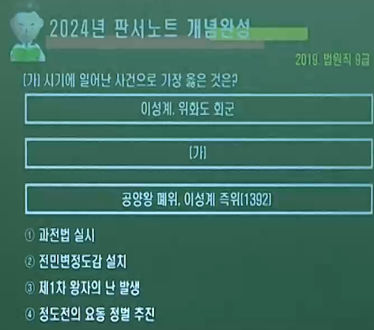
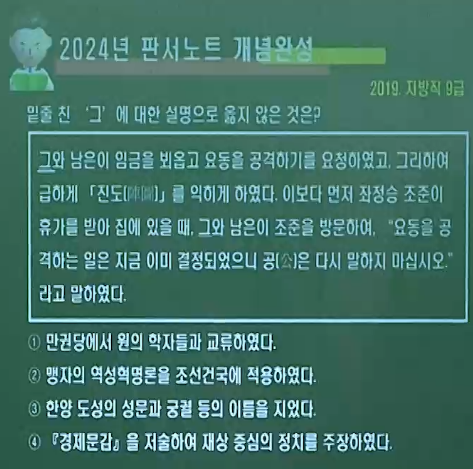
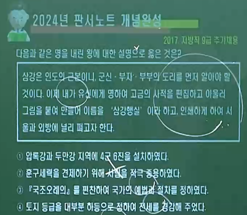
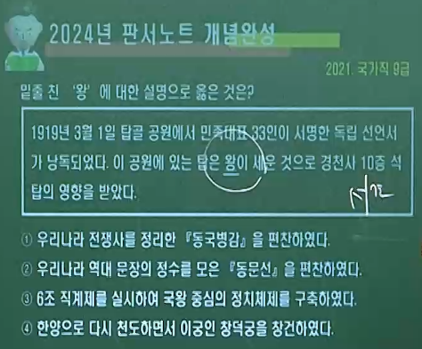
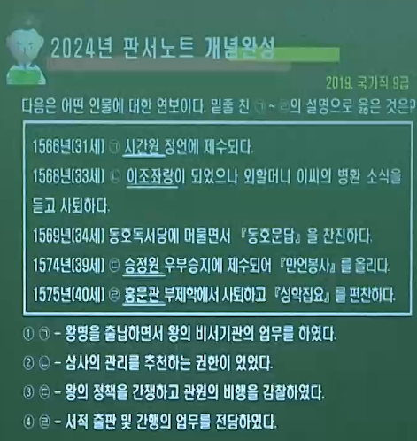
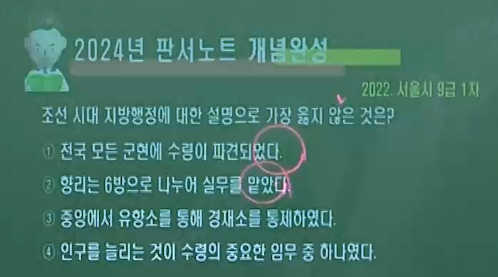

---

layout: single
title: "한국사) 판서노트 조선의 건국(초기 왕) ∽ 중앙▪지방▪군사▪통신 제도 "
categories: Dongkyun-Moon
tag: Korean-history
toc: true
toc_sticky: true
toc_label: 목차
toc_icon: "fas fa-dragon"
author_profile: false
sidebar:
    nav: "counts"

---

# 1. 조선의 건국(초기 왕) ∽ 중앙▪지방▪군사▪통신 제도

---

## ( A 고려의 멸망과 조선의 건국 )

----

### 1️⃣ 고려 말 정치 상황

- #### 공민왕 개혁 노력 실패
  
  - #### 고려 사회 모순 심화
    
    - #### 권문세족의 정치 세력 독점과 대토지 소유 확대
    
    - #### 정치 기강 문란 및 민생 파탄

- #### 홍건적과 왜구의 격퇴 과정에서 이성계 등 신흥 무인 세력 성장

- #### 신진 사대부의 분열
  
  - #### 급진 개혁파 ( 정도전. 조준. 윤소종 )
    
    - #### 급진적 개혁. 고려 왕조 부정 ( 역성혁명 주장 ). 전면적 토지 개혁 찬성
    
    - #### ➡ 훈구파 ( 15C 집권 )
  
  - #### 온건 개혁파 ( 정몽주. 이색. 길재 )
    
    - #### 점진적 개혁. 고려 왕조 유지. 전면적 토지 개혁 반대
    
    - #### ➡ 사림파 ( 16C 집권 )

### 2️⃣ 고려의 멸망과 조선의 건국 과정

- #### 우왕 즉위 ( 1374 )
  
  - #### 공민왕 사후 권문세족 이인임의 추대로 우왕 즉위

- #### 이인임 일파 축출 ( 1388 )
  
  - #### 최영이 이성계와 신진사대부의 세력의 뒷받침을 받아 이인임 일파 축출

- #### 명의 철령위 설치 통고 ( 1388 )
  
  - #### 국론 분열 ➡ 요동 정벌 ( 최영. 우왕 ) 🆚 4불가론 ( 이성계 )
  
  - > ##### 💯4불가론
    > 
    > 1. ##### 소국이 대국을 거역함은 불가하다.
    > 
    > 2. ##### 여름에 군사를 일으킴은 불가하다.
    > 
    > 3. ##### 거국적 원정은 왜구 침입의 우려가 있다.
    > 
    > 4. ##### 장마철이라 병기 관리의 곤란과 전염병 우려가 있다.

- #### 요동 정벌 단행 ( 1388 ) = 최영이 이성계를 시켜 요동 정벌 단행

- #### 위화도 회군 ( 1388 )
  
  - #### 요동 정벌에 반대했떤 이성계가 조민수와 함께 위화도에서 회군
  
  - #### 최영 제거, 우왕 폐위 ➡ 창왕 옹립

- #### 공양왕 옹립 ( 1389 )
  
  - #### 폐가입진 명목으로 창왕 폐위 ➡ 공양왕 옹립

- #### 과전법 마련 ( 1391 )
  
  - #### 급진 개혁파 ( 정도전. 조준 ) ▪ 신진 사대부 세력이 급전도감을 통해 ( 전민변정도감 ❌) 토지 개혁 단행 ➡ 과전법 실시

- #### 조선 건국 ( 1392 )
  
  - #### 정몽주 등 온건 개혁파 제거 ( 1392 )
    
    - #### 단심가 🆚 하여가(이방원)
  
  - #### 이성계 즉위 ( 1392 )
  
  - #### 🆔국호 제정 = 조선 ( 1393 )
  
  - #### 🚩한양 천도 ( 1394 )

---

## ( B 🐉🥇조선 초기 국왕의 업적 = 통치 체제의 정비 )

----

### 0️⃣ 🎖🦹‍♂️삼봉 정도전 (향리아들) ∽ 1398

- #### 봉화(奉化) 호장 집안. 공민왕 때 관직 생활 ( 성균관 강의 )

- #### 이인임의 친원 정책에 반발 ▪ 나주 유배

- #### 초창기 문물 제도 정비에 공헌 ( 맹자의 역성혁명론을 조선 건국에 적용)
  
  - #### 도성 축조 계획 수립 ▪ 경복궁 건립 주도 등
    
    - #### 4대문. 경복궁 근정전 명칭 지음

- #### 📓『조선경국전』 편찬
  
  - #### 왕도 정치 및 재상 중심의 정치
  
  - #### 민본적 통치 규범 마련 ( 사찬 법전 )

- #### 📓『경제문감』 편찬
  
  - #### 새 왕조의 문물 제도와 통치 규범을 정리하고 체계화
  
  - #### 재상 중심 정치 주장

- #### 📓『불씨잡변』 저술
  
  - #### 불교 비판 ➡ 성리학을 통치 이념으로 확립

- #### 📓『고려국사』 편찬
  
  - #### 고려 시대의 역사 정리
  
  - #### 조선 건국의 정당성을 밝히려 함.

- #### 📓『진도』 진법서 편찬 : 요동 정벌 계획

- #### 📓『학자지남도』 : 성리학 입문서

- #### 🎼『문덕곡.신도가』 : 조선 건국 찬양

- #### 📓『심기리편』 편찬 : 불교 뿐만 아니라 도교까지 함께 비판 . 유학(성리학) 찬양

### 1️⃣ 태조 이성계 1392 ∽ 1398

- #### 조선 건국 ( 1392 ) 『 숭유억불:도첩제 실시 ▪ 중농억상 ▪ 사대교린 정책 』
  
  - #### 국호 제정 '조선' '고조선 계승' ( 1393 )
  
  - #### 의흥 삼군부 설치 ( 1393 ) : 조선 초기 군령과 군정을 총괄하던 관서
  
  - #### 한양 천도 ( 1394 )

- #### 한양 정비
  
  - #### 한양부를 한성부로 개칭 ( 1395 )
  
  - #### 도성 축조 ▪ 경복궁 건립 ( 1395 )
  
  - #### 종묘 (좌묘우사) ▪ 사직, 관아, 학교, 시장, 도로 등 설치

- #### 1차 왕자의 난 ( 무인정사. 1398 )
  
  - #### 이방원(정안군)이 방석, 방번, 정도전 제거 ➡ 정종(이방과) 옹립

### 2️⃣ 정종 1398 ∽ 1400

- #### 정치적 혼란을 피하기 위해 개경으로 천도 ( 1399 )

- #### 중앙 통치제도 개칭.개편
  
  - #### 도평의사사를 의정부로 개칭 ➡ 의정부 : 정무담당
  
  - #### 중추원을 삼군부로 개편 ➡ 삼군부 : 군무담당 ➡ 군▪정 분리

- #### 2차 왕자의 난 ( 1400 )
  
  - #### 방간 ▪ 박포 🆚 방원 : 방원이 방간 제거
  
  - #### 정종이 방원을 왕세자로 삼고 양위

### 3️⃣ 🐉🥇 💯 태종 이방원 1400 ∽ 1418

- #### 왕자의 난 Ⅰ▪ Ⅱ ➡ 개국공신을 몰아내고 즉위

- #### 왕권 강화 및 국왕 중심의 통치 체제 정비

- #### 도평의사사 폐지 ➡ 💯6조 직계제 처음 실시
  
  - #### "왕은 신중하게 여겨... 이때 이르러 단행하였다. "

- #### 한양 환도 ▪ 창덕궁 건립 : 이궁(별궁) . 양궐 체제 성립

- #### 양전사업. 호패법 실시

### 4️⃣ 🐉🥇 💯 세종 1418 ∽ 1450

- #### 태종과 원경왕후 민씨의 셋째 아들

- #### 충녕대군 ➡ 왕세자 책봉 ➡ 즉위
  
  - #### 태종이 4년 간 상왕으로 생존

- #### 💯『의정부 서사제』 : 왕권과 신권의 조화
  
  - #### "의정부에서 정책 심의▪합의. 그러나 인사▪군사권 직접 처리"

- #### 집현전 설치 : 정책 연구, 경연 (국왕) ▪ 서연(세자) 담당
  
  - #### 훈민정음 창제
  
  - #### 집현전 학사를 일반 관리보다 우대 : 사가독서제(유급 휴가)
  
  - #### 청백리 등용 ( 황희. 맹사성 )

- #### 공법 시행 ( 연분 9등법. 전분 6등법 ) / 조선통보 발행

### 5️⃣ 🐉🥇 💯 세조 1455 ∽ 1468

- #### 세종의 둘째 아들 ➡ 수양대군에 봉해짐.

- #### 계유정난 ( 1453 )으로 집권 ➡ 단종의 양위를 받아 즉위
  
  - #### 김종서 ▪ 황보인 제거 , 이징옥의 난 ( 1453 )

- #### 💯『6조 직계제』 부활 ➡ 📓『경국대전』 편찬 시작
  
  - #### "상왕이 어려서... 복구한다" / 호전▪형전 간행(육전상정소)

- #### 단종 복위 운동 ( 1456 ) : 집현전 ▪ 경연 폐지
  
  - #### 집현전 학사 세력 중심
  
  - #### 사육신 : 성삼문, 박팽년, 하위지, 이개, 유성원, 유응부
  
  - #### 생육신 : 김시습, 원호, 이맹전, 성담수, 조려, 남효온

- #### 함경도 이시애의 난 ( 1467 ) : 유향소 폐지 ➡ 성종 때 부활
  
  - #### 남이 장군이 진압

- #### 직전법 시행 ( 수신전과 휼양전 폐지 ) / 팔방통보(유엽전) 주조

### 6️⃣ 🐉🥇 💯 성종 1469 ∽ 1494

- #### 예종이 즉위 1년 만에 사망 ➡ 13세에 즉위

- #### 정희왕후의 수렴청정 ➡ 성종의 친정 시작
  
  - #### 세조의 비. 약 8년간 .

- #### 💯 📓『경국대전』 완성 ▪ 반포
  
  - #### "만대의 성법" 조선 왕조의 통치 체제 확립

- #### 홍문관(옥당) 설치 : 집현전 계승
  
  - #### 홍문관 관원 모두가 경연관을 겸하게 함.
  
  - #### 경연 활성화 : 왕과 신하가 모여 정책 토론 및 심의

- #### 관수관급제 실시 : 국가가 수조권 대행 ➡ 국가 토지 지배력 강화

----

## ( C 조선 초기 태종. 세종. 세조. 성종 업적 )

### ( 🐉🥇 태종 이방원 1400 ∽ 1418 )

- #### 1️⃣ 정치
  
  - #### 🅰 문하부 낭사를 사간원으로 독립시켜 대신 견제
    
    - #### 의금부 설치. 승정원이 독립된 기구로 설치
    
    - #### 상서사의 인사 기능을 이조와 병조로 귀속
  
  - #### 🅱 사병 혁파 : 왕이 군사 지휘권 장악. 친위 국사 ⬆, 양인개병제 실시
  
  - #### 🆎 왕실 외척과 종친의 정치적 영향력 약화
    
    - #### 외척 숙청 : 처남 민무구, 민무질 형제 숙청
  
  - #### 🅾 국방 : 거북선과 비거도선 제조

- #### 2️⃣ 경제
  
  - #### 🅰 양전 사업 : 양안 20년, 호구 파악 : 호적 3년
    
    - #### 인보법 실시 : 호적 작성을 위해 실시
      
      - #### 10호 또는 수호를 하나의 인보로 묶어 통제
  
  - #### 🅱 호패법 실시 : 16세 이상 모든 남자 ( 양반 ∽ 노비까지 )

- #### 3️⃣ 불교 ▪ 기타
  
  - #### 사원 정리 및 사원의 토지 몰수, 242사 이외 폐지
  
  - #### 신문고(등문고) 설치 : 연산군 폐지 ➡ 영조 부활
    
    - #### 억울한 노비를 조사 ▪ 해방
  
  - #### 서얼 차대법 : 서얼의 문과 응시 제한. 한품서용제 적용
  
  - #### 삼가금지법 : 과부의 혼인 제한
  
  - #### 주자소 설치. 계미자 주조 ▪ 사섬서 설치 = 저화 발행
  
  - #### 5부 학당 학제 마련 ➡ 세종 때 4부 학당

### ( 🐉🥇 세종 1418 ∽ 1450 )

- #### 1️⃣ 정치
  
  - #### 🅰 국가 행사를 유교식으로 거행
    
    - #### 📓『주자가례』 장려
  
  - #### 🅱 왕도 정치를 내세워 유교적 민본 사상 실현
  
  - #### 🅾 대외 정책
    
    - #### 이종무의 쓰시마 정벌 ( 1419 ), 4군 6진 개척
    
    - #### 3포 개항 ( 1426 ) : 부산 ▪ 제포 ▪ 염포
    
    - #### 계해약조 ( 1443 ) : 세견선 50척

- #### 2️⃣ 경제
  
  - #### 🅰 공법 시행 : 연분 9등법, 전분 6등법
  
  - #### 🅱 조선통보 발행

- #### 3️⃣ 불교 ▪ 기타
  
  - #### 불교 교단 정리 : 전국 36개 절만 인정
  
  - #### 내불당 설치
  
  - #### 📓『석보상절』 간행 : 수양대군 저술. 훗날 세조
  
  - #### 부민고소 금지법 : 향리 ▪ 백성의 수령 고소 금지
  
  - #### 원악향리 처벌법 : 부정한 향리 처벌
  
  - #### 금부삼복법 : 사형죄 의금부 3심제
  
  - #### 노비에 대한 사적인 처벌 금지
    
    - #### 관노비에 대한 출산 휴가 정책 실시
  
  - #### 한양 대화재 ( 1426 ) 발생 : 금화도감 설치

- #### 4️⃣ 과학 및 문화 사업
  
  - #### 🅰 경자자, 병진자, 갑인자 주조 : 인쇄술의 발달
  
  - #### 🅱 식자판 조립법 창안
  
  - #### 🅾 칠정산 편찬, 혼의(혼천의), 간의
  
  - #### 🆎 자격루(물시계), 앙부일구(해시계), 측우기(강우량 측정) 제작

- #### 5️⃣ 편찬 사업
  
  - #### 🅰 용비어천가 : 한글로 간행 / 월인천강지곡 / 여민락 / 정간보
  
  - #### 🅱 농사직설 / 삼강행실도 / 효행록
  
  - #### 🆎 향약채취월령 / 향약집성방 / 의방유취
  
  - #### 🅾 총통등록 / 동국정운 등
  
  - #### 

### ( 🐉🥇 세조 1455 ∽ 1468 )

- #### 1️⃣ 정치
  
  - #### 🅰 군사제도 정비
    
    - #### 보법 제정 ( 정군 1. 보인 2 )
    
    - #### 5위 (중앙군) 및 진관 체제 실시 : 지역 중심 방어 체제

- #### 2️⃣ 경제
  
  - #### 🅰 직전법 시행 : 수신전과 휼양전 폐지
  
  - #### 🅱 팔방통보 (유엽전) 주조
  
  - #### 🅾 인지의와 규형 발명

- #### 3️⃣ 불교 ▪ 기타
  
  - #### 적극적인 불교 진흥책
  
  - #### 간경도감 설치 : 불교 경전 한글로 번역 ▪ 간행
  
  - #### 원각사 및 원각사지 10층 석탑 건립
  
  - #### 종친 등용 / 장례원 설치
  
  - #### 호적 사업과 호패법 강화

### ( 🐉🥇  성종 1469 ∽ 1494 )

- #### 1️⃣ 정치
  
  - #### 유교 정치 이념 강화
  
  - #### 김종직 등 (온건 개혁파)사림 등용, 유향소 부활
    
    - #### 훈구파 견제 위해
  
  - #### 👨‍🎓김종직(호:점필재. 1431∽1492)
    
    - #### 사림 : 정몽주와 길재의 학통 계승 ( 온건 개혁파 )
    
    - #### 1459년 ( 세조 5. ) 식년 문과 급제
    
    - #### 성종 때 이조참판, 형조판서, 홍문관 제학 등 역임
    
    - #### 제자 : 정여창 ▪ 김굉필 ▪ 김일손 ▪ 유호인 ▪ 남효온
    
    - #### 📓『동국여지승람』 발문을 짓고 교정 작업에 참여
    
    - #### 📓『조의제문』 저술 ➡ 무오사화 때 부관참시
    
    - #### 예림서원 ( 밀양. 김종직 제향 )

- #### 2️⃣ 경제
  
  - #### 관수관급제 실시 : 국가가 수조권 대행 ➡ 국가의 토지에 대한 지배력 강화

- #### 3️⃣ 불교 ▪ 기타
  
  - #### 도첩제 폐지 : 강력한 억불책. 승려의 출가 금지
  
  - #### 간경도감 폐지 ( 세조. 불교 경전 한글로 번역▪간행 )
  
  - #### 과부재가금지법 시행
  
  - #### 사창제 폐지
  
  - #### 성균관 안에 존경각(도서관) 건립. 독서당 설치
  
  - #### 『대전속록』 완성

- #### 4️⃣ 편찬 사업
  
  - #### 📓『동국여지승람』 / 📓『국조오례의』 / 📓『동문선』 / 📓『약학궤범』 / 📓『동국통감』 등

----

## ( D 🔯조선의 중앙 정치 조직 - 왕권 강화 기구 )

----

- #### 경국대전으로 법제화

- #### 국정을 총괄하는 의정부와 그 아래에 왕명을 집행하는 행정 기관인 6조를 중심으로 편성

- #### 겸직제 발달, 의정부와 6조의 고관이 중요 정책 회의에 참여
  
  - #### 경연에서 정책 협의
  
  - #### 각 관서 사이의 업무를 조정하고 통일정인 정책 추진 가능

- #### 문반과 무반의 양반으로 구성. 정1품 ∽ 종9품까지의 18품으로 나눔.
  
  - #### 6품 이상은 상▪하계의 구분이 있어 총 30단계의 계서가 있었음.
  
  - #### 18품 30계 ( 등급 )

- #### 당상관 ( 정3품 상계 이상 ㅡ 문반의 통정대부, 무반의 절충장군 이상 )

- #### 당하관 ( 정3품 하계 이하 )
  
  - #### 참상관 ( 정 3품 하계 ∽ 종 6품 ) : 수령 임용 가능
  
  - #### 참하관 ( 정 7품 ∽ 종 9품 )

- #### 관복 (  경국대전 기준 ) : 홍포 (1품∽정3품), 청포 (종3품 ∽ 6품), 녹포 (7품∽9품)

### 1️⃣ 🛕의정부 : 재상들의 합의를 통해 국정 총괄 (독자적 기구. 국왕 다음의 최고 권력 기관)

- #### 『고려』의 2성 中『중서문하성』(재부.최고관서.장관:문하시중) 연결됨.

- #### 관원
  
  - #### 🧙‍♂️정 1품 : 영 ▪ 좌 ▪ 우의정 (정승)
  
  - #### 🧙‍♀️종 1품 : 좌찬성. 우찬성
  
  - #### 🧙‍♀️정 2품 : 좌참찬, 우참찬

### 2️⃣ 🔱6조 : 왕명을 집행하는 행정 기관

- #### 『고려』의 2성 6부 中 『6부』와 연결됨.

- #### 6조 아래 여러 관청이 소속되어 업무를 나누어 담당함으로써 행정 전문성 ▪ 효율성 ⬆
  
  - #### 👨‍💻이조 ( 문관 인사 ) / 🤵호조 ( 조세. 호구. 조운 )
  
  - #### 👨‍🏫예조 ( 외교. 교육. 과거 ) / 👨‍✈️병조 ( 군사. 무관 인사 )
  
  - #### 👨‍⚖️형조 ( 법률. 소송 ) / 👷‍♂️공조 ( 수공업. 토목 )

- #### 구성
  
  - #### 🦹‍♂️ 판서 ( 정2품. 6조의 장관직 )
  
  - #### 🦹‍♀️ 참판 ( 종2품 )
  
  - #### 👨‍⚕️참의 ( 종3품 )
  
  - #### 이조 전랑 ( 정5품 정랑 + 정6품 좌랑 ) : 낭천권, 통청권, 자대권 행사

### ☑👑 왕권 강화 기구 ( 승정원 . 의금부 )

### 3️⃣🏟승정원 ( = 은대, 대언사 ) : 왕명출납 ▪ 국왕의 비서기관

- #### 고려 중추원의 승선(왕명출납.궁궐숙위) 연결됨

- #### 구성
  
  - #### 👨‍💼 장관 : 도승지
  
  - #### 도승지 포함 6승지 ( 모두 👨‍💼정3품 당산관 ) 가 6조 분담.
  
  - #### 👨‍💼도승지 ▪ 👨‍💼좌승지 ▪ 👨‍💼우승지 ▪ 👨‍💼좌부승지 ▪ 👨‍💼우부승지 ▪ 👨‍💼동부승지

### ☑ 🏩📰승문원 : 외교 문서 작성

### 4️⃣ 🕋 의금부 : 왕명 직속 사법 기관

- #### 왕명에 의해서만 반역 죄인 심문 가능. 의정부 동의 불필요

- #### 반역죄 ▪ 강상죄 등 국가 중죄 처결

- #### 구성
  
  - #### 👩‍⚖️판사 ( 종1품 )
  
  - #### 💂‍♂️도사  ( 종5품 )

----

## ( E 🔯조선의 중앙 정치 조직 - 왕권 견제 ▪ 기타 기구 )

----

### ☑ 🔰양사(대간) = 🌃🕵️‍♂️헌부+ 🏛👨‍🎤사간원 / 서경권 행사 ( 5품 이하 대상 )

- #### 개념 : 🕵️‍♂️대관(臺官. 감찰) + 👨‍🎤간관(揀官. 간쟁)

- #### 역할 : 언관(관료의 비행을 논하고 왕에 대한 간쟁 수행)

- #### 특권
  
  - #### 재직 중 함부로 체포되지 않을 권리
  
  - #### 🤴왕을 직접 대면하여 🙇‍♂️간언할 수 있는 권리

### 5️⃣ 🌃🕵️‍♂️사헌부 : 관리 감찰

- #### 관리 감찰 ▪ 억울한 일 해결 ▪ 풍속 교정 = 고려의 어사대(대관)

- #### 🕵️‍♂️ 종2품 대사헌

### 6️⃣ 🏛👨‍🎤사간원 : 간쟁 ( 정사의 잘못 논박 )

- #### 대신도 견제하기 위함. 고려 중서문하성의 낭사

- #### 👨‍🎤정3품 대사간

### 7️⃣ 🏰🧙‍♀️홍문관 : 왕의 자문 대비. 경연. 서연 담당.

- #### 경적 ▪ 문한 관리

- #### 상참에 참여하여 국정에 대한 의견 제출

- #### 🧙‍♀️정2품 대제학

### ☑ 💮삼사 = 🌃🕵️‍♂️사헌부 + 🏛👨‍🎤사간원 + 🏫🧙‍♀️홍문관

- #### 청요직 ( 맑음을 요구 )

- #### 언론 담당. 권력의 독점 및 부정 방지

### ☑ 🏫성균관 : 최고 교육기관 / 👩‍🏫長 : 정2품 지사

### ☑ 🛕🤴📓예문관 : 왕의 교서 작성

- #### 고려의 한림원과 연결됨.

### ☑ 🏯🖨교서관 : 궁중 서적 출판 ▪ 간행

- #### 고려의 보문각과 연결됨.

### ☑ ⛩한성부 : 서울의 행정과 치안담당 / 💂‍♂️長 : 정2품 판윤

### ☑ 🕍춘추관 : 역사서 편찬 및 보관 / 🧙‍♂️長 : 정1품 영사 ➡영의정이 겸임

### ☑ 🏘상서원 : 옥새와 마패 제작 관리

### ☑ 🌇포도청(포청) : 치안(경찰 업무)과 상민의 범죄를 다스림 / 👮‍♂️長 : 종2품 포도대장

### ☑ 🪐관상감 : 세조 때 서운관을 관상감으로 개칭 ( 1466 ) / 천문 ▪ 지리 등 담당

----

## ( F 🕎조선의 군사 제도)

----

### 1️⃣ 군역 제도의 원칙

- #### 양인 개병제 실시 : 16세 이상 60세 이하 모든 양인 남자 대상
  
  - #### 태종 때 사병 혁파

- #### 군역 면제 : 현직 관료, 학생, 향리, 수공업자, 상인 등

- #### 노비 : 원칙적으로 군역의 의무가 없음. 필요에 따라 잡색군 편제

### 2️⃣ 보법 제정 ( 15C 세조 )

- #### 정군 : 현역 군인. 서울 근무 또는 국경 요충지에 배속
  
  - #### 일정 기간 교대 복무. 복무 기간에 따라 품계를 받기도 함.

- #### 보인(봉족) : 정군의 비용 부담 ( 군포 납부 ), 2정을 1보로 편성
  
  - #### 그러나 병종에 따라 보인의 비율이 다름.

### 3️⃣ 군사 제도의 변화

- ### 초기 ( 15C ) : 군사제도 정비. 5위 . 영진군. 진관체제. 잡색군
  
  - #### 중앙군 : 5위 ( 총괄 기관 : 5위 도총부 )
    
    - #### 세조 때 정비. 지휘 책임은 문반 관료가 맡았음.
    
    - #### 5위 : 의흥위. 용양위. 호분위. 충좌위. 충무위.
    
    - #### 임무 : 궁궐과 서울 수비
    
    - #### 구성
      
      - #### 정군(정병 중심)
      
      - #### 갑사 : 간단한 시험을 거쳐 선발된 직업 군인. 근무 기간에 따라 품계와 녹봉을 받음.
      
      - #### 특수병 : 종친과 외척. 공신이나 고급 관료의 자제
  
  - #### 지방군 : 영진군. 진관 체제
    
    - #### 영진군 ( 태조 )
      
      - #### 육군과 수군이 국방상 요지인 영이나 진에 소속되어 복무
      
      - #### 영군 : 병마절도사 / 진군 : 첨절제사
    
    - #### 진관 체제 ( 세조 )
      
      - #### 익군체제 ( 중익 ▪ 좌익 ▪ 우익 )를 진관 체제로 개편
      
      - #### 병영 아래에 몇 개의 거진을 설치하여 방어
      
      - #### 지역 단위 방어 체제, 수령이 지휘 ( 통제 효율적 )
      
      - #### 소규모 침입에 유리, 그러나 대규모 침입시 취약
  
  - #### 잡색군 : 태종 때 설치된 일종의 예비군 ( 유사시 동원 )
    
    - #### 구성 : 서리. 잡학인. 식량역천인. 노비 등 ( 농민 제외 )

- ### 중기 ( 16C ) : 군역의 폐단, 제승방략 체제
  
  - #### 군역의 요역화 ( 요역 부담 ⬆ ) ➡ 군역 기피
  
  - #### 방군수포와 대립의 불법 성행
  
  - #### 군적 수포제(중종) : 1년에 군포 2필 징수 ➡ 현역 복무 면제
  
  - #### 제승방략 체제
    
    - #### 을묘왜변 ( 1555 ) 이후 명종 때 실시
    
    - #### 유사시 필요한 방어처에 각 지역의 병력 동원
    
    - #### 중앙에서 파견되는 장수가 지휘
    
    - #### 대규모 침입 방어에 유리, 그러나 임진왜란 때 효과 ❌

- ### 후기 ( 임진왜란 이후 ) : 5군영. 속오군 체제. 진관 체제 복구
  
  - #### 5군영 : 임기응변식 설치 ▪ 서인 정권의 군사적 기반
    
    - #### 훈련도감 ( 1593. 선조 ) : 임진왜란 중 유성룡의 건의로 설치
      
      - #### 삼수병 ( 포수 ▪ 살수 ▪ 사수 ) 구성
      
      - #### 직업군인 ▪ 장기근무 ▪ 일정 급료 받는 상비군
      
      - #### 재원 : 삼수미세 ( 1결당 2.2두 )
    
    - #### 어영청 ( 1623. 인조 ) : 수도 방어. 효종 때 북벌의 본영 역할
      
      - #### 호위청 ( 1623. 인조 ) : 궁중 호위
    
    - #### 총융청 ( 1624. 인조 ) : 이괄의 난을 계기로 설치. 북한산성 수비
    
    - #### 수어청 ( 1626. 인조 ) : 남한상성 수비 ( 경기 남부 )
    
    - #### 금위영 ( 1682. 숙종 ) : 궁궐 수비. 한성 수비
  
  - #### 속오군 체제 : 유성룡의 건의로 1594 ( 선조 27 ) 실시
    
    - #### 편성 : 양반에서부터 노비에 이르기 까지 편제
    
    - #### 평상시 생업에 종사. 농한기 때 훈련. 유사시 전투에 동원
    
    - #### 한계 : 양반의 회피로 상민과 노비들만 남게 됨.
  
  - #### 진관 체제 복구
    
    - #### 영장제 ( 인조 ) : 『영장절목』 반포 ➡ 각 지방에 영장을 파견하여 속오군의 조련 담당

### 4️⃣ 교통 및 통신 제도 ( 중앙 집권 강화 목적 )

- #### 역원제 : 병조에서 관장
  
  - #### 역 : 공문 전달과 관물 운송. 주요 도로에 30리 마다 설치
  
  - #### 원 : 공공 여관 ㅡ 공무 수행 중인 관민이 이용

- #### 봉수제 : 병조에서 관장
  
  - #### 군사적 위급 사태를 알리기 위한 통신 제도
  
  - #### 낮에는 연기, 밤에는 횃불로 연락
  
  - #### 전국 각지에서 오는 봉화는 남산 봉수대로 집결

- #### 파발제 : 선조 때 설치 ( 1597 ). 봉수제와 역원제 보완
  
  - #### 공문 전달(급송) 목적.
  
  - #### 기발 ( 25리 마다 )과 보발 ( 30리 마다 ) ➡ 봉수제와 역원제 보완

----

## ( G ✡ 조선의 지방 통치 조직 = 8도 / [ 부 ▪ 목 ▪ 군 ▪ 현 ] / [ 면 ▪ 리 ▪ 통 ]- 고려와 비교  / 특수 행정 구역 : 4유수부 )

----

- ### 전국을 8도로 나눔. 작은 군현 통합

- ### 전국 330여 개의 군현 ( 모든 군현에 수령 파견 )

- ### 속군 ▪ 속현 ▪ 향 ▪ 부곡 ▪ 소 ➡ 소멸

- ### 고을의 크기에 따라 지방관의 등급 조정

- ### 수시로 암행어사를 지방에 파견

### 1️⃣ 🔆8도

- ### 🦹‍♂️관찰사 ( 감사. 도백. 방백. 종 2품 )
  
  - #### 임기 : 1년 ( 360일 ), 단임 ( 임기제 및 상피제 적용 )
  
  - #### 권한 : 감찰권 ▪ 행정 ▪ 사법 ▪ 군사권
    
    - #### 🧙‍♀️수령 지휘 ▪ 감독 ( 수령에 대한 포폄권 )
  
  - #### 특징 : 감영에 상주
    
    - #### 병마절도사 ▪ 수군절도사를 겸직
  
  - #### ☑ 고려 안찰사 : 5∽6품. 임기 6개월. 임시직(감영❌)

- #### 2️⃣ ⭐부 ( 5부 )
  
  - #### 👨‍🔬부윤 ( 종 2품 ) ▪ 👩‍🔬부사 ( 정 3품 )

- #### 3️⃣ 🌐목 ( 20목 )
  
  - #### 👨‍⚖️목사 ( 정 3품 )

- #### 4️⃣ 🌀군 ( 82군 )
  
  - #### 👩‍⚖️군수 ( 종 4품 )

- #### 5️⃣ 💫현 ( 175현 )
  
  - #### 👨‍⚕️현령 ( 종 5품 ) ▪ 👩‍⚕️현감 ( 종 6품 )

- ### ☑ 🗼경재소 ( 유향소 감시 및 통제. 후기에 사라짐. )
  
  - #### 책임자 : 👨‍🎓지방 출신 중앙 고관 임명
  
  - #### 서울에 설치 ( 태종 때 설치 ➡ 세종 때 제도화 )
  
  - #### 역할 : 🏵유향소 👁감시 및 통제 ( 중앙 집권 강화 )
    
    - #### 유향소와 정부 간의 연락 기능 담당
    
    - #### 좌수와 별감 임명
  
  - #### 폐지 : 1603년 선조 때 ➡ 이후 수령이 좌수 ▪ 별감 임명 (수령권한 강화 )
  
  - #### ☑ 🤵경저리 : 고려의 기인 제도 계승
    
    - #### 개념 : 서울에 파견 된 지방 향리
    
    - #### 역할 : 경재소의 실무자 . 중앙과 지방 관청 사이의 연락 업무 . 자기 고을의 공부 수납 담당 . 방납의 폐단을 발생시키기도 함.

- ### 🧙‍♀️수령 ( 관찰사의 지휘▪감독을 받음, 향리 감독 )
  
  - #### 임기 : 1,800일 ( 5년 ), 임기제 및 상피제 적용
  
  - #### 권한 : 행정 ▪ 사법 ▪ 군사권 (왕의 대리인)
  
  - #### 특징 : 모든 군현에 수령 파견 ➡ 중앙 집권 강화
  
  - #### 속현 ▪ 향 ▪ 부곡 ▪ 소 소멸
  
  - #### 수령 7사 = 학교흥 ▪ 간활식 ▪ 농상성 ▪ 부역균 ▪ 군정수 ▪ 호구증 ▪ 사송간(소송을 간략하게 하라)

- ### ☑🏵유향소 ( 수령 보좌. 향리 규찰. 풍속 교정 )
  
  - #### 조직 : 👴지방 양반 ( 사족, 향촌의 덕망 있는 인사 )
  
  - #### 성격 : 지방 (향촌) 자치 조직
  
  - #### 운영 : 임원인 좌수와 별감 선출
    
    - #### 향규 ( 자율적 규약 ) ▪ 향안 ( 사족 명단 ) 작성
    
    - #### 향회 ( 총 회 ) 를 소집하여 여론 수렴
  
  - #### 역할 : 수령 보좌. 향리 규찰. 풍속 규정
  
  - #### 변천 : 조선 초기 설치 ➡ 태종 때 혁파 ➡ 세종 때 부활 ➡ 세조 때 혁파(이시애의 난을 계기로) ➡ 성종 때 부활

- ### 👩‍🚒향리 ( 6방에 소속 [무보수], 수령의 행정 실무 보좌 )
  
  - #### 세습적 아전으로 격하 ( 고려 향리보다 약화 )
  
  - #### 관인화 제한 : 시험 보러 못가게 함. 동네를 못떠남.

- #### 오가작통법 : 촌 5개의 집을 묶어 세금을 납부하게 하는 제도
  
  - #### 촌에 적용. 👨‍🌾농민 이탈 방지
  
  - #### 세조 때 강화. 성종 때 법제화. 숙종 때 오가작통사목 21개조 제정

- #### 6️⃣ 🛤면 ( 권농 [면장. 풍헌 ] )

- #### 7️⃣ 🏞리 ( 이정 )

- #### 8️⃣ 🛣통 ( 통주 )

### 2️⃣ 시대별 지방 통제 제도

- #### 통일 신라의 상수리 제도
  
  - #### 지방 세력을 일정 기간 수도에 와서 거주하게 함.

- #### 고려의 기인 제도
  
  - #### 지방 호족(향리)의 자제를 인질로 삼아 수도에 두고 출신지 일에 대한 고문 역할을 담당케 함.

- #### 조선
  
  - #### 고려의 사심관 제도가 경재소와 유향소로 분화

### 3️⃣ 4도 유수부 ( 특수 행정 구역 )

- #### 개성(세종) , 강화(인조), 광주( 숙종 설치. 정조 재설치 ), 수원(정조)

- #### 국왕에게 직속된 경관 (4도 유수) 파견

- #### 4도 유수 ( 유수관, 종 2품 ) : 관찰사의 지휘 ▪ 통제를 받지 않음.

---