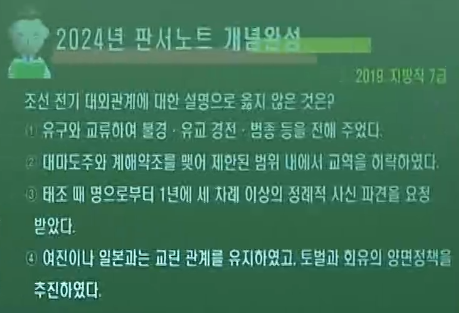
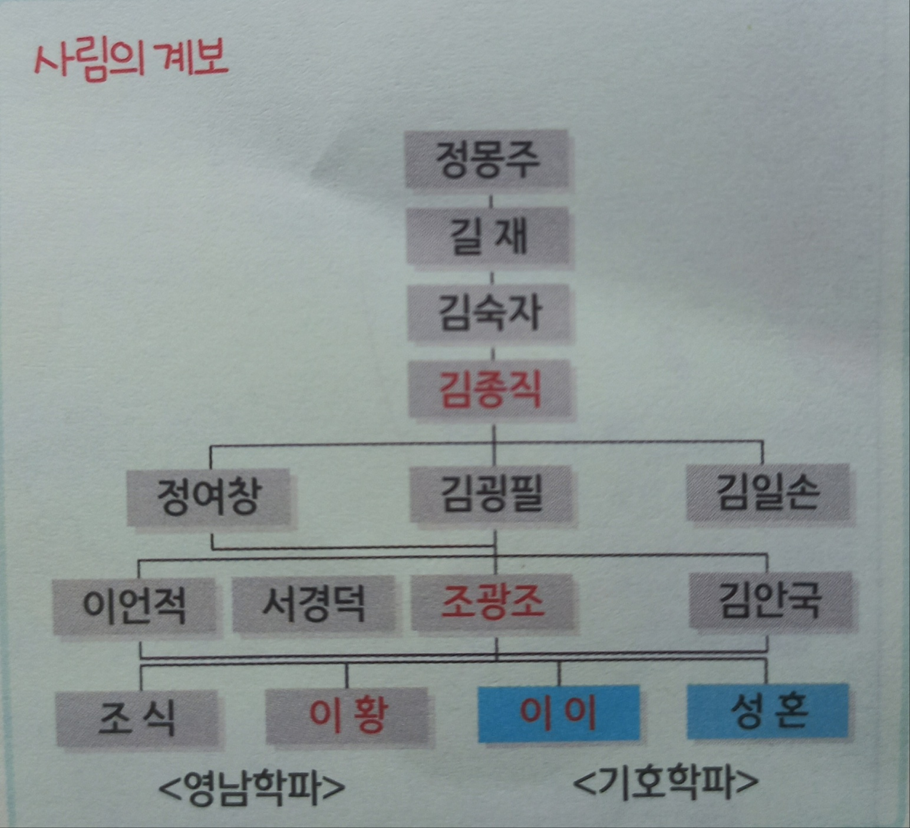
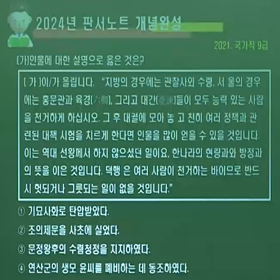
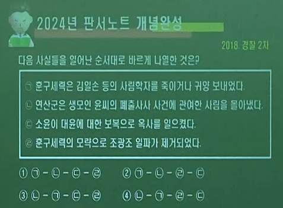
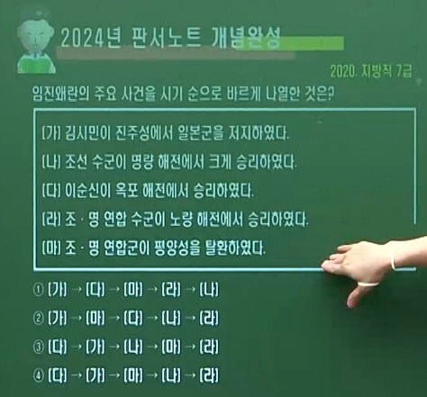

# 1. 조선 초기 대외관계 ( 명. 여진. 일본. 동남아시아 ) ∽ 사림의 대두와 4대 사화 ∽ 임진왜란

----

## ( A 🐉🥇조선 초기의 대외관계 )

---

- ### 외교 정책의 원칙 ( 사대교린 정책 )
  
  - #### 사대 정책 : 명나라에 대한 외교책 ( 서로의 독립성 인정. 예속 관계 ❌)
  
  - #### 교린 정책 : 여진. 일본 등에 대한 외교책 ( ➕회유책 ▪ ➖강경책 병행 )

### 1️⃣ 🏇🥈명과의 관계 ( 사대 정책 )

- #### 조천사 : 명에 보내는 사신의 총칭

- #### 연행사 : 조선 후기에 청에 보낸 사신의 총칭

- #### 태조 ( 건국 초) ㅡ 불편한 관계
  
  - #### 조선의 1년 3사 요청 🆚 명의 3년 1사 요구 ( 정종. 태종. 태조 ❌)
  
  - #### 표전 문제
    
    - #### 정도전이 명에 보낸 문서 (표전)의 언사가 불손하다며 명이 정도전의 압송을 요구 ➡ 요동 정벌 준비 ( 정도전 ▪ 남은 주도 )
  
  - #### 고명 ▪ 금인 문제
    
    - #### 명이 태조 불인정 ➡ '고려권지국사' 칭호 사용
  
  - #### 종계변무문제
    
    - #### 명의 『대명회전』에 이성계가 친원파 이인임의 아들로 잘못 기록된 것을 조선이 수정 요구 ➡ 선조 때에 해결 됨
  
  - #### 여진 관련 문제
    
    - #### 명이 조선으로 넘어온 여진인의 송환 요구 ➡ 조선이 거부

- #### 태조 이후
  
  - #### 관계 개선, 원만한 관계, 교류 활발
  
  - #### 자주적 실리 외교 ( 조공품과 회사품 교환), 공무역

- #### 명의 과다한 금 ▪ 은 요구를 피하기 위해 금 ▪ 은광을 폐쇄키도 함.

- #### 그러나 16C 사림 : 존화주의 ( 소중화 의식 )

### 2️⃣ 👹🏅여진과의 관계 ( 교린 정책 )

- #### 회유책
  
  - #### 귀순 장려 ( 관직 ▪ 토지 ▪ 주택 지급 )
  
  - #### 북평관 : 한양 설치. 여진 사신 유숙소 ( 조공 무역 )
  
  - #### 무역소 : 태종 때 경성  ▪ 경원 무역소 설치 ( 국경 무역 )

- #### 강경책
  
  - #### 태조 : 두만강 지역 개척
  
  - #### 세종 : 4군(최윤덕) ▪ 6진(김종서) 개척
    
    - #### 4군 : 파저강 건주위 여진 정벌
    
    - #### 압록강과 두만강을 경계로 하는 오늘날과 같은 국경선 확정

- #### 사민 정책 : 삼남 지방의 일부 주민을 북방으로 이주
  
  - #### 압록강과 두만강 이남 지역 개발

- #### 토관제 : 함경도 ▪ 평안도 변방 토착민을 토관으로 임명

### 3️⃣ 👺🏅일본과의 관계 ( 교린 정책 )

- #### 강경책 : 세종 때 이종무의 쓰시마 정벌 ( 기해동정. 1419 )
  
  - ##### cf > 태조 때 김사형의 쓰시마 정벌 ( 1396 )

- #### 회유책
  
  - #### 동평관 설치 : 일본 사신 숙소
  
  - #### 세종 때 3포 개항 ( 1426 ) : 부산포. 제포(내이포, 진해). 염포(울산) 개항 ➡ 왜관 설치
  
  - #### 계해약조 ( 1443 ) : 세견선 50척, 세사미두 200석 ➡ 대마도주와 체결 ( 이예가 체결에 공헌 )

- #### 『해동제국기』 : 세종 때 일본에 다녀온 신숙주가 성종 때 저술한 일본 견문기

- #### 왜란 전후 일본과의 관계
  
  - #### 15C 세종
    
    - #### 이종무 쓰시마 정벌 ( 1419. 기해동정. 세종 1 )
    
    - #### 3포 개항 ( 1426 )
    
    - #### 계해약조 ( 1443 ) : 세견선 50척
  
  - #### 16C 중종
    
    - #### 3포 왜란 ( 1510 ) : 비변사 설치
    
    - #### 임신약조 ( 1512 ) : 제포만 개항 ➡ 세견선 25척, 세사미두 100석
    
    - #### 사량진 왜변 ( 1544 )
  
  - #### 16C 명종
    
    - #### 정미약조 ( 1547 ) : 세견선 25척
    
    - #### 을묘왜변 ( 1555 ) : 비변사 상설 기구화. 제승방략 체제. 국교 단절
  
  - #### 16C 선조
    
    - #### 임진왜란 ( 1592 ) : 비변사 최고 기구화. 훈련도감. 속오군 설치
    
    - #### 정유재란 ( 1597 ) : 명량 ▪ 노량 대첩
  
  - #### 17C 선조. 광해군
    
    - #### 선조 : 부산 두모포 왜관 설치  ( 1607 )
    
    - #### 광해군 : 기유약조 ( 1609 ) = 세견선 20척, 세사미두 100석, 부산포만 개항

### 4️⃣ 👲🏅동남아시아의 교류 ( 교린 정책 )

- #### 류큐(유구), 시암, 자와(자바) 등과 교류

- #### 조공 ▪ 진상 형식 교류 : 토산물을 가져와 옷감, 문방구 등을 회사품으로 가져감

- #### 류큐 문화 발전에 기여 : 조선의 선진 문물 전파 ( 불경, 유교 경전 , 범종, 부채 등 전래)

----

## ( B 사림의 대두와 4대 사화 )

----

### 1️⃣ ⚕👨‍🎤훈구파(관학파) 🆚 🛐🧙‍♂️사림파(사학파)의 비교

- ### ⚕👨‍🎤
  
  - #### 연원 : 정도전, 조준 등 급진 개혁파 ( 혁명파 )
  
  - #### 활동 : 15세기 문화 발전에 공헌
  
  - #### 경제 기반 : 대농장 소유 ( 대지주 )
  
  - #### 역사 의식 : 자주적 민족의식 ( 단군 중시 )

- ### 🛐🧙‍♂️
  
  - #### 연원 : 이색. 정몽주. 길재 등 온건 개혁파
  
  - #### 활동 : 16세기 심성론과 이기론 발전에 공헌
  
  - #### 경제 기반 : 중소지주 ➡ 토지의 편중과 내수사(왕실 재정 관리)의 고리대 비판
  
  - #### 역사 의식 : 존화주의적 경향 ( 소중화 의식, 기자 중시 )

- ### ⚕👨‍🎤
  
  - #### 성향 : 중앙 집권, 부국강병 추구, 패도정치 인정
    
    - #### 사장( 시, 문장 ) 중시 ➡ 한문학 발달
    
    - #### 『주례』 ( 주나라 의례 )를 국가의 통치 이념으로 중시
    
    - #### 성리학 외 타 사상도 포용적 ( 불교. 도교. 풍수지리. 민간 신앙 )
    
    - #### 기술학 중시 ➡ 15C 과학 기술 발달

- ### 🛐🧙‍♂️
  
  - #### 성향 : 향촌 자치, 의리 ▪ 도덕 바탕 왕도 정치 추구 (성리학적 명분론에 투철 ) ➡ 형벌보다 교화에 의한 통치 강조
    
    - #### 경학 ( 유교 경전 연구 ) 중시
    
    - #### 『소학』, 『주자가례』 중시
    
    - #### 성리학 이외 타 사상 배척 ( 성리학에 투철 )
    
    - #### 기술학 천시 ➡ 16C 과학 기술 쇠퇴

- ### ⚕👨‍🎤
  
  - #### 진출 : 성균관 ▪ 집현전 등 관학을 통해 진출
    
    - #### 세조 집권 이후 공신으로서 정치적 실권 세습적 장악
    
    - #### 정난 공신 : 한명회. 신숙주. 권람
    
    - #### 의정부와 6조 관직 장악

- ### 🛐🧙‍♂️
  
  - #### 진출 : 서원 ▪ 향약을 바탕으로 향촌에서 세력 확대
    
    - #### 사학을 통해 성장
    
    - #### 성종 때 김종직과 그 문인들이 과거를 통해 중앙 정계 진출 ( 김종직은 세조 때 처음 정계 진출 )
    
    - #### 훈구세력 비판
    
    - #### 이조전랑과 3사 언관직 진출
  
  - 

### 2️⃣ 💥사화의 발생 ( 무오사화 ▪ 갑자사화 ▪ 기묘사화 ▪ 을사사화 )

- ### 🤴연산군 ( 1494 ∽ 1506. 무오사화. 갑자사화. )

- #### 연산군의 폭정
  
  - #### 신문고 폐지. 한글 탄압. 경연 폐지
  
  - #### 언론 탄압 : 관리들에게 신언패 ( 말 조심 ) 착용
  
  - ### ⚕👨‍🎤 🛐 무오사화 ( 1498. 훈구 승리. 사림 세력 약화 )
    
    - #### 원인 : 🛐🧙‍♂️ 사림파 김종직의 『조의제문』을 그의 제자 김일손이 사초에 기록
    
    - #### 전개 : ⚕👨‍🎤 이극돈, 유자광 등 훈구 세력의 공격 ➡ 『조의제문』이 세조의 왕위 찬탈을 비방한 것이라 주장 💥
    
    - #### 결과 : 🛐김종직 부관참시, 김일손 처형, 김굉필 ▪ 정여창 유배 등 사림파 희생
  
  - ### ⚕ 🛐  갑자사화 ( 1504. 훈구▪사림 모두 피해 )
    
    - #### 원인 : 👸윤비( 성종 비. 연산군의 생모 ) 폐출 및 사사 사건
    
    - #### 전개 : 🧙‍♀️측근 임사홍의 밀고 ➡ 💥사화 발생
    
    - #### 결과 : ⚕한명회 , 정창손 부관참시, 🛐 김굉필 처형 ➡ 훈구와 사림 모두 피해

- #### 중종 반정 ( 1506 )
  
  - #### ⚕👨‍🎤 박원종(훈구), 성희안 등의 주도로 🤴❌연산군을 폐위시키고 👑진성대군(중종) 옹립

- ### 🛐🧙‍♂️ 정암 조광조 ( 1482 ∽ 1519)
  
  - #### 현량과 (천거) 실시 = 사림 등용 목적
  
  - #### 방납의 폐단 시정 주장 ( 수미법 제기 )
  
  - #### 유향소 폐지 주장, 여씨 향약 처음 실시
  
  - #### 경연 강화 및 언론 활동의 활성화
  
  - #### 소학 교육 및 주자가례 장려
  
  - #### 도학 정치 ( 이상적 유교정치 실현 ) 주장
  
  - #### ⚕👨‍🎤  💥 훈구 공신의 위훈 삭제 ( 1519. 기묘사화 배경 )
  
  - #### 소격서 ( 도교 행사 기관 ) 폐지
  
  - #### 내수사 장리 폐지 주장 / 능성적중시(화순 유배중) / 절명시 / 심곡 서원 제향
  
  

- ### 🤴중종 ( 1506 ∽ 1544. 기묘사화 )
  
  - ### ⚕👨‍🎤 🛐 기묘사화 ( 1519. 조광조 ▪ 사림 세력 제거 )
    
    - #### 배경 : 🤴중종의 🛐🧙‍♂️ 사림 ( 조광조 등 ) 중용 ➡ 3사 언관직 차지 ➡ 급진 개혁
    
    - #### 원인 : 🛐🧙‍♂️ 조광조의 급진적 개혁 정치
    
    - #### 전개 : 🛐🧙‍♂️ 위훈 삭제 사건 ➡ ⚕👨‍🎤 훈구 공신들의 반발 ➡ ⚕👨‍🎤 훈구파(남곤,심정)의 주초위왕 조작
    
    - #### 결과 : 🛐 조광조를 비롯한 사림 세력 제거

- ### 🤴명종 ( 1545 ∽ 1567. 을사사화 )
  
  - ### ⚕👨‍🎤 🛐 을사사화 ( 1545. 윤임을 지원했던 사림들 희생 )
    
    - #### 배경 : 🤴인종의 단명 ( 1544 ∽ 1545 ) ➡ 👑명종 즉위 ➡ 👸문정왕후 수렴청정
    
    - #### 원인 : 🛐🧙‍♂️ 인종 외척 ( 윤임 등 대윤파 ) 🆚 ⚕👨‍🎤 명종 외척 ( 윤원형 등 소윤파 )
    
    - #### 전개 : ⚕👨‍🎤 소윤파의 🛐🧙‍♂️ 대윤파 제거
    
    - #### 결과 : 🛐 윤임을 지원했던 사림들 희생
  
  - #### 양재역 벽서 사건 ( 1547. 정미사화 ) : ⚕👨‍🎤 소윤 세력이 반대파 숙청 ➡ 🛐🧙‍♂️ 이언적 유배
  
  - #### 정미약조 ( 1547 ) : 세견선 25척
  
  - #### 을묘왜변 ( 1555 ) : 비변사 상설화, 제승방략 체제
  
  - #### 직전법 폐지 ( 1556 ) : 수조권 지급제 소멸, 녹봉만 지급 ➡ 지주 전호제 강화
  
  - #### 임꺽정의 난 ( 1559 ) : 경기 ▪ 황해도 일대 / 백정 출신 ▪ 모사꾼 서림
  
  - #### 보우 중용, 선교 양종 및 승과 제도 부활 / 판옥선 개발
  
  - #### 구황촬요 ( 흉년 대비 ) 간행, 조선방역지도 / 사단칠정 논쟁 ( 이황. 기대승 )

---

## ( C 붕당의 출현과 동인의 분화 : 선조 1567 ∽ 1608 )

---

### 1️⃣ 척신 정치 잔재 청산 ▪ 👨‍💻이조전랑직 문제로 갈등 ( 1575. 선조 8. 을해당론 )

- #### 🤴선조 즉위 후 🛐🧙‍♂️ 사림 세력 대거 중앙 정계 진출 ➡ 사림의 정국 주도

- #### 🛐🧙‍♂️ 사림 세력의 분화 ( 💔붕당의 시작 )

- ### 👨‍💻이조전랑직 문제 ( 1575. 선조8. 을해당론 )
  
  - #### 👨‍💻이조의 🧚‍♀️정5품 정랑과 🧚‍♂️정6품 좌랑
  
  - #### 💌낭천권 : 인사 추천
  
  - #### 🏅자대권 : 후임자 추천
  
  - #### 💮통청권 : 삼사 선발권

- ### 🛐🧙‍♂️ 동인 : 수기에 역점. 치자의 도덕성 제고 중시
  
  - #### 김효원 및 신진 사림
  
  - #### 척신정치 개혁에 적극적 ▪ 이황. 조식. 서경덕 학문 계승
  
  - #### 동인이 먼저 붕당 형세를 이룸

- ### 🛐🧙‍♂️  🛐 정여립 모반 사건 ( 1589. ☢기축옥사 )
  
  - #### 원인 : 🛐🧙‍♂️ 서인이었다가 🛐🧙‍♂️ 동인에 🤝가담한 🤡정여립이 진안 죽도에서 ☢대동계 조직 ➡ 👩‍🎤모반 준비 ➡ 발각되어 자결⚰
  
  - #### 결과 : 🛐🧙‍♂️ 서인(정철)에 의해 🛐 동인들 처벌

- ### 🛐 정철의 👑건저의 사건 ( 1591 )
  
  - #### 원인 : 서인 정철이 🤴광해군을 👑세자로 정할 것을 주청 ➡ 🤴선조의 🔞미움을 사게 됨 ➡ 🛐🧙‍♂️ 동인이 ☢기축옥사를 주도한 🛐🧙‍♂️ 서인 정철 공격 ( 이산해 주도 )
  
  - #### 결과 : 🛐🧙‍♂️ 정철의 처벌 두고 🛐🧙‍♂️ 북인(강경파)과 🛐🧙‍♂️ 남인(온건파)으로 분열 ➡ 🛐 서인 정철 ⛵파직 ▪ 유배
  
  - #### 🛐🧙‍♂️동인 ➡ 『 🛐🧙‍♂️ 북인 ▪ 🛐🧙‍♂️  남인 』
  
  - #### 🛐🧙‍♂️ 북인 : 강경파 ( 급진파 ) ➡ 🧓🗡조식의 문인. ( 이산해. 이이첨)
  
  - #### 🛐🧙‍♂️ 남인 : 온건파 ➡ 👴📚이황의 문인 ( 유성룡 )
  
  - #### 처음에는 남인이 정국 주도. 임진왜란 이후 북인(의병장) 주도

- ### 🛐🧙‍♂️ 서인 : 치인에 역점. 제도 개혁을 통한 부국안민 추구
  
  - #### 심의겸 및 기성 사림 ( ⛵🧙‍♂️정철 . 🤡배신자 ☢정여립 )
  
  - #### 척신정치 개혁에 소극적 ▪ 이이. 성혼의 문인

----

## ( D 임진왜란의 발발 : 선조 1567 ∽ 1608 )

  ---

### 1️⃣ 👺🎌 왜란 전의 🐉🥇 국내 상황

- #### 🕎국방력 약화 : 16세기 군역의 문란 심화 ➡ 국방력 약화 (5위제 붕괴)

- #### 👺🎌 왜구의 침략 : 3포 왜란 ( 1510. 중종 ), 을묘왜변 ( 1555. 명종 )

- #### 👹🏅여진족의 침입 : 니탕개의 난 ( 1583 ) 발생 ➡ 신립이 진압
  
  - #### 녹둔도 사건 ( 1587. 이순신 백의종군 )

- #### 👺🎌 일본의 상황 : 도요토미 히데요시가 전국 시대의 혼란을 수습하고 통일

- #### 💥국론 분열
  
  - #### 황윤길과 김성일을 사신으로 👺🎌 일본에 파견 ➡ 귀국 ( 1591 ) 후 일본의 상황 보고
  
  - #### 🛐🧙‍♂️ 김성일(동인) : 일본의 침략 가능성 ❌
  
  - #### 🛐🧙‍♂️ 황윤길(서인) : 일본의 침략 가능성 ⭕
  
  - #### 🛐🧙‍♂️ 이이의 십만양병설 ➡ 수용 X

### 2️⃣임진왜란 ( 1592 )

- #### 👺🎌 일본의 정명가도 명분 : "명을 치려하니 길을 비켜라 !" ➡ 조선이 거절 ➡ 일본군 20만 대군 침략

- #### 임진왜란 전개 과정 ( Ⅰ 초기 패전 )
  
  - #### 👺🎌🏰 부산진 ▪ 동래성 침입 ( 😱정발 ▪ 송상현 패배 ) ( 1592. 4. )
  
  - #### 👺🎌🛤 상주 ( 😱이일 ) ▪ 충주 탄금대 전투 패배 ( 😱신립 ) ( 1592. 4. )
  
  - #### ➡ 🤴선조 의주 피난 : 💂‍♂️광해군 세자책봉 분조. 👺🎌🛕 한양 함락 ( 1592. 5. )
    
    - #### 🤴선조 피난 출발 ( 1592. 4. 30. ) ➡ 🕍평양 도착 ( 5. 7. ) ➡ 🏟의주 도착 ( 6. 22. )
    
    - #### 💂‍♂️광해군 세자 책봉 ( 1592. 4. 29. ) ➡ 분조 발족 ( 6. 14. )
  
  - #### ➡ 👺🎌🕍 평양성 함락 ( 1592. 6. 15. )

- #### Ⅱ 🚢👷‍♂️수군 의병 활약
  
  - #### 🌅 옥포해전 승리 ( 🦸‍♂️이순신. 첫 승리 ) ( 1592. 5. )
  
  - #### 🐢 사천해전 ( 거북선 이용 첫 승리 ) ( 1592. 5. )
  
  - #### 🥕 당포 ▪ 당항포 해전 승리 ( 1592. 6. )
  
  - #### 🚢🦚 한산도 대첩 승리 ( 학익진 이용 ) ( 1592. 7. )
  
  - #### 🤗부산포 해전 승리 ( 1592. 9 )
  
  - #### 🔮👷‍♂️ 김시민의 진주대첩 승리 ( 김시민 전사 ) ( 1592. 10. )

- #### Ⅲ 🐉🏇조명 연합군 활약
  
  - #### 🐉🏇조 ▪ 명 연합군 평양성 탈환 ( 🛐🧙‍♂️ 유성룡 + 이여송 ) ( 1593. 1. )
  
  - #### 👺🎌 벽제관 전투에서 🏇명군 😱대패 ( 평양으로 후퇴 ) ( 1593. 1. )
  
  - #### 🎉👨‍✈️권율의 행주 대첩 ( 행주산성 ) 승리 ( 1593. 2. )
  
  - #### 👺🎌🏰 진주성 전투 패배 ( 😱관군+의병, 🧔김천일 전사 ) ( 1593. 6. )
  
  - #### 🐉🥇조선의 전열 정비 : 🏟훈련도감 설치 ( 1593. 8. )
  
  - #### 🤴선조의 한양 환도 ( 1593. 10. )
  
  - #### 👨‍✈️🏋️‍♀️속오법 실시 ( 1594 ). 💣화포 개량. 🔫조총 제작
  
  - #### 👩‍🎤왕실 서얼 출신 이몽학의 난 발생 ( 1596 )
  
  - #### 이순신 승리의 의미 : 남해의 제해권 장악 ▪ 전라도 곡창 지대 보전
    
    - #### 왜군의 수륙 병진 작전 좌절 ( 3대 대첩 : 한산도 ▪ 진주 ▪ 행주대첩 )

### 3️⃣ 의병 항쟁

- #### 조직 : 농민 주축. 전직 관리. 사림. 승려 등

- #### 전술 : 향토 지리에 밝음. 상당수가 관군에 편입

- #### 대표 의병장
  
  - #### 함경도(길주) : 👨‍🎤정문부 (숙종 때 북관대첩비 건립)
  
  - #### 🛐🧙‍♂️ 경상도 : 🛐🧙‍♂️ 정인홍 ▪ 곽재우 (북인 의병)
  
  - #### 전라도 : 고경명 ▪ 김천일
  
  - #### 충청도 : 조헌 ▪ 영규
  
  - #### 묘향산 : 🦹‍♂️서산대사 (휴정)
  
  - #### 금강산 : 🦹‍♂️사명대사(유정)

 

### 4️⃣ Ⅳ 정유재란 발발 1597. 1

- #### 👺🎌 🧔⛵칠전량 해전 ( 😱원균. 배를 잃었다... ) ( 1597. 7 )

- #### 🏇🐉조 ▪ 명 연합군의 직산 (현재 천안) 전투 승리 ( 1597. 9 )

- #### 🦸‍♂️🌅🚤이순신의 명량대첩 승리 ( 진도 울둘목 ) ( 1597. 9 )
  
  - #### "신에게는 12척..."

- #### 🦸‍♂️🌻이순신의 노량대첩 승리 ( 이순신 전사 ) ( 1598. 11 )

### 5️⃣ 임진왜란 ▪ 정유재란 전쟁의 영향

- #### 국내 : 🏵비변사 기능 강화 ➡🏵 최고 권력 기구화
  
  - #### 🧾토지대장과 📋호적 상실 ➡ 🏧재정 악화 ➡ 📠공명첩 발급, 납속책 실시 ➡ 🛐신분제 동요
  
  - #### ⛩문화재 소실 : 🛕경복궁 등 궁궐 ▪ 🕍불국사 ▪ 사고(전주사고본만 보존 ) 등
  
  - #### 숭명사상 고조. 명나라 군인들에 의해 🏇관우 숭배 사상 유입 ➡ 관우묘(동묘. 동관왕묘) 건립
  
  - #### 왜란 이후 일본에서 전래된 작물 : 🚬담배 . 🌶고추 . 🎃호박. 🍅토마토 등

- #### 국외 : 🏇명 쇠퇴. 👹여진족 급성장 ➡ 🗾동아시아 정세의 큰 변화
  
  - #### 👺🎌일본 문화 발전 ➡ 🧕포로로 끌려간 조선인들을 통해 이삼평 도자기, 🛐🧙‍♂️ 강항의 이황 성리학 전파 = 귀국하여 『간양록』 저술

- #### 국교 재개 : 🎌일본 『에도 막부』 성립 ➡ 조선에 친교 요청
  
  - #### 🦹‍♂️사명대사(유정) 파견 ( 포로 송환 1604 ∽ 1605 ) ➡ 📞통신사 파견(1607. 선조) ➡ 광해군 때 🛳기유약조(세견선 20척) 체결 ( 1609 )
  
  - #### 회답 겸 ✈쇄환사 파견 : 임진왜란 이후 단절된 국교를 회복하고자 일본의 요청으로 파견된 사신  ( 1607. 1617. 1624 )

----